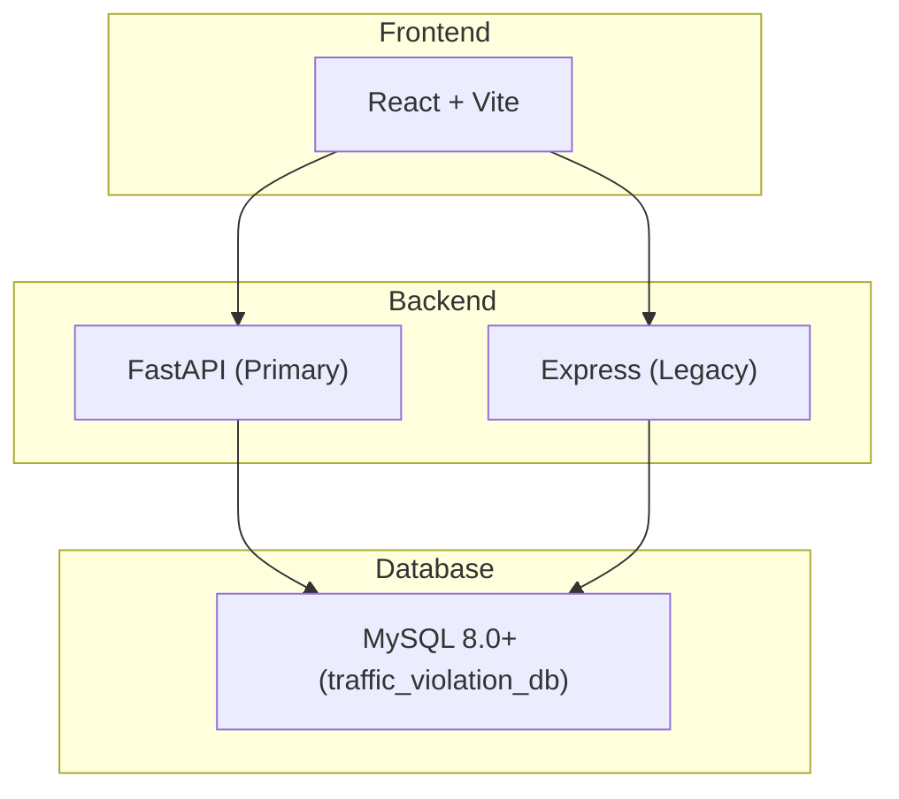
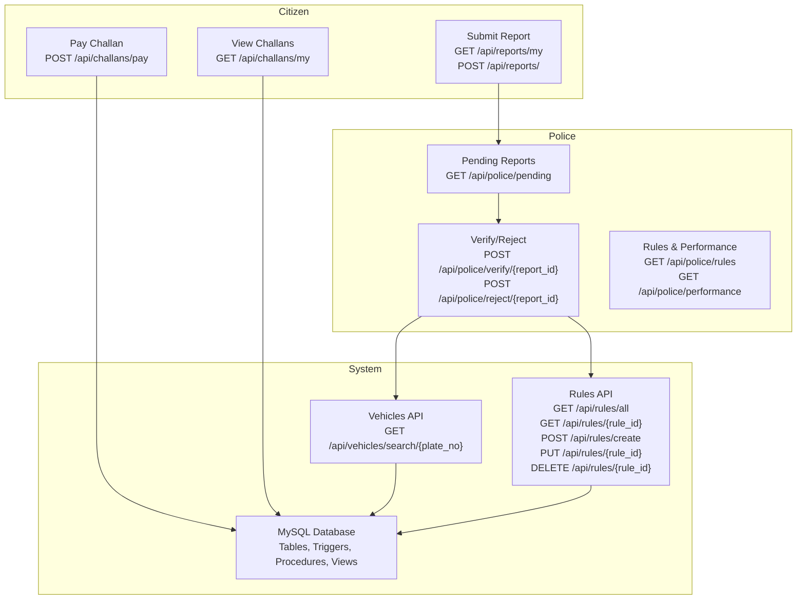
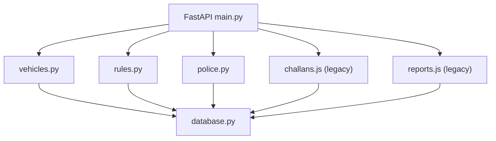
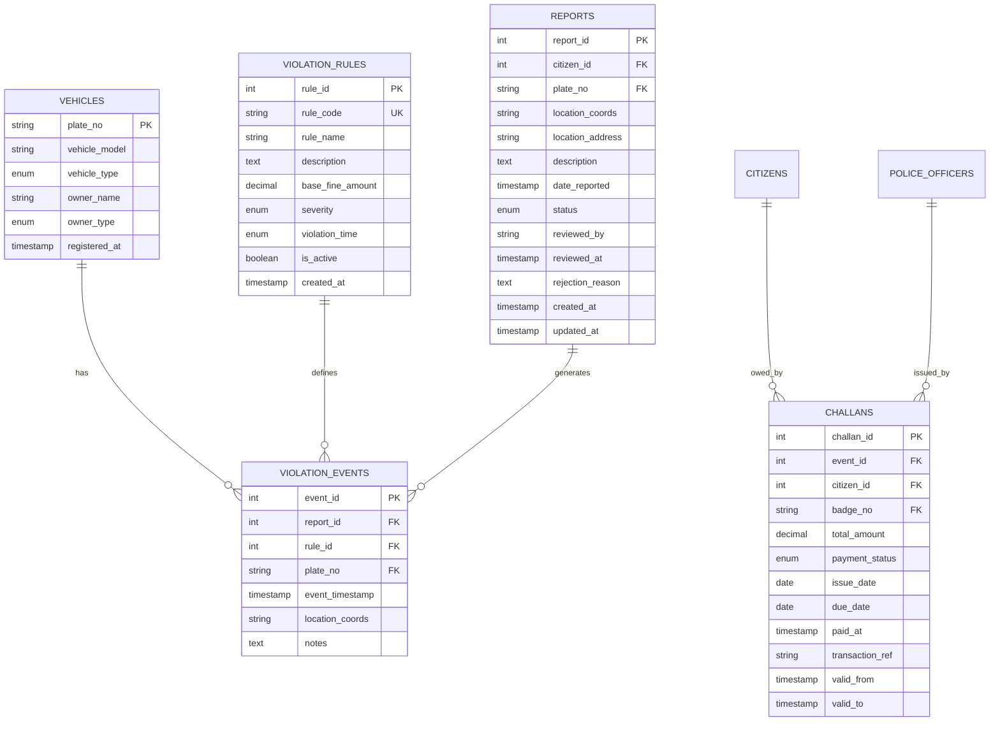

# Vehicle and Rules Management

<cite>
**Referenced Files in This Document**
- [README.md](file://README.md)
- [server/main.py](file://server/main.py)
- [backend/server.js](file://backend/server.js)
- [server/routes/vehicles.py](file://server/routes/vehicles.py)
- [server/routes/rules.py](file://server/routes/rules.py)
- [server/routes/police.py](file://server/routes/police.py)
- [backend/routes/challans.js](file://backend/routes/challans.js)
- [backend/routes/reports.js](file://backend/routes/reports.js)
- [db/schema.sql](file://db/schema.sql)
- [db/stored_procedure_process_report.sql](file://db/stored_procedure_process_report.sql)
- [server/database.py](file://server/database.py)
- [server/init_db.py](file://server/init_db.py)
- [server/REPORTS_API_DOCUMENTATION.md](file://server/REPORTS_API_DOCUMENTATION.md)
</cite>

## Table of Contents
1. [Introduction](#introduction)
2. [Project Structure](#project-structure)
3. [Core Components](#core-components)
4. [Architecture Overview](#architecture-overview)
5. [Detailed Component Analysis](#detailed-component-analysis)
6. [Dependency Analysis](#dependency-analysis)
7. [Performance Considerations](#performance-considerations)
8. [Troubleshooting Guide](#troubleshooting-guide)
9. [Conclusion](#conclusion)
10. [Appendices](#appendices)

## Introduction
This document provides comprehensive API documentation for the vehicle and rules management subsystems of the Traffic Violation Management System. It covers:
- Vehicle registration verification and search
- Violation rule definitions and management
- Penalty calculations and regulatory updates
- Integration with the reports system for violation categorization, challan generation rules, and compliance checking
- Dynamic penalty calculation based on rule attributes and enforcement workflows

The system integrates two backend implementations:
- A Python FastAPI service exposing vehicle search, rule management, and police enforcement endpoints
- A legacy Node.js Express service for citizen-facing reports and challan payment

## Project Structure
The system comprises:
- A MySQL 8.0+ database with a 5NF-normalized schema, triggers, stored procedures, and views
- A Python FastAPI backend (primary) with routers for authentication, analytics, reports, challans, vehicles, rules, and police
- A legacy Node.js Express backend (retained for reference) with routes for authentication, reports, challans, and police

**Diagram sources**
- [README.md:14-41](file://README.md#L14-L41)
- [server/main.py:50-107](file://server/main.py#L50-L107)
- [backend/server.js:1-42](file://backend/server.js#L1-L42)

**Section sources**
- [README.md:45-93](file://README.md#L45-L93)
- [server/main.py:77-87](file://server/main.py#L77-L87)
- [backend/server.js:22-27](file://backend/server.js#L22-L27)

## Core Components
- Vehicle Search and Violation History: Retrieve vehicle details and violation events with challan status
- Violation Rules Management: CRUD operations for rule definitions with validation and active status
- Police Enforcement: Pending reports dashboard, verify/reject reports, and performance metrics
- Challan Payment: Secure, row-locked payment processing for citizens
- Reports Submission: Citizen submissions with location and evidence metadata

Key endpoints:
- Vehicle search: GET /api/vehicles/search/{plate_no}
- Rules management: GET /api/rules/all, GET /api/rules/{rule_id}, POST /api/rules/create, PUT /api/rules/{rule_id}, DELETE /api/rules/{rule_id}
- Police: GET /api/police/pending, POST /api/police/verify/{report_id}, POST /api/police/reject/{report_id}, GET /api/police/rules, GET /api/police/performance
- Challans: GET /api/challans/my, POST /api/challans/pay
- Reports: POST /api/reports/, GET /api/reports/my

**Section sources**
- [server/routes/vehicles.py:36-145](file://server/routes/vehicles.py#L36-L145)
- [server/routes/rules.py:58-377](file://server/routes/rules.py#L58-L377)
- [server/routes/police.py:25-220](file://server/routes/police.py#L25-L220)
- [backend/routes/challans.js:7-101](file://backend/routes/challans.js#L7-L101)
- [backend/routes/reports.js:7-54](file://backend/routes/reports.js#L7-L54)

## Architecture Overview
The system enforces role-based access control and uses stored procedures for ACID-compliant operations. The FastAPI backend exposes vehicle and rules APIs, while the Express backend serves citizen-facing endpoints.

**Diagram sources**
- [server/main.py:77-87](file://server/main.py#L77-L87)
- [backend/server.js:22-27](file://backend/server.js#L22-L27)
- [server/routes/vehicles.py:36-145](file://server/routes/vehicles.py#L36-L145)
- [server/routes/rules.py:58-377](file://server/routes/rules.py#L58-L377)
- [server/routes/police.py:25-220](file://server/routes/police.py#L25-L220)
- [backend/routes/challans.js:7-101](file://backend/routes/challans.js#L7-L101)
- [backend/routes/reports.js:7-54](file://backend/routes/reports.js#L7-L54)

## Detailed Component Analysis

### Vehicle Lookup and Violation History
Purpose:
- Search vehicle by plate number and retrieve full violation history with challan status and totals.

Endpoints:
- GET /api/vehicles/search/{plate_no}

Behavior:
- Validates existence of vehicle
- Joins violation events with rules and challans
- Computes summary statistics (total violations, unpaid challans, total unpaid amount)
- Converts dates and decimals to serializable formats

Request:
- Path parameter: plate_no (string)

Response:
- vehicle: basic registration info
- summary: counts and monetary totals
- violations: event-level details with rule and challan data

Example response keys:
- vehicle.plate_no, vehicle.vehicle_model, vehicle.vehicle_type, vehicle.owner_name, vehicle.owner_type, vehicle.registered_at
- summary.total_violations, summary.unpaid_challans, summary.total_unpaid_amount
- violations[*].event_id, event_timestamp, location_coords, notes, rule_code, rule_name, base_fine_amount, severity, challan_id, total_amount, payment_status, issue_date, due_date, paid_at

**Section sources**
- [server/routes/vehicles.py:36-145](file://server/routes/vehicles.py#L36-L145)
- [db/schema.sql:87-167](file://db/schema.sql#L87-L167)

### Violation Rules Management
Purpose:
- Manage violation rule definitions used for challan generation and categorization.

Endpoints:
- GET /api/rules/all
- GET /api/rules/{rule_id}
- POST /api/rules/create
- PUT /api/rules/{rule_id}
- DELETE /api/rules/{rule_id}

Request bodies:
- Create: rule_code, rule_name, description, base_fine_amount, severity, violation_time, is_active
- Update: selective fields (rule_name, description, base_fine_amount, severity, violation_time, is_active)

Validation:
- Severity must be one of Minor, Moderate, Major, Critical
- Violation time must be Daytime, Nighttime, Anytime
- Rule code uniqueness enforced on creation

Response:
- Lists and single rule retrieval include metadata and timestamps
- Update/delete returns success messages with identifiers

**Section sources**
- [server/routes/rules.py:58-377](file://server/routes/rules.py#L58-L377)
- [db/schema.sql:98-111](file://db/schema.sql#L98-L111)

### Police Enforcement and Reports Integration
Purpose:
- Provide police with pending reports, verify/reject reports, and performance metrics.

Endpoints:
- GET /api/police/pending
- POST /api/police/verify/{report_id} (requires rule_id)
- POST /api/police/reject/{report_id} (requires reason)
- GET /api/police/rules
- GET /api/police/performance

Workflow:
- Verify triggers stored procedure sp_issue_challan to create violation events and challans atomically
- Reject triggers sp_reject_report to update status and record reasons
- Active rules are returned for rule selection during verification

**Section sources**
- [server/routes/police.py:25-220](file://server/routes/police.py#L25-L220)
- [db/stored_procedure_process_report.sql:8-98](file://db/stored_procedure_process_report.sql#L8-L98)
- [db/schema.sql:440-686](file://db/schema.sql#L440-L686)

### Challan Payment Processing
Purpose:
- Securely process challan payments with row-level locking to prevent race conditions.

Endpoints:
- POST /api/challans/pay

Behavior:
- Validates challan ownership and status
- Uses SELECT ... FOR UPDATE to lock the row
- Updates status to Paid and records paid_at
- Returns payment confirmation with amount and timestamp

**Section sources**
- [backend/routes/challans.js:31-98](file://backend/routes/challans.js#L31-L98)
- [db/schema.sql:552-629](file://db/schema.sql#L552-L629)

### Reports Submission and Citizen Access
Purpose:
- Allow citizens to submit reports with location and description; retrieve their own reports.

Endpoints:
- POST /api/reports/ (citizen only)
- GET /api/reports/my (citizen only)

Behavior:
- Validates required fields
- Inserts report with status Pending
- Retrieves citizen’s reports ordered by timestamp

Note: The legacy Express backend also exposes similar endpoints for compatibility.

**Section sources**
- [backend/routes/reports.js:7-54](file://backend/routes/reports.js#L7-L54)
- [server/REPORTS_API_DOCUMENTATION.md:72-164](file://server/REPORTS_API_DOCUMENTATION.md#L72-L164)

### Database Schema and Stored Procedures
Schema highlights:
- Core entities: CITIZENS, POLICE_OFFICERS, VEHICLES, VIOLATION_RULES, REPORTS, VIOLATION_EVENTS, CHALLANS, CHALLANS_HISTORY, OVERDUE_LOG
- Triggers: temporal versioning, trust score adjustments, and audit trails
- Stored procedures: sp_issue_challan, sp_pay_challan, sp_reject_report, sp_flag_overdue_challans
- Views: Pending_Reports_Dashboard, Citizen_Challan_Summary

**Section sources**
- [db/schema.sql:26-235](file://db/schema.sql#L26-L235)
- [db/schema.sql:440-754](file://db/schema.sql#L440-L754)

## Dependency Analysis
- FastAPI application mounts routers for auth, analytics, reports, challans, vehicles, rules, and optionally police and trust endpoints
- Express server mounts auth, reports, police, and challans routes
- Database connectivity is handled via a connection pool in the FastAPI backend
- Stored procedures encapsulate critical business logic for challan issuance and payment

**Diagram sources**
- [server/main.py:12-87](file://server/main.py#L12-L87)
- [backend/server.js:5-27](file://backend/server.js#L5-L27)
- [server/database.py:14-76](file://server/database.py#L14-L76)

**Section sources**
- [server/main.py:12-87](file://server/main.py#L12-L87)
- [backend/server.js:5-27](file://backend/server.js#L5-L27)
- [server/database.py:14-76](file://server/database.py#L14-L76)

## Performance Considerations
- Row-level locking in stored procedures and payment endpoint prevents race conditions and ensures data consistency
- Connection pooling in the FastAPI backend reduces overhead for concurrent requests
- Indexes on frequently queried columns (e.g., rule severity, report status, challan due date) improve query performance
- Triggers and stored procedures centralize business logic, reducing client-side complexity and potential inconsistencies

[No sources needed since this section provides general guidance]

## Troubleshooting Guide
Common issues and resolutions:
- Database connectivity failures: verify MySQL credentials and service availability; ensure the database pool initializes correctly
- Missing stored procedures or views: confirm schema installation and stored procedure creation
- Payment conflicts: ensure only one payment request is active per challan; row-level locking prevents concurrent updates
- Authorization errors: verify JWT tokens and roles; ensure proper middleware is applied

**Section sources**
- [server/database.py:14-44](file://server/database.py#L14-L44)
- [db/schema.sql:440-754](file://db/schema.sql#L440-L754)
- [backend/routes/challans.js:44-78](file://backend/routes/challans.js#L44-L78)

## Conclusion
The vehicle and rules management subsystems provide a robust foundation for traffic violation enforcement. They integrate seamlessly with the reports system, enforce strict compliance via stored procedures and triggers, and offer scalable APIs for both citizens and law enforcement. The modular design supports future enhancements such as rule inheritance patterns and dynamic penalty calculations based on severity and time-of-violation attributes.

[No sources needed since this section summarizes without analyzing specific files]

## Appendices

### API Reference Summary
- Vehicle Search: GET /api/vehicles/search/{plate_no}
- Rules Management: GET /api/rules/all, GET /api/rules/{rule_id}, POST /api/rules/create, PUT /api/rules/{rule_id}, DELETE /api/rules/{rule_id}
- Police: GET /api/police/pending, POST /api/police/verify/{report_id}, POST /api/police/reject/{report_id}, GET /api/police/rules, GET /api/police/performance
- Challans: GET /api/challans/my, POST /api/challans/pay
- Reports: POST /api/reports/, GET /api/reports/my

**Section sources**
- [server/routes/vehicles.py:36-145](file://server/routes/vehicles.py#L36-L145)
- [server/routes/rules.py:58-377](file://server/routes/rules.py#L58-L377)
- [server/routes/police.py:25-220](file://server/routes/police.py#L25-L220)
- [backend/routes/challans.js:7-101](file://backend/routes/challans.js#L7-L101)
- [backend/routes/reports.js:7-54](file://backend/routes/reports.js#L7-L54)

### Data Model Overview

**Diagram sources**
- [db/schema.sql:87-195](file://db/schema.sql#L87-L195)