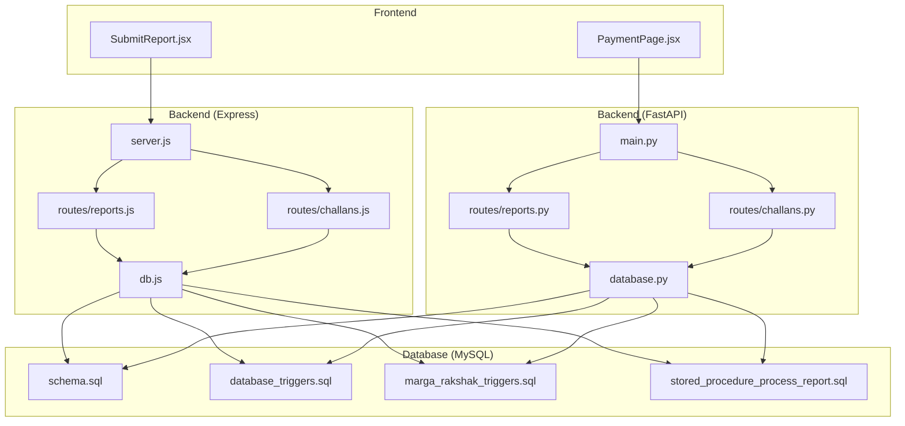
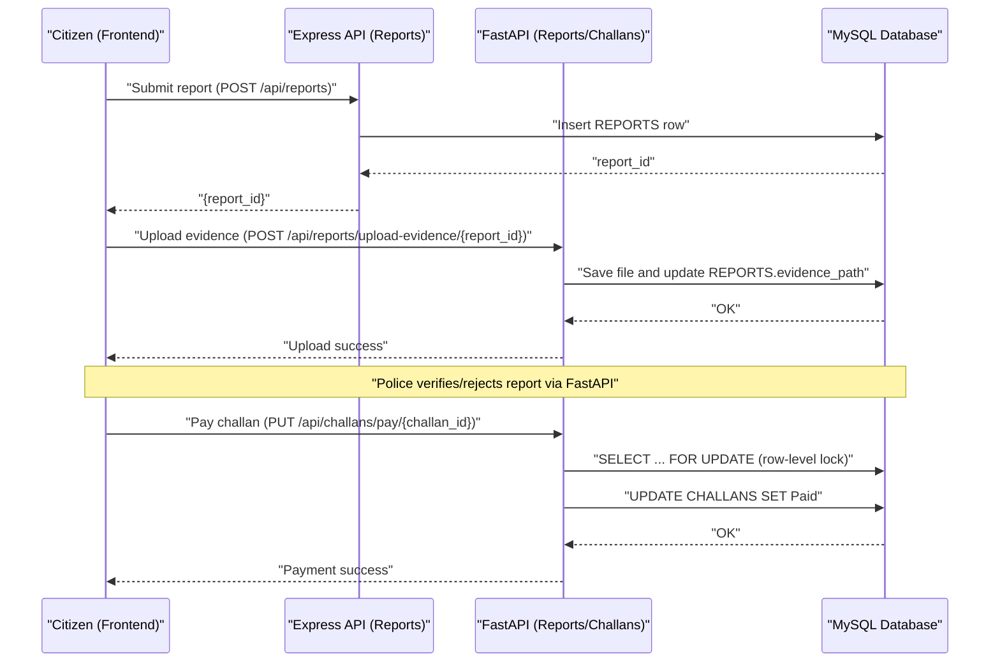
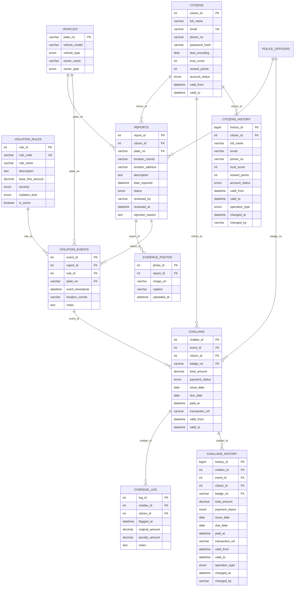
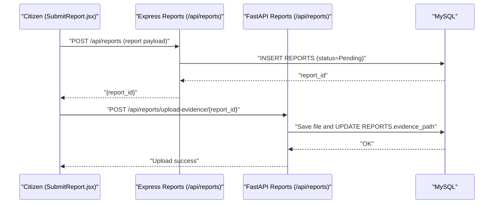
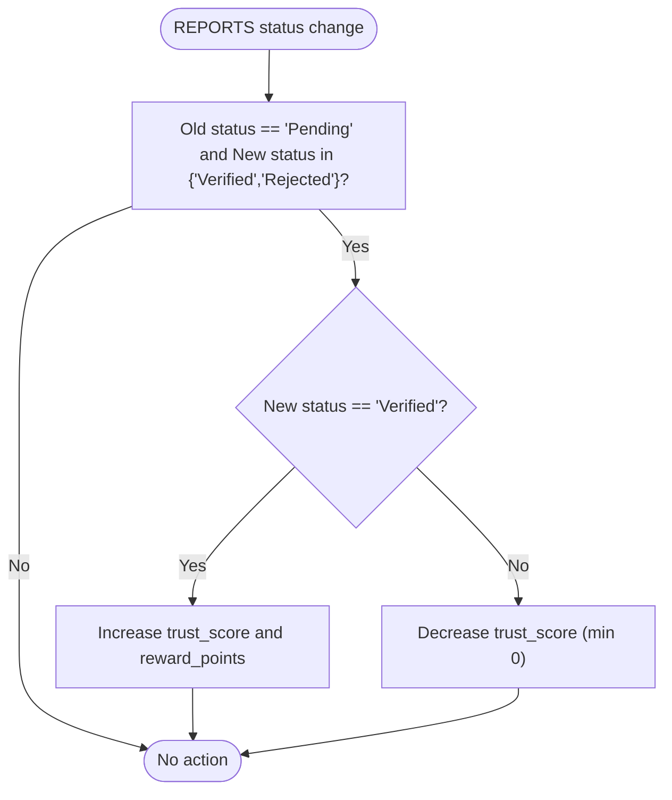
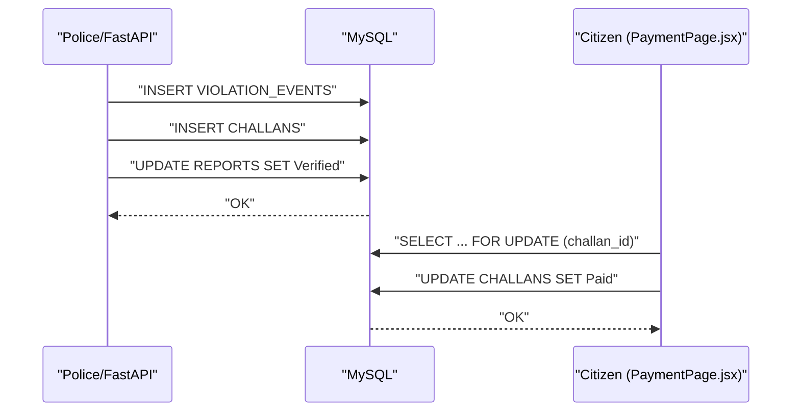
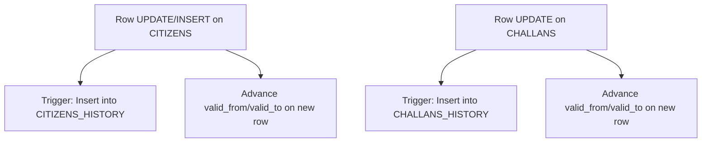
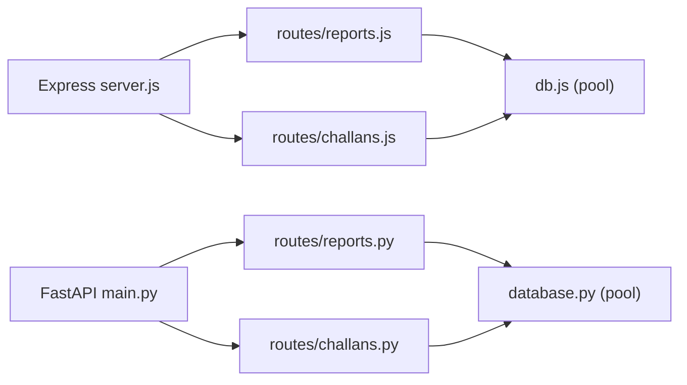
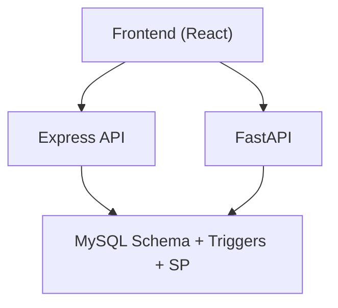

# Data Flow Architecture

<cite>
**Referenced Files in This Document**
- [schema.sql](file://db/schema.sql)
- [stored_procedure_process_report.sql](file://db/stored_procedure_process_report.sql)
- [database_triggers.sql](file://db/database_triggers.sql)
- [marga_rakshak_triggers.sql](file://db/marga_rakshak_triggers.sql)
- [db.js](file://backend/db.js)
- [database.py](file://server/database.py)
- [SubmitReport.jsx](file://frontend/src/pages/SubmitReport.jsx)
- [PaymentPage.jsx](file://frontend/src/pages/PaymentPage.jsx)
- [reports.js](file://backend/routes/reports.js)
- [challans.js](file://backend/routes/challans.js)
- [reports.py](file://server/routes/reports.py)
- [challans.py](file://server/routes/challans.py)
- [main.py](file://server/main.py)
- [server.js](file://backend/server.js)
- [test_trust_score_triggers.py](file://scripts/test_trust_score_triggers.py)
</cite>

## Table of Contents
1. [Introduction](#introduction)
2. [Project Structure](#project-structure)
3. [Core Components](#core-components)
4. [Architecture Overview](#architecture-overview)
5. [Detailed Component Analysis](#detailed-component-analysis)
6. [Dependency Analysis](#dependency-analysis)
7. [Performance Considerations](#performance-considerations)
8. [Troubleshooting Guide](#troubleshooting-guide)
9. [Conclusion](#conclusion)

## Introduction
This document explains the end-to-end data flow architecture of the Traffic Violation Management System (TVMS). It covers the complete lifecycle from citizen report submission, police verification, challan generation, and payment processing, through the backend APIs and the database. It also documents the database design patterns (5NF normalization, temporal tables, and trigger-based automation), transaction flows, audit trails, historical tracking, integration patterns, stored procedures, and performance considerations.

## Project Structure
The system comprises:
- Frontend (React SPA) for citizen and police interactions
- Backend (Express.js) for citizen-facing APIs
- Backend (FastAPI) for police and administrative APIs
- Database (MySQL) implementing normalized schemas, temporal tables, triggers, and stored procedures

**Diagram sources**
- [server.js:1-42](file://backend/server.js#L1-L42)
- [main.py:1-107](file://server/main.py#L1-L107)
- [db.js:1-26](file://backend/db.js#L1-L26)
- [database.py:1-76](file://server/database.py#L1-L76)
- [schema.sql:1-942](file://db/schema.sql#L1-L942)
- [database_triggers.sql:1-48](file://db/database_triggers.sql#L1-L48)
- [marga_rakshak_triggers.sql:1-78](file://db/marga_rakshak_triggers.sql#L1-L78)
- [stored_procedure_process_report.sql:1-115](file://db/stored_procedure_process_report.sql#L1-L115)

**Section sources**
- [server.js:1-42](file://backend/server.js#L1-L42)
- [main.py:1-107](file://server/main.py#L1-L107)
- [db.js:1-26](file://backend/db.js#L1-L26)
- [database.py:1-76](file://server/database.py#L1-L76)
- [schema.sql:1-942](file://db/schema.sql#L1-L942)

## Core Components
- Entities and relations: CITIZENS, POLICE_OFFICERS, VEHICLES, VIOLATION_RULES, REPORTS, EVIDENCE_PHOTOS, VIOLATION_EVENTS, CHALLANS, OVERDUE_LOG, and transient tables ACTIVE_SESSIONS and UNVERIFIED_UPLOADS.
- Temporal design: CITIZENS and CHALLANS include valid_from/valid_to for historical versioning; CITIZENS_HISTORY and CHALLANS_HISTORY capture audit trails.
- Triggers: Automated trust score updates on REPORTS status changes; temporal versioning on CITIZENS and CHALLANS updates.
- Stored procedures: ACID-compliant report processing and challan issuance; payment processing with row-level locking; overdue flagging with cursor-based iteration.
- Views: Pending_Reports_Dashboard and Citizen_Challan_Summary for dashboards and summaries.

**Section sources**
- [schema.sql:26-235](file://db/schema.sql#L26-L235)
- [schema.sql:304-430](file://db/schema.sql#L304-L430)
- [schema.sql:432-754](file://db/schema.sql#L432-L754)
- [schema.sql:757-800](file://db/schema.sql#L757-L800)

## Architecture Overview
The TVMS follows a layered architecture:
- Presentation layer: React frontend for citizens and police
- API layer: Express.js and FastAPI microservices exposing REST endpoints
- Persistence layer: MySQL with normalized schema, triggers, stored procedures, and views

**Diagram sources**
- [SubmitReport.jsx:121-156](file://frontend/src/pages/SubmitReport.jsx#L121-L156)
- [reports.js:7-31](file://backend/routes/reports.js#L7-L31)
- [reports.py:50-121](file://server/routes/reports.py#L50-L121)
- [challans.js:31-98](file://backend/routes/challans.js#L31-L98)
- [challans.py:336-397](file://server/routes/challans.py#L336-L397)
- [schema.sql:116-195](file://db/schema.sql#L116-L195)

## Detailed Component Analysis

### Database Design Patterns
- 5NF Normalization: Separate entities for CITIZENS, POLICE_OFFICERS, VEHICLES, VIOLATION_RULES, REPORTS, EVIDENCE_PHOTOS, VIOLATION_EVENTS, CHALLANS, and OVERDUE_LOG minimize redundancy and anomalies.
- Temporal Tables: CITIZENS and CHALLANS include valid_from/valid_to; CITIZENS_HISTORY and CHALLANS_HISTORY capture historical changes with operation_type and changed_at.
- Trigger Automation: 
  - Auto_Reward_System and Auto_Penalty_System adjust CITIZENS.trust_score and reward_points upon REPORTS status changes.
  - CITIZENS_BEFORE_UPDATE and CHALLANS_BEFORE_UPDATE/CHALLANS_AFTER_INSERT manage temporal versioning and history logging.
- Stored Procedures:
  - ProcessReportAndIssueChallan: ACID transaction for report processing and challan creation.
  - sp_issue_challan: Full transaction with row-level locks and foreign key-safe creation.
  - sp_pay_challan: Concurrent-safe payment with SELECT ... FOR UPDATE and reward points addition.
  - sp_flag_overdue_challans: Cursor-based iteration to apply penalties and update trust scores.

**Diagram sources**
- [schema.sql:26-235](file://db/schema.sql#L26-L235)
- [schema.sql:49-219](file://db/schema.sql#L49-L219)

**Section sources**
- [schema.sql:17-235](file://db/schema.sql#L17-L235)
- [schema.sql:304-430](file://db/schema.sql#L304-L430)
- [schema.sql:432-754](file://db/schema.sql#L432-L754)

### Report Submission Pipeline (Citizen)
- Frontend collects plate_no, violation_type, location_address, description, and evidence image.
- POST to Express API (/api/reports) inserts REPORTS with status Pending.
- Evidence upload to FastAPI (/api/reports/upload-evidence/{report_id}) saves file and updates REPORTS.evidence_path.
- The system ensures vehicle registration exists; if not, it is created during report creation.

**Diagram sources**
- [SubmitReport.jsx:121-156](file://frontend/src/pages/SubmitReport.jsx#L121-L156)
- [reports.js:7-31](file://backend/routes/reports.js#L7-L31)
- [reports.py:50-121](file://server/routes/reports.py#L50-L121)

**Section sources**
- [SubmitReport.jsx:92-177](file://frontend/src/pages/SubmitReport.jsx#L92-L177)
- [reports.js:7-31](file://backend/routes/reports.js#L7-L31)
- [reports.py:147-223](file://server/routes/reports.py#L147-L223)

### Trust Score Automation Triggers
- Auto_Reward_System increases trust_score and reward_points when REPORTS.status transitions from Pending to Verified.
- Auto_Penalty_System decreases trust_score when REPORTS.status transitions from Pending to Rejected.
- Additional trigger set (marga_rakshak_triggers.sql) includes similar logic and verification queries.

**Diagram sources**
- [database_triggers.sql:8-35](file://db/database_triggers.sql#L8-L35)
- [marga_rakshak_triggers.sql:16-45](file://db/marga_rakshak_triggers.sql#L16-L45)

**Section sources**
- [database_triggers.sql:1-48](file://db/database_triggers.sql#L1-L48)
- [marga_rakshak_triggers.sql:1-78](file://db/marga_rakshak_triggers.sql#L1-L78)
- [test_trust_score_triggers.py:1-198](file://scripts/test_trust_score_triggers.py#L1-L198)

### Challan Generation and Payment Processing
- Challan creation:
  - FastAPI (/api/challans/create) validates report status, creates VIOLATION_EVENTS, and inserts CHALLANS, then sets REPORTS.status to Verified.
  - Stored procedure ProcessReportAndIssueChallan encapsulates the same logic with ACID guarantees.
- Payment processing:
  - Frontend navigates to PaymentPage.jsx which calls FastAPI (/api/challans/pay/{challan_id}).
  - The endpoint performs SELECT ... FOR UPDATE to lock the row, checks ownership and status, updates to Paid, and adds reward points.

**Diagram sources**
- [challans.py:47-139](file://server/routes/challans.py#L47-L139)
- [stored_procedure_process_report.sql:8-98](file://db/stored_procedure_process_report.sql#L8-L98)
- [PaymentPage.jsx:58-80](file://frontend/src/pages/PaymentPage.jsx#L58-L80)
- [challans.py:336-397](file://server/routes/challans.py#L336-L397)

**Section sources**
- [challans.py:47-139](file://server/routes/challans.py#L47-L139)
- [stored_procedure_process_report.sql:8-98](file://db/stored_procedure_process_report.sql#L8-L98)
- [PaymentPage.jsx:46-80](file://frontend/src/pages/PaymentPage.jsx#L46-L80)
- [challans.py:336-397](file://server/routes/challans.py#L336-L397)

### Audit Trails and Historical Tracking
- CITIZENS_HISTORY captures every update/delete with operation_type and changed_by.
- CHALLANS_HISTORY mirrors CHALLANS with valid_from/valid_to and operation_type for auditability.
- Events purge expired sessions and unlinked uploads automatically.

**Diagram sources**
- [schema.sql:307-356](file://db/schema.sql#L307-L356)
- [schema.sql:384-429](file://db/schema.sql#L384-L429)

**Section sources**
- [schema.sql:49-65](file://db/schema.sql#L49-L65)
- [schema.sql:198-219](file://db/schema.sql#L198-L219)
- [schema.sql:277-300](file://db/schema.sql#L277-L300)

### Integration Patterns
- CORS-enabled FastAPI and Express servers expose routes under /api/*.
- Static file serving for evidence uploads.
- Authentication middleware used in backend routes (Express) and FastAPI routers.

**Diagram sources**
- [server.js:1-42](file://backend/server.js#L1-L42)
- [main.py:1-107](file://server/main.py#L1-L107)
- [db.js:1-26](file://backend/db.js#L1-L26)
- [database.py:1-76](file://server/database.py#L1-L76)

**Section sources**
- [server.js:13-27](file://backend/server.js#L13-L27)
- [main.py:60-72](file://server/main.py#L60-L72)

## Dependency Analysis
- Backend Express depends on a MySQL pool abstraction and exposes citizen-centric endpoints.
- Backend FastAPI depends on a separate MySQL pool abstraction and exposes police/admin endpoints.
- Both backends interact with the same MySQL schema, leveraging triggers and stored procedures.
- Frontend integrates with both backend services for submission and payment flows.

**Diagram sources**
- [db.js:1-26](file://backend/db.js#L1-L26)
- [database.py:1-76](file://server/database.py#L1-L76)
- [schema.sql:1-942](file://db/schema.sql#L1-L942)

**Section sources**
- [db.js:1-26](file://backend/db.js#L1-L26)
- [database.py:1-76](file://server/database.py#L1-L76)
- [schema.sql:1-942](file://db/schema.sql#L1-L942)

## Performance Considerations
- Indexes: Strategic indexes on status, dates, foreign keys, and composite keys support efficient filtering and joins.
- Concurrency: SELECT ... FOR UPDATE prevents race conditions during payment and report updates.
- Stored procedures: Encapsulate ACID transactions and reduce network round trips.
- Events: Scheduled purges for ACTIVE_SESSIONS and UNVERIFIED_UPLOADS reduce storage overhead.
- Views: Denormalized views (Pending_Reports_Dashboard, Citizen_Challan_Summary) optimize read-heavy dashboards.

[No sources needed since this section provides general guidance]

## Troubleshooting Guide
- Trust score triggers not firing:
  - Verify triggers installation and test script execution.
  - Confirm REPORTS status transitions from Pending to Verified/Rejected.
- Payment failures:
  - Ensure row-level locking is respected; check for concurrent requests.
  - Validate challan ownership and non-paid status.
- Report processing errors:
  - Use stored procedure ProcessReportAndIssueChallan for ACID guarantees.
  - Confirm violation rule existence and report status is Pending.

**Section sources**
- [test_trust_score_triggers.py:17-198](file://scripts/test_trust_score_triggers.py#L17-L198)
- [challans.py:336-397](file://server/routes/challans.py#L336-L397)
- [stored_procedure_process_report.sql:8-98](file://db/stored_procedure_process_report.sql#L8-L98)

## Conclusion
The Traffic Violation Management System employs a robust, layered architecture with strong data integrity enforced by 5NF normalization, temporal tables, and trigger automation. ACID-compliant stored procedures and row-level locking ensure reliable transaction processing for challan issuance and payment. The system’s audit trails and historical tracking provide transparency and compliance readiness. Integration between frontend and dual backend services, combined with scheduled maintenance tasks, supports scalable and maintainable operations.