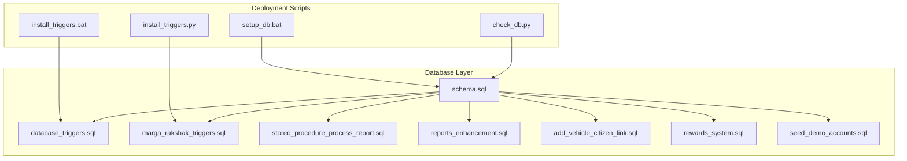
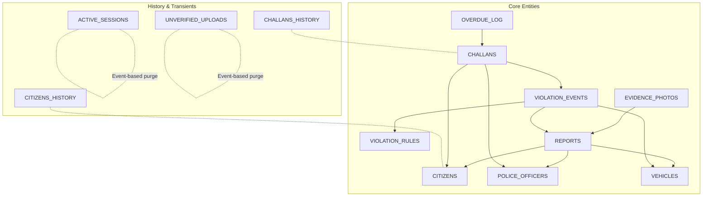
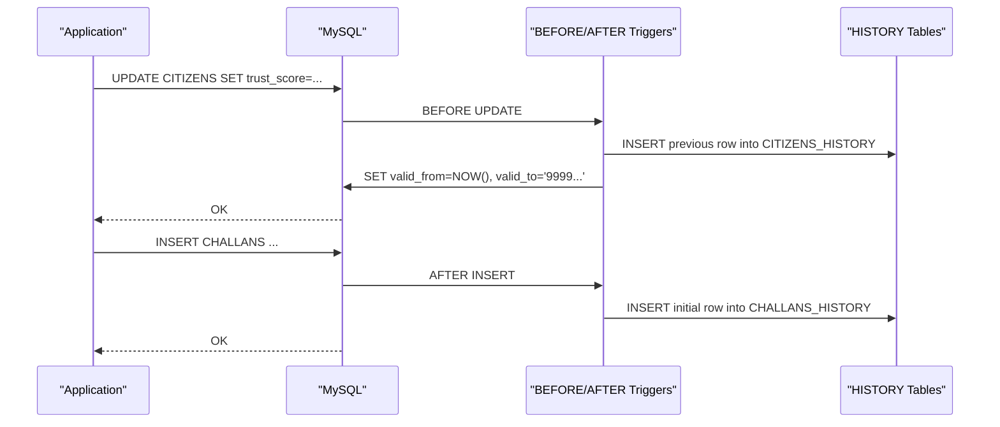
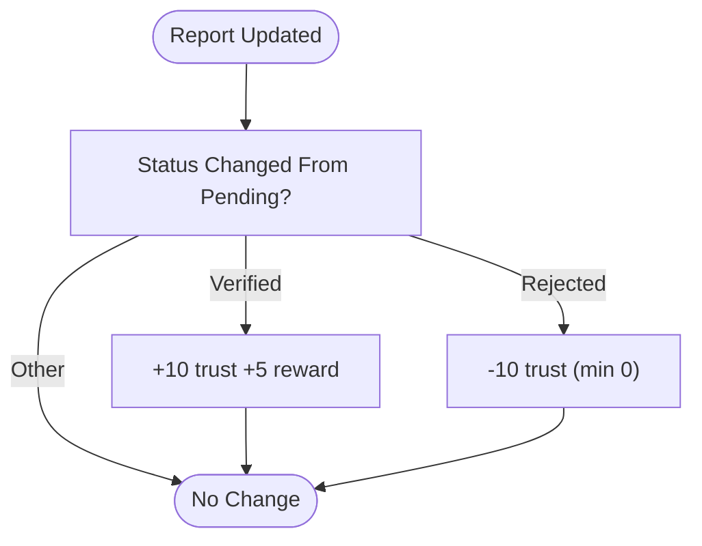
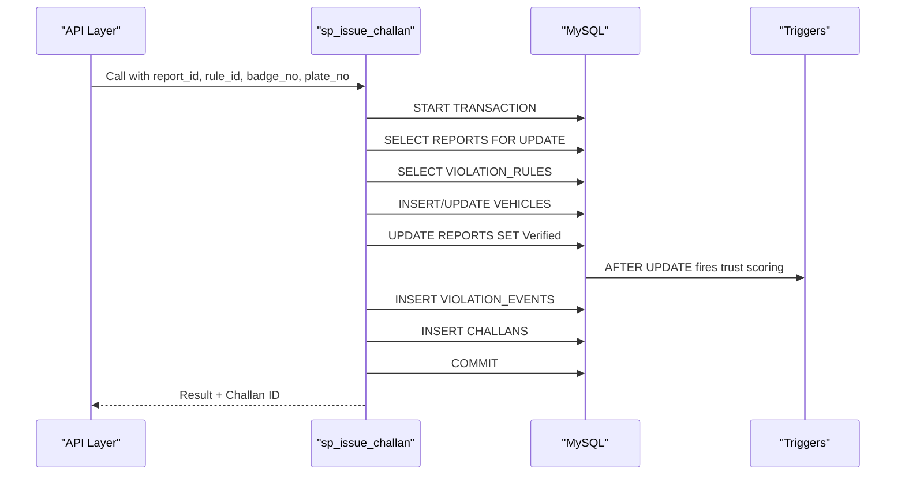
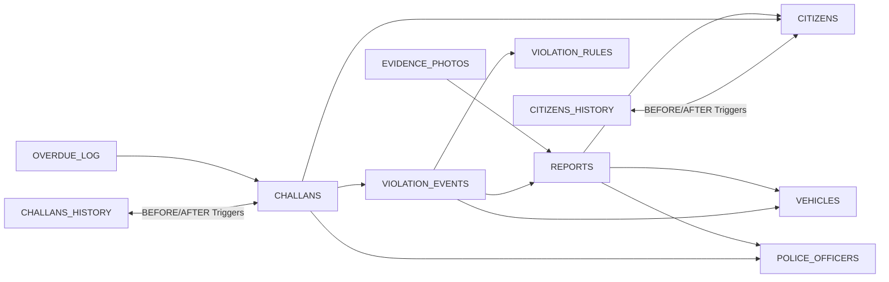

# Data Integrity Mechanisms

<cite>
**Referenced Files in This Document**
- [schema.sql](file://db/schema.sql)
- [database_triggers.sql](file://db/database_triggers.sql)
- [marga_rakshak_triggers.sql](file://db/marga_rakshak_triggers.sql)
- [stored_procedure_process_report.sql](file://db/stored_procedure_process_report.sql)
- [reports_enhancement.sql](file://db/reports_enhancement.sql)
- [add_vehicle_citizen_link.sql](file://db/add_vehicle_citizen_link.sql)
- [rewards_system.sql](file://db/rewards_system.sql)
- [seed_demo_accounts.sql](file://db/seed_demo_accounts.sql)
- [install_triggers.bat](file://scripts/install_triggers.bat)
- [setup_db.bat](file://scripts/setup_db.bat)
- [install_triggers.py](file://server/install_triggers.py)
- [check_db.py](file://server/check_db.py)
</cite>

## Table of Contents
1. [Introduction](#introduction)
2. [Project Structure](#project-structure)
3. [Core Components](#core-components)
4. [Architecture Overview](#architecture-overview)
5. [Detailed Component Analysis](#detailed-component-analysis)
6. [Dependency Analysis](#dependency-analysis)
7. [Performance Considerations](#performance-considerations)
8. [Troubleshooting Guide](#troubleshooting-guide)
9. [Conclusion](#conclusion)
10. [Appendices](#appendices)

## Introduction
This document details the data integrity mechanisms implemented in the Traffic Violation Management System. It covers trigger-based automation for trust score updates, challan generation, and audit trail creation; foreign key constraint enforcement and referential integrity across the core schema; CHECK constraints for data validation; ENUM usage for controlled value sets; temporal data integrity via valid_from/valid_to columns synchronized with HISTORY tables; cascade delete and set null behaviors; database events and scheduled tasks for maintenance; and operational guidance for backup and recovery in production.

## Project Structure
The database layer is primarily defined in SQL scripts under the db directory, complemented by Windows batch and Python utilities for deployment and verification. The schema defines 12 core tables plus transient and history tables, along with triggers, stored procedures, views, and events.

**Diagram sources**
- [schema.sql:1-942](file://db/schema.sql#L1-L942)
- [database_triggers.sql:1-48](file://db/database_triggers.sql#L1-L48)
- [marga_rakshak_triggers.sql:1-78](file://db/marga_rakshak_triggers.sql#L1-L78)
- [stored_procedure_process_report.sql:1-115](file://db/stored_procedure_process_report.sql#L1-L115)
- [reports_enhancement.sql:1-302](file://db/reports_enhancement.sql#L1-L302)
- [add_vehicle_citizen_link.sql:1-38](file://db/add_vehicle_citizen_link.sql#L1-L38)
- [rewards_system.sql:1-127](file://db/rewards_system.sql#L1-L127)
- [seed_demo_accounts.sql:1-175](file://db/seed_demo_accounts.sql#L1-L175)
- [setup_db.bat:1-64](file://scripts/setup_db.bat#L1-L64)
- [install_triggers.bat:1-55](file://scripts/install_triggers.bat#L1-L55)
- [install_triggers.py:1-71](file://server/install_triggers.py#L1-L71)
- [check_db.py:1-14](file://server/check_db.py#L1-L14)

**Section sources**
- [schema.sql:1-942](file://db/schema.sql#L1-L942)
- [setup_db.bat:1-64](file://scripts/setup_db.bat#L1-L64)

## Core Components
- Schema and Constraints: Defines 12 core tables with primary keys, foreign keys, CHECK constraints, and ENUM columns. Includes temporal columns valid_from/valid_to and HISTORY tables for audit trails.
- Triggers: Automate trust score updates on report status changes, capture temporal history rows for CITIZENS and CHALLANS, and enforce policy-driven behaviors.
- Stored Procedures: Provide ACID-compliant workflows for report processing, challan issuance, payment processing, and overdue flagging.
- Events: Scheduled maintenance tasks purge expired sessions and unverified uploads.
- Enhanced Reporting: Extends REPORTS with new columns and mock data for richer analytics and testing.
- Rewards System: Introduces reward tracking with audit trail and triggers to maintain consistency.

**Section sources**
- [schema.sql:26-235](file://db/schema.sql#L26-L235)
- [database_triggers.sql:8-35](file://db/database_triggers.sql#L8-L35)
- [marga_rakshak_triggers.sql:16-45](file://db/marga_rakshak_triggers.sql#L16-L45)
- [stored_procedure_process_report.sql:8-98](file://db/stored_procedure_process_report.sql#L8-L98)
- [reports_enhancement.sql:14-47](file://db/reports_enhancement.sql#L14-L47)
- [rewards_system.sql:10-103](file://db/rewards_system.sql#L10-L103)

## Architecture Overview
The system enforces integrity at multiple layers:
- Database-level: Foreign keys, CHECK constraints, ENUMs, and temporal versioning.
- Automation-level: Triggers and stored procedures encapsulate business logic and maintain consistency.
- Maintenance-level: Events automate cleanup of transient data.

**Diagram sources**
- [schema.sql:26-235](file://db/schema.sql#L26-L235)

## Detailed Component Analysis

### Foreign Key Constraint Enforcement and Referential Integrity
- CITIZENS to REPORTS: CASCADE DELETE ensures deleting a citizen removes their reports.
- REPORTS to VEHICLES: SET NULL on plate_no deletion allows orphaned reports to persist without vehicle linkage.
- REPORTS to POLICE_OFFICERS: SET NULL on officer deletion preserves report review metadata.
- VIOLATION_EVENTS to REPORTS: CASCADE DELETE maintains event integrity with report lifecycle.
- VIOLATION_EVENTS to VIOLATION_RULES: RESTRICT prevents deletion of active rules tied to events.
- VIOLATION_EVENTS to VEHICLES: SET NULL on vehicle deletion decouples events.
- CHALLANS to VIOLATION_EVENTS: CASCADE DELETE aligns challan lifecycle with events.
- CHALLANS to CITIZENS: CASCADE DELETE ensures challans are removed with citizens.
- CHALLANS to POLICE_OFFICERS: RESTRICT prevents removal of issuing officers.
- OVERDUE_LOG to CHALLANS: CASCADE DELETE keeps overdue ledger in sync.
- OVERDUE_LOG to CITIZENS: CASCADE DELETE maintains audit continuity.

These behaviors ensure referential integrity during deletions and prevent orphaned records.

**Section sources**
- [schema.sql:130-136](file://db/schema.sql#L130-L136)
- [schema.sql:162-167](file://db/schema.sql#L162-L167)
- [schema.sql:188-195](file://db/schema.sql#L188-L195)
- [schema.sql:232-235](file://db/schema.sql#L232-L235)

### CHECK Constraints and Controlled Value Sets (ENUM)
- CITIZENS: trust_score constrained to [0, 200]; account_status ENUM('Active','Suspended','Banned').
- VIOLATION_RULES: base_fine_amount > 0; severity ENUM('Minor','Moderate','Major','Critical'); violation_time ENUM('Daytime','Nighttime','Anytime').
- CHALLANS: total_amount > 0; payment_status ENUM('Unpaid','Paid','Overdue','Waived','Disputed').
- VEHICLES: vehicle_type ENUM('Car','Motorcycle','Truck','Bus','Auto-Rickshaw','Bicycle','Other'); owner_type ENUM('Individual','Corporate','Government').
- REPORTS: status ENUM extended to include 'Challan Issued'; includes fine_amount column.
- POLICE_OFFICERS: is_active boolean; indexed station_code for station-level reporting.

These constraints and ENUMs enforce domain validity and reduce invalid states.

**Section sources**
- [schema.sql:33](file://db/schema.sql#L33)
- [schema.sql:105](file://db/schema.sql#L105)
- [schema.sql:178](file://db/schema.sql#L178)
- [schema.sql:90](file://db/schema.sql#L90)
- [schema.sql:92](file://db/schema.sql#L92)
- [schema.sql:124](file://db/schema.sql#L124)
- [reports_enhancement.sql:34-37](file://db/reports_enhancement.sql#L34-L37)

### Temporal Data Integrity and HISTORY Synchronization
- CITIZENS and CHALLANS include valid_from/valid_to timestamps to represent temporal validity.
- Triggers capture previous versions into CITIZENS_HISTORY and CHALLANS_HISTORY before updates and after inserts.
- On UPDATE: the old row’s valid_to is closed and a new row is opened with valid_from set to now.
- On INSERT: initial history rows are logged with full valid_from/valid_to spans.

This pattern ensures auditable, non-overlapping temporal records and supports historical analysis.

**Diagram sources**
- [schema.sql:311-336](file://db/schema.sql#L311-L336)
- [schema.sql:341-356](file://db/schema.sql#L341-L356)
- [schema.sql:387-407](file://db/schema.sql#L387-L407)
- [schema.sql:412-429](file://db/schema.sql#L412-L429)

**Section sources**
- [schema.sql:38-43](file://db/schema.sql#L38-L43)
- [schema.sql:184-195](file://db/schema.sql#L184-L195)
- [schema.sql:311-336](file://db/schema.sql#L311-L336)
- [schema.sql:341-356](file://db/schema.sql#L341-L356)
- [schema.sql:387-407](file://db/schema.sql#L387-L407)
- [schema.sql:412-429](file://db/schema.sql#L412-L429)

### Trigger-Based Automation: Trust Score, Challan Generation, Audit Trails
- Auto-Reward and Auto-Penalty Triggers: After REPORTS status changes from Pending to Verified or Rejected, CITIZENS trust_score and reward_points are adjusted accordingly.
- CITIZENS History Triggers: Capture updates and initial inserts into CITIZENS_HISTORY.
- CHALLANS History Triggers: Capture updates and initial inserts into CHALLANS_HISTORY.
- Report Processing Workflow: Stored procedure validates inputs, optionally creates missing VEHICLES entries, updates REPORTS status, creates VIOLATION_EVENTS, and issues CHALLANS atomically.

**Diagram sources**
- [database_triggers.sql:10-35](file://db/database_triggers.sql#L10-L35)
- [marga_rakshak_triggers.sql:16-45](file://db/marga_rakshak_triggers.sql#L16-L45)

**Section sources**
- [database_triggers.sql:8-35](file://db/database_triggers.sql#L8-L35)
- [marga_rakshak_triggers.sql:16-45](file://db/marga_rakshak_triggers.sql#L16-L45)
- [schema.sql:363-382](file://db/schema.sql#L363-L382)
- [schema.sql:311-336](file://db/schema.sql#L311-L336)
- [schema.sql:387-407](file://db/schema.sql#L387-L407)

### Stored Procedures for Automated Operations
- sp_issue_challan: Validates report state, selects active violation rule, optionally creates VEHICLE, updates REPORTS status, inserts VIOLATION_EVENTS, and inserts CHALLANS within a transaction with exception handling.
- sp_pay_challan: Locks specific CHALLAN row, verifies ownership and status, marks Paid, stores transaction reference, and rewards citizen.
- sp_reject_report: Validates report state and status, updates to Rejected with reason and reviewer metadata.
- sp_flag_overdue_challans: Iterates unpaid challans past due date, applies 15% penalty, logs in OVERDUE_LOG, and reduces citizen trust.

**Diagram sources**
- [schema.sql:440-546](file://db/schema.sql#L440-L546)

**Section sources**
- [schema.sql:440-546](file://db/schema.sql#L440-L546)
- [schema.sql:552-629](file://db/schema.sql#L552-L629)
- [schema.sql:634-686](file://db/schema.sql#L634-L686)
- [schema.sql:693-754](file://db/schema.sql#L693-L754)

### Database Events and Scheduled Tasks
- Purge Expired Sessions: Hourly event deletes ACTIVE_SESSIONS where expires_at < NOW().
- Purge Unverified Uploads: Every six hours event deletes UNVERIFIED_UPLOADS older than expiry and not yet linked.

These events maintain data hygiene and prevent accumulation of stale transient data.

**Section sources**
- [schema.sql:279-300](file://db/schema.sql#L279-L300)

### Enhanced Reporting and Controlled Status Set
- REPORTS table extended with violation_type, latitude/longitude, fine_amount, and status ENUM expanded to include 'Challan Issued'.
- Mock data injection demonstrates realistic Chennai-based scenarios across Pending, Verified, Challan Issued, and Rejected statuses.

**Section sources**
- [reports_enhancement.sql:14-47](file://db/reports_enhancement.sql#L14-L47)
- [reports_enhancement.sql:53-285](file://db/reports_enhancement.sql#L53-L285)

### Rewards System and Audit Trail
- REWARDS_CATALOG and REDEMPTION_HISTORY tables track reward eligibility and redemptions.
- Trigger updates reward_points when reports reach Verified or Challan Issued.
- View provides citizen rewards dashboard metrics.

**Section sources**
- [rewards_system.sql:10-103](file://db/rewards_system.sql#L10-L103)

### Vehicle-Citizen Ownership Link
- Added citizen_id to VEHICLES with foreign key to CITIZENS and SET NULL on delete to preserve vehicle records while unlinking owners.

**Section sources**
- [add_vehicle_citizen_link.sql:9-13](file://db/add_vehicle_citizen_link.sql#L9-L13)

## Dependency Analysis
The following diagram maps key dependencies among tables and integrity mechanisms:

**Diagram sources**
- [schema.sql:26-235](file://db/schema.sql#L26-L235)

**Section sources**
- [schema.sql:130-136](file://db/schema.sql#L130-L136)
- [schema.sql:162-167](file://db/schema.sql#L162-L167)
- [schema.sql:188-195](file://db/schema.sql#L188-L195)
- [schema.sql:232-235](file://db/schema.sql#L232-L235)

## Performance Considerations
- Indexes on frequently filtered columns (e.g., CITIZENS(account_status), REPORTS(status, date_reported), CHALLANS(payment_status, due_date)) improve query performance.
- Triggers operate per-row; minimize heavy computations inside triggers to avoid contention.
- Stored procedures use row-level locks (SELECT ... FOR UPDATE) to prevent race conditions during concurrent updates.
- Events run periodically; schedule during low-traffic windows to minimize impact.

[No sources needed since this section provides general guidance]

## Troubleshooting Guide
- Trigger Installation Failures: Use provided scripts to drop and recreate triggers, then verify with INFORMATION_SCHEMA queries.
- Database Setup Issues: Confirm MySQL availability and correct credentials; run setup_db.bat to initialize schema.
- Verification Queries: Utilize provided verification sections in trigger and procedure scripts to confirm successful creation and behavior.
- Demo Accounts: Seed demo accounts to test end-to-end flows quickly.

**Section sources**
- [install_triggers.bat:14-52](file://scripts/install_triggers.bat#L14-L52)
- [install_triggers.py:13-70](file://server/install_triggers.py#L13-L70)
- [database_triggers.sql:43-47](file://db/database_triggers.sql#L43-L47)
- [marga_rakshak_triggers.sql:53-63](file://db/marga_rakshak_triggers.sql#L53-L63)
- [stored_procedure_process_report.sql:106-114](file://db/stored_procedure_process_report.sql#L106-L114)
- [seed_demo_accounts.sql:113-175](file://db/seed_demo_accounts.sql#L113-L175)
- [check_db.py:1-14](file://server/check_db.py#L1-L14)

## Conclusion
The Traffic Violation Management System employs robust data integrity mechanisms across schema, triggers, stored procedures, and events. Foreign keys, CHECK constraints, and ENUMs enforce domain correctness; temporal versioning and HISTORY tables provide auditability; triggers automate trust scoring and audit logging; stored procedures encapsulate ACID workflows; and scheduled events maintain data hygiene. These controls collectively ensure consistency, traceability, and reliability in production environments.

[No sources needed since this section summarizes without analyzing specific files]

## Appendices

### Backup and Recovery Guidance
- Full Logical Backups: Use mysqldump for complete schema and data snapshots.
- Incremental Backups: Schedule periodic binary log backups for point-in-time recovery.
- Verification: Restore to a staging environment and run verification queries against key tables and triggers.
- Disaster Recovery Plan: Maintain offsite copies of backups; test restoration regularly; document rollback procedures for schema changes and triggers.

[No sources needed since this section provides general guidance]