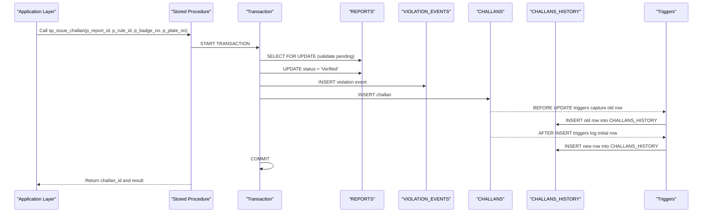
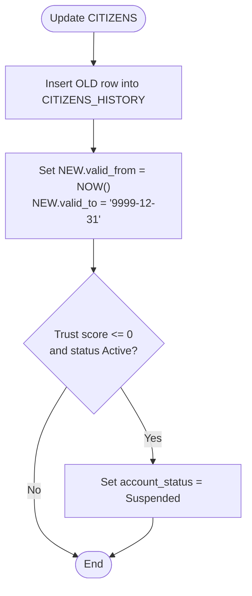
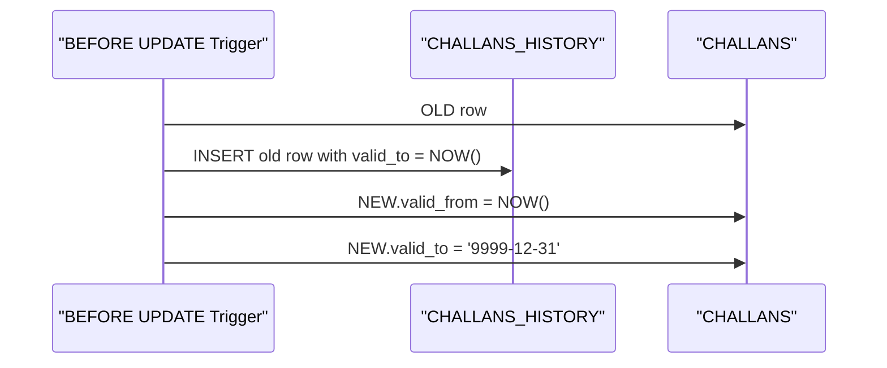
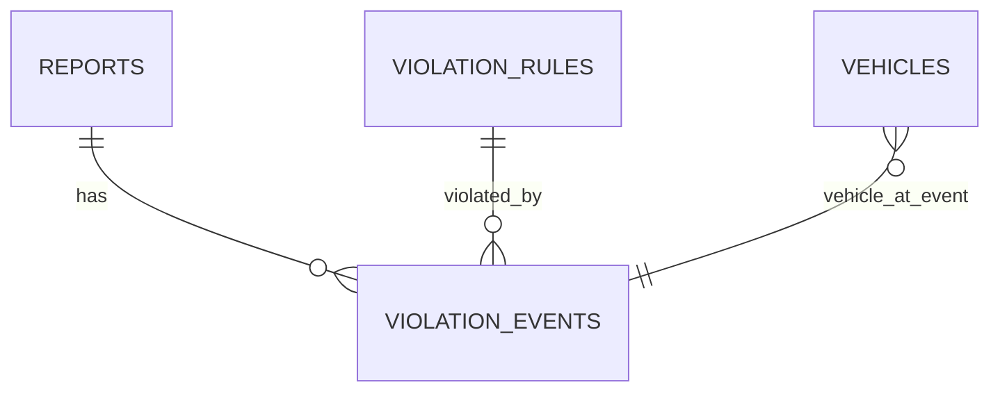
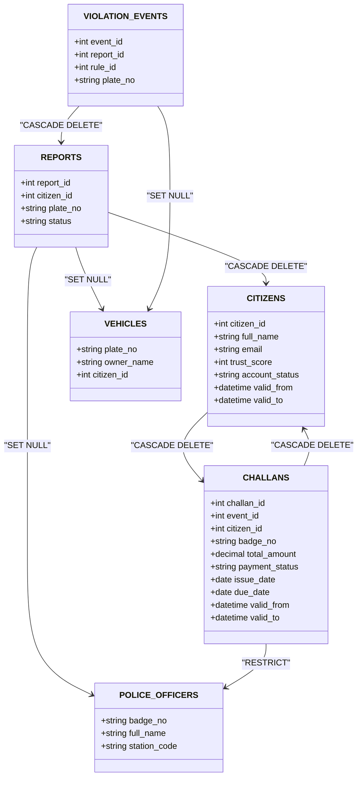
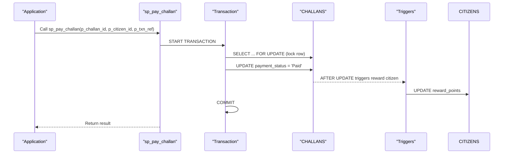
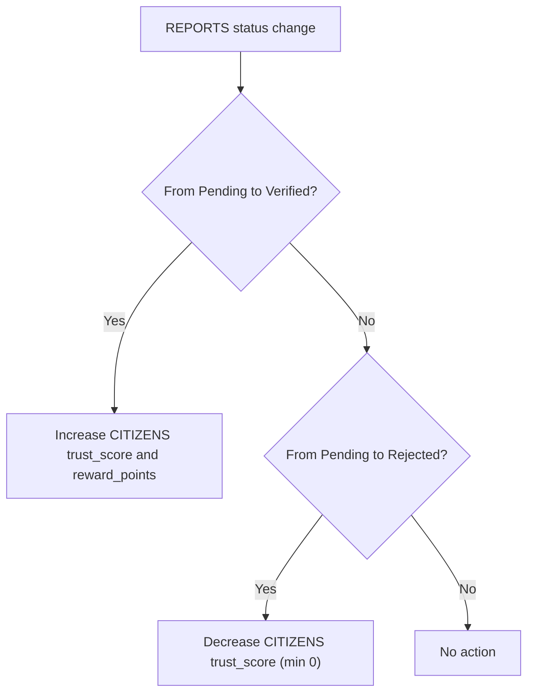
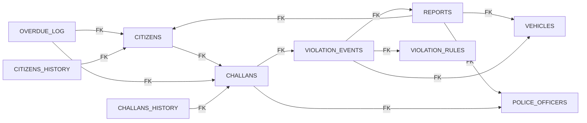

# Database Design Patterns

<cite>
**Referenced Files in This Document**
- [schema.sql](file://db/schema.sql)
- [add_vehicle_citizen_link.sql](file://db/add_vehicle_citizen_link.sql)
- [reports_enhancement.sql](file://db/reports_enhancement.sql)
- [stored_procedure_process_report.sql](file://db/stored_procedure_process_report.sql)
- [marga_rakshak_triggers.sql](file://db/marga_rakshak_triggers.sql)
- [database_triggers.sql](file://db/database_triggers.sql)
- [rewards_system.sql](file://db/rewards_system.sql)
- [seed_demo_accounts.sql](file://db/seed_demo_accounts.sql)
- [insert_mock_reports.sql](file://db/insert_mock_reports.sql)
</cite>

## Table of Contents
1. [Introduction](#introduction)
2. [Project Structure](#project-structure)
3. [Core Components](#core-components)
4. [Architecture Overview](#architecture-overview)
5. [Detailed Component Analysis](#detailed-component-analysis)
6. [Dependency Analysis](#dependency-analysis)
7. [Performance Considerations](#performance-considerations)
8. [Troubleshooting Guide](#troubleshooting-guide)
9. [Conclusion](#conclusion)
10. [Appendices](#appendices)

## Introduction
This document explains the database design patterns used in the Traffic Violation Management System (TVMS). It focuses on:
- 5NF normalized schema design principles and how they prevent data anomalies
- Temporal table pattern with valid_from/valid_to timestamp columns for CITIZENS and CHALLANS
- Audit trail mechanism using separate HISTORY tables (CITIZENS_HISTORY, CHALLANS_HISTORY)
- Junction table pattern for many-to-many relationships (REPORTS-VIOLATION_RULES via VIOLATION_EVENTS)
- Foreign key constraint strategy and referential integrity enforcement
- Examples of table creation statements, indexing strategies, and constraint definitions
- Use of ENUM types for status fields and CHECK constraints for data validation
- Role of AUTO_INCREMENT primary keys and rationale behind composite foreign key designs

## Project Structure
The TVMS database schema is defined primarily in a single schema file and augmented by several enhancement and operational scripts:
- Core schema and triggers: db/schema.sql
- Vehicle-citizen linkage: db/add_vehicle_citizen_link.sql
- Reports enhancements: db/reports_enhancement.sql
- Stored procedures for processing reports and issuing challans: db/stored_procedure_process_report.sql
- Trigger systems for trust scoring: db/marga_rakshak_triggers.sql and db/database_triggers.sql
- Rewards system (additional relational design): db/rewards_system.sql
- Demo seeding and mock data: db/seed_demo_accounts.sql, db/insert_mock_reports.sql

```mermaid
graph TB
subgraph "TVMS Database Schema"
CITIZENS["CITIZENS<br/>Primary key: citizen_id<br/>Temporal: valid_from/valid_to"]
CITIZENS_HISTORY["CITIZENS_HISTORY<br/>Audit trail for CITIZENS"]
POLICE_OFFICERS["POLICE_OFFICERS<br/>Primary key: badge_no"]
VEHICLES["VEHICLES<br/>Primary key: plate_no<br/>FK: citizen_id"]
VIOLATION_RULES["VIOLATION_RULES<br/>Primary key: rule_id"]
REPORTS["REPORTS<br/>Primary key: report_id"]
EVIDENCE_PHOTOS["EVIDENCE_PHOTOS<br/>Primary key: photo_id"]
VIOLATION_EVENTS["VIOLATION_EVENTS<br/>Junction: report_id × rule_id"]
CHALLANS["CHALLANS<br/>Primary key: challan_id<br/>Temporal: valid_from/valid_to"]
CHALLANS_HISTORY["CHALLANS_HISTORY<br/>Audit trail for CHALLANS"]
OVERDUE_LOG["OVERDUE_LOG<br/>Ledger for overdue challans"]
ACTIVE_SESSIONS["ACTIVE_SESSIONS<br/>Transient session table"]
UNVERIFIED_UPLOADS["UNVERIFIED_UPLOADS<br/>Transient upload staging"]
REWARDS_CATALOG["REWARDS_CATALOG<br/>Rewards catalog"]
REDEMPTION_HISTORY["REDEMPTION_HISTORY<br/>Audit trail for redemptions"]
end
CITIZENS --> CITIZENS_HISTORY
CHALLANS --> CHALLANS_HISTORY
REPORTS --> EVIDENCE_PHOTOS
REPORTS --> VIOLATION_EVENTS
VIOLATION_RULES <- --> VIOLATION_EVENTS
VEHICLES --> VIOLATION_EVENTS
POLICE_OFFICERS <- --> CHALLANS
CITIZENS <- --> CHALLANS
VEHICLES <- --> CHALLANS
CHALLANS --> OVERDUE_LOG
CITIZENS --> REWARDS_CATALOG
CITIZENS --> REDEMPTION_HISTORY
REWARDS_CATALOG --> REDEMPTION_HISTORY
```

**Diagram sources**
- [schema.sql:26-235](file://db/schema.sql#L26-L235)
- [add_vehicle_citizen_link.sql:9-13](file://db/add_vehicle_citizen_link.sql#L9-L13)
- [rewards_system.sql:10-41](file://db/rewards_system.sql#L10-L41)

**Section sources**
- [schema.sql:1-942](file://db/schema.sql#L1-L942)

## Core Components
This section outlines the core relational components and their design patterns.

- CITIZENS
  - Primary key: AUTO_INCREMENT citizen_id
  - Temporal columns: valid_from, valid_to
  - Constraints: CHECK on trust_score, ENUM on account_status
  - Indexes: email, account_status, trust_score
  - Audit trail: CITIZENS_HISTORY captures mutations with operation_type and changed_by

- CHALLANS
  - Primary key: AUTO_INCREMENT challan_id
  - Temporal columns: valid_from, valid_to
  - Constraints: CHECK on total_amount, ENUM on payment_status
  - Indexes: payment_status, citizen_id, due_date, issue_date
  - Audit trail: CHALLANS_HISTORY captures updates and inserts

- VIOLATION_EVENTS (Junction table)
  - Composite primary key: event_id (AUTO_INCREMENT)
  - Composite foreign keys: report_id × rule_id
  - Optional plate_no links to VEHICLES
  - Indexes: report_id, rule_id

- REPORTS
  - Primary key: AUTO_INCREMENT report_id
  - Foreign keys: citizen_id (CITIZENS), plate_no (VEHICLES), reviewed_by (POLICE_OFFICERS)
  - Enhanced with violation_type, latitude/longitude, fine_amount, and ENUM extension to include 'Challan Issued'
  - Indexes: status, citizen_id, date_reported, violation_type, location (lat/lng), fine_amount

- POLICE_OFFICERS
  - Primary key: badge_no (VARCHAR)
  - Indexes: station_code

- VEHICLES
  - Primary key: plate_no (VARCHAR)
  - Added citizen_id foreign key linking to CITIZENS
  - Indexes: vehicle_type

- VIOLATION_RULES
  - Primary key: rule_id (AUTO_INCREMENT)
  - Constraints: CHECK on base_fine_amount, ENUMs for severity and violation_time
  - Indexes: severity

- EVIDENCE_PHOTOS
  - Primary key: photo_id (AUTO_INCREMENT)
  - Foreign key: report_id → REPORTS

- OVERDUE_LOG
  - Primary key: log_id (AUTO_INCREMENT)
  - Foreign keys: challan_id → CHALLANS, citizen_id → CITIZENS

- Transient tables
  - ACTIVE_SESSIONS: short-lived sessions with auto-purge events
  - UNVERIFIED_UPLOADS: staging area with expiry and linkage tracking

- Views
  - Pending_Reports_Dashboard, Citizen_Challan_Summary, Officer_Performance_View, Citizen_Trust_History

**Section sources**
- [schema.sql:26-235](file://db/schema.sql#L26-L235)
- [reports_enhancement.sql:14-47](file://db/reports_enhancement.sql#L14-L47)
- [add_vehicle_citizen_link.sql:9-13](file://db/add_vehicle_citizen_link.sql#L9-L13)

## Architecture Overview
The TVMS database enforces:
- 5NF normalization: Each table represents a single entity or a minimal relationship, avoiding partial and transitive dependencies
- Temporal modeling: valid_from/valid_to enables historical tracking without destructive updates
- Audit trails: Separate HISTORY tables capture all mutations for compliance and forensics
- Junction tables: VIOLATION_EVENTS decouples REPORTS and VIOLATION_RULES for many-to-many relationships
- Strong referential integrity: Foreign keys with ON DELETE CASCADE/SET NULL policies
- ENUM and CHECK constraints: Enforce domain validity for statuses and numeric ranges
- Triggers and stored procedures: Automate trust scoring, temporal versioning, and ACID transactions



**Diagram sources**
- [schema.sql:440-546](file://db/schema.sql#L440-L546)
- [schema.sql:384-429](file://db/schema.sql#L384-L429)

**Section sources**
- [schema.sql:440-546](file://db/schema.sql#L440-L546)
- [schema.sql:384-429](file://db/schema.sql#L384-L429)

## Detailed Component Analysis

### 5NF Normalized Schema Design Principles
- Entity separation: CITIZENS, POLICE_OFFICERS, VEHICLES, VIOLATION_RULES are distinct entities with atomic attributes
- Relationship isolation: REPORTS links to CITIZENS and optionally VEHICLES; VIOLATION_EVENTS isolates many-to-many between REPORTS and VIOLATION_RULES
- Elimination of redundancy: No repeating groups; each table has a single responsibility
- Minimal dependencies: All non-key attributes depend on the primary key; no partial or transitive dependencies

Benefits:
- Prevents insertion, update, and deletion anomalies
- Simplifies maintenance and reduces storage overhead
- Improves query performance through targeted indexing

**Section sources**
- [schema.sql:26-235](file://db/schema.sql#L26-L235)

### Temporal Table Pattern (valid_from/valid_to)
- CITIZENS and CHALLANS include valid_from and valid_to timestamps to represent periods of validity
- Triggers automatically close previous periods and open new ones on updates
- CITIZENS_HISTORY and CHALLANS_HISTORY capture historical snapshots with operation_type and changed_by for auditability



**Diagram sources**
- [schema.sql:307-336](file://db/schema.sql#L307-L336)

**Section sources**
- [schema.sql:38-43](file://db/schema.sql#L38-L43)
- [schema.sql:184-195](file://db/schema.sql#L184-L195)
- [schema.sql:307-336](file://db/schema.sql#L307-L336)
- [schema.sql:384-429](file://db/schema.sql#L384-L429)

### Audit Trail Mechanism (CITIZENS_HISTORY, CHALLANS_HISTORY)
- CITIZENS_HISTORY: Records full profile snapshot on INSERT/UPDATE with operation_type and changed_by
- CHALLANS_HISTORY: Records full challan snapshot on INSERT/UPDATE with operation_type and changed_by
- Indexes on (citizen_id, valid_from, valid_to) and (challan_id, valid_from, valid_to) support efficient temporal queries



**Diagram sources**
- [schema.sql:384-429](file://db/schema.sql#L384-L429)

**Section sources**
- [schema.sql:49-65](file://db/schema.sql#L49-L65)
- [schema.sql:200-219](file://db/schema.sql#L200-L219)
- [schema.sql:384-429](file://db/schema.sql#L384-L429)

### Junction Table Pattern (REPORTS-VIOLATION_RULES via VIOLATION_EVENTS)
- VIOLATION_EVENTS serves as a bridge table linking REPORTS and VIOLATION_RULES
- Composite foreign keys enforce referential integrity across the many-to-many relationship
- Optional plate_no allows event-level vehicle association



**Diagram sources**
- [schema.sql:154-167](file://db/schema.sql#L154-L167)

**Section sources**
- [schema.sql:154-167](file://db/schema.sql#L154-L167)

### Foreign Key Constraint Strategy and Referential Integrity
- CITIZENS → CHALLANS: ON DELETE CASCADE ensures removal of challans when a citizen is deleted
- REPORTS → CITIZENS: ON DELETE CASCADE
- REPORTS → VEHICLES: ON DELETE SET NULL (optional vehicle association)
- REPORTS → POLICE_OFFICERS: ON DELETE SET NULL (reviewed_by)
- VIOLATION_EVENTS → REPORTS: ON DELETE CASCADE
- VIOLATION_EVENTS → VIOLATION_RULES: ON DELETE RESTRICT (prevent orphaning rules)
- VIOLATION_EVENTS → VEHICLES: ON DELETE SET NULL
- CHALLANS → VIOLATION_EVENTS: ON DELETE CASCADE
- CHALLANS → CITIZENS: ON DELETE CASCADE
- CHALLANS → POLICE_OFFICERS: ON DELETE RESTRICT
- OVERDUE_LOG → CHALLANS: ON DELETE CASCADE
- OVERDUE_LOG → CITIZENS: ON DELETE CASCADE
- VEHICLES → CITIZENS: ON DELETE SET NULL (owner linkage)



**Diagram sources**
- [schema.sql:129-190](file://db/schema.sql#L129-L190)
- [schema.sql:154-167](file://db/schema.sql#L154-L167)
- [add_vehicle_citizen_link.sql:10-13](file://db/add_vehicle_citizen_link.sql#L10-L13)

**Section sources**
- [schema.sql:129-190](file://db/schema.sql#L129-L190)
- [schema.sql:154-167](file://db/schema.sql#L154-L167)
- [add_vehicle_citizen_link.sql:10-13](file://db/add_vehicle_citizen_link.sql#L10-L13)

### ENUM Types and CHECK Constraints
- ENUM usage:
  - CITIZENS.account_status: Active, Suspended, Banned
  - CHALLANS.payment_status: Unpaid, Paid, Overdue, Waived, Disputed
  - VIOLATION_RULES.severity: Minor, Moderate, Major, Critical
  - VIOLATION_RULES.violation_time: Daytime, Nighttime, Anytime
  - REPORTS.status: Extended to include 'Challan Issued'
- CHECK constraints:
  - CITIZENS.trust_score: 0–200
  - CHALLANS.total_amount: > 0
  - VIOLATION_RULES.base_fine_amount: > 0

These constraints ensure domain validity and simplify application logic.

**Section sources**
- [schema.sql:33-35](file://db/schema.sql#L33-L35)
- [schema.sql:178-179](file://db/schema.sql#L178-L179)
- [schema.sql:105-107](file://db/schema.sql#L105-L107)
- [schema.sql:124-124](file://db/schema.sql#L124-L124)
- [reports_enhancement.sql:34-37](file://db/reports_enhancement.sql#L34-L37)

### AUTO_INCREMENT Primary Keys and Composite Foreign Keys
- AUTO_INCREMENT primary keys:
  - CITIZENS.citizen_id, CHALLANS.challan_id, REPORTS.report_id, VIOLATION_EVENTS.event_id, EVIDENCE_PHOTOS.photo_id, OVERDUE_LOG.log_id
  - Rational: Simplicity, uniqueness, and performance for joins
- Composite foreign keys:
  - VIOLATION_EVENTS.report_id × rule_id: Ensures each report-rule pairing is unique and prevents duplication
  - Rationale: Many-to-many relationship with explicit event metadata

**Section sources**
- [schema.sql:27-43](file://db/schema.sql#L27-L43)
- [schema.sql:154-167](file://db/schema.sql#L154-L167)

### Indexing Strategies
- CITIZENS: email, account_status, trust_score
- REPORTS: status, citizen_id, date_reported, violation_type, (latitude, longitude), fine_amount
- CHALLANS: payment_status, citizen_id, due_date, issue_date
- VIOLATION_EVENTS: report_id, rule_id
- CITIZENS_HISTORY: citizen_id, (valid_from, valid_to)
- CHALLANS_HISTORY: challan_id, (valid_from, valid_to)
- VEHICLES: vehicle_type
- POLICE_OFFICERS: station_code
- ACTIVE_SESSIONS: user_id, expires_at
- UNVERIFIED_UPLOADS: expires_at, is_linked

Indexes optimize frequent queries and joins, particularly for dashboards and reporting.

**Section sources**
- [schema.sql:40-43](file://db/schema.sql#L40-L43)
- [schema.sql:133-136](file://db/schema.sql#L133-L136)
- [schema.sql:191-195](file://db/schema.sql#L191-L195)
- [schema.sql:165-167](file://db/schema.sql#L165-L167)
- [schema.sql:63-65](file://db/schema.sql#L63-L65)
- [schema.sql:217-219](file://db/schema.sql#L217-L219)
- [schema.sql:94-95](file://db/schema.sql#L94-L95)
- [schema.sql:81-82](file://db/schema.sql#L81-L82)
- [schema.sql:254-256](file://db/schema.sql#L254-L256)
- [schema.sql:272-274](file://db/schema.sql#L272-L274)
- [reports_enhancement.sql:44-47](file://db/reports_enhancement.sql#L44-L47)

### Example Table Creation Statements and Constraint Definitions
- CITIZENS creation with temporal columns, ENUM, CHECK, and indexes
- CHALLANS creation with temporal columns, ENUM, CHECK, and indexes
- VIOLATION_EVENTS creation with composite foreign keys
- REPORTS creation with ENUM extension and indexes
- VEHICLES creation with added citizen_id foreign key
- CITIZENS_HISTORY and CHALLANS_HISTORY creation for audit trails
- POLICE_OFFICERS, VIOLATION_RULES, EVIDENCE_PHOTOS, OVERDUE_LOG creation
- Transient tables ACTIVE_SESSIONS and UNVERIFIED_UPLOADS with purge events

See the schema file for full DDL statements and constraint definitions.

**Section sources**
- [schema.sql:26-235](file://db/schema.sql#L26-L235)

### Stored Procedures and ACID Transactions
- sp_issue_challan: Validates report, selects rule fine, ensures vehicle exists, updates report status, creates violation event, and inserts challan within a transaction with exception handling
- sp_pay_challan: Row-level locking to prevent double payment, updates payment status, and rewards citizen
- sp_reject_report: Updates report status to Rejected with reason
- sp_flag_overdue_challans: Cursor-based procedure to flag overdue challans, apply penalties, log in ledger, and penalize trust score



**Diagram sources**
- [schema.sql:552-629](file://db/schema.sql#L552-L629)

**Section sources**
- [schema.sql:440-546](file://db/schema.sql#L440-L546)
- [schema.sql:552-629](file://db/schema.sql#L552-L629)
- [schema.sql:634-686](file://db/schema.sql#L634-L686)
- [schema.sql:688-754](file://db/schema.sql#L688-L754)

### Trigger Systems for Trust Scoring and Temporal Versioning
- Auto_Reward_System and Auto_Penalty_System: After UPDATE on REPORTS, adjust CITIZENS trust_score and reward_points based on status changes
- CITIZENS triggers: BEFORE UPDATE closes old period and advances new period; AFTER INSERT logs initial row
- CHALLANS triggers: BEFORE UPDATE and AFTER INSERT manage history entries



**Diagram sources**
- [marga_rakshak_triggers.sql:16-45](file://db/marga_rakshak_triggers.sql#L16-L45)
- [database_triggers.sql:10-35](file://db/database_triggers.sql#L10-L35)

**Section sources**
- [marga_rakshak_triggers.sql:1-78](file://db/marga_rakshak_triggers.sql#L1-L78)
- [database_triggers.sql:1-48](file://db/database_triggers.sql#L1-L48)
- [schema.sql:307-382](file://db/schema.sql#L307-L382)

### Additional Relational Design: Rewards System
- REWARDS_CATALOG: Catalog of available rewards with requirement_type and requirement_value
- REDEMPTION_HISTORY: Audit trail for reward redemptions with foreign keys to CITIZENS and REWARDS_CATALOG
- Stored procedure sp_calculate_reward_points and trigger to automate reward point updates

**Section sources**
- [rewards_system.sql:10-127](file://db/rewards_system.sql#L10-L127)

## Dependency Analysis
The following diagram shows key dependencies among core tables and triggers:



**Diagram sources**
- [schema.sql:129-190](file://db/schema.sql#L129-L190)
- [schema.sql:154-167](file://db/schema.sql#L154-L167)
- [add_vehicle_citizen_link.sql:10-13](file://db/add_vehicle_citizen_link.sql#L10-L13)

**Section sources**
- [schema.sql:129-190](file://db/schema.sql#L129-L190)
- [schema.sql:154-167](file://db/schema.sql#L154-L167)
- [add_vehicle_citizen_link.sql:10-13](file://db/add_vehicle_citizen_link.sql#L10-L13)

## Performance Considerations
- Use indexes on frequently filtered/sorted columns (status, dates, foreign keys)
- Prefer ENUM and CHECK constraints to reduce application-side validation overhead
- Apply temporal queries with valid_from/valid_to bounds to limit scan ranges
- Use stored procedures with transactions to minimize round trips and ensure consistency
- Consider partitioning strategies for large HISTORY tables if growth becomes significant
- Monitor and tune purge events for transient tables to keep storage manageable

## Troubleshooting Guide
Common issues and resolutions:
- Foreign key constraint violations:
  - Ensure referenced rows exist before insert/update
  - Use ON DELETE SET NULL for optional relationships (e.g., REPORTS.plate_no)
- Temporal versioning anomalies:
  - Verify triggers fire correctly on UPDATE/INSERT
  - Confirm valid_from/valid_to transitions in HISTORY tables
- Stored procedure failures:
  - Check exception handlers and rollback messages
  - Validate report status transitions and rule availability
- Trust score inconsistencies:
  - Confirm triggers execute after REPORTS status changes
  - Verify CHECK constraints on trust_score boundaries

**Section sources**
- [schema.sql:307-382](file://db/schema.sql#L307-L382)
- [schema.sql:440-546](file://db/schema.sql#L440-L546)
- [schema.sql:552-629](file://db/schema.sql#L552-L629)

## Conclusion
The TVMS database design leverages 5NF normalization, temporal modeling, audit trails, and robust foreign key constraints to ensure data integrity, compliance, and performance. The junction table pattern cleanly models many-to-many relationships, while ENUM and CHECK constraints enforce domain validity. Triggers and stored procedures automate critical workflows, and transient tables support operational efficiency with scheduled purges.

## Appendices

### Appendix A: Representative Table Creation References
- CITIZENS: [schema.sql:26-43](file://db/schema.sql#L26-L43)
- CHALLANS: [schema.sql:173-195](file://db/schema.sql#L173-L195)
- VIOLATION_EVENTS: [schema.sql:154-167](file://db/schema.sql#L154-L167)
- REPORTS enhancements: [reports_enhancement.sql:14-47](file://db/reports_enhancement.sql#L14-L47)
- VEHICLES owner linkage: [add_vehicle_citizen_link.sql:9-13](file://db/add_vehicle_citizen_link.sql#L9-L13)
- CITIZENS_HISTORY: [schema.sql:49-65](file://db/schema.sql#L49-L65)
- CHALLANS_HISTORY: [schema.sql:200-219](file://db/schema.sql#L200-L219)
- Stored procedures: [schema.sql:440-546](file://db/schema.sql#L440-L546), [stored_procedure_process_report.sql:8-98](file://db/stored_procedure_process_report.sql#L8-L98)
- Trigger systems: [marga_rakshak_triggers.sql:16-45](file://db/marga_rakshak_triggers.sql#L16-L45), [database_triggers.sql:10-35](file://db/database_triggers.sql#L10-L35)
- Demo seeding: [seed_demo_accounts.sql:18-107](file://db/seed_demo_accounts.sql#L18-L107), [insert_mock_reports.sql:12-15](file://db/insert_mock_reports.sql#L12-L15)