# Integration Patterns

<cite>
**Referenced Files in This Document**
- [server.js](file://backend/server.js)
- [main.py](file://server/main.py)
- [db.js](file://backend/db.js)
- [database.py](file://server/database.py)
- [auth.js](file://backend/middleware/auth.js)
- [auth.py](file://server/middleware/auth.py)
- [auth.js](file://backend/routes/auth.js)
- [auth.py](file://server/routes/auth.py)
- [reports.js](file://backend/routes/reports.js)
- [reports.py](file://server/routes/reports.py)
- [challans.js](file://backend/routes/challans.js)
- [challans.py](file://server/routes/challans.py)
- [config.js](file://frontend/src/config.js)
- [package.json](file://frontend/package.json)
- [package.json](file://backend/package.json)
- [requirements.txt](file://server/requirements.txt)
- [schema.sql](file://db/schema.sql)
</cite>

## Table of Contents
1. [Introduction](#introduction)
2. [Project Structure](#project-structure)
3. [Core Components](#core-components)
4. [Architecture Overview](#architecture-overview)
5. [Detailed Component Analysis](#detailed-component-analysis)
6. [Dependency Analysis](#dependency-analysis)
7. [Performance Considerations](#performance-considerations)
8. [Troubleshooting Guide](#troubleshooting-guide)
9. [Conclusion](#conclusion)
10. [Appendices](#appendices)

## Introduction
This document explains the integration patterns across the Traffic Violation Management System’s dual backend architecture and React frontend. It covers:
- API communication protocols and request/response formats
- Authentication and authorization flows
- Database connection management and pooling
- Real-time synchronization patterns for dashboards and status updates
- Evidence upload and file management
- Cross-origin resource sharing (CORS) configuration and security considerations
- Middleware roles and error handling strategies
- Examples of endpoint integrations and data transformation patterns

## Project Structure
The system comprises:
- Express.js backend (Citizens API)
- FastAPI backend (Police and administrative API)
- React frontend
- Shared MySQL database with normalized schema and triggers

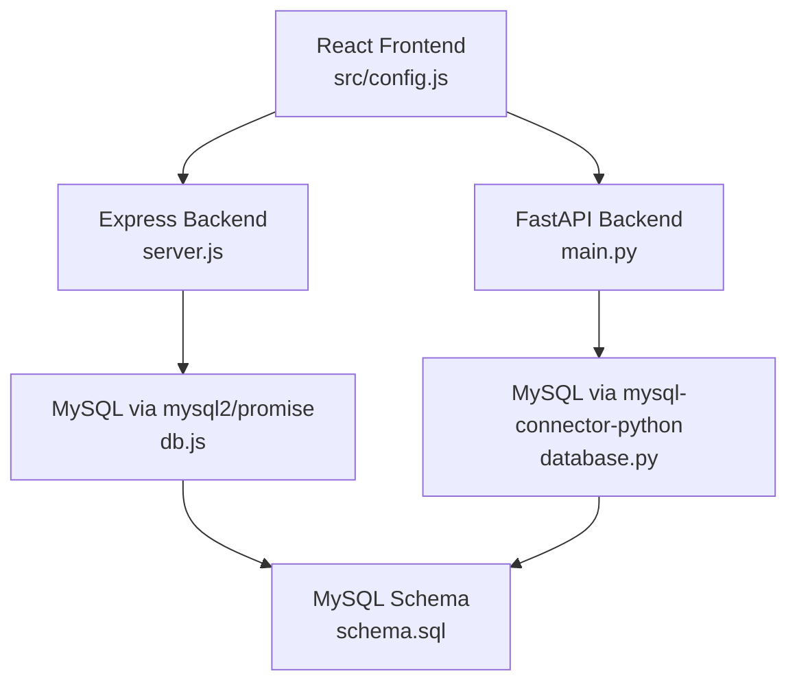

**Diagram sources**
- [server.js:1-42](file://backend/server.js#L1-L42)
- [main.py:1-107](file://server/main.py#L1-L107)
- [db.js:1-26](file://backend/db.js#L1-L26)
- [database.py:1-76](file://server/database.py#L1-L76)
- [schema.sql:1-200](file://db/schema.sql#L1-L200)

**Section sources**
- [server.js:1-42](file://backend/server.js#L1-L42)
- [main.py:1-107](file://server/main.py#L1-L107)
- [db.js:1-26](file://backend/db.js#L1-L26)
- [database.py:1-76](file://server/database.py#L1-L76)
- [schema.sql:1-200](file://db/schema.sql#L1-L200)

## Core Components
- Express server for citizens’ endpoints (authentication, reports, challans)
- FastAPI server for police and administrative endpoints (authentication, reports, challans, analytics)
- Shared database with normalized tables and foreign keys
- Frontend configuration for API base URLs and endpoint mapping

Key integration points:
- Unified API base URL for frontend to route requests to either backend
- Role-based authentication tokens exchanged via Authorization headers
- Evidence uploads handled by FastAPI with static file serving
- CORS enabled for development across both backends

**Section sources**
- [config.js:1-34](file://frontend/src/config.js#L1-L34)
- [server.js:1-42](file://backend/server.js#L1-L42)
- [main.py:57-103](file://server/main.py#L57-L103)
- [auth.js:1-37](file://backend/middleware/auth.js#L1-L37)
- [auth.py:1-182](file://server/middleware/auth.py#L1-L182)

## Architecture Overview
The system integrates three layers:
- Presentation: React SPA
- Services: Express.js (Citizens) and FastAPI (Police/Admin)
- Persistence: MySQL with normalized schema and triggers

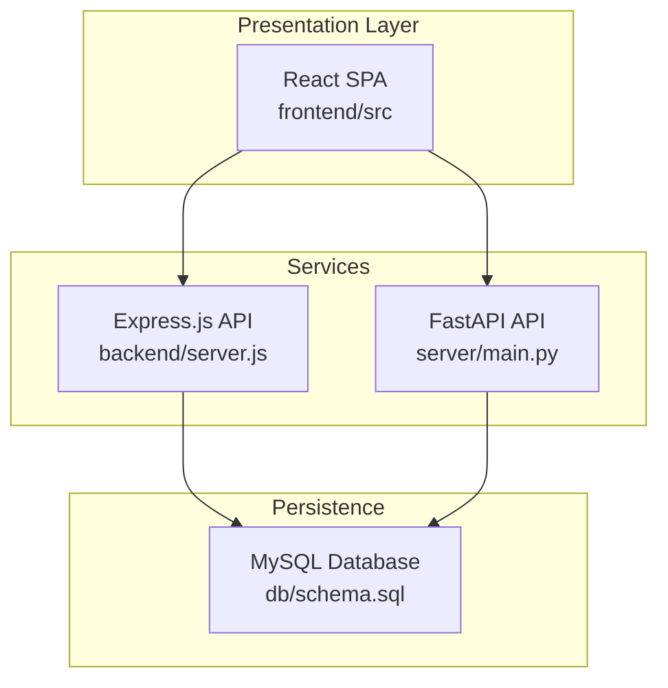

**Diagram sources**
- [server.js:1-42](file://backend/server.js#L1-L42)
- [main.py:1-107](file://server/main.py#L1-L107)
- [schema.sql:1-200](file://db/schema.sql#L1-L200)

## Detailed Component Analysis

### Authentication Integration
Two authentication flows coexist:
- Express middleware validates JWT for citizens
- FastAPI routes handle citizen and police registration/login with JWT issuance

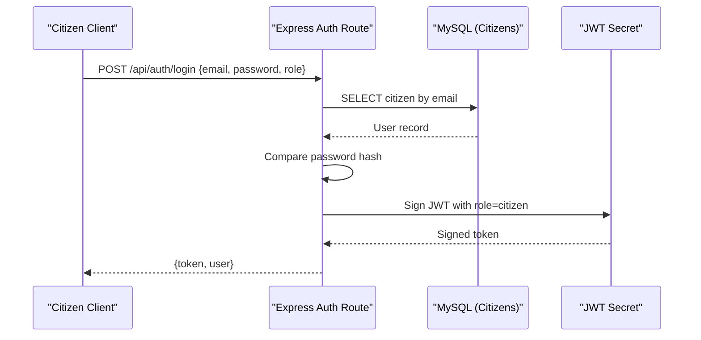

**Diagram sources**
- [auth.js:9-76](file://backend/routes/auth.js#L9-L76)
- [auth.js:1-37](file://backend/middleware/auth.js#L1-L37)
- [schema.sql:26-43](file://db/schema.sql#L26-L43)

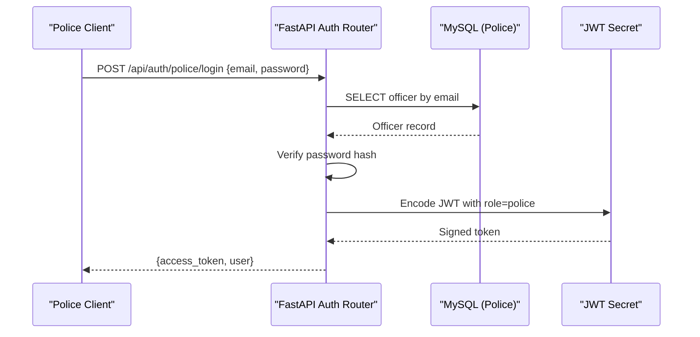

**Diagram sources**
- [auth.py:399-490](file://server/routes/auth.py#L399-L490)
- [auth.py:1-182](file://server/middleware/auth.py#L1-L182)
- [schema.sql:69-82](file://db/schema.sql#L69-L82)

Authentication roles:
- Citizens: authenticated via Express middleware and JWT
- Police: authenticated via FastAPI routes and JWT

Authorization helpers:
- Express middleware enforces role checks for protected endpoints
- FastAPI endpoints validate JWT and enforce role-specific access

**Section sources**
- [auth.js:1-117](file://backend/routes/auth.js#L1-L117)
- [auth.js:1-37](file://backend/middleware/auth.js#L1-L37)
- [auth.py:1-744](file://server/routes/auth.py#L1-L744)
- [auth.py:1-182](file://server/middleware/auth.py#L1-L182)

### API Communication Protocols and Endpoints
Frontend configuration centralizes endpoint URLs:
- Base URL configurable via environment variable
- Endpoint constants for auth, reports, police, challans, trust

Example endpoints:
- Auth: login, profile retrieval
- Reports: create, list citizen reports
- Challans: list citizen challans, pay with row-level locking
- Evidence: upload photos for reports

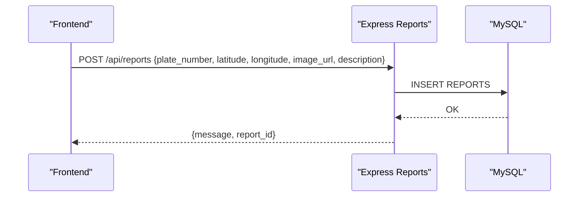

**Diagram sources**
- [config.js:1-34](file://frontend/src/config.js#L1-L34)
- [reports.js:7-31](file://backend/routes/reports.js#L7-L31)
- [schema.sql:114-136](file://db/schema.sql#L114-L136)

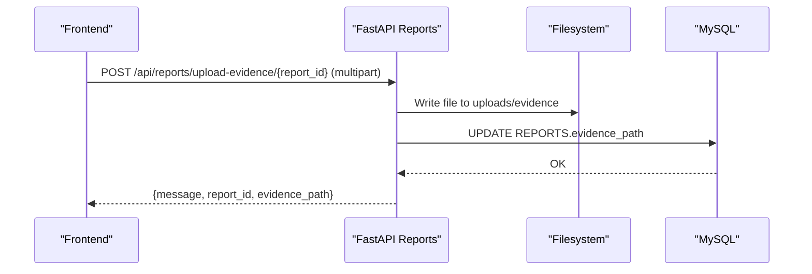

**Diagram sources**
- [reports.py:50-121](file://server/routes/reports.py#L50-L121)
- [main.py:69-72](file://server/main.py#L69-L72)
- [schema.sql:139-149](file://db/schema.sql#L139-L149)

**Section sources**
- [config.js:1-34](file://frontend/src/config.js#L1-L34)
- [reports.js:1-54](file://backend/routes/reports.js#L1-L54)
- [reports.py:1-200](file://server/routes/reports.py#L1-L200)
- [challans.js:1-101](file://backend/routes/challans.js#L1-L101)
- [challans.py:1-200](file://server/routes/challans.py#L1-L200)

### Database Connection Management and Pooling
- Express uses mysql2/promise with a connection pool
- FastAPI uses mysql-connector-python with a connection pool

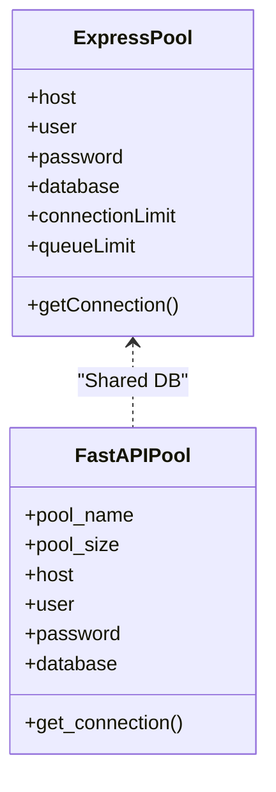

**Diagram sources**
- [db.js:1-26](file://backend/db.js#L1-L26)
- [database.py:14-50](file://server/database.py#L14-L50)

Pooling characteristics:
- Express: configurable limits and keep-alive
- FastAPI: centralized pool initialization and context-managed connections

**Section sources**
- [db.js:1-26](file://backend/db.js#L1-L26)
- [database.py:1-76](file://server/database.py#L1-L76)

### Real-Time Data Synchronization Patterns
- Dashboards and status updates rely on polling endpoints exposed by both backends
- Frontend subscribes to periodic updates for:
  - My Reports (citizen)
  - My Challans (citizen)
  - Pending Reports (police)
  - Trust History (citizen)

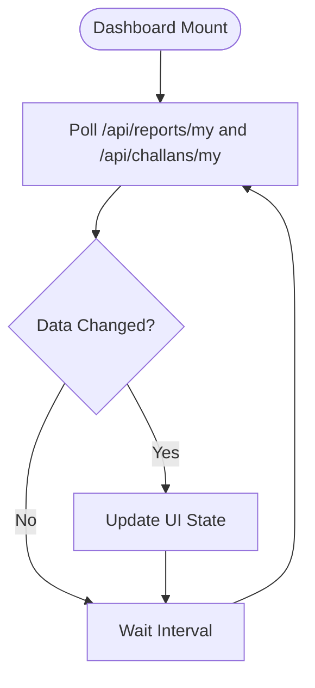

[No sources needed since this diagram shows conceptual workflow, not actual code structure]

### Evidence Upload and File Management
- FastAPI handles multipart uploads for evidence images
- Uploaded files are saved under a dedicated directory
- Static file serving exposes uploads via a mounted route

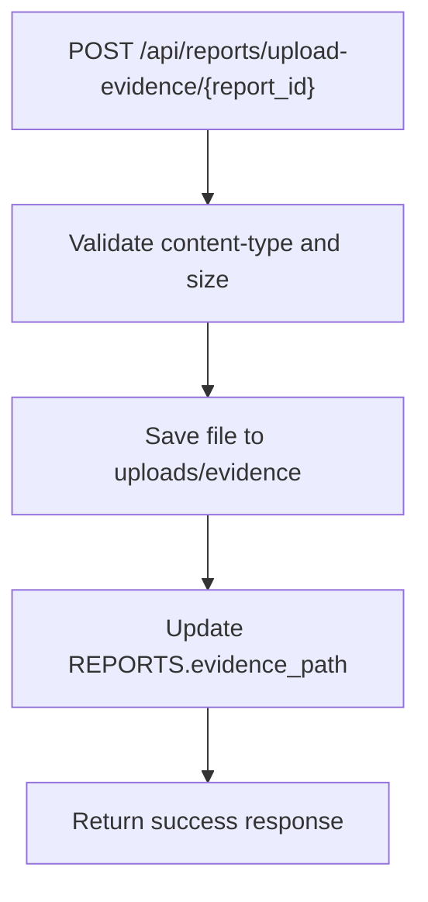

**Diagram sources**
- [reports.py:50-121](file://server/routes/reports.py#L50-L121)
- [main.py:69-72](file://server/main.py#L69-L72)

**Section sources**
- [reports.py:1-200](file://server/routes/reports.py#L1-L200)
- [main.py:69-72](file://server/main.py#L69-L72)

### Cross-Origin Resource Sharing (CORS) and Security
- Express: CORS enabled globally
- FastAPI: CORS configured with permissive settings for development

Security considerations:
- JWT-based authentication with role checks
- Protected routes enforced by middleware
- Input validation and sanitization in route handlers
- File upload validation (content-type and size)

**Section sources**
- [server.js:14-14](file://backend/server.js#L14-L14)
- [main.py:60-66](file://server/main.py#L60-L66)
- [auth.js:1-37](file://backend/middleware/auth.js#L1-L37)
- [auth.py:1-182](file://server/middleware/auth.py#L1-L182)

### Middleware and Request Processing
- Express middleware:
  - JWT verification
  - Role-based authorization (citizen/police)
- FastAPI middleware:
  - Self-contained authentication logic without external dependencies

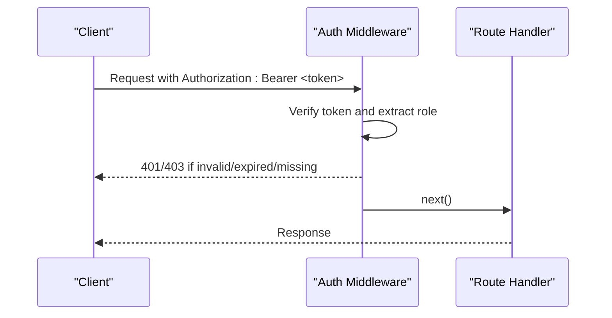

**Diagram sources**
- [auth.js:5-20](file://backend/middleware/auth.js#L5-L20)
- [auth.py:44-61](file://server/middleware/auth.py#L44-L61)

**Section sources**
- [auth.js:1-37](file://backend/middleware/auth.js#L1-L37)
- [auth.py:1-182](file://server/middleware/auth.py#L1-L182)

### Error Handling Strategies
- Centralized 404 and global error handlers in Express
- Route-level try/catch blocks in FastAPI with explicit HTTP exceptions
- Database errors surfaced with appropriate HTTP status codes

**Section sources**
- [server.js:28-37](file://backend/server.js#L28-L37)
- [auth.py:114-216](file://server/routes/auth.py#L114-L216)
- [reports.py:50-121](file://server/routes/reports.py#L50-L121)

## Dependency Analysis
External dependencies:
- Express backend: express, cors, jsonwebtoken, bcryptjs, mysql2
- FastAPI backend: fastapi, uvicorn, mysql-connector-python, python-jose, passlib[bcrypt], pydantic
- Frontend: react, react-router-dom, recharts, leaflet

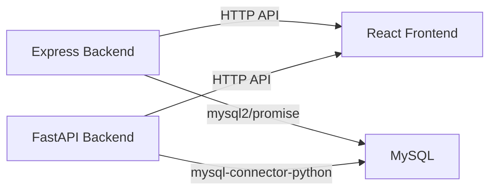

**Diagram sources**
- [package.json:10-20](file://backend/package.json#L10-L20)
- [requirements.txt:1-12](file://server/requirements.txt#L1-L12)
- [package.json:11-28](file://frontend/package.json#L11-L28)

**Section sources**
- [package.json:1-22](file://backend/package.json#L1-L22)
- [requirements.txt:1-13](file://server/requirements.txt#L1-L13)
- [package.json:1-30](file://frontend/package.json#L1-L30)

## Performance Considerations
- Use connection pools to avoid connection overhead
- Prefer batched reads for dashboard endpoints
- Validate file sizes and types early to reduce unnecessary processing
- Use JWT claims minimally and refresh tokens when appropriate
- Index frequently queried columns (e.g., status, dates) in MySQL

[No sources needed since this section provides general guidance]

## Troubleshooting Guide
Common issues and resolutions:
- CORS errors: ensure both backends allow appropriate origins and headers
- Authentication failures: verify JWT secret consistency and token expiration
- Database connectivity: check pool configuration and credentials
- File upload failures: confirm upload directory permissions and size/type constraints

**Section sources**
- [server.js:14-14](file://backend/server.js#L14-L14)
- [main.py:60-66](file://server/main.py#L60-L66)
- [db.js:15-23](file://backend/db.js#L15-L23)
- [database.py:20-43](file://server/database.py#L20-L43)
- [reports.py:57-70](file://server/routes/reports.py#L57-L70)

## Conclusion
The system integrates a React frontend with dual backend services using standardized HTTP APIs, JWT-based authentication, shared MySQL persistence, and permissive CORS for development. Evidence uploads are handled securely with validation and static file serving. Both Express and FastAPI implement robust error handling and middleware to protect endpoints. For production, tighten CORS, rotate secrets, and add rate limiting and input sanitization.

[No sources needed since this section summarizes without analyzing specific files]

## Appendices

### API Endpoint Reference (Selected)
- Auth
  - POST /api/auth/login (Express)
  - POST /api/auth/police/login (FastAPI)
  - GET /api/auth/profile (FastAPI)
- Reports
  - POST /api/reports/create (FastAPI)
  - POST /api/reports/upload-evidence/{report_id} (FastAPI)
  - GET /api/reports/my (Express)
- Challans
  - GET /api/challans/my (Express)
  - POST /api/challans/pay (Express)
  - GET /api/challans/citizen/{citizen_id} (FastAPI)

**Section sources**
- [auth.js:9-114](file://backend/routes/auth.js#L9-L114)
- [auth.py:399-490](file://server/routes/auth.py#L399-L490)
- [reports.js:7-51](file://backend/routes/reports.js#L7-L51)
- [reports.py:147-200](file://server/routes/reports.py#L147-L200)
- [challans.js:7-98](file://backend/routes/challans.js#L7-L98)
- [challans.py:141-200](file://server/routes/challans.py#L141-L200)