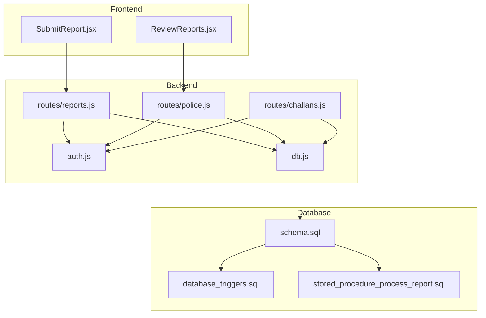
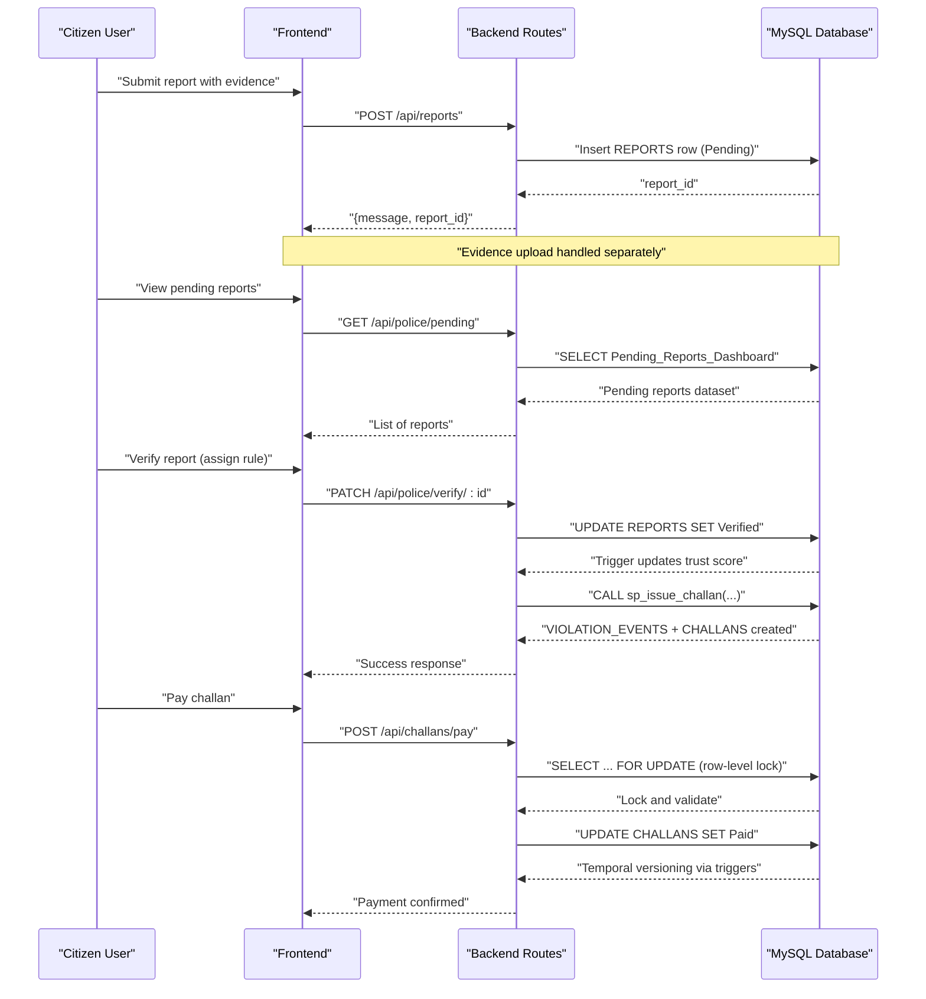
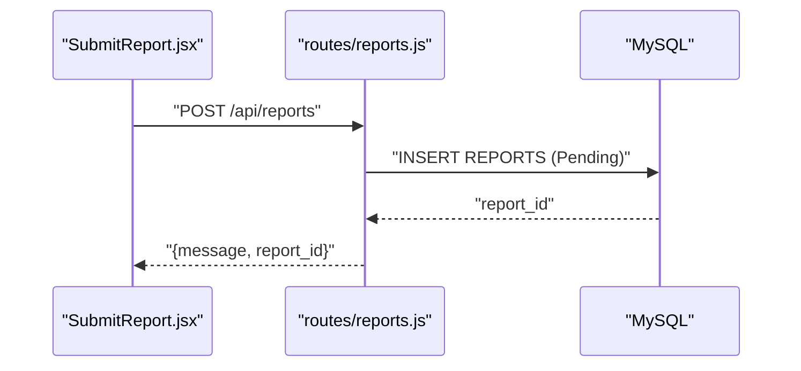
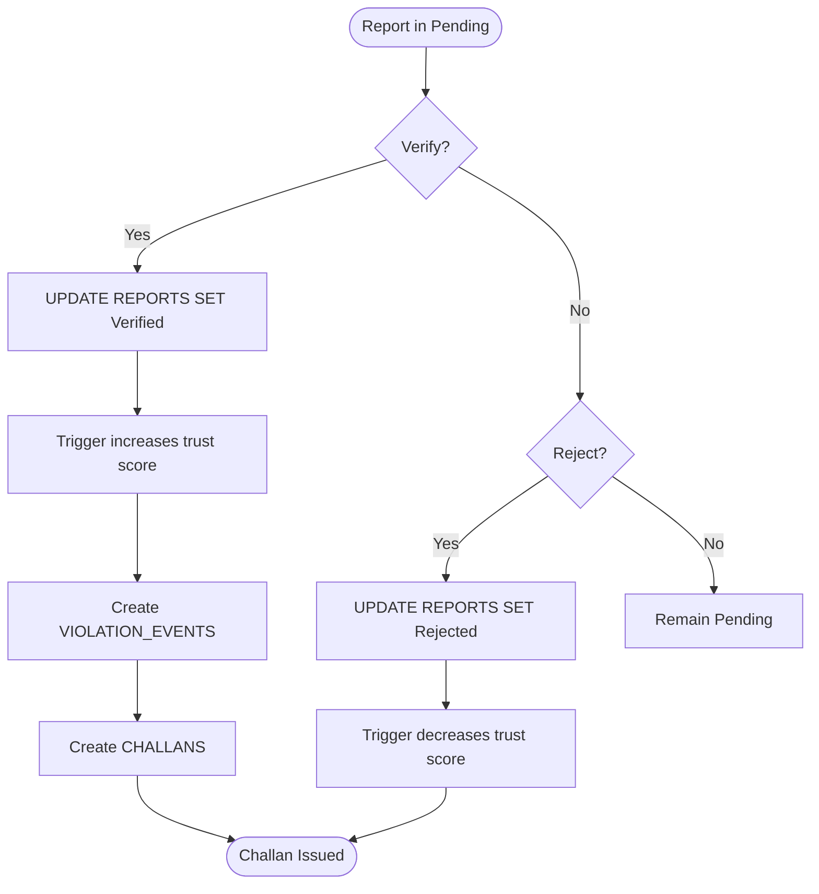
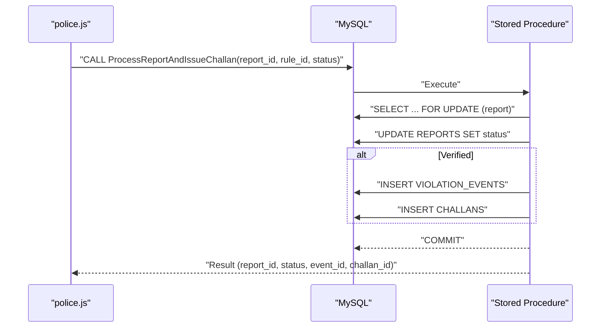
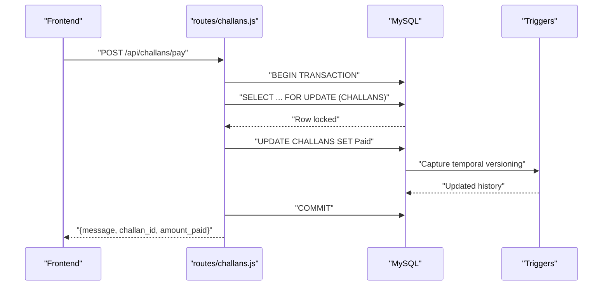
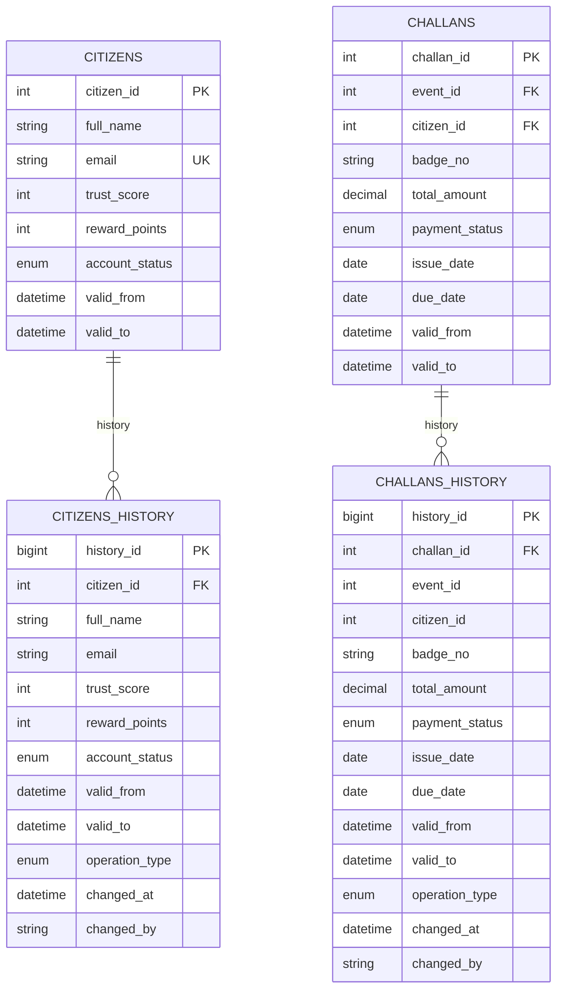
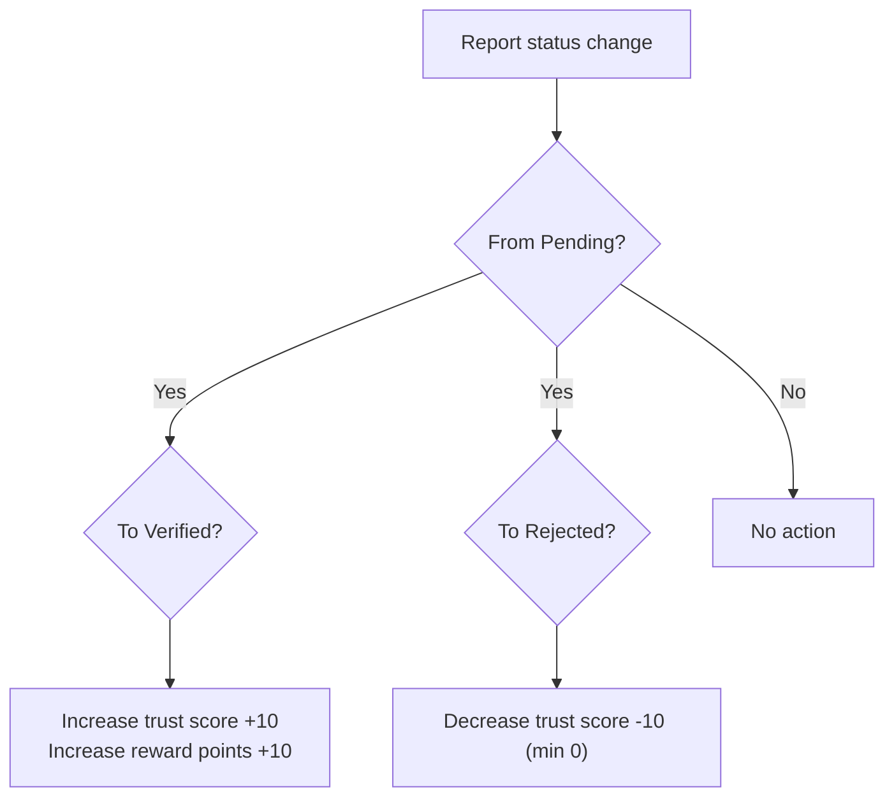
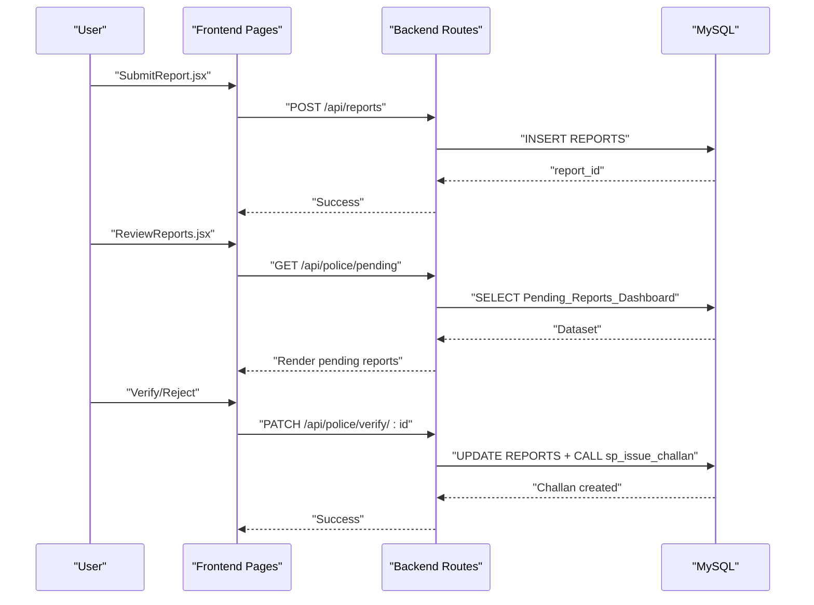
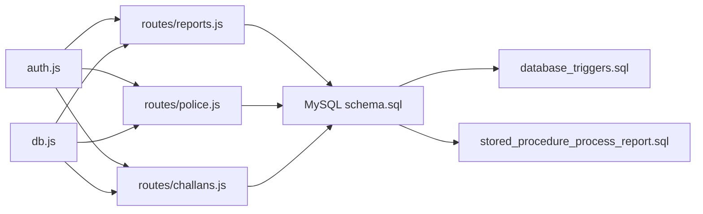

# Transaction Flows

<cite>
**Referenced Files in This Document**
- [schema.sql](file://db/schema.sql)
- [stored_procedure_process_report.sql](file://db/stored_procedure_process_report.sql)
- [database_triggers.sql](file://db/database_triggers.sql)
- [marga_rakshak_triggers.sql](file://db/marga_rakshak_triggers.sql)
- [reports.js](file://backend/routes/reports.js)
- [police.js](file://backend/routes/police.js)
- [challans.js](file://backend/routes/challans.js)
- [db.js](file://backend/db.js)
- [auth.js](file://backend/middleware/auth.js)
- [SubmitReport.jsx](file://frontend/src/pages/SubmitReport.jsx)
- [ReviewReports.jsx](file://frontend/src/pages/ReviewReports.jsx)
- [deploy_stored_procedure.bat](file://scripts/deploy_stored_procedure.bat)
- [install_triggers.bat](file://scripts/install_triggers.bat)
</cite>

## Table of Contents
1. [Introduction](#introduction)
2. [Project Structure](#project-structure)
3. [Core Components](#core-components)
4. [Architecture Overview](#architecture-overview)
5. [Detailed Component Analysis](#detailed-component-analysis)
6. [Dependency Analysis](#dependency-analysis)
7. [Performance Considerations](#performance-considerations)
8. [Troubleshooting Guide](#troubleshooting-guide)
9. [Conclusion](#conclusion)

## Introduction
This document explains the transaction flow patterns across the Traffic Violation Management System. It covers the complete report processing pipeline from citizen submission through police verification to challan generation, the multi-stage approval workflow, trigger-based automation for trust score updates, stored procedure-driven business logic, concurrent payment processing with row-level locking, audit trails via temporal versioning, and the integration between frontend user actions and backend database transactions.

## Project Structure
The system comprises:
- Frontend (React) pages for citizen and police interactions
- Backend (Node.js/Express) routes implementing REST endpoints
- Database (MySQL) with stored procedures, triggers, views, and temporal tables

**Diagram sources**
- [SubmitReport.jsx](file://frontend/src/pages/SubmitReport.jsx)
- [ReviewReports.jsx](file://frontend/src/pages/ReviewReports.jsx)
- [auth.js](file://backend/middleware/auth.js)
- [db.js](file://backend/db.js)
- [reports.js](file://backend/routes/reports.js)
- [police.js](file://backend/routes/police.js)
- [challans.js](file://backend/routes/challans.js)
- [schema.sql](file://db/schema.sql)
- [database_triggers.sql](file://db/database_triggers.sql)
- [stored_procedure_process_report.sql](file://db/stored_procedure_process_report.sql)

**Section sources**
- [schema.sql](file://db/schema.sql)
- [reports.js](file://backend/routes/reports.js)
- [police.js](file://backend/routes/police.js)
- [challans.js](file://backend/routes/challans.js)
- [db.js](file://backend/db.js)
- [auth.js](file://backend/middleware/auth.js)

## Core Components
- Reports lifecycle: Pending → Verified/Rejected → Challan Issued
- Trust score automation via triggers on report status changes
- Stored procedures for ACID-compliant report processing and challan issuance
- Concurrent-safe payment processing with row-level locks
- Audit trails using temporal tables (CITIZENS_HISTORY, CHALLANS_HISTORY)

Key transactional building blocks:
- ACID-compliant stored procedures with explicit rollback on errors
- Row-level locking (SELECT ... FOR UPDATE) to prevent race conditions
- Database triggers to maintain data consistency and automate business rules
- Temporal versioning to preserve historical state

**Section sources**
- [schema.sql](file://db/schema.sql)
- [stored_procedure_process_report.sql](file://db/stored_procedure_process_report.sql)
- [database_triggers.sql](file://db/database_triggers.sql)
- [marga_rakshak_triggers.sql](file://db/marga_rakshak_triggers.sql)

## Architecture Overview
The system enforces strict transaction boundaries at the database level while exposing REST endpoints for frontend interactions. The backend validates roles and delegates complex workflows to stored procedures and triggers.

**Diagram sources**
- [reports.js](file://backend/routes/reports.js)
- [police.js](file://backend/routes/police.js)
- [challans.js](file://backend/routes/challans.js)
- [schema.sql](file://db/schema.sql)
- [database_triggers.sql](file://db/database_triggers.sql)

## Detailed Component Analysis

### Report Submission Pipeline (Citizen → Pending)
- Frontend collects plate number, violation type, location, description, and evidence.
- Backend route validates presence of required fields and inserts a new report with status Pending.
- Evidence upload is handled via a separate endpoint (not shown here) and linked to the report.

**Diagram sources**
- [SubmitReport.jsx](file://frontend/src/pages/SubmitReport.jsx)
- [reports.js](file://backend/routes/reports.js)

**Section sources**
- [reports.js](file://backend/routes/reports.js)
- [SubmitReport.jsx](file://frontend/src/pages/SubmitReport.jsx)

### Multi-Stage Approval Workflow (Pending → Verified/Rejected)
- Police dashboard lists pending reports via a view.
- Verification updates report status to Verified and triggers trust score increase.
- Rejection updates status to Rejected and triggers trust score decrease.

**Diagram sources**
- [police.js](file://backend/routes/police.js)
- [schema.sql](file://db/schema.sql)
- [database_triggers.sql](file://db/database_triggers.sql)
- [marga_rakshak_triggers.sql](file://db/marga_rakshak_triggers.sql)

**Section sources**
- [police.js](file://backend/routes/police.js)
- [schema.sql](file://db/schema.sql)
- [database_triggers.sql](file://db/database_triggers.sql)
- [marga_rakshak_triggers.sql](file://db/marga_rakshak_triggers.sql)

### Stored Procedure: ProcessReportAndIssueChallan
- Validates report existence and Pending status with row-level lock.
- Updates report status and, if Verified, creates violation event and challan.
- Returns structured result with report, event, and challan identifiers.

**Diagram sources**
- [police.js](file://backend/routes/police.js)
- [stored_procedure_process_report.sql](file://db/stored_procedure_process_report.sql)

**Section sources**
- [stored_procedure_process_report.sql](file://db/stored_procedure_process_report.sql)
- [police.js](file://backend/routes/police.js)

### Payment Processing Flow (Concurrent Safety)
- Frontend initiates payment with challan_id.
- Backend starts a transaction, locks the specific challan row, verifies ownership and status, then marks as Paid.
- Triggers capture temporal changes and update reward points.

**Diagram sources**
- [challans.js](file://backend/routes/challans.js)
- [schema.sql](file://db/schema.sql)

**Section sources**
- [challans.js](file://backend/routes/challans.js)
- [schema.sql](file://db/schema.sql)

### Audit Trail and Temporal Data Versioning
- CITIZENS_HISTORY captures trust score and profile changes with valid_from/valid_to windows.
- CHALLANS_HISTORY captures all modifications to challans for auditability.
- Triggers automatically write historical rows on updates and inserts.

**Diagram sources**
- [schema.sql](file://db/schema.sql)

**Section sources**
- [schema.sql](file://db/schema.sql)

### Trust Score Automation via Triggers
- Auto-Reward System: On Verified, adds points to reporter’s trust score and reward points.
- Auto-Penalty System: On Rejected, subtracts points (bounded by zero).
- Additional triggers enforce temporal versioning and auto-suspension thresholds.

**Diagram sources**
- [database_triggers.sql](file://db/database_triggers.sql)
- [marga_rakshak_triggers.sql](file://db/marga_rakshak_triggers.sql)

**Section sources**
- [database_triggers.sql](file://db/database_triggers.sql)
- [marga_rakshak_triggers.sql](file://db/marga_rakshak_triggers.sql)

### Frontend Integration and User Actions
- Citizen submits reports and evidence; backend persists Pending status.
- Police review pending reports, verify with a rule, and trigger challan creation.
- Citizens pay challans; backend ensures concurrency safety with row-level locks.

**Diagram sources**
- [SubmitReport.jsx](file://frontend/src/pages/SubmitReport.jsx)
- [ReviewReports.jsx](file://frontend/src/pages/ReviewReports.jsx)
- [reports.js](file://backend/routes/reports.js)
- [police.js](file://backend/routes/police.js)

**Section sources**
- [SubmitReport.jsx](file://frontend/src/pages/SubmitReport.jsx)
- [ReviewReports.jsx](file://frontend/src/pages/ReviewReports.jsx)
- [reports.js](file://backend/routes/reports.js)
- [police.js](file://backend/routes/police.js)

## Dependency Analysis
- Backend routes depend on database connection pooling and JWT middleware.
- Stored procedures encapsulate complex workflows and enforce referential integrity.
- Triggers maintain consistency across related entities (CITIZENS, REPORTS, CHALLANS).
- Frontend depends on backend endpoints for all state-changing operations.

**Diagram sources**
- [auth.js](file://backend/middleware/auth.js)
- [db.js](file://backend/db.js)
- [reports.js](file://backend/routes/reports.js)
- [police.js](file://backend/routes/police.js)
- [challans.js](file://backend/routes/challans.js)
- [schema.sql](file://db/schema.sql)
- [database_triggers.sql](file://db/database_triggers.sql)
- [stored_procedure_process_report.sql](file://db/stored_procedure_process_report.sql)

**Section sources**
- [auth.js](file://backend/middleware/auth.js)
- [db.js](file://backend/db.js)
- [reports.js](file://backend/routes/reports.js)
- [police.js](file://backend/routes/police.js)
- [challans.js](file://backend/routes/challans.js)
- [schema.sql](file://db/schema.sql)
- [database_triggers.sql](file://db/database_triggers.sql)
- [stored_procedure_process_report.sql](file://db/stored_procedure_process_report.sql)

## Performance Considerations
- Use row-level locks (SELECT ... FOR UPDATE) to avoid contention during concurrent updates.
- Keep stored procedures minimal and focused to reduce transaction durations.
- Indexes on frequently filtered columns (status, dates, foreign keys) improve query performance.
- Connection pooling reduces overhead for high-throughput endpoints.

## Troubleshooting Guide
Common issues and resolutions:
- Report not found or already processed: Ensure report_id exists and status is Pending before verification.
- Duplicate payment attempts: Row-level lock prevents concurrent payments; backend returns conflict if already Paid.
- Trust score not updating: Verify triggers are installed and firing on report status changes.
- Stored procedure deployment failures: Confirm database connectivity and credentials; use deployment scripts to install procedures and triggers.

Operational scripts:
- [deploy_stored_procedure.bat](file://scripts/deploy_stored_procedure.bat)
- [install_triggers.bat](file://scripts/install_triggers.bat)

**Section sources**
- [deploy_stored_procedure.bat](file://scripts/deploy_stored_procedure.bat)
- [install_triggers.bat](file://scripts/install_triggers.bat)

## Conclusion
The Traffic Violation Management System enforces robust transactional integrity through stored procedures, triggers, and row-level locking. The frontend integrates seamlessly with backend endpoints to support end-to-end workflows from citizen submission to challan payment, with comprehensive audit trails and automated trust score management.