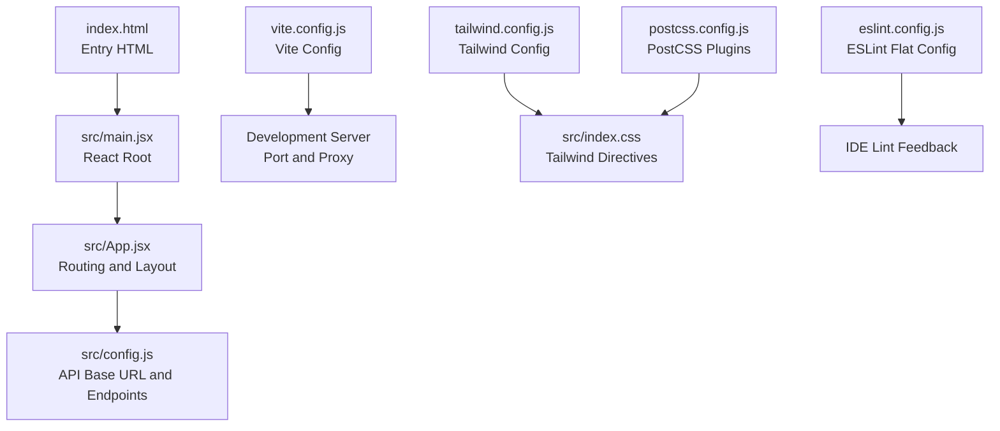
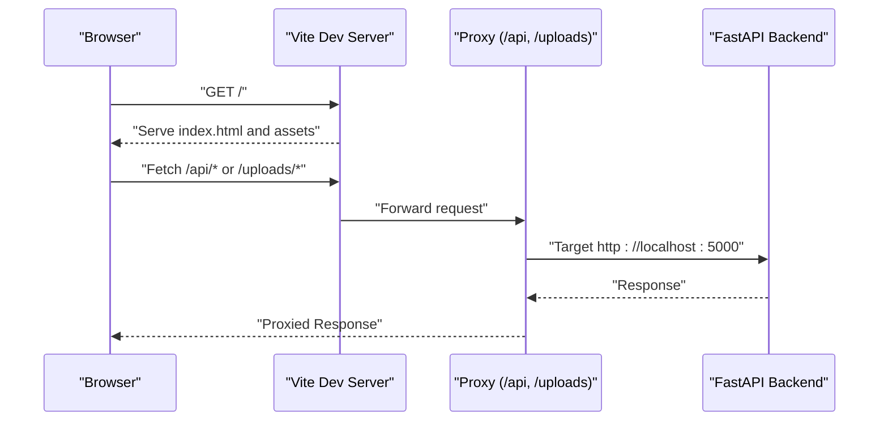
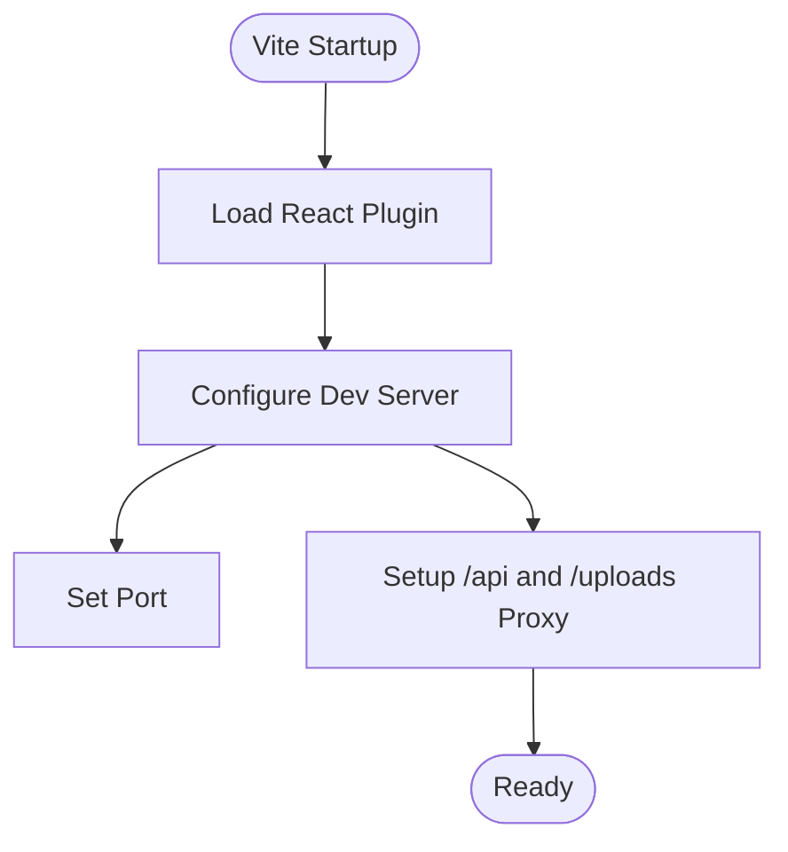
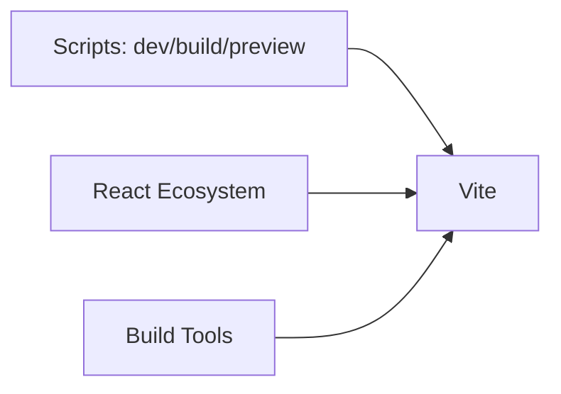
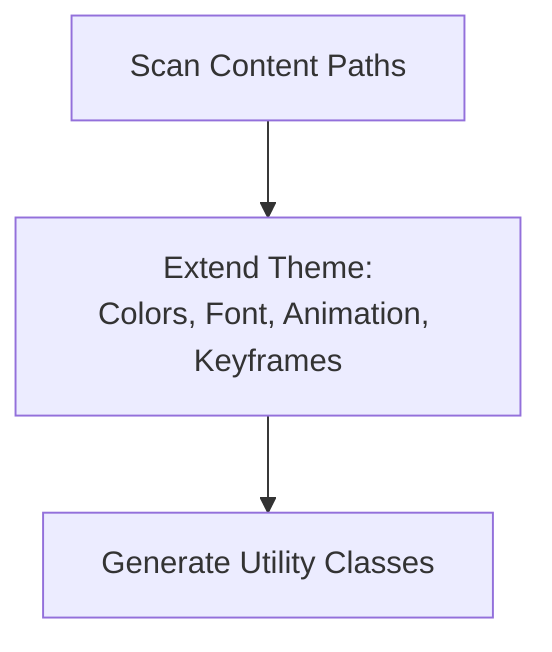
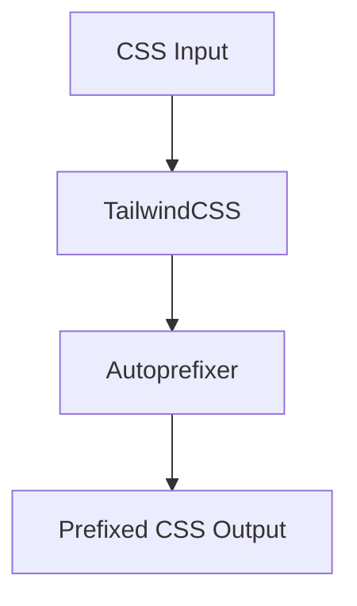
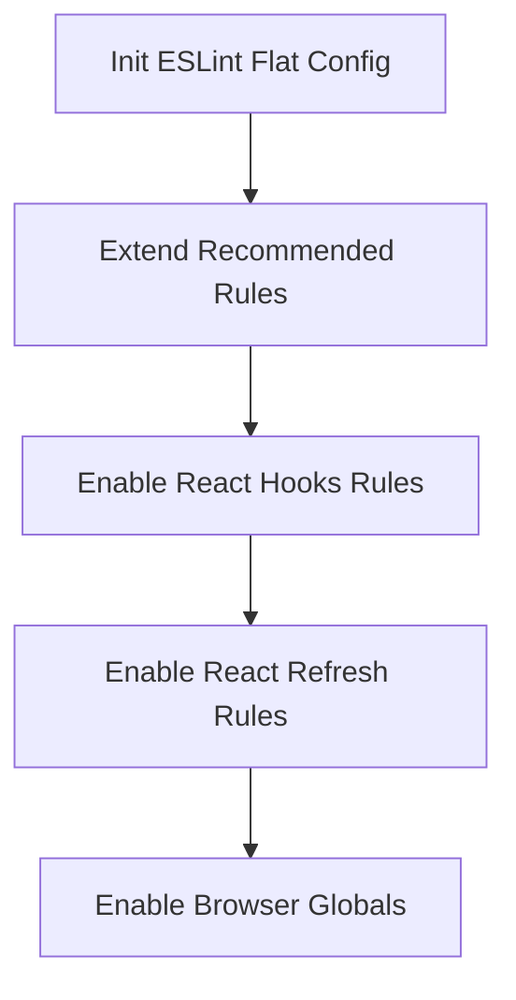
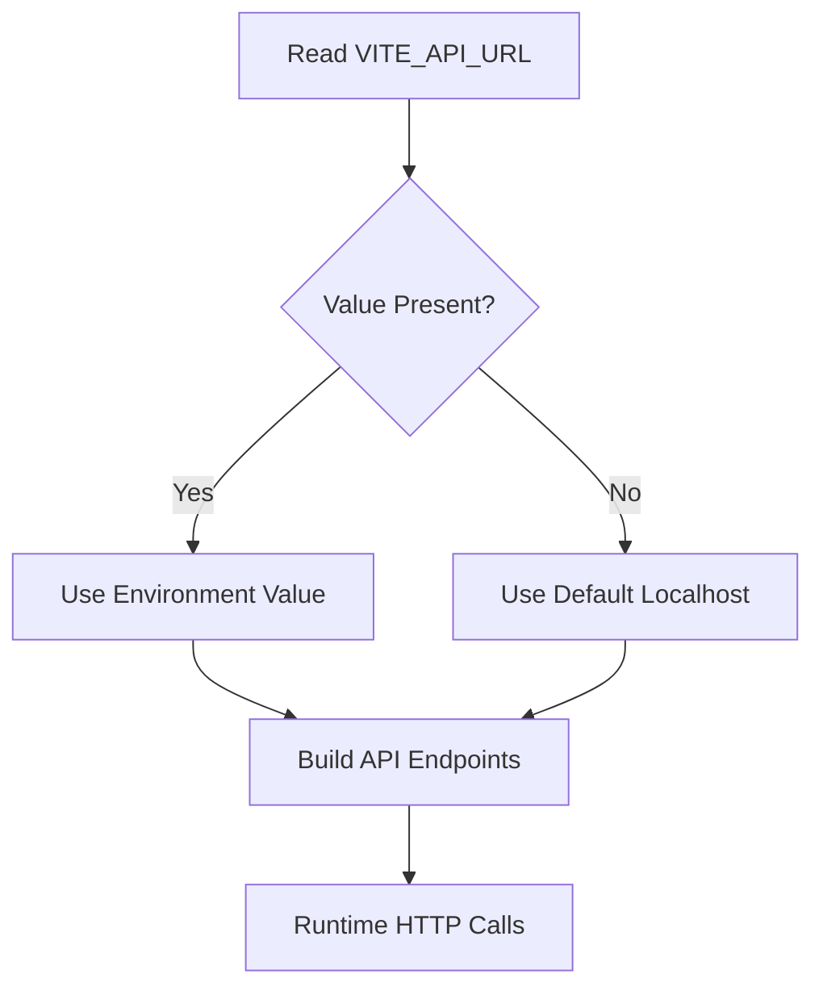
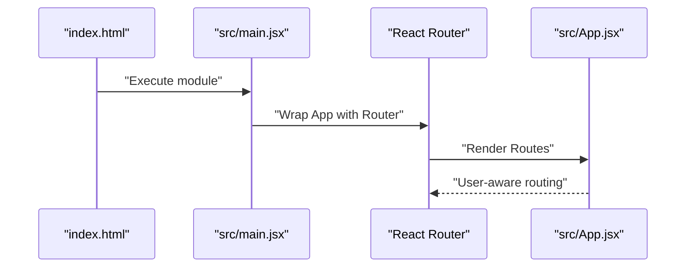
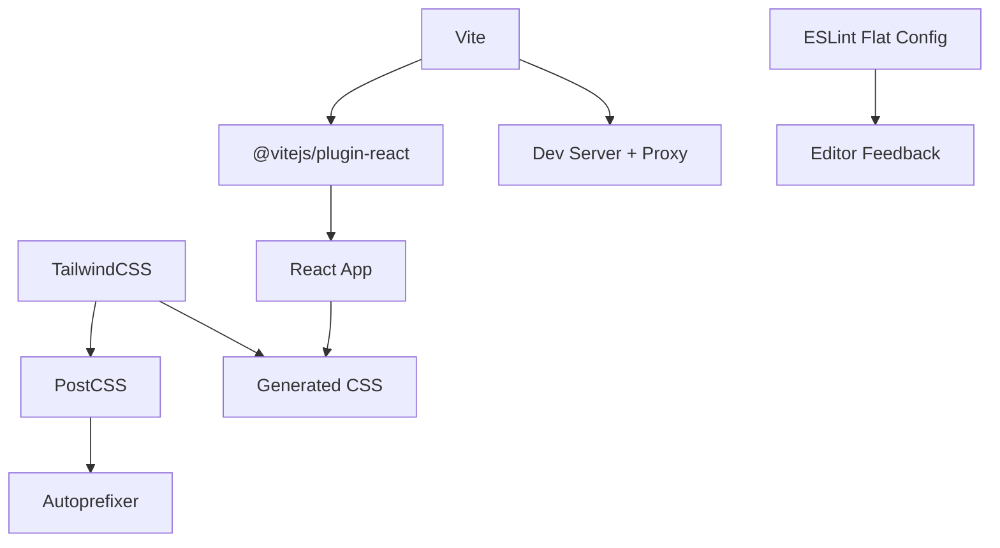

# Build Configuration

<cite>
**Referenced Files in This Document**
- [vite.config.js](file://frontend/vite.config.js)
- [package.json](file://frontend/package.json)
- [tailwind.config.js](file://frontend/tailwind.config.js)
- [postcss.config.js](file://frontend/postcss.config.js)
- [eslint.config.js](file://frontend/eslint.config.js)
- [index.html](file://frontend/index.html)
- [src/main.jsx](file://frontend/src/main.jsx)
- [src/App.jsx](file://frontend/src/App.jsx)
- [src/config.js](file://frontend/src/config.js)
- [.gitignore](file://frontend/.gitignore)
- [src/index.css](file://frontend/src/index.css)
</cite>

## Table of Contents
1. [Introduction](#introduction)
2. [Project Structure](#project-structure)
3. [Core Components](#core-components)
4. [Architecture Overview](#architecture-overview)
5. [Detailed Component Analysis](#detailed-component-analysis)
6. [Dependency Analysis](#dependency-analysis)
7. [Performance Considerations](#performance-considerations)
8. [Troubleshooting Guide](#troubleshooting-guide)
9. [Conclusion](#conclusion)
10. [Appendices](#appendices)

## Introduction
This document explains the Vite build configuration and development environment setup for the traffic violation system frontend. It covers the Vite configuration, plugin integrations, development server proxy, TailwindCSS and PostCSS setup, ESLint configuration, and how environment variables are used to configure API endpoints. It also outlines current build optimization capabilities and recommended strategies for production deployments.

## Project Structure
The frontend build system centers around Vite with React, TailwindCSS, and PostCSS. The configuration files are located under the frontend directory and integrate with the React application entry points and routing.

**Diagram sources**
- [index.html:1-17](file://frontend/index.html#L1-L17)
- [src/main.jsx:1-14](file://frontend/src/main.jsx#L1-L14)
- [src/App.jsx:1-274](file://frontend/src/App.jsx#L1-L274)
- [src/config.js:1-34](file://frontend/src/config.js#L1-L34)
- [vite.config.js:1-23](file://frontend/vite.config.js#L1-L23)
- [tailwind.config.js:1-54](file://frontend/tailwind.config.js#L1-L54)
- [src/index.css:1-189](file://frontend/src/index.css#L1-L189)
- [postcss.config.js:1-7](file://frontend/postcss.config.js#L1-L7)
- [eslint.config.js:1-22](file://frontend/eslint.config.js#L1-L22)

**Section sources**
- [index.html:1-17](file://frontend/index.html#L1-L17)
- [src/main.jsx:1-14](file://frontend/src/main.jsx#L1-L14)
- [src/App.jsx:1-274](file://frontend/src/App.jsx#L1-L274)
- [src/config.js:1-34](file://frontend/src/config.js#L1-L34)
- [vite.config.js:1-23](file://frontend/vite.config.js#L1-L23)
- [tailwind.config.js:1-54](file://frontend/tailwind.config.js#L1-L54)
- [src/index.css:1-189](file://frontend/src/index.css#L1-L189)
- [postcss.config.js:1-7](file://frontend/postcss.config.js#L1-L7)
- [eslint.config.js:1-22](file://frontend/eslint.config.js#L1-L22)

## Core Components
- Vite configuration defines the React plugin, dev server port, and API proxy for local development.
- TailwindCSS provides utility-first styling with custom theme extensions and animations.
- PostCSS applies Tailwind directives and autoprefixing automatically via the PostCSS configuration.
- ESLint flat config enforces React best practices and refresh-friendly linting during development.
- Environment variables drive API endpoint configuration through a dedicated configuration module.

**Section sources**
- [vite.config.js:1-23](file://frontend/vite.config.js#L1-L23)
- [tailwind.config.js:1-54](file://frontend/tailwind.config.js#L1-L54)
- [postcss.config.js:1-7](file://frontend/postcss.config.js#L1-L7)
- [eslint.config.js:1-22](file://frontend/eslint.config.js#L1-L22)
- [src/config.js:1-34](file://frontend/src/config.js#L1-L34)

## Architecture Overview
The development workflow connects the browser to Vite’s dev server, which proxies API requests to the backend. TailwindCSS and PostCSS process styles, while ESLint provides real-time feedback in supported editors.

**Diagram sources**
- [vite.config.js:7-21](file://frontend/vite.config.js#L7-L21)
- [src/config.js:1-34](file://frontend/src/config.js#L1-L34)

## Detailed Component Analysis

### Vite Configuration
- Plugin integration: React plugin is enabled for JSX transformations and fast refresh.
- Development server: Port is set to a common development value, and two API prefixes are proxied to the backend server.
- Purpose: Enables seamless frontend-backend collaboration during development without CORS concerns.

**Diagram sources**
- [vite.config.js:5-22](file://frontend/vite.config.js#L5-L22)

**Section sources**
- [vite.config.js:1-23](file://frontend/vite.config.js#L1-L23)

### Package Dependencies and Scripts
- Scripts: dev, build, and preview commands are provided by Vite.
- Runtime dependencies: React, React DOM, React Router, Recharts, React Leaflet, Lucide React, and Leaflet.
- Dev dependencies: Vite, @vitejs/plugin-react, TailwindCSS, PostCSS, Autoprefixer, and TypeScript types.

**Diagram sources**
- [package.json:6-28](file://frontend/package.json#L6-L28)

**Section sources**
- [package.json:1-30](file://frontend/package.json#L1-L30)

### TailwindCSS Configuration
- Content scanning: Scans index.html and all JS/TS/JSX/TSX files under src.
- Theme extensions: Adds custom named colors, typography, and animation/keyframes.
- Plugins: No additional plugins configured.

**Diagram sources**
- [tailwind.config.js:3-52](file://frontend/tailwind.config.js#L3-L52)

**Section sources**
- [tailwind.config.js:1-54](file://frontend/tailwind.config.js#L1-L54)

### PostCSS Setup
- Plugins: TailwindCSS and Autoprefixer are enabled.
- Effect: Ensures Tailwind directives are processed and vendor prefixes are applied to CSS output.

**Diagram sources**
- [postcss.config.js:1-7](file://frontend/postcss.config.js#L1-L7)
- [src/index.css:1-3](file://frontend/src/index.css#L1-L3)

**Section sources**
- [postcss.config.js:1-7](file://frontend/postcss.config.js#L1-L7)
- [src/index.css:1-189](file://frontend/src/index.css#L1-L189)

### ESLint Configuration
- Flat config: Uses ESLint’s modern flat config with recommended presets.
- Extensions: Recommended rules for JS/JSX, React Hooks, and React Refresh for Vite.
- Globals: Browser globals enabled for DOM APIs.

**Diagram sources**
- [eslint.config.js:7-21](file://frontend/eslint.config.js#L7-L21)

**Section sources**
- [eslint.config.js:1-22](file://frontend/eslint.config.js#L1-L22)

### Environment Variables and API Configuration
- API base URL is resolved from an environment variable with a fallback to a localhost address.
- API endpoints are constructed dynamically using the base URL.
- The environment variable is consumed at runtime via Vite’s import.meta.env mechanism.

**Diagram sources**
- [src/config.js:1-34](file://frontend/src/config.js#L1-L34)

**Section sources**
- [src/config.js:1-34](file://frontend/src/config.js#L1-L34)

### Application Entry and Routing
- The HTML file includes a script tag pointing to the React entry module.
- The React entry mounts the router and renders the main application component.
- The main App component orchestrates route-based rendering and user state persistence.

**Diagram sources**
- [index.html:14-14](file://frontend/index.html#L14-L14)
- [src/main.jsx:1-14](file://frontend/src/main.jsx#L1-L14)
- [src/App.jsx:1-274](file://frontend/src/App.jsx#L1-L274)

**Section sources**
- [index.html:1-17](file://frontend/index.html#L1-L17)
- [src/main.jsx:1-14](file://frontend/src/main.jsx#L1-L14)
- [src/App.jsx:1-274](file://frontend/src/App.jsx#L1-L274)

## Dependency Analysis
The frontend depends on Vite for bundling and dev server, React for UI, TailwindCSS for styling, and PostCSS for processing. ESLint ensures code quality during development.

**Diagram sources**
- [package.json:20-28](file://frontend/package.json#L20-L28)
- [vite.config.js:6-6](file://frontend/vite.config.js#L6-L6)
- [postcss.config.js:1-7](file://frontend/postcss.config.js#L1-L7)
- [eslint.config.js:7-21](file://frontend/eslint.config.js#L7-L21)

**Section sources**
- [package.json:1-30](file://frontend/package.json#L1-L30)
- [vite.config.js:1-23](file://frontend/vite.config.js#L1-L23)
- [postcss.config.js:1-7](file://frontend/postcss.config.js#L1-L7)
- [eslint.config.js:1-22](file://frontend/eslint.config.js#L1-L22)

## Performance Considerations
Current configuration does not enable explicit build-time optimizations such as code splitting, minification, or asset optimization. For production deployments, consider:
- Enabling Vite’s default minifier and compression plugins.
- Using dynamic imports to split bundles by route.
- Pre-rendering static pages where applicable.
- Configuring asset hashing and CDN integration.
- Adding image optimization and CSS extraction for improved load times.

[No sources needed since this section provides general guidance]

## Troubleshooting Guide
- API proxy not working:
  - Verify the backend is running on the proxied target address and port.
  - Confirm the proxy entries match the API prefixes used in the configuration module.
- Environment variable not applied:
  - Ensure the environment variable is prefixed appropriately for Vite and present in the runtime environment.
  - Check that the configuration module reads the variable correctly.
- Styles not applying:
  - Confirm Tailwind directives are present in the entry CSS file.
  - Ensure PostCSS is configured and Tailwind scanning paths include the relevant files.

**Section sources**
- [vite.config.js:9-20](file://frontend/vite.config.js#L9-L20)
- [src/config.js:2-2](file://frontend/src/config.js#L2-L2)
- [src/index.css:1-3](file://frontend/src/index.css#L1-L3)
- [postcss.config.js:1-7](file://frontend/postcss.config.js#L1-L7)

## Conclusion
The frontend build setup integrates Vite, React, TailwindCSS, and PostCSS with a straightforward development server and proxy configuration. The environment-driven API configuration enables flexible deployment targets. While the current setup focuses on developer ergonomics, adopting production-oriented optimizations will improve performance and reliability for live deployments.

[No sources needed since this section summarizes without analyzing specific files]

## Appendices

### Development Workflows
- Start the dev server using the provided script.
- Access the app at the configured port.
- Use the proxy to call backend endpoints under the configured prefixes.
- Edit files to leverage hot module replacement and automatic refresh.

**Section sources**
- [package.json:6-10](file://frontend/package.json#L6-L10)
- [vite.config.js:7-21](file://frontend/vite.config.js#L7-L21)

### Environment Variable Handling
- Define the API base URL via the environment variable consumed by the configuration module.
- Use a fallback for local development when the environment variable is absent.

**Section sources**
- [src/config.js:1-34](file://frontend/src/config.js#L1-L34)

### Ignoring Build Artifacts
- The repository ignores built artifacts and node_modules to keep the repository clean.

**Section sources**
- [.gitignore:10-12](file://frontend/.gitignore#L10-L12)