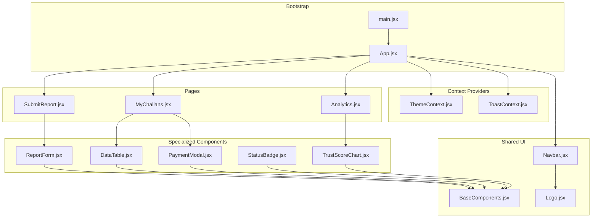
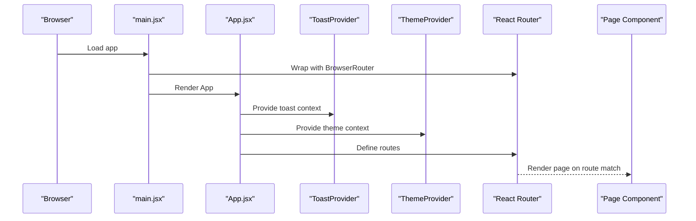
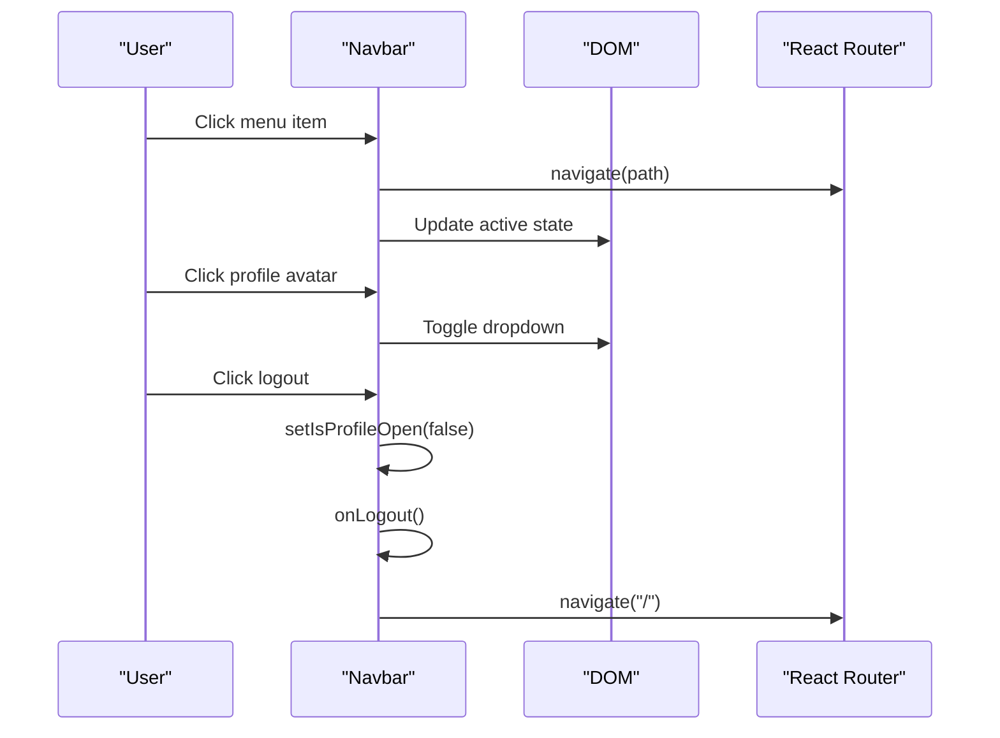
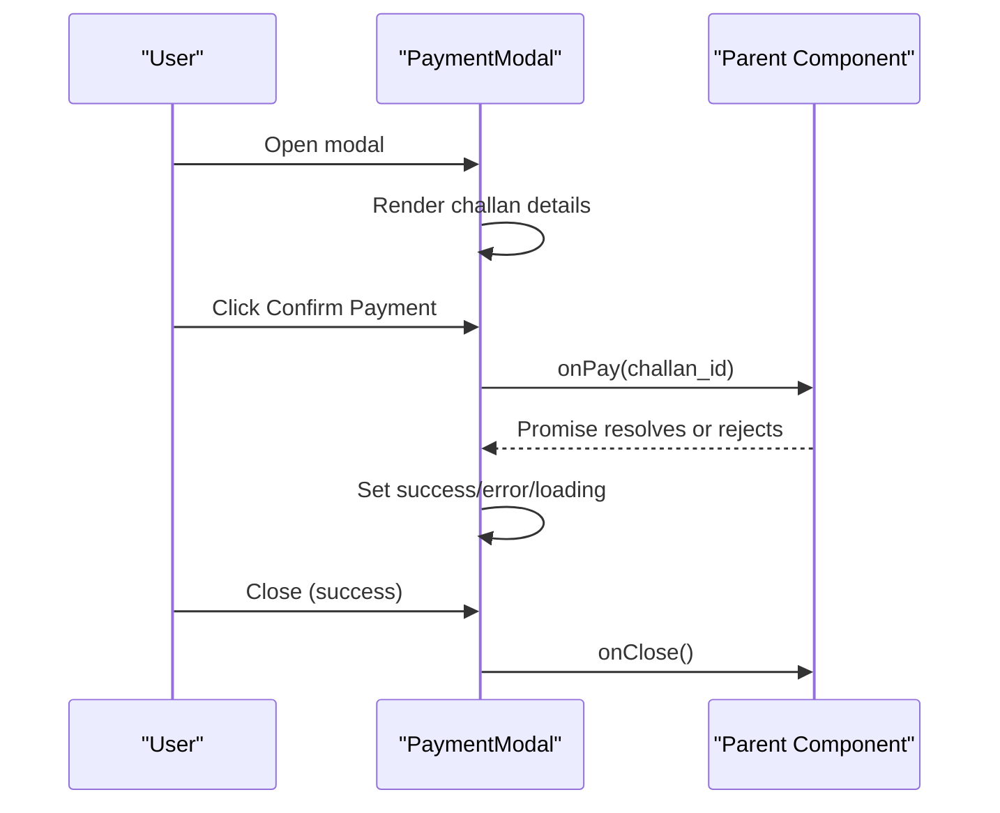
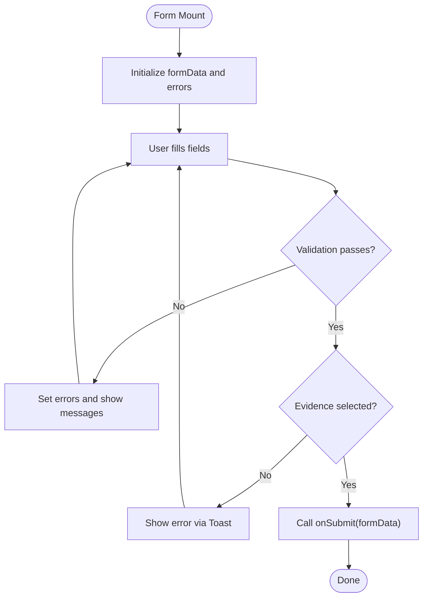
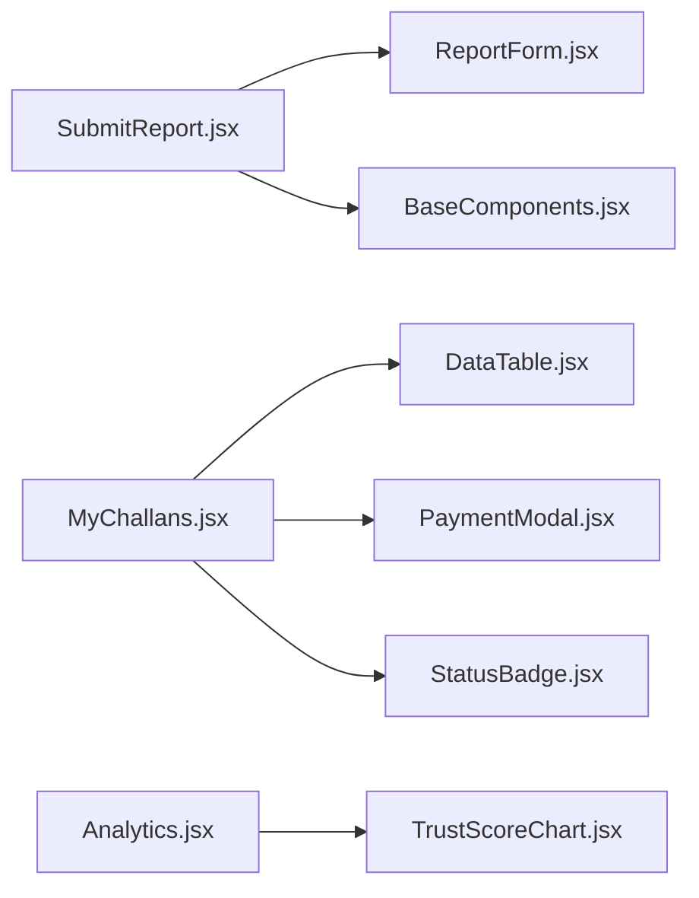
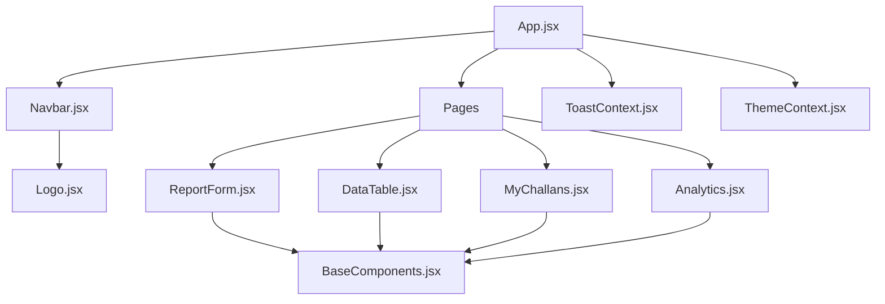

# Component Architecture

<cite>
**Referenced Files in This Document**
- [BaseComponents.jsx](file://frontend/src/components/ui/BaseComponents.jsx)
- [Navbar.jsx](file://frontend/src/components/Navbar.jsx)
- [Logo.jsx](file://frontend/src/components/Logo.jsx)
- [StatusBadge.jsx](file://frontend/src/components/StatusBadge.jsx)
- [DataTable.jsx](file://frontend/src/components/DataTable.jsx)
- [PaymentModal.jsx](file://frontend/src/components/PaymentModal.jsx)
- [ReportForm.jsx](file://frontend/src/components/ReportForm.jsx)
- [TrustScoreChart.jsx](file://frontend/src/components/TrustScoreChart.jsx)
- [ThemeContext.jsx](file://frontend/src/context/ThemeContext.jsx)
- [ToastContext.jsx](file://frontend/src/context/ToastContext.jsx)
- [App.jsx](file://frontend/src/App.jsx)
- [main.jsx](file://frontend/src/main.jsx)
- [SubmitReport.jsx](file://frontend/src/pages/SubmitReport.jsx)
- [Analytics.jsx](file://frontend/src/pages/Analytics.jsx)
- [MyChallans.jsx](file://frontend/src/pages/MyChallans.jsx)
</cite>

## Table of Contents
1. [Introduction](#introduction)
2. [Project Structure](#project-structure)
3. [Core Components](#core-components)
4. [Architecture Overview](#architecture-overview)
5. [Detailed Component Analysis](#detailed-component-analysis)
6. [Dependency Analysis](#dependency-analysis)
7. [Performance Considerations](#performance-considerations)
8. [Troubleshooting Guide](#troubleshooting-guide)
9. [Conclusion](#conclusion)

## Introduction
This document explains the React component architecture for the traffic violation management system. It focuses on the foundational design system in BaseComponents.jsx and demonstrates how shared UI components integrate with page-specific components. It covers role-based navigation via Navbar, branding consistency with Logo, specialized components for status display, data presentation, payments, evidence submission, and analytics visualization. The guide also documents prop interfaces, state management patterns, styling with TailwindCSS, composition patterns, and communication through props and context providers.

## Project Structure
The frontend is organized into:
- Shared UI components under components/ui and standalone components under components
- Context providers under context
- Page components under pages
- Application bootstrap in main.jsx and routing/app shell in App.jsx

**Diagram sources**
- [main.jsx:1-14](file://frontend/src/main.jsx#L1-L14)
- [App.jsx:1-274](file://frontend/src/App.jsx#L1-L274)
- [ThemeContext.jsx:1-39](file://frontend/src/context/ThemeContext.jsx#L1-L39)
- [ToastContext.jsx:1-113](file://frontend/src/context/ToastContext.jsx#L1-L113)
- [Navbar.jsx:1-252](file://frontend/src/components/Navbar.jsx#L1-L252)
- [Logo.jsx:1-34](file://frontend/src/components/Logo.jsx#L1-L34)
- [BaseComponents.jsx:1-178](file://frontend/src/components/ui/BaseComponents.jsx#L1-L178)
- [StatusBadge.jsx:1-39](file://frontend/src/components/StatusBadge.jsx#L1-L39)
- [DataTable.jsx:1-37](file://frontend/src/components/DataTable.jsx#L1-L37)
- [PaymentModal.jsx:1-99](file://frontend/src/components/PaymentModal.jsx#L1-L99)
- [ReportForm.jsx:1-270](file://frontend/src/components/ReportForm.jsx#L1-L270)
- [TrustScoreChart.jsx:1-126](file://frontend/src/components/TrustScoreChart.jsx#L1-L126)
- [SubmitReport.jsx:1-344](file://frontend/src/pages/SubmitReport.jsx#L1-L344)
- [Analytics.jsx:1-271](file://frontend/src/pages/Analytics.jsx#L1-L271)
- [MyChallans.jsx:1-207](file://frontend/src/pages/MyChallans.jsx#L1-L207)

**Section sources**
- [main.jsx:1-14](file://frontend/src/main.jsx#L1-L14)
- [App.jsx:1-274](file://frontend/src/App.jsx#L1-L274)

## Core Components
This section documents the foundational design system and reusable building blocks.

- Button
  - Purpose: Unified button with variants, sizes, icons, and full-width support
  - Props: children, variant, size, onClick, type, disabled, fullWidth, icon, className
  - Styling: Tailwind-based variant and size classes; focus ring and transitions
  - Usage pattern: Compose with icons and full-width for CTAs

- Input
  - Purpose: Labeled input with optional icon, error messaging, and accessibility props
  - Props: label, name, type, value, onChange, placeholder, icon, error, required, disabled, className, and spread props
  - Styling: Conditional error borders and focus rings; left icon placement
  - Usage pattern: Pass controlled props and error state from parent forms

- Card
  - Purpose: Consistent card container with optional hover effect
  - Props: children, className, hover
  - Styling: Rounded borders, subtle shadows, hover enhancements
  - Usage pattern: Wrap forms, tables, and content sections

- Badge
  - Purpose: Lightweight status indicators
  - Props: children, variant
  - Variants: default, success, warning, danger, info, primary
  - Styling: Rounded pill labels with semantic colors

- Skeleton
  - Purpose: Loading placeholders
  - Props: className
  - Styling: Animated pulse with neutral background

- Spinner
  - Purpose: Inline loading indicator
  - Props: size
  - Variants: sm, md, lg
  - Styling: SVG with animation

**Section sources**
- [BaseComponents.jsx:1-178](file://frontend/src/components/ui/BaseComponents.jsx#L1-L178)

## Architecture Overview
The app initializes with BrowserRouter and mounts App. App sets up context providers and renders routes. Navbar is conditionally rendered for authenticated users and handles role-based navigation. Specialized components are composed within page components to deliver cohesive experiences.

**Diagram sources**
- [main.jsx:1-14](file://frontend/src/main.jsx#L1-L14)
- [App.jsx:1-274](file://frontend/src/App.jsx#L1-L274)
- [ToastContext.jsx:1-113](file://frontend/src/context/ToastContext.jsx#L1-L113)
- [ThemeContext.jsx:1-39](file://frontend/src/context/ThemeContext.jsx#L1-L39)

## Detailed Component Analysis

### Navbar Component
Role-based navigation and profile management:
- Props: user (object with role), onLogout (callback)
- Behavior:
  - Dynamic home path based on role
  - Role-aware menu items
  - Profile dropdown with user info and actions
  - Mobile menu with responsive behavior
  - Click-outside handlers to close menus
  - Logout handler triggers onLogout and navigates to home
- Styling: Fixed positioning, rounded containers, subtle shadows, and Tailwind utilities
- Composition: Uses Logo and links to page routes

**Diagram sources**
- [Navbar.jsx:1-252](file://frontend/src/components/Navbar.jsx#L1-L252)

**Section sources**
- [Navbar.jsx:1-252](file://frontend/src/components/Navbar.jsx#L1-L252)

### Logo Component
- Purpose: Branding element with traffic light and camera visuals
- Props: className (Tailwind sizing classes)
- Usage: Integrated into Navbar header for consistent branding

**Section sources**
- [Logo.jsx:1-34](file://frontend/src/components/Logo.jsx#L1-L34)

### StatusBadge Component
- Purpose: Visual status labels with semantic colors
- Props: status (string)
- Behavior: Maps status strings to Tailwind color classes
- Usage: Display report or challan statuses consistently

**Section sources**
- [StatusBadge.jsx:1-39](file://frontend/src/components/StatusBadge.jsx#L1-L39)

### DataTable Component
- Purpose: Tabular data rendering with column configuration
- Props: columns (array of objects with header and render), data (array), emptyMessage (string)
- Behavior: Renders a responsive table; falls back to empty message when data is missing
- Usage: Display lists of reports, challans, or analytics summaries

**Section sources**
- [DataTable.jsx:1-37](file://frontend/src/components/DataTable.jsx#L1-L37)

### PaymentModal Component
- Purpose: Secure payment confirmation modal for challans
- Props: challan (object), onClose (callback), onPay (async callback)
- State: loading, error, success
- Flow:
  - Displays challan details
  - Confirms payment via onPay(challan_id)
  - Shows success state with close action
  - Handles errors and disables controls during processing
- Styling: Modal overlay, bordered card, success tick icon

**Diagram sources**
- [PaymentModal.jsx:1-99](file://frontend/src/components/PaymentModal.jsx#L1-L99)

**Section sources**
- [PaymentModal.jsx:1-99](file://frontend/src/components/PaymentModal.jsx#L1-L99)

### ReportForm Component
- Purpose: Evidence-based violation reporting for citizens
- Props: onSubmit (callback), loading (boolean)
- State: formData, errors
- Features:
  - Validation for vehicle number, rule selection, location description
  - Evidence image upload with size/type checks
  - Optional geolocation retrieval
  - Controlled form inputs using BaseComponents.Input
- Context: Uses ToastContext for user feedback
- Composition: Uses BaseComponents.Card, BaseComponents.Button, BaseComponents.Input

**Diagram sources**
- [ReportForm.jsx:1-270](file://frontend/src/components/ReportForm.jsx#L1-L270)

**Section sources**
- [ReportForm.jsx:1-270](file://frontend/src/components/ReportForm.jsx#L1-L270)

### TrustScoreChart Component
- Purpose: Visualize trust score history and related metrics
- Props: history (array of records)
- Behavior:
  - Scales bars based on min/max trust scores
  - Renders vertical bars with color-coded thresholds
  - Displays a tabular history with dates, scores, reward points, account status, and operation type
- Fallback: Empty state when no history is present

**Section sources**
- [TrustScoreChart.jsx:1-126](file://frontend/src/components/TrustScoreChart.jsx#L1-L126)

### Page Integration Examples
- SubmitReport page composes ReportForm and manages local state, validation, and API submission. It integrates with ToastContext for feedback and uses BaseComponents for consistent UI.
- MyChallans page fetches citizen challans, displays summaries, and integrates PaymentModal for unpaid items. It uses DataTable for tabular display and StatusBadge for status labels.
- Analytics page fetches role-specific analytics and renders charts and summary cards. It demonstrates data-driven composition with reusable components.

**Diagram sources**
- [SubmitReport.jsx:1-344](file://frontend/src/pages/SubmitReport.jsx#L1-L344)
- [ReportForm.jsx:1-270](file://frontend/src/components/ReportForm.jsx#L1-L270)
- [MyChallans.jsx:1-207](file://frontend/src/pages/MyChallans.jsx#L1-L207)
- [DataTable.jsx:1-37](file://frontend/src/components/DataTable.jsx#L1-L37)
- [PaymentModal.jsx:1-99](file://frontend/src/components/PaymentModal.jsx#L1-L99)
- [StatusBadge.jsx:1-39](file://frontend/src/components/StatusBadge.jsx#L1-L39)
- [Analytics.jsx:1-271](file://frontend/src/pages/Analytics.jsx#L1-L271)
- [TrustScoreChart.jsx:1-126](file://frontend/src/components/TrustScoreChart.jsx#L1-L126)

**Section sources**
- [SubmitReport.jsx:1-344](file://frontend/src/pages/SubmitReport.jsx#L1-L344)
- [MyChallans.jsx:1-207](file://frontend/src/pages/MyChallans.jsx#L1-L207)
- [Analytics.jsx:1-271](file://frontend/src/pages/Analytics.jsx#L1-L271)

## Dependency Analysis
- App.jsx orchestrates routing and authentication state, conditionally rendering Navbar and pages.
- Context providers (ThemeContext, ToastContext) are established at the root level and consumed by components.
- Shared UI components (BaseComponents) are reused across pages and specialized components.
- Specialized components depend on shared UI and context for consistent UX and stateless behavior.

**Diagram sources**
- [App.jsx:1-274](file://frontend/src/App.jsx#L1-L274)
- [Navbar.jsx:1-252](file://frontend/src/components/Navbar.jsx#L1-L252)
- [Logo.jsx:1-34](file://frontend/src/components/Logo.jsx#L1-L34)
- [ReportForm.jsx:1-270](file://frontend/src/components/ReportForm.jsx#L1-L270)
- [DataTable.jsx:1-37](file://frontend/src/components/DataTable.jsx#L1-L37)
- [MyChallans.jsx:1-207](file://frontend/src/pages/MyChallans.jsx#L1-L207)
- [Analytics.jsx:1-271](file://frontend/src/pages/Analytics.jsx#L1-L271)
- [BaseComponents.jsx:1-178](file://frontend/src/components/ui/BaseComponents.jsx#L1-L178)
- [ToastContext.jsx:1-113](file://frontend/src/context/ToastContext.jsx#L1-L113)
- [ThemeContext.jsx:1-39](file://frontend/src/context/ThemeContext.jsx#L1-L39)

**Section sources**
- [App.jsx:1-274](file://frontend/src/App.jsx#L1-L274)

## Performance Considerations
- Prefer controlled components with minimal re-renders; pass derived data and callbacks from parent components.
- Lazy-load heavy pages or charts to reduce initial bundle size.
- Use memoization for expensive computations in charts and tables.
- Debounce or throttle real-time sync intervals (as seen in MyChallans) to balance freshness and performance.
- Keep shared UI components pure and stateless where possible to maximize reuse.

## Troubleshooting Guide
- Toast notifications not appearing:
  - Ensure ToastProvider wraps the application root.
  - Verify useToast is called within provider scope.
- Theme not toggling:
  - Confirm ThemeProvider is mounted at the root.
  - Check localStorage persistence and class application on html element.
- Navbar menu not closing:
  - Ensure click-outside handlers are attached and cleaned up on unmount.
- Payment modal not responding:
  - Validate onPay promise resolution and error handling.
  - Confirm challan prop is provided and modal renders only when present.
- ReportForm validation errors:
  - Check error propagation and clearing on input change.
  - Ensure image constraints and geolocation permissions are handled gracefully.

**Section sources**
- [ToastContext.jsx:1-113](file://frontend/src/context/ToastContext.jsx#L1-L113)
- [ThemeContext.jsx:1-39](file://frontend/src/context/ThemeContext.jsx#L1-L39)
- [Navbar.jsx:1-252](file://frontend/src/components/Navbar.jsx#L1-L252)
- [PaymentModal.jsx:1-99](file://frontend/src/components/PaymentModal.jsx#L1-L99)
- [ReportForm.jsx:1-270](file://frontend/src/components/ReportForm.jsx#L1-L270)

## Conclusion
The component architecture centers on a robust design system (BaseComponents) and shared UI primitives, enabling consistent styling and behavior across the application. Role-based navigation, branding, specialized status and data components, and payment flows are integrated cleanly through props and context providers. Pages compose these components to deliver focused experiences while maintaining a cohesive design language and predictable state management patterns.