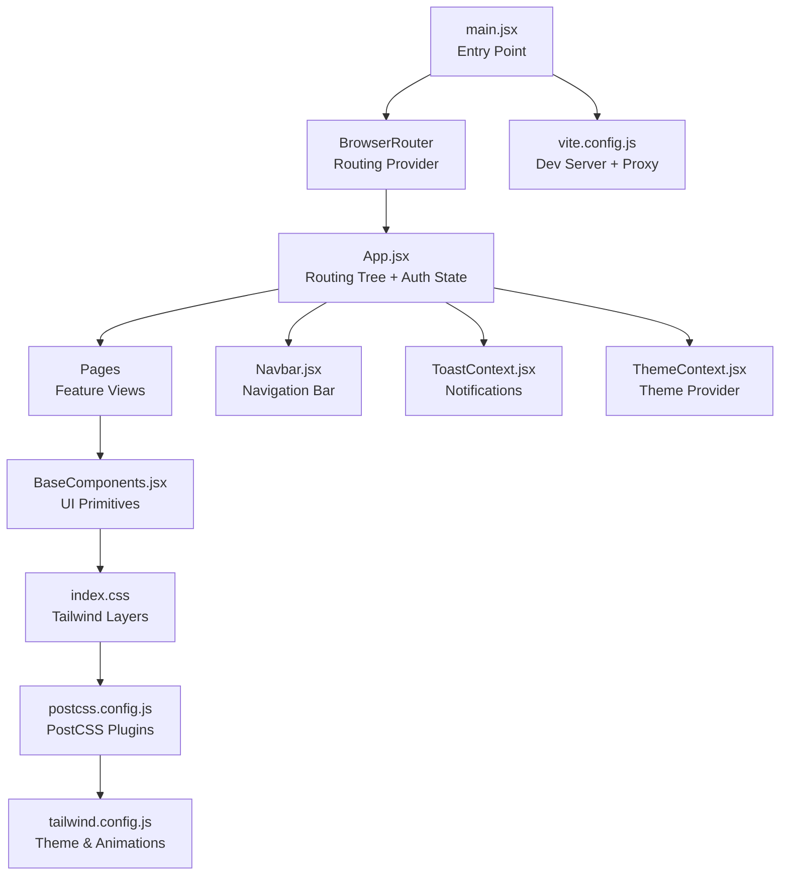
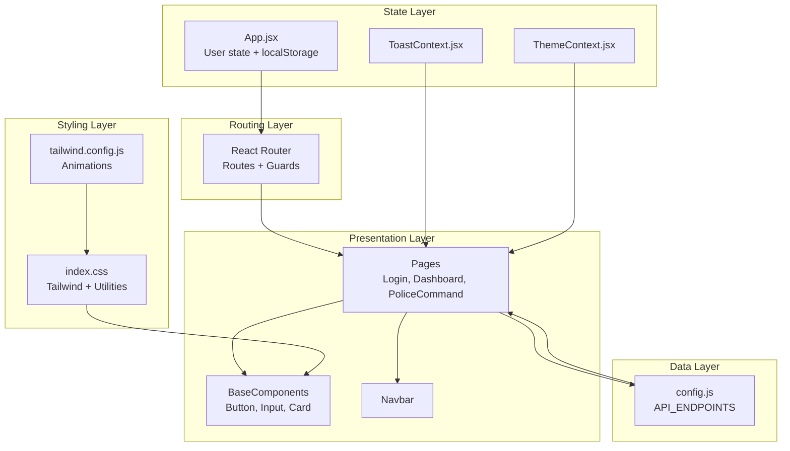
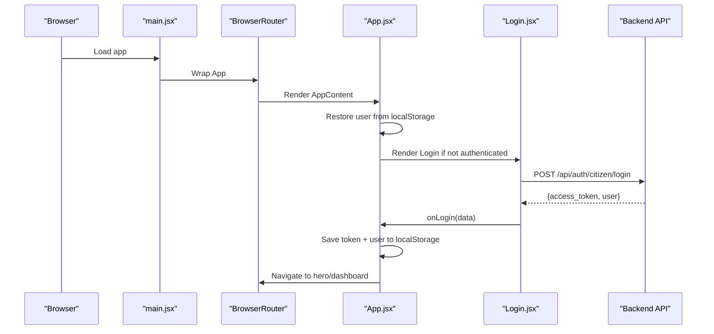
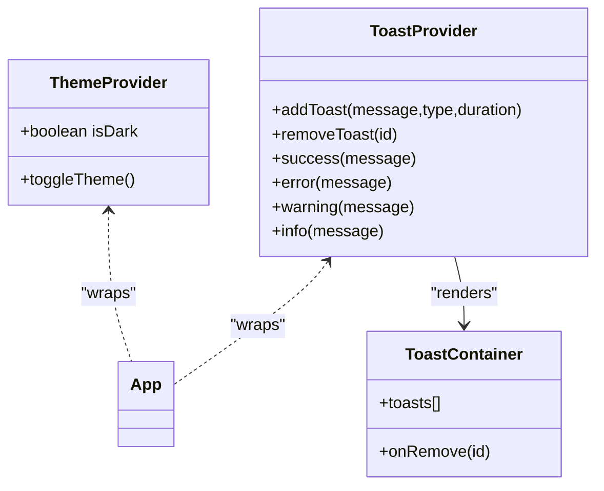
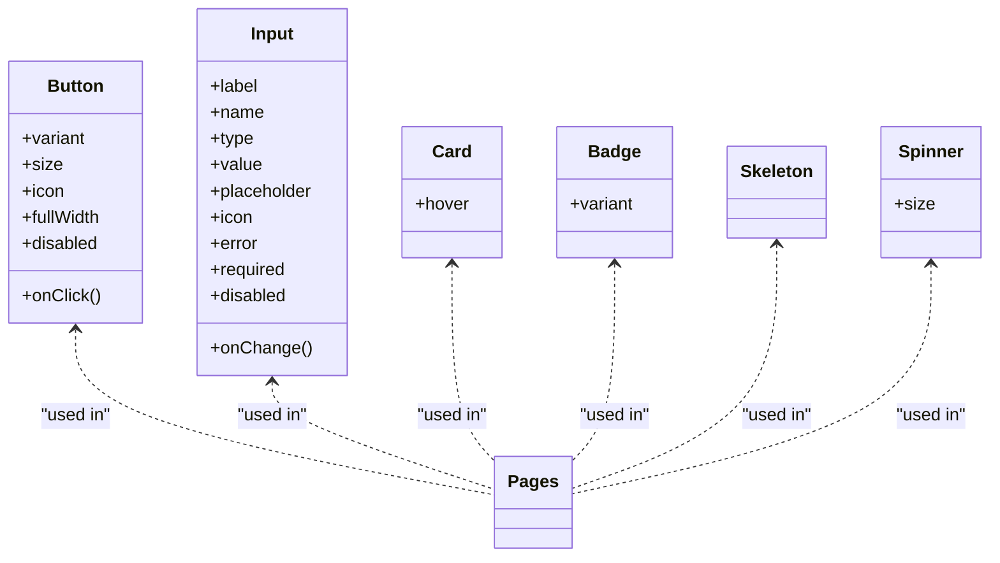
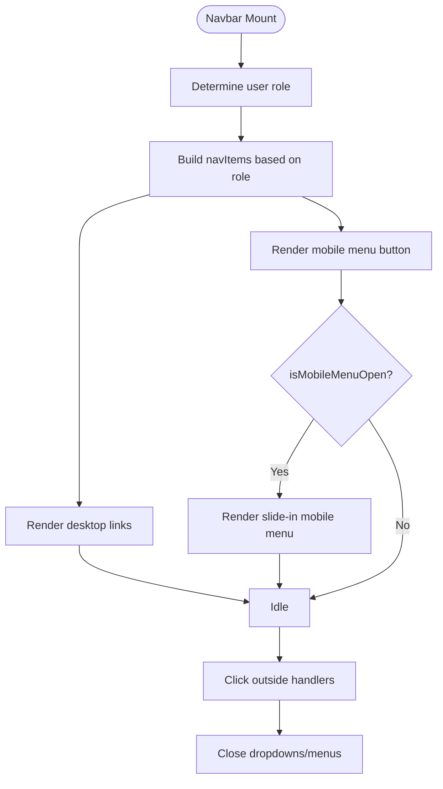
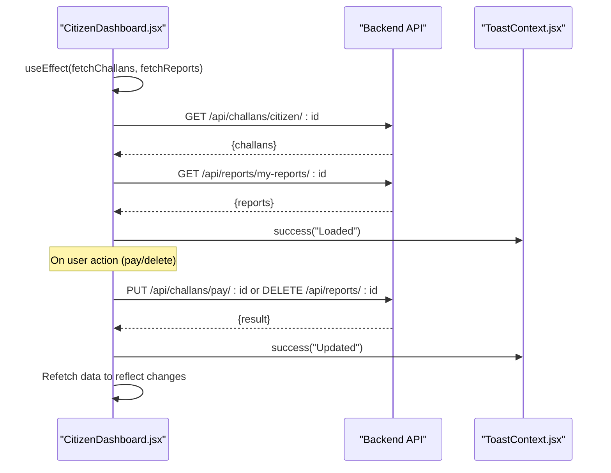
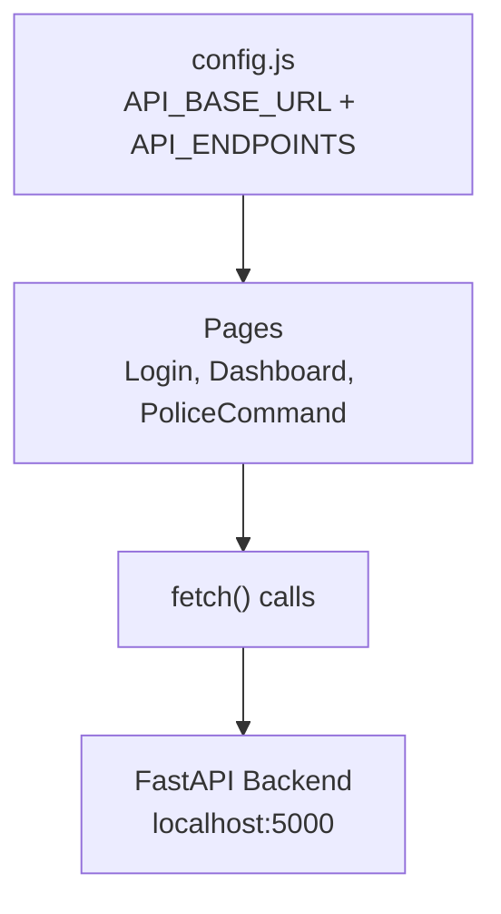
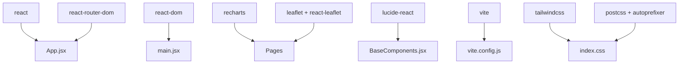
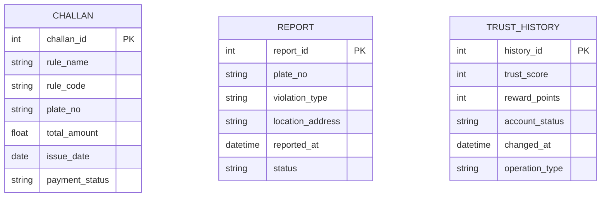

# Frontend Architecture

<cite>
**Referenced Files in This Document**
- [main.jsx](file://frontend/src/main.jsx)
- [App.jsx](file://frontend/src/App.jsx)
- [Navbar.jsx](file://frontend/src/components/Navbar.jsx)
- [BaseComponents.jsx](file://frontend/src/components/ui/BaseComponents.jsx)
- [ToastContext.jsx](file://frontend/src/context/ToastContext.jsx)
- [ThemeContext.jsx](file://frontend/src/context/ThemeContext.jsx)
- [DataTable.jsx](file://frontend/src/components/DataTable.jsx)
- [StatusBadge.jsx](file://frontend/src/components/StatusBadge.jsx)
- [TrustScoreChart.jsx](file://frontend/src/components/TrustScoreChart.jsx)
- [Login.jsx](file://frontend/src/pages/Login.jsx)
- [CitizenDashboard.jsx](file://frontend/src/pages/CitizenDashboard.jsx)
- [PoliceCommand.jsx](file://frontend/src/pages/PoliceCommand.jsx)
- [config.js](file://frontend/src/config.js)
- [index.css](file://frontend/src/index.css)
- [vite.config.js](file://frontend/vite.config.js)
- [tailwind.config.js](file://frontend/tailwind.config.js)
- [postcss.config.js](file://frontend/postcss.config.js)
- [package.json](file://frontend/package.json)
</cite>

## Table of Contents
1. [Introduction](#introduction)
2. [Project Structure](#project-structure)
3. [Core Components](#core-components)
4. [Architecture Overview](#architecture-overview)
5. [Detailed Component Analysis](#detailed-component-analysis)
6. [Dependency Analysis](#dependency-analysis)
7. [Performance Considerations](#performance-considerations)
8. [Troubleshooting Guide](#troubleshooting-guide)
9. [Conclusion](#conclusion)
10. [Appendices](#appendices)

## Introduction
This document explains the React frontend architecture for the Traffic Violation Management System. It covers component hierarchy, routing with React Router, state management patterns, build and styling systems (Vite, TailwindCSS), responsive design, context providers for theme and toast notifications, real-time-like data fetching, configuration management, API endpoint configuration, development server setup, and performance optimization techniques. The goal is to make the system understandable for beginners while providing sufficient technical depth for experienced React developers.

## Project Structure
The frontend is organized around a clear separation of concerns:
- Entry point initializes React, React Router, and global styles.
- App wraps the routing tree and manages user authentication state and navigation.
- Pages implement domain-specific views.
- Components encapsulate reusable UI elements and layout helpers.
- Context providers centralize cross-cutting concerns like theme and notifications.
- Styling leverages TailwindCSS with PostCSS and custom animations.
- Build tooling uses Vite with a development proxy to the backend.

**Diagram sources**
- [main.jsx:1-14](file://frontend/src/main.jsx#L1-L14)
- [App.jsx:1-274](file://frontend/src/App.jsx#L1-L274)
- [Navbar.jsx:1-252](file://frontend/src/components/Navbar.jsx#L1-L252)
- [BaseComponents.jsx:1-178](file://frontend/src/components/ui/BaseComponents.jsx#L1-L178)
- [ToastContext.jsx:1-113](file://frontend/src/context/ToastContext.jsx#L1-L113)
- [ThemeContext.jsx:1-39](file://frontend/src/context/ThemeContext.jsx#L1-L39)
- [index.css:1-189](file://frontend/src/index.css#L1-L189)
- [postcss.config.js:1-7](file://frontend/postcss.config.js#L1-L7)
- [tailwind.config.js:1-54](file://frontend/tailwind.config.js#L1-L54)
- [vite.config.js:1-23](file://frontend/vite.config.js#L1-L23)

**Section sources**
- [main.jsx:1-14](file://frontend/src/main.jsx#L1-L14)
- [App.jsx:1-274](file://frontend/src/App.jsx#L1-L274)
- [vite.config.js:1-23](file://frontend/vite.config.js#L1-L23)
- [tailwind.config.js:1-54](file://frontend/tailwind.config.js#L1-L54)
- [postcss.config.js:1-7](file://frontend/postcss.config.js#L1-L7)
- [package.json:1-30](file://frontend/package.json#L1-L30)

## Core Components
- App routing and authentication state: Orchestrates protected routes, user restoration from localStorage, and logout cleanup.
- Navbar: Role-aware navigation, profile dropdown, and responsive mobile menu.
- Base UI primitives: Button, Input, Card, Badge, Skeleton, Spinner for consistent component composition.
- Context providers: Toast notifications and theme switching with persistence.
- Page components: Login, CitizenDashboard, PoliceCommand demonstrate data fetching and user actions.

Key patterns:
- Composition via context providers at the root level.
- Route guards using conditional rendering and redirects.
- Centralized API endpoints via a configuration module.
- Tailwind utilities layered with custom utilities and animations.

**Section sources**
- [App.jsx:27-274](file://frontend/src/App.jsx#L27-L274)
- [Navbar.jsx:5-252](file://frontend/src/components/Navbar.jsx#L5-L252)
- [BaseComponents.jsx:1-178](file://frontend/src/components/ui/BaseComponents.jsx#L1-L178)
- [ToastContext.jsx:13-40](file://frontend/src/context/ToastContext.jsx#L13-L40)
- [ThemeContext.jsx:13-39](file://frontend/src/context/ThemeContext.jsx#L13-L39)
- [Login.jsx:6-186](file://frontend/src/pages/Login.jsx#L6-L186)
- [CitizenDashboard.jsx:6-340](file://frontend/src/pages/CitizenDashboard.jsx#L6-L340)
- [PoliceCommand.jsx:4-207](file://frontend/src/pages/PoliceCommand.jsx#L4-L207)

## Architecture Overview
The frontend follows a layered architecture:
- Presentation layer: Pages and UI components.
- Routing layer: React Router with route guards.
- State layer: Local state in pages and shared state via contexts.
- Data layer: API endpoints configured centrally and consumed by pages.
- Styling layer: TailwindCSS with custom animations and utilities.

**Diagram sources**
- [App.jsx:1-274](file://frontend/src/App.jsx#L1-L274)
- [Login.jsx:6-186](file://frontend/src/pages/Login.jsx#L6-L186)
- [CitizenDashboard.jsx:6-340](file://frontend/src/pages/CitizenDashboard.jsx#L6-L340)
- [PoliceCommand.jsx:4-207](file://frontend/src/pages/PoliceCommand.jsx#L4-L207)
- [config.js:1-34](file://frontend/src/config.js#L1-L34)
- [index.css:1-189](file://frontend/src/index.css#L1-L189)
- [tailwind.config.js:1-54](file://frontend/tailwind.config.js#L1-L54)

## Detailed Component Analysis

### Routing and Authentication Flow
The App component sets up protected routes and handles user persistence and logout. It conditionally renders pages based on role and login state, and persists tokens and user data in localStorage.

**Diagram sources**
- [main.jsx:7-13](file://frontend/src/main.jsx#L7-L13)
- [App.jsx:27-76](file://frontend/src/App.jsx#L27-L76)
- [Login.jsx:15-69](file://frontend/src/pages/Login.jsx#L15-L69)

**Section sources**
- [App.jsx:27-76](file://frontend/src/App.jsx#L27-L76)
- [Login.jsx:6-186](file://frontend/src/pages/Login.jsx#L6-L186)

### Context Providers: Theme and Toast Notifications
- ThemeContext: Manages dark/light mode with persistence in localStorage and applies a class to the root element.
- ToastContext: Provides a toast queue with severity types and auto-dismissal, rendered via a container component.

**Diagram sources**
- [ThemeContext.jsx:13-39](file://frontend/src/context/ThemeContext.jsx#L13-L39)
- [ToastContext.jsx:13-40](file://frontend/src/context/ToastContext.jsx#L13-L40)
- [ToastContext.jsx:42-112](file://frontend/src/context/ToastContext.jsx#L42-L112)

**Section sources**
- [ThemeContext.jsx:1-39](file://frontend/src/context/ThemeContext.jsx#L1-L39)
- [ToastContext.jsx:1-113](file://frontend/src/context/ToastContext.jsx#L1-L113)

### UI Primitive Library and Composition Patterns
Reusable primitives enable consistent composition:
- Button supports variants, sizes, icons, and full-width.
- Input supports labels, icons, errors, and required fields.
- Card, Badge, Skeleton, and Spinner provide standardized building blocks.

**Diagram sources**
- [BaseComponents.jsx:1-178](file://frontend/src/components/ui/BaseComponents.jsx#L1-L178)

**Section sources**
- [BaseComponents.jsx:1-178](file://frontend/src/components/ui/BaseComponents.jsx#L1-L178)

### Navigation Patterns and Responsive Design
The Navbar adapts to roles and screen sizes:
- Role-aware links and home path.
- Desktop: centered horizontal navigation.
- Mobile: hamburger menu with animated slide-in panel.
- Click-outside handlers close dropdowns and menus.

**Diagram sources**
- [Navbar.jsx:5-252](file://frontend/src/components/Navbar.jsx#L5-L252)

**Section sources**
- [Navbar.jsx:1-252](file://frontend/src/components/Navbar.jsx#L1-L252)

### Real-Time Data Synchronization Mechanisms
While true real-time updates (WebSocket/SSE) are not implemented, the system simulates near-real-time behavior by:
- Fetching data on mount and on-demand after user actions.
- Using loading states and skeleton UI during network requests.
- Providing retry mechanisms and user feedback via toast notifications.

Example flows:
- CitizenDashboard fetches challans and reports, then allows payment and deletion with immediate UI refresh.
- PoliceCommand fetches dashboard statistics and presents summary cards.

**Diagram sources**
- [CitizenDashboard.jsx:14-116](file://frontend/src/pages/CitizenDashboard.jsx#L14-L116)
- [ToastContext.jsx:16-27](file://frontend/src/context/ToastContext.jsx#L16-L27)

**Section sources**
- [CitizenDashboard.jsx:6-340](file://frontend/src/pages/CitizenDashboard.jsx#L6-L340)
- [PoliceCommand.jsx:20-48](file://frontend/src/pages/PoliceCommand.jsx#L20-L48)
- [ToastContext.jsx:13-40](file://frontend/src/context/ToastContext.jsx#L13-L40)

### Configuration Management and API Endpoints
Centralized configuration defines base URLs and endpoints for authentication, reports, challans, trust, and police operations. Pages consume these endpoints directly or via helper functions.

**Diagram sources**
- [config.js:1-34](file://frontend/src/config.js#L1-L34)
- [Login.jsx:26-33](file://frontend/src/pages/Login.jsx#L26-L33)
- [CitizenDashboard.jsx:31-68](file://frontend/src/pages/CitizenDashboard.jsx#L31-L68)
- [PoliceCommand.jsx:25](file://frontend/src/pages/PoliceCommand.jsx#L25)

**Section sources**
- [config.js:1-34](file://frontend/src/config.js#L1-L34)
- [Login.jsx:6-186](file://frontend/src/pages/Login.jsx#L6-L186)
- [CitizenDashboard.jsx:6-340](file://frontend/src/pages/CitizenDashboard.jsx#L6-L340)
- [PoliceCommand.jsx:4-207](file://frontend/src/pages/PoliceCommand.jsx#L4-L207)

### Styling Architecture with TailwindCSS
Tailwind is configured with:
- Content scanning across templates.
- Custom color palette and typography.
- Animation keyframes and utilities.
- PostCSS pipeline with Tailwind and Autoprefixer.
- Global base, components, and utilities layers in index.css.

Responsive design:
- Breakpoints and spacing scale via Tailwind utilities.
- Mobile-first with lg+ variants for desktop layouts.
- Custom animations and transitions for interactive elements.

**Section sources**
- [tailwind.config.js:1-54](file://frontend/tailwind.config.js#L1-L54)
- [postcss.config.js:1-7](file://frontend/postcss.config.js#L1-L7)
- [index.css:1-189](file://frontend/src/index.css#L1-L189)

### Webcam Integration for Face Capture
The Login page demonstrates a pattern for capturing images and sending them to backend endpoints for facial recognition. While the exact webcam implementation is not present in the provided files, the page shows how form submission and API calls are structured for face-based authentication.

- The Login component posts credentials to the backend and receives tokens.
- config.js exposes REGISTER_FACE and LOGIN_FACE endpoints for facial registration and authentication.

Note: The actual webcam capture code is not included in the provided files. The integration would follow similar patterns shown in the Login component’s fetch workflow.

**Section sources**
- [Login.jsx:15-69](file://frontend/src/pages/Login.jsx#L15-L69)
- [config.js:9-10](file://frontend/src/config.js#L9-L10)

## Dependency Analysis
External dependencies include React, React Router DOM, Recharts, Leaflet, and Lucide icons. Dev tooling includes Vite, TailwindCSS, PostCSS, and related plugins.

**Diagram sources**
- [package.json:11-28](file://frontend/package.json#L11-L28)
- [vite.config.js:1-23](file://frontend/vite.config.js#L1-23)
- [tailwind.config.js:1-54](file://frontend/tailwind.config.js#L1-L54)
- [postcss.config.js:1-7](file://frontend/postcss.config.js#L1-L7)

**Section sources**
- [package.json:1-30](file://frontend/package.json#L1-L30)

## Performance Considerations
- Bundle splitting and lazy loading: Split large pages and routes to reduce initial load. Use React.lazy and Suspense for heavy components.
- Code splitting by route: Group routes by feature and split chunks to defer non-critical pages.
- Minimize re-renders: Use useMemo/useCallback for expensive computations and derived data in pages.
- Virtualize long lists: For large datasets, implement virtual scrolling to keep the DOM small.
- Optimize images and assets: Compress assets and leverage modern formats; defer non-critical images.
- CSS optimization: Keep Tailwind purged and avoid unused utilities; extract critical CSS for above-the-fold content.
- Network efficiency: Batch requests where possible; cache data in memory with invalidation strategies.
- Build optimization: Use Vite’s built-in minification and asset optimization; enable compression in preview/prod.

[No sources needed since this section provides general guidance]

## Troubleshooting Guide
Common issues and resolutions:
- Authentication persistence: Verify localStorage keys and parsing logic in App. Ensure tokens are saved and cleared on logout.
- Toast notifications: Confirm provider is mounted at the root and hooks are used within provider scope.
- Styling anomalies: Check Tailwind content globs and ensure index.css is imported in main.jsx.
- API connectivity: Validate VITE_API_URL and proxy settings in vite.config.js; confirm backend is running on the target port.
- Route guards: Ensure protected routes redirect appropriately when user state is missing.

**Section sources**
- [App.jsx:27-76](file://frontend/src/App.jsx#L27-L76)
- [ToastContext.jsx:13-40](file://frontend/src/context/ToastContext.jsx#L13-L40)
- [index.css:1-3](file://frontend/src/index.css#L1-L3)
- [vite.config.js:7-21](file://frontend/vite.config.js#L7-L21)

## Conclusion
The frontend employs a clean, modular architecture with React Router for navigation, centralized configuration for API endpoints, and context providers for cross-cutting concerns. TailwindCSS and PostCSS deliver a scalable styling system, while Vite streamlines development and builds. Real-time-like behavior is achieved through targeted data fetching and user feedback. Following the recommended performance and maintenance practices will help sustain a robust, maintainable frontend.

[No sources needed since this section summarizes without analyzing specific files]

## Appendices

### Component Composition Patterns
- Primitive-first: Build pages from Button, Input, Card, and Badge.
- Container components: Pages manage state and orchestrate data fetching; presentational components render UI.
- Context-driven: Toast and Theme providers inject behavior without prop drilling.

**Section sources**
- [BaseComponents.jsx:1-178](file://frontend/src/components/ui/BaseComponents.jsx#L1-L178)
- [ToastContext.jsx:13-40](file://frontend/src/context/ToastContext.jsx#L13-L40)
- [ThemeContext.jsx:13-39](file://frontend/src/context/ThemeContext.jsx#L13-L39)

### Data Models and UI Elements

**Diagram sources**
- [CitizenDashboard.jsx:232-262](file://frontend/src/pages/CitizenDashboard.jsx#L232-L262)
- [CitizenDashboard.jsx:295-327](file://frontend/src/pages/CitizenDashboard.jsx#L295-L327)
- [TrustScoreChart.jsx:89-117](file://frontend/src/components/TrustScoreChart.jsx#L89-L117)