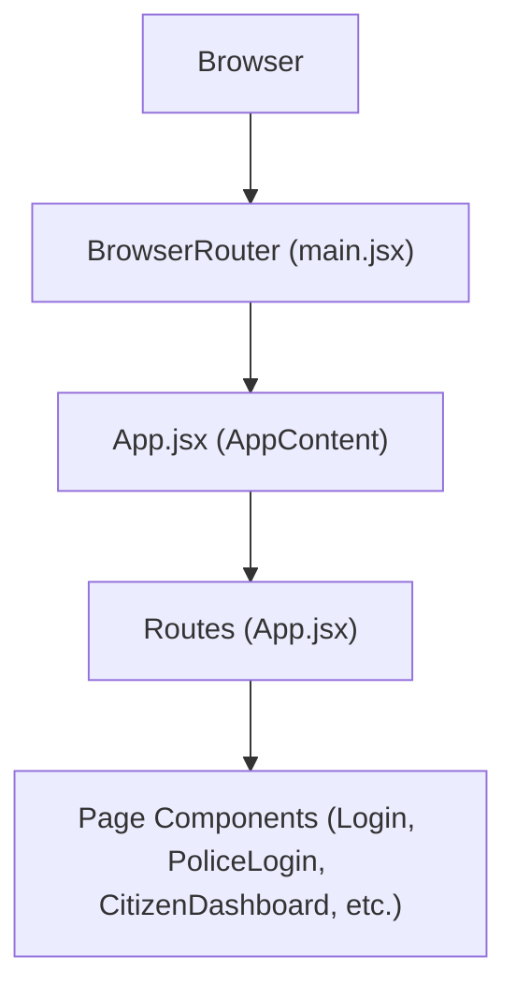
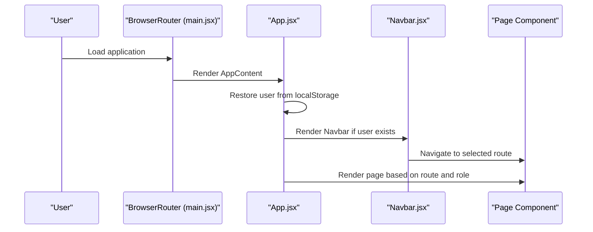
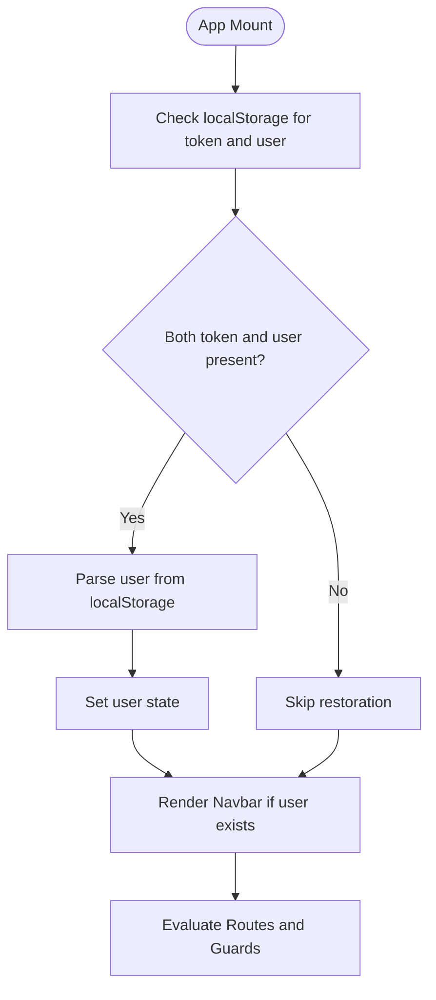
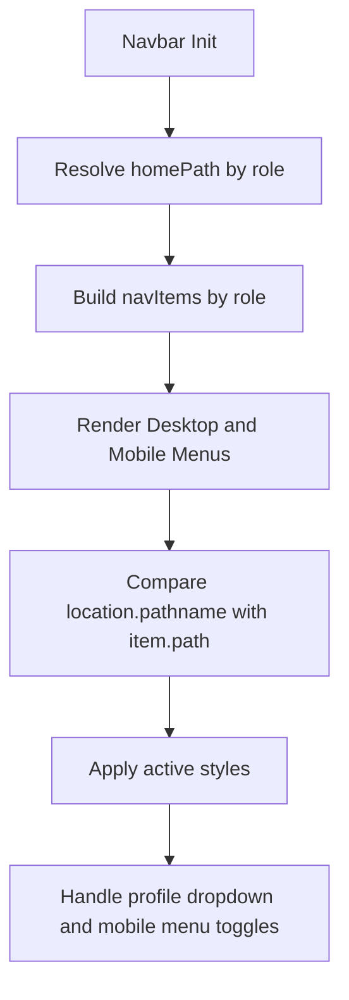
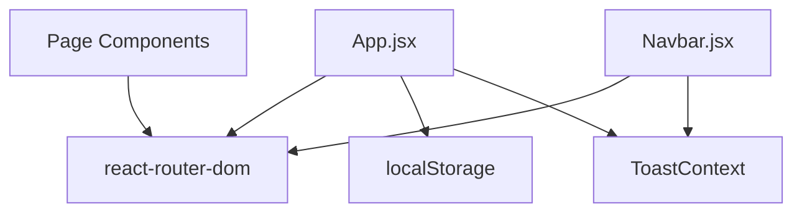

# Routing and Navigation

<cite>
**Referenced Files in This Document**
- [App.jsx](file://frontend/src/App.jsx)
- [main.jsx](file://frontend/src/main.jsx)
- [Navbar.jsx](file://frontend/src/components/Navbar.jsx)
- [Login.jsx](file://frontend/src/pages/Login.jsx)
- [PoliceLogin.jsx](file://frontend/src/pages/PoliceLogin.jsx)
- [CitizenDashboard.jsx](file://frontend/src/pages/CitizenDashboard.jsx)
- [PoliceCommand.jsx](file://frontend/src/pages/PoliceCommand.jsx)
- [MyChallans.jsx](file://frontend/src/pages/MyChallans.jsx)
- [PaymentPage.jsx](file://frontend/src/pages/PaymentPage.jsx)
- [Analytics.jsx](file://frontend/src/pages/Analytics.jsx)
- [Profile.jsx](file://frontend/src/pages/Profile.jsx)
- [ToastContext.jsx](file://frontend/src/context/ToastContext.jsx)
- [config.js](file://frontend/src/config.js)
- [package.json](file://frontend/package.json)
</cite>

## Table of Contents
1. [Introduction](#introduction)
2. [Project Structure](#project-structure)
3. [Core Components](#core-components)
4. [Architecture Overview](#architecture-overview)
5. [Detailed Component Analysis](#detailed-component-analysis)
6. [Dependency Analysis](#dependency-analysis)
7. [Performance Considerations](#performance-considerations)
8. [Troubleshooting Guide](#troubleshooting-guide)
9. [Conclusion](#conclusion)

## Introduction
This document explains the React Router configuration and navigation system for the Traffic Violation Management application. It covers route definitions, role-based access control, dynamic routing patterns, authentication guards, programmatic navigation, and integration with authentication state and localStorage. It also documents the Navbar component’s conditional rendering, responsive behavior, and active link highlighting, along with examples of route parameters and nested navigation patterns.

## Project Structure
The routing is configured at the application root with React Router v6. The app wraps the main layout in a provider for toast notifications and mounts the router around the primary layout and pages. The main entry point initializes the browser router and renders the root component.

**Diagram sources**
- [main.jsx:7-13](file://frontend/src/main.jsx#L7-L13)
- [App.jsx:78-264](file://frontend/src/App.jsx#L78-L264)

**Section sources**
- [main.jsx:1-14](file://frontend/src/main.jsx#L1-L14)
- [package.json:17](file://frontend/package.json#L17)

## Core Components
- App.jsx: Defines all routes, authentication guards, and redirects. Integrates Navbar and handles user state persistence via localStorage.
- Navbar.jsx: Provides role-aware navigation, responsive behavior, active link highlighting, and logout flow.
- Login.jsx and PoliceLogin.jsx: Handle authentication and persist tokens and user data to localStorage.
- Programmatic navigation: Used in MyChallans.jsx for navigating to payment routes and in PaymentPage.jsx for redirects after actions.

Key routing patterns:
- Protected routes: Many routes render a component only when a user exists and matches the expected role.
- Redirects: Home and hero routes redirect authenticated users to appropriate dashboards.
- Route parameters: PaymentPage.jsx uses a parameterized route to open a specific challan payment page.
- Nested-like behavior: Sub-navigation is handled by the Navbar, which dynamically adjusts menu items based on user role.

**Section sources**
- [App.jsx:78-264](file://frontend/src/App.jsx#L78-L264)
- [Navbar.jsx:5-252](file://frontend/src/components/Navbar.jsx#L5-L252)
- [Login.jsx:6-69](file://frontend/src/pages/Login.jsx#L6-L69)
- [PoliceLogin.jsx:6-68](file://frontend/src/pages/PoliceLogin.jsx#L6-L68)
- [MyChallans.jsx:38-44](file://frontend/src/pages/MyChallans.jsx#L38-L44)
- [PaymentPage.jsx:8-44](file://frontend/src/pages/PaymentPage.jsx#L8-L44)

## Architecture Overview
The routing architecture enforces role-based access control centrally in App.jsx. Authentication state is persisted in localStorage and restored on initial load. The Navbar conditionally renders menu items and highlights active links based on the current location. Programmatic navigation is used to move users between related views (e.g., from a list to a payment page).

**Diagram sources**
- [main.jsx:7-13](file://frontend/src/main.jsx#L7-L13)
- [App.jsx:27-80](file://frontend/src/App.jsx#L27-L80)
- [Navbar.jsx:5-252](file://frontend/src/components/Navbar.jsx#L5-L252)

## Detailed Component Analysis

### Route Definitions and Access Control
- Root and Hero: Home route serves Login when unauthenticated; authenticated citizens and police are redirected to the hero route. The hero route requires authentication.
- Registration: Available only when unauthenticated; otherwise redirects to respective dashboards.
- Profile: Accessible to any authenticated user.
- Analytics: Accessible to any authenticated user; displays role-specific summaries.
- Citizen routes: Dashboard, Submit Report, My Reports, My Challans, Rewards & Redeem, and payment routes are restricted to citizens.
- Police routes: Police dashboard, review reports, vehicle search, and rules are restricted to police officers.
- Parameterized routes: Payment route accepts a challan identifier and restricts access to citizens.

Access control is enforced by checking user presence and role before rendering components, with redirects to safe destinations when unauthorized.

**Section sources**
- [App.jsx:82-262](file://frontend/src/App.jsx#L82-L262)

### Authentication Guards and Session Persistence
- On login, both token and user data are saved to localStorage and the user state is updated.
- On initial load, the app restores user state from localStorage if present.
- Logout removes token and user data from localStorage and clears user state.
- Pages like Profile and Analytics read user data from localStorage to determine access and display role-specific content.

**Diagram sources**
- [App.jsx:30-50](file://frontend/src/App.jsx#L30-L50)
- [App.jsx:52-76](file://frontend/src/App.jsx#L52-L76)
- [Login.jsx:55-62](file://frontend/src/pages/Login.jsx#L55-L62)
- [PoliceLogin.jsx:54-61](file://frontend/src/pages/PoliceLogin.jsx#L54-L61)

**Section sources**
- [App.jsx:27-80](file://frontend/src/App.jsx#L27-L80)
- [Login.jsx:55-62](file://frontend/src/pages/Login.jsx#L55-L62)
- [PoliceLogin.jsx:54-61](file://frontend/src/pages/PoliceLogin.jsx#L54-L61)

### Navigation Flow Between Roles
- Citizen flow:
  - Login → Hero → Dashboard → My Challans → Payment (parameterized) → My Challans
  - Submit Report → My Reports → Analytics → Profile
- Police flow:
  - Police Login → Hero → Police Dashboard → Review Reports → Vehicle Search → Analytics → Profile
- Shared flows:
  - Profile, Analytics, Rules, About, Leaderboard, Future Scopes are accessible to authenticated users.

The Navbar dynamically sets the home link and menu items based on user role, ensuring intuitive navigation for each persona.

**Section sources**
- [Navbar.jsx:13-76](file://frontend/src/components/Navbar.jsx#L13-L76)
- [App.jsx:82-262](file://frontend/src/App.jsx#L82-L262)

### Navbar Component: Conditional Rendering, Responsiveness, and Active Links
- Role-aware home link: Home navigates to the police dashboard for officers and the hero/home for citizens.
- Dynamic menu items: Menu items change based on user role.
- Active link highlighting: Compares current location with each menu item path to apply active styles.
- Responsive behavior: Collapses into a mobile menu with a toggle button; click-outside handlers close dropdowns and menus.
- Programmatic logout: Clears session and navigates to the root route.

**Diagram sources**
- [Navbar.jsx:13-76](file://frontend/src/components/Navbar.jsx#L13-L76)
- [Navbar.jsx:94-111](file://frontend/src/components/Navbar.jsx#L94-L111)
- [Navbar.jsx:217-234](file://frontend/src/components/Navbar.jsx#L217-L234)

**Section sources**
- [Navbar.jsx:5-252](file://frontend/src/components/Navbar.jsx#L5-L252)

### Route Parameters and Programmatic Navigation
- Parameterized route: Payment route uses a parameter for challan identification.
- Programmatic navigation:
  - From MyChallans.jsx: Clicking an unpaid challan navigates to the payment route with the selected challan ID.
  - From PaymentPage.jsx: After successful payment, navigates back to the challans list; on errors, navigates to the list or displays a not-found state.

These patterns ensure seamless transitions between related views while preserving context.

**Section sources**
- [App.jsx:170-179](file://frontend/src/App.jsx#L170-L179)
- [MyChallans.jsx:38-44](file://frontend/src/pages/MyChallans.jsx#L38-L44)
- [PaymentPage.jsx:40-73](file://frontend/src/pages/PaymentPage.jsx#L40-L73)

### Role-Based Access Control Examples
- Citizen-only routes:
  - Dashboard, Submit Report, My Reports, My Challans, Rewards & Redeem, and payment route.
- Police-only routes:
  - Police Dashboard, Review Reports, Vehicle Search, and Rules.
- Shared routes:
  - Profile, Analytics, About, Rules, Leaderboard, Future Scopes.

Guards enforce access by checking user role before rendering components and redirecting to safe locations when unauthorized.

**Section sources**
- [App.jsx:138-261](file://frontend/src/App.jsx#L138-L261)

### Integration with Authentication State and localStorage
- Token and user data are persisted in localStorage upon login.
- App.jsx restores user state on mount and updates Navbar visibility accordingly.
- Pages like Profile and Analytics read localStorage to determine role and fetch role-specific data.
- Toast notifications are provided globally via ToastProvider for user feedback during navigation and actions.

**Section sources**
- [App.jsx:27-80](file://frontend/src/App.jsx#L27-L80)
- [Profile.jsx:30-44](file://frontend/src/pages/Profile.jsx#L30-L44)
- [Analytics.jsx:24-40](file://frontend/src/pages/Analytics.jsx#L24-L40)
- [ToastContext.jsx:13-40](file://frontend/src/context/ToastContext.jsx#L13-L40)

### API Endpoints and Configuration
- API base URL and endpoints are centralized in config.js, enabling consistent backend integration across pages.
- Pages consume these endpoints to fetch data and drive navigation decisions.

**Section sources**
- [config.js:1-34](file://frontend/src/config.js#L1-L34)

## Dependency Analysis
The routing system depends on React Router for declarative routing and navigation, and on localStorage for session persistence. The Navbar depends on react-router-dom for Link and navigation hooks. ToastContext provides global notifications.

**Diagram sources**
- [package.json:17](file://frontend/package.json#L17)
- [App.jsx:27-80](file://frontend/src/App.jsx#L27-L80)
- [Navbar.jsx:5-252](file://frontend/src/components/Navbar.jsx#L5-L252)
- [ToastContext.jsx:13-40](file://frontend/src/context/ToastContext.jsx#L13-L40)

**Section sources**
- [package.json:17](file://frontend/package.json#L17)
- [App.jsx:27-80](file://frontend/src/App.jsx#L27-L80)
- [Navbar.jsx:5-252](file://frontend/src/components/Navbar.jsx#L5-L252)
- [ToastContext.jsx:13-40](file://frontend/src/context/ToastContext.jsx#L13-L40)

## Performance Considerations
- Minimal re-renders: Route guards and conditional rendering prevent unnecessary component mounts for unauthorized users.
- Local storage usage: Reduces network requests for authentication state on initial load.
- Programmatic navigation: Efficient for moving between related views without re-fetching unrelated data.
- Recommendations:
  - Lazy-load heavy pages using React.lazy and Suspense for improved initial load performance.
  - Implement route-level code splitting to reduce bundle size.
  - Debounce or throttle navigation-triggered fetches to avoid redundant API calls.

[No sources needed since this section provides general guidance]

## Troubleshooting Guide
Common issues and resolutions:
- Unauthorized access attempts:
  - Symptom: Redirect loops or blank pages for protected routes.
  - Resolution: Ensure user state is restored from localStorage and role checks match expected values.
- Stuck on login:
  - Symptom: Cannot navigate past login despite valid credentials.
  - Resolution: Verify token and user data are saved to localStorage and App.jsx handles the login callback correctly.
- Payment route errors:
  - Symptom: Cannot access payment page or incorrect redirects.
  - Resolution: Confirm the route parameter exists and the user has the correct role; verify programmatic navigation logic.
- Navbar not updating:
  - Symptom: Menu items or active states not reflecting role or current route.
  - Resolution: Check location pathname comparisons and ensure Navbar receives updated user props.

**Section sources**
- [App.jsx:27-80](file://frontend/src/App.jsx#L27-L80)
- [PaymentPage.jsx:38-44](file://frontend/src/pages/PaymentPage.jsx#L38-L44)
- [Navbar.jsx:94-111](file://frontend/src/components/Navbar.jsx#L94-L111)

## Conclusion
The routing and navigation system enforces robust role-based access control, integrates seamlessly with authentication state and localStorage, and provides responsive, user-friendly navigation through the Navbar. Parameterized routes and programmatic navigation enable smooth transitions between related views. With optional lazy loading and route-level code splitting, the system can be further optimized for performance while maintaining a strong UX.