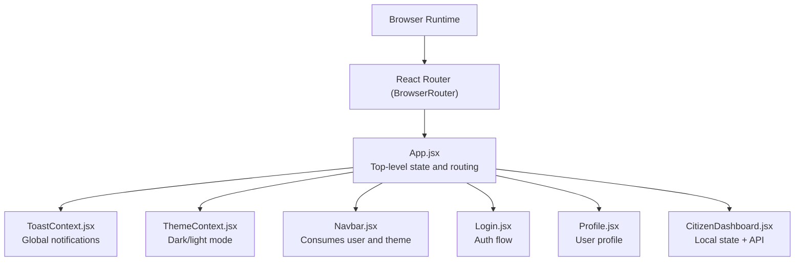
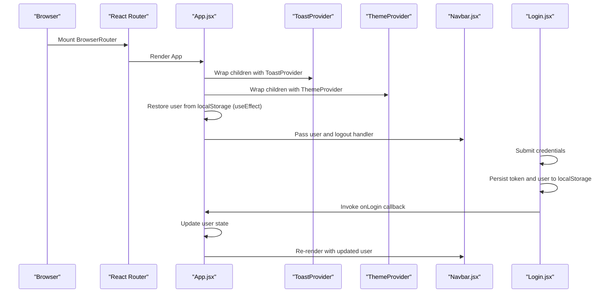
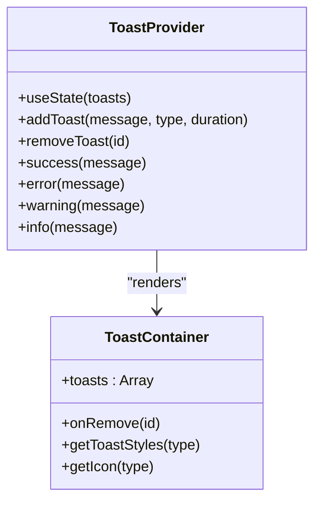
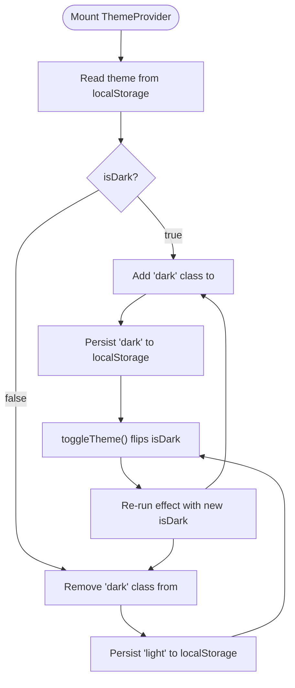
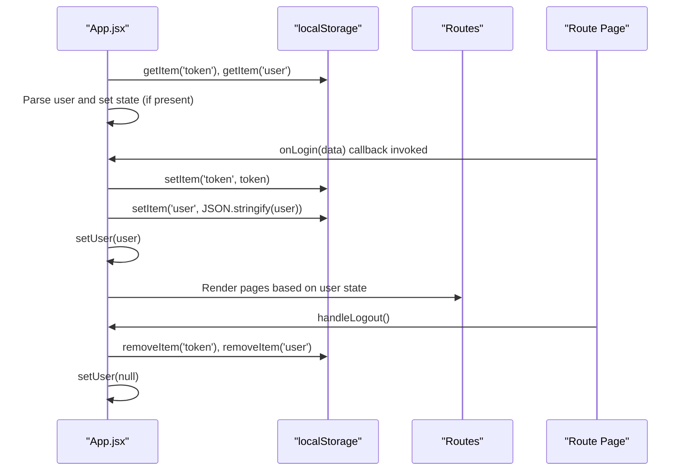
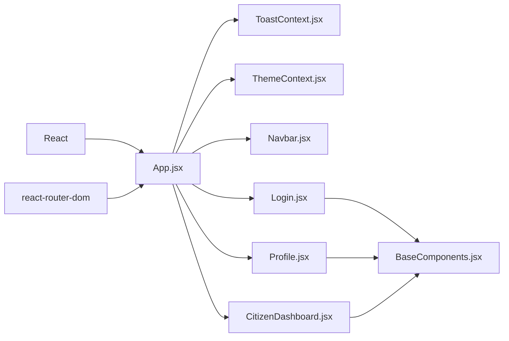

# State Management

<cite>
**Referenced Files in This Document**
- [ToastContext.jsx](file://frontend/src/context/ToastContext.jsx)
- [ThemeContext.jsx](file://frontend/src/context/ThemeContext.jsx)
- [App.jsx](file://frontend/src/App.jsx)
- [main.jsx](file://frontend/src/main.jsx)
- [Navbar.jsx](file://frontend/src/components/Navbar.jsx)
- [Login.jsx](file://frontend/src/pages/Login.jsx)
- [Profile.jsx](file://frontend/src/pages/Profile.jsx)
- [CitizenDashboard.jsx](file://frontend/src/pages/CitizenDashboard.jsx)
- [BaseComponents.jsx](file://frontend/src/components/ui/BaseComponents.jsx)
</cite>

## Table of Contents
1. [Introduction](#introduction)
2. [Project Structure](#project-structure)
3. [Core Components](#core-components)
4. [Architecture Overview](#architecture-overview)
5. [Detailed Component Analysis](#detailed-component-analysis)
6. [Dependency Analysis](#dependency-analysis)
7. [Performance Considerations](#performance-considerations)
8. [Troubleshooting Guide](#troubleshooting-guide)
9. [Conclusion](#conclusion)

## Introduction
This document explains the frontend state management architecture for the traffic violation management system. It focuses on the context provider pattern, authentication state flow, theme preferences, and notification system. It also covers local component state with useState/useEffect, localStorage integration for persistence, cross-component communication without prop drilling, and practical debugging techniques.

## Project Structure
The frontend uses React with Vite and Tailwind CSS. The application bootstraps inside a routing context and wraps the app with providers for global state (notifications and theme). Authentication state is managed at the top-level App component and passed down to route components.

**Diagram sources**
- [main.jsx:7-13](file://frontend/src/main.jsx#L7-L13)
- [App.jsx:27-273](file://frontend/src/App.jsx#L27-L273)
- [ToastContext.jsx:13-40](file://frontend/src/context/ToastContext.jsx#L13-L40)
- [ThemeContext.jsx:13-38](file://frontend/src/context/ThemeContext.jsx#L13-L38)
- [Navbar.jsx:5-252](file://frontend/src/components/Navbar.jsx#L5-L252)
- [Login.jsx:6-186](file://frontend/src/pages/Login.jsx#L6-L186)
- [Profile.jsx:5-464](file://frontend/src/pages/Profile.jsx#L5-L464)
- [CitizenDashboard.jsx:6-393](file://frontend/src/pages/CitizenDashboard.jsx#L6-L393)

**Section sources**
- [main.jsx:7-13](file://frontend/src/main.jsx#L7-L13)
- [App.jsx:27-273](file://frontend/src/App.jsx#L27-L273)

## Core Components
- ToastProvider: Provides a global notification system with typed messages and auto-dismissal.
- ThemeProvider: Manages dark/light mode preference persisted in localStorage.
- App: Top-level state container for user authentication and session persistence.
- Consumers: Components like Navbar, Login, Profile, and CitizenDashboard consume context and manage local state.

Key patterns:
- Context providers wrap the app tree to enable cross-component access.
- useState manages local component state; useEffect handles side effects like localStorage reads/writes.
- localStorage persists tokens and user objects for session restoration.

**Section sources**
- [ToastContext.jsx:13-40](file://frontend/src/context/ToastContext.jsx#L13-L40)
- [ThemeContext.jsx:13-38](file://frontend/src/context/ThemeContext.jsx#L13-L38)
- [App.jsx:27-76](file://frontend/src/App.jsx#L27-L76)

## Architecture Overview
The state architecture centers around three pillars:
- Global notifications via ToastProvider
- Theme preference via ThemeProvider
- Authentication state via App

**Diagram sources**
- [main.jsx:7-13](file://frontend/src/main.jsx#L7-L13)
- [App.jsx:27-76](file://frontend/src/App.jsx#L27-L76)
- [ToastContext.jsx:13-40](file://frontend/src/context/ToastContext.jsx#L13-L40)
- [ThemeContext.jsx:13-38](file://frontend/src/context/ThemeContext.jsx#L13-L38)
- [Navbar.jsx:5-37](file://frontend/src/components/Navbar.jsx#L5-L37)
- [Login.jsx:15-69](file://frontend/src/pages/Login.jsx#L15-L69)

## Detailed Component Analysis

### Toast Provider Pattern
ToastProvider encapsulates:
- Local state for toasts array
- Methods to enqueue and dismiss toasts
- Auto-dismiss timers
- A container component rendering all active toasts

Usage patterns:
- Components call useToast() to access success/error/warning/info helpers.
- Toasts are dismissed automatically after a duration; users can dismiss manually.

**Diagram sources**
- [ToastContext.jsx:13-112](file://frontend/src/context/ToastContext.jsx#L13-L112)

**Section sources**
- [ToastContext.jsx:13-112](file://frontend/src/context/ToastContext.jsx#L13-L112)

### Theme Provider Pattern
ThemeProvider manages:
- Local state for isDark
- Synchronizes DOM class and localStorage on change
- Exposes a toggleTheme function

**Diagram sources**
- [ThemeContext.jsx:13-38](file://frontend/src/context/ThemeContext.jsx#L13-L38)

**Section sources**
- [ThemeContext.jsx:13-38](file://frontend/src/context/ThemeContext.jsx#L13-L38)

### Authentication State Flow (App.jsx)
App manages:
- Top-level user state
- Automatic session restoration on mount
- Login handler that persists token and user
- Logout handler that clears persistence and resets state

**Diagram sources**
- [App.jsx:27-76](file://frontend/src/App.jsx#L27-L76)

**Section sources**
- [App.jsx:27-76](file://frontend/src/App.jsx#L27-L76)

### Context Consumption Patterns
- Navbar consumes user and logout handler from App and displays role-aware navigation.
- Login uses useToast to show success/error feedback during authentication.
- Profile uses useToast and local state to manage editing and fetching profile data.
- CitizenDashboard uses useToast and local state to manage lists, loading, and API interactions.

Common patterns:
- Destructure context values for readability (e.g., success, error from useToast).
- Use local state for UI-only concerns (e.g., editing, loading).
- Combine context and local state for cross-component updates (e.g., Navbar triggers App.handleLogout).

**Section sources**
- [Navbar.jsx:5-37](file://frontend/src/components/Navbar.jsx#L5-L37)
- [Login.jsx:8-69](file://frontend/src/pages/Login.jsx#L8-L69)
- [Profile.jsx:6-150](file://frontend/src/pages/Profile.jsx#L6-L150)
- [CitizenDashboard.jsx:7-116](file://frontend/src/pages/CitizenDashboard.jsx#L7-L116)

### Cross-Component Communication Without Prop Drilling
- App passes user and handleLogout to Navbar via props.
- App passes onLogin to Login so Login can update App’s state.
- ToastProvider and ThemeProvider wrap the app so any child can consume context.

Benefits:
- Reduces prop chains
- Encourages modular UI components
- Simplifies testing and reuse

**Section sources**
- [App.jsx:78-264](file://frontend/src/App.jsx#L78-L264)
- [Navbar.jsx:5-37](file://frontend/src/components/Navbar.jsx#L5-L37)
- [Login.jsx:6-62](file://frontend/src/pages/Login.jsx#L6-L62)

### State Synchronization Across Components
- Navbar reflects App’s user state and triggers logout.
- Profile and CitizenDashboard read localStorage to hydrate UI state and keep user data fresh.
- ToastProvider maintains a centralized queue for notifications across the app.

Techniques:
- useEffect for initialization and side effects
- useCallback for stable callbacks passed to children
- localStorage as a shared persistence layer

**Section sources**
- [Navbar.jsx:33-37](file://frontend/src/components/Navbar.jsx#L33-L37)
- [Profile.jsx:26-123](file://frontend/src/pages/Profile.jsx#L26-L123)
- [CitizenDashboard.jsx:14-68](file://frontend/src/pages/CitizenDashboard.jsx#L14-L68)
- [ToastContext.jsx:16-27](file://frontend/src/context/ToastContext.jsx#L16-L27)

## Dependency Analysis
- App depends on React Router for routing and on context providers for global state.
- Providers depend on React’s built-in hooks (useState, useEffect, useContext).
- Components depend on BaseComponents for UI primitives.

**Diagram sources**
- [App.jsx:1-26](file://frontend/src/App.jsx#L1-L26)
- [ToastContext.jsx:1-3](file://frontend/src/context/ToastContext.jsx#L1-L3)
- [ThemeContext.jsx:1-3](file://frontend/src/context/ThemeContext.jsx#L1-L3)
- [Navbar.jsx:1-4](file://frontend/src/components/Navbar.jsx#L1-L4)
- [Login.jsx:1-4](file://frontend/src/pages/Login.jsx#L1-L4)
- [Profile.jsx:1-3](file://frontend/src/pages/Profile.jsx#L1-L3)
- [CitizenDashboard.jsx:1-4](file://frontend/src/pages/CitizenDashboard.jsx#L1-L4)
- [BaseComponents.jsx:1-178](file://frontend/src/components/ui/BaseComponents.jsx#L1-L178)

**Section sources**
- [App.jsx:1-26](file://frontend/src/App.jsx#L1-L26)
- [ToastContext.jsx:1-3](file://frontend/src/context/ToastContext.jsx#L1-L3)
- [ThemeContext.jsx:1-3](file://frontend/src/context/ThemeContext.jsx#L1-L3)
- [BaseComponents.jsx:1-178](file://frontend/src/components/ui/BaseComponents.jsx#L1-L178)

## Performance Considerations
- Prefer stable callbacks: Memoize handlers passed to children using useCallback to prevent unnecessary re-renders.
- Minimize localStorage writes: Batch writes and avoid frequent toggles of theme or auth state.
- Optimize renders: Use shallow comparisons for props and avoid passing new objects/functions on each render.
- Debounce or throttle UI updates: For frequent UI changes, consider debouncing to reduce reflows.
- Lazy loading: Defer heavy computations until after initial render where possible.

## Troubleshooting Guide
Common issues and debugging steps:
- Authentication not persisting:
  - Verify localStorage keys exist after login.
  - Check parsing errors when restoring user from localStorage.
  - Confirm token presence and validity in backend responses.
- Theme not applying:
  - Ensure the 'dark' class is added/removed on <html>.
  - Confirm localStorage value is consistent with UI state.
- Notifications not appearing/dismissing:
  - Confirm ToastProvider wraps the component tree.
  - Verify auto-dismiss timers and manual removal logic.
- UI state desync:
  - Check for stale localStorage reads vs. updated state.
  - Ensure useEffect dependencies are correct to avoid stale closures.

Practical checks:
- Use console logs around localStorage reads/writes and state updates.
- Inspect React DevTools to confirm provider consumers receive expected values.
- Validate network requests for authentication and profile APIs.

**Section sources**
- [App.jsx:30-50](file://frontend/src/App.jsx#L30-L50)
- [ThemeContext.jsx:19-27](file://frontend/src/context/ThemeContext.jsx#L19-L27)
- [ToastContext.jsx:16-27](file://frontend/src/context/ToastContext.jsx#L16-L27)
- [Login.jsx:15-69](file://frontend/src/pages/Login.jsx#L15-L69)
- [Profile.jsx:30-123](file://frontend/src/pages/Profile.jsx#L30-L123)

## Conclusion
The frontend employs a clean, scalable state management architecture:
- Context providers deliver global capabilities (notifications, theme).
- App centralizes authentication state and persistence.
- Components use a mix of context and local state for optimal performance and clarity.
- localStorage ensures seamless session restoration and theme persistence.

Adhering to these patterns reduces prop drilling, improves maintainability, and simplifies cross-component communication.