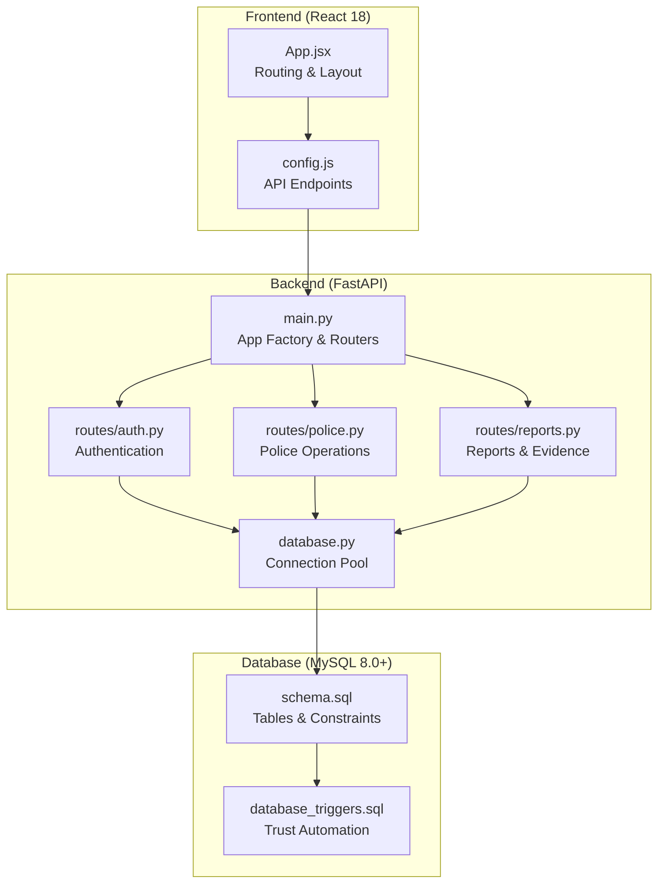
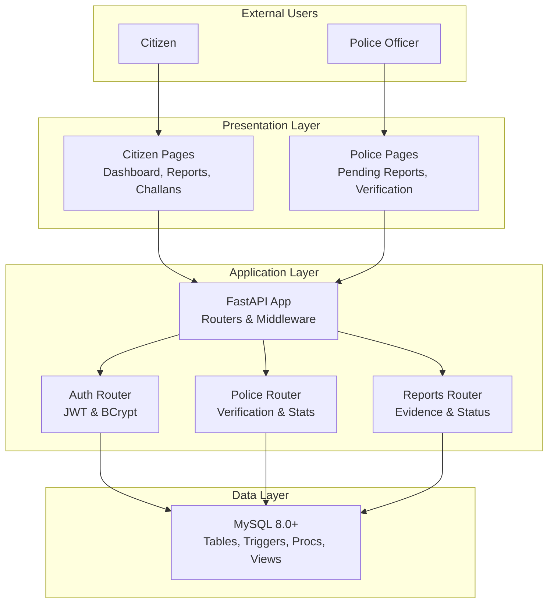
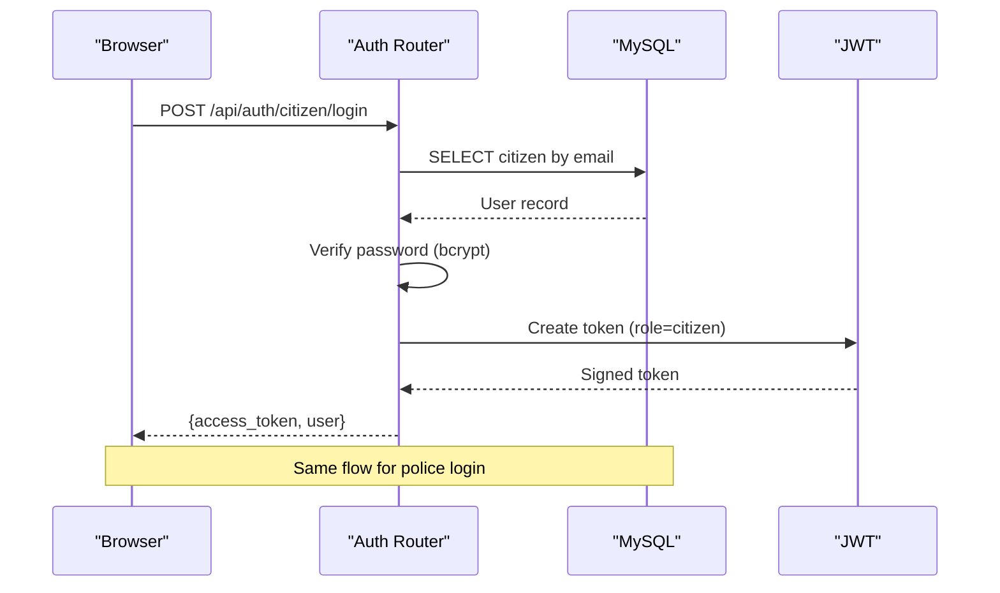
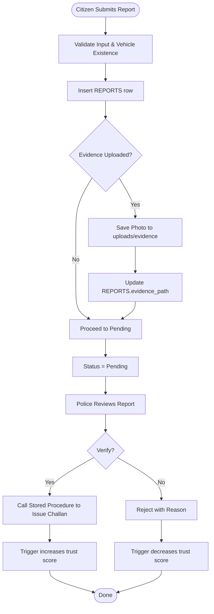
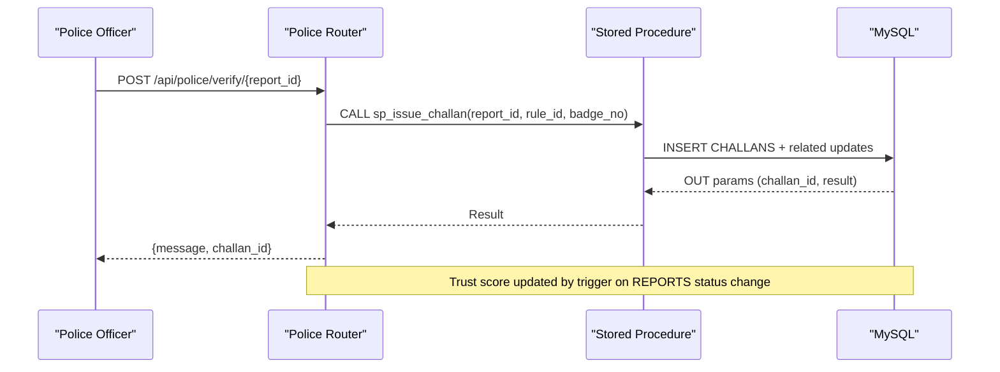
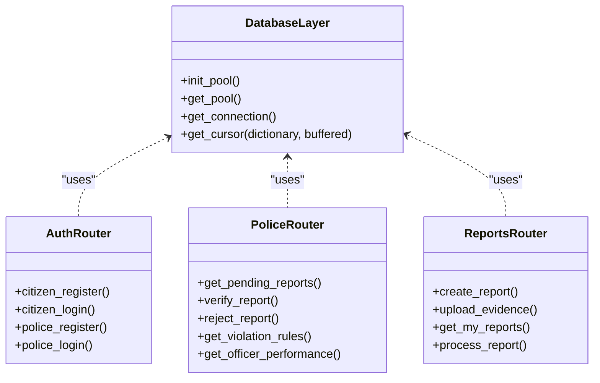
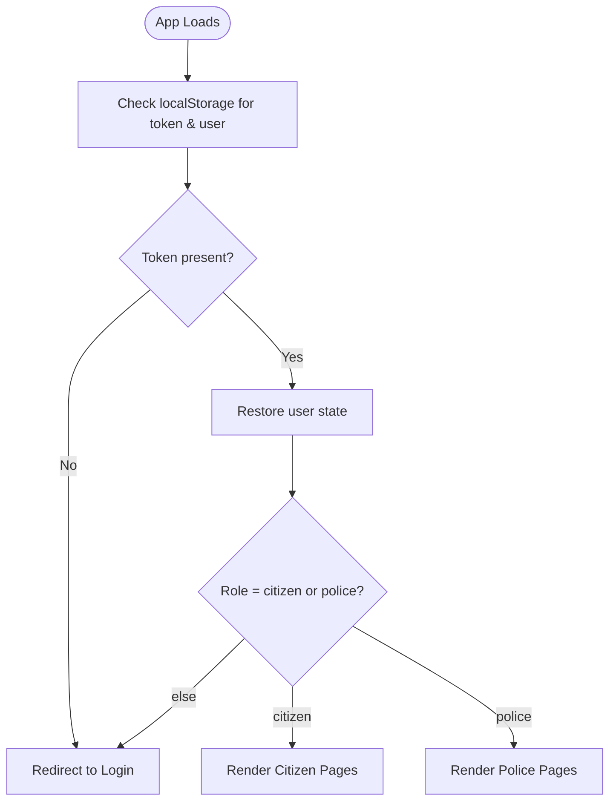
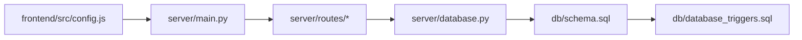

# Overall System Design

<cite>
**Referenced Files in This Document**
- [README.md](file://README.md)
- [package.json](file://package.json)
- [server/main.py](file://server/main.py)
- [frontend/package.json](file://frontend/package.json)
- [server/requirements.txt](file://server/requirements.txt)
- [db/schema.sql](file://db/schema.sql)
- [server/routes/auth.py](file://server/routes/auth.py)
- [server/routes/police.py](file://server/routes/police.py)
- [server/routes/reports.py](file://server/routes/reports.py)
- [frontend/src/App.jsx](file://frontend/src/App.jsx)
- [frontend/src/config.js](file://frontend/src/config.js)
- [server/middleware/auth.py](file://server/middleware/auth.py)
- [server/database.py](file://server/database.py)
- [db/database_triggers.sql](file://db/database_triggers.sql)
</cite>

## Table of Contents
1. [Introduction](#introduction)
2. [Project Structure](#project-structure)
3. [Core Components](#core-components)
4. [Architecture Overview](#architecture-overview)
5. [Detailed Component Analysis](#detailed-component-analysis)
6. [Dependency Analysis](#dependency-analysis)
7. [Performance Considerations](#performance-considerations)
8. [Troubleshooting Guide](#troubleshooting-guide)
9. [Conclusion](#conclusion)
10. [Appendices](#appendices)

## Introduction
This document presents the overall system design of the Traffic Violation Management System (TVMS), a Tier-1 Government/Law Enforcement platform. The system follows a clean three-tier architecture:
- Frontend: React 18 with Vite and Tailwind CSS
- Backend: FastAPI with async support and Uvicorn
- Database: MySQL 8.0+ with advanced features (triggers, stored procedures, views, temporal tables)

The system supports dual portals:
- Citizen portal for reporting violations, viewing trust scores, managing challans, and making secure payments
- Police portal for reviewing, verifying/rejecting reports, issuing challans, and monitoring performance

Technology choices emphasize reliability, scalability, and academic rigor, leveraging native MySQL capabilities and modern web frameworks.

## Project Structure
The repository is organized into distinct layers and supporting scripts:
- frontend: React SPA with routing, context providers, and UI components
- server: FastAPI application with route modules, middleware, database abstraction, and services
- db: Schema, triggers, stored procedures, and seed data
- scripts: Windows batch scripts and Python utilities for setup and verification
- root: Top-level package configuration and documentation

**Diagram sources**
- [server/main.py:50-107](file://server/main.py#L50-L107)
- [server/database.py:14-76](file://server/database.py#L14-L76)
- [server/routes/auth.py:1-744](file://server/routes/auth.py#L1-L744)
- [server/routes/police.py:1-220](file://server/routes/police.py#L1-L220)
- [server/routes/reports.py:1-563](file://server/routes/reports.py#L1-L563)
- [frontend/src/App.jsx:1-274](file://frontend/src/App.jsx#L1-L274)
- [frontend/src/config.js:1-34](file://frontend/src/config.js#L1-L34)
- [db/schema.sql:1-200](file://db/schema.sql#L1-L200)
- [db/database_triggers.sql:1-48](file://db/database_triggers.sql#L1-L48)

**Section sources**
- [README.md:45-93](file://README.md#L45-L93)
- [package.json:1-21](file://package.json#L1-L21)
- [frontend/package.json:1-30](file://frontend/package.json#L1-L30)
- [server/requirements.txt:1-13](file://server/requirements.txt#L1-L13)

## Core Components
- Frontend (React 18)
  - Routing via React Router DOM
  - Centralized API configuration
  - Role-based navigation and protected routes
- Backend (FastAPI)
  - Modular routers for authentication, reports, police operations, challans, vehicles, rules, analytics, and trust
  - Centralized CORS configuration
  - Static file serving for evidence uploads
  - Health check endpoint
- Database (MySQL 8.0+)
  - 5NF normalized schema with temporal tables and transient cleanup
  - Triggers for trust score automation
  - Stored procedures for challan generation and payment
  - Views for dashboards and analytics

Key implementation patterns:
- MVC-like separation: routes define controllers, database.py encapsulates persistence, and middleware enforces auth
- Repository pattern: database.py centralizes connection pooling and cursor management
- Observer pattern: database triggers observe report state changes to update trust scores

**Section sources**
- [frontend/src/App.jsx:1-274](file://frontend/src/App.jsx#L1-L274)
- [frontend/src/config.js:1-34](file://frontend/src/config.js#L1-L34)
- [server/main.py:50-107](file://server/main.py#L50-L107)
- [server/database.py:14-76](file://server/database.py#L14-L76)
- [db/schema.sql:26-200](file://db/schema.sql#L26-L200)
- [db/database_triggers.sql:8-35](file://db/database_triggers.sql#L8-L35)

## Architecture Overview
The system employs a clean three-tier architecture with explicit separation of concerns:
- Presentation tier: React SPA handles citizen and police UIs
- Application tier: FastAPI exposes REST endpoints with role-based access control
- Data tier: MySQL manages core entities, temporal history, and business logic via triggers and stored procedures

**Diagram sources**
- [server/main.py:77-86](file://server/main.py#L77-L86)
- [server/routes/auth.py:114-491](file://server/routes/auth.py#L114-L491)
- [server/routes/police.py:25-220](file://server/routes/police.py#L25-L220)
- [server/routes/reports.py:147-563](file://server/routes/reports.py#L147-L563)
- [db/schema.sql:26-200](file://db/schema.sql#L26-L200)

## Detailed Component Analysis

### Authentication and Authorization
The authentication system supports dual roles with JWT-based session tokens:
- Registration and login for citizens and police
- Password hashing with bcrypt
- Role-aware token claims
- Protected routes enforced by middleware

**Diagram sources**
- [server/routes/auth.py:218-293](file://server/routes/auth.py#L218-L293)
- [server/routes/auth.py:399-476](file://server/routes/auth.py#L399-L476)

**Section sources**
- [server/routes/auth.py:114-491](file://server/routes/auth.py#L114-L491)
- [server/middleware/auth.py:44-182](file://server/middleware/auth.py#L44-L182)

### Reports and Evidence Management
The reports module enables citizens to submit violation reports with optional evidence and allows police to review and act on them. It ensures data integrity and supports temporal auditing.

**Diagram sources**
- [server/routes/reports.py:147-223](file://server/routes/reports.py#L147-L223)
- [server/routes/reports.py:411-460](file://server/routes/reports.py#L411-L460)
- [server/routes/police.py:48-156](file://server/routes/police.py#L48-L156)
- [db/database_triggers.sql:8-35](file://db/database_triggers.sql#L8-L35)

**Section sources**
- [server/routes/reports.py:147-563](file://server/routes/reports.py#L147-L563)
- [server/routes/police.py:25-220](file://server/routes/police.py#L25-L220)
- [db/database_triggers.sql:8-35](file://db/database_triggers.sql#L8-L35)

### Challan Generation and Payment
Challans are generated via stored procedures, ensuring ACID compliance and preventing race conditions through row-level locking. Payments are processed with concurrency control.

**Diagram sources**
- [server/routes/police.py:48-93](file://server/routes/police.py#L48-L93)

**Section sources**
- [server/routes/police.py:48-156](file://server/routes/police.py#L48-L156)

### Database Abstraction and Connection Pooling
The backend uses a centralized database abstraction layer to manage connections efficiently and consistently across routes.

**Diagram sources**
- [server/database.py:14-76](file://server/database.py#L14-L76)
- [server/routes/auth.py:114-491](file://server/routes/auth.py#L114-L491)
- [server/routes/police.py:25-220](file://server/routes/police.py#L25-L220)
- [server/routes/reports.py:147-563](file://server/routes/reports.py#L147-L563)

**Section sources**
- [server/database.py:14-76](file://server/database.py#L14-L76)

### Frontend Routing and Role-Based Access
The frontend orchestrates role-specific navigation and persists user sessions locally.

**Diagram sources**
- [frontend/src/App.jsx:27-76](file://frontend/src/App.jsx#L27-L76)

**Section sources**
- [frontend/src/App.jsx:1-274](file://frontend/src/App.jsx#L1-L274)
- [frontend/src/config.js:1-34](file://frontend/src/config.js#L1-L34)

## Dependency Analysis
The system exhibits low coupling and high cohesion:
- Frontend depends on centralized API endpoints configuration
- Backend routes depend on the shared database abstraction
- Database encapsulates schema, triggers, and stored procedures

**Diagram sources**
- [frontend/src/config.js:1-34](file://frontend/src/config.js#L1-L34)
- [server/main.py:77-86](file://server/main.py#L77-L86)
- [server/database.py:14-76](file://server/database.py#L14-L76)
- [db/schema.sql:26-200](file://db/schema.sql#L26-L200)
- [db/database_triggers.sql:8-35](file://db/database_triggers.sql#L8-L35)

**Section sources**
- [frontend/src/config.js:1-34](file://frontend/src/config.js#L1-L34)
- [server/main.py:77-86](file://server/main.py#L77-L86)
- [server/database.py:14-76](file://server/database.py#L14-L76)

## Performance Considerations
- Connection pooling: MySQL pool with fixed size reduces connection overhead
- Async-friendly design: FastAPI supports concurrent requests
- Row-level locking: Prevents race conditions during payment processing
- Indexes and views: Optimized lookups for frequent dashboards and queries
- Static file serving: Efficient delivery of evidence images

[No sources needed since this section provides general guidance]

## Troubleshooting Guide
Common issues and resolutions:
- Backend startup failures: verify MySQL connectivity and environment variables
- Frontend cannot connect: ensure backend runs on port 5000 and Vite proxy is configured
- Database setup problems: re-run schema and trigger scripts; confirm MySQL 8.0+
- Face recognition issues: ensure webcam permissions and model downloads

**Section sources**
- [README.md:371-392](file://README.md#L371-L392)

## Conclusion
The Traffic Violation Management System demonstrates a robust, scalable, and secure three-tier architecture tailored for government law enforcement. The dual-portals design, combined with advanced database features and modern web technologies, provides a solid foundation for real-world deployment while maintaining academic rigor and extensibility.

[No sources needed since this section summarizes without analyzing specific files]

## Appendices

### System Boundaries and External Integrations
- Internal boundaries: Frontend SPA, FastAPI microservice, MySQL database
- External integrations: None required; all components self-contained
- Administrative systems: Not integrated; operates independently

[No sources needed since this section provides general guidance]

### Technology Stack Decisions
- React 18: Modern, component-based UI with strong ecosystem support
- FastAPI: High-performance async backend with automatic API docs
- MySQL 8.0+: Advanced SQL features enabling triggers, procedures, and temporal tables
- OpenCV DNN: Optional biometric enhancement for face recognition

**Section sources**
- [README.md:287-297](file://README.md#L287-L297)