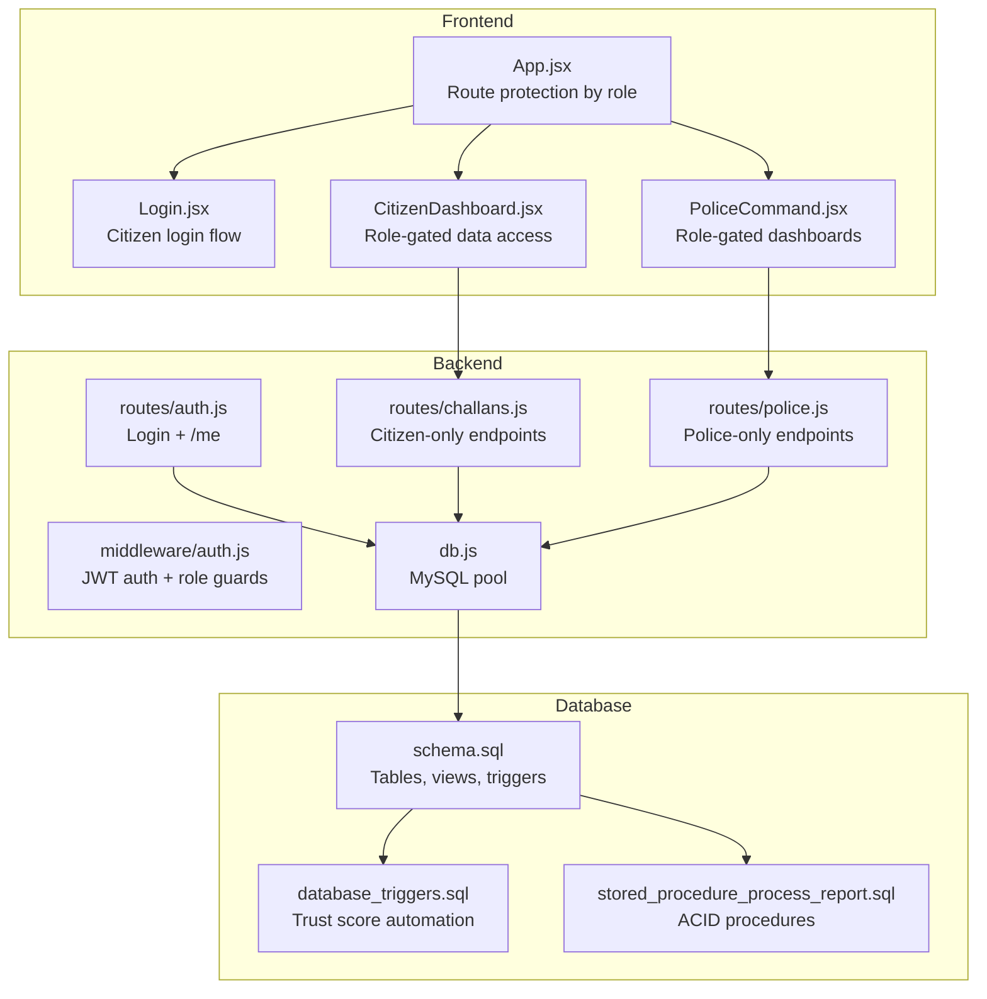
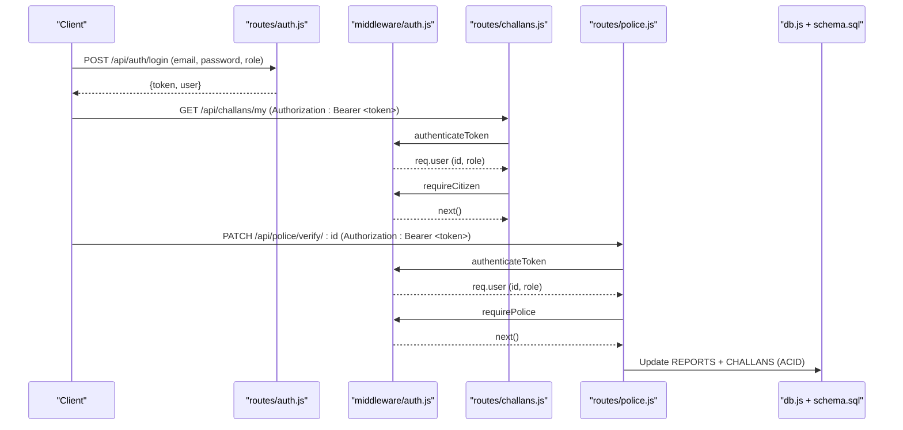
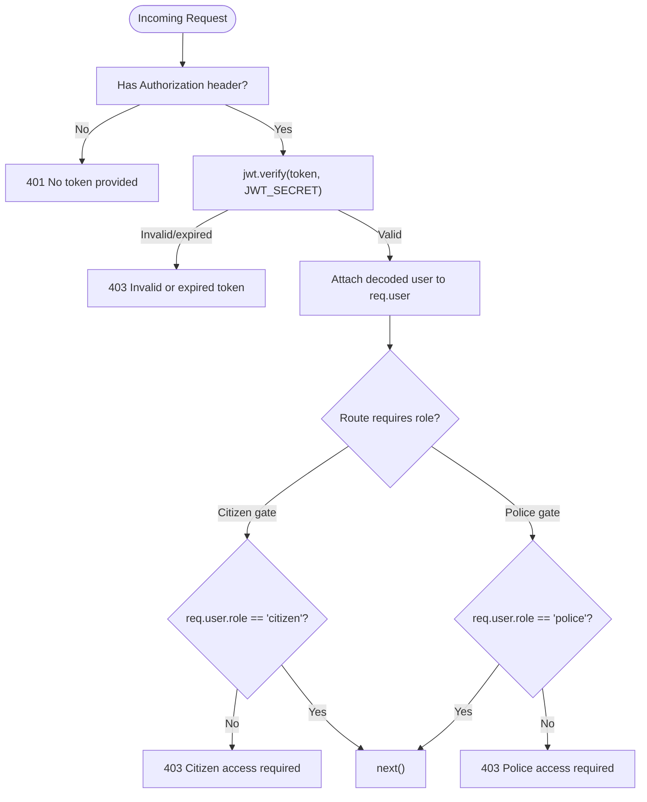
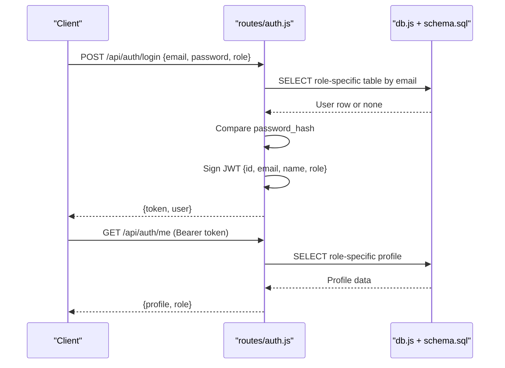
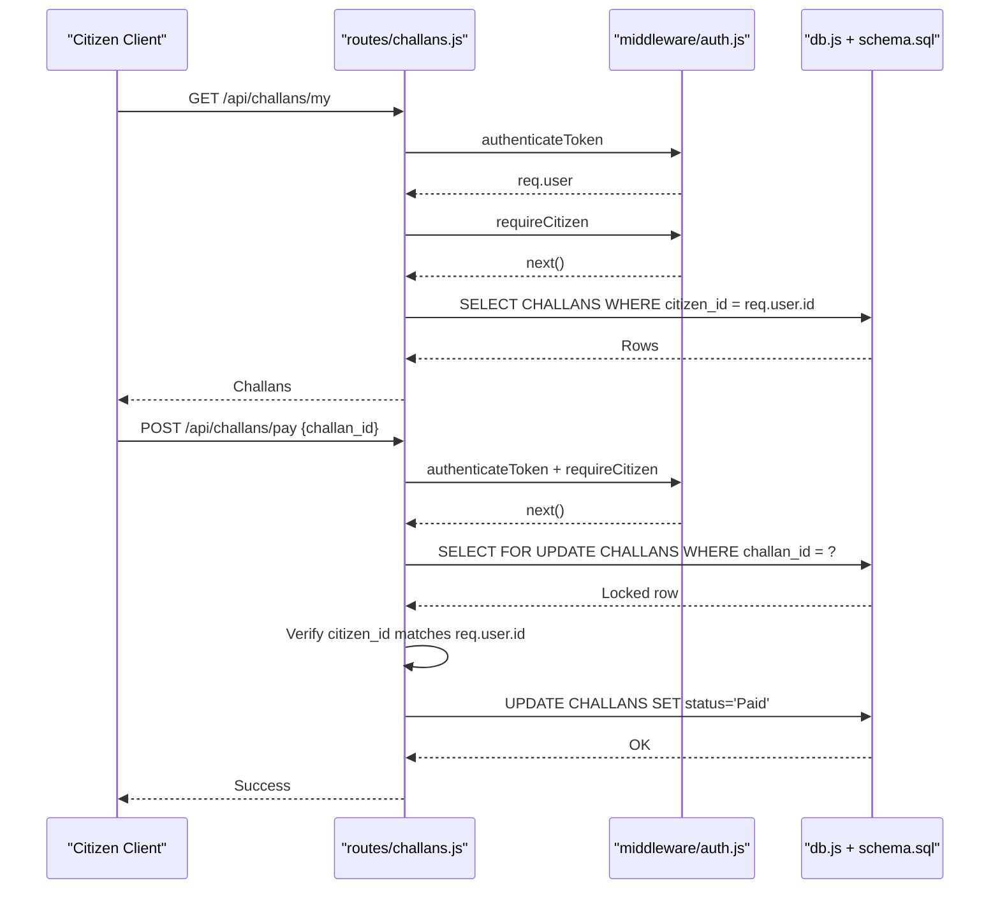
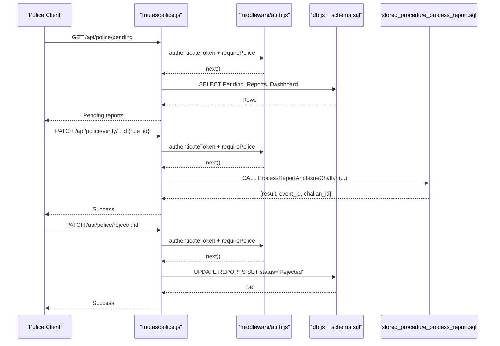
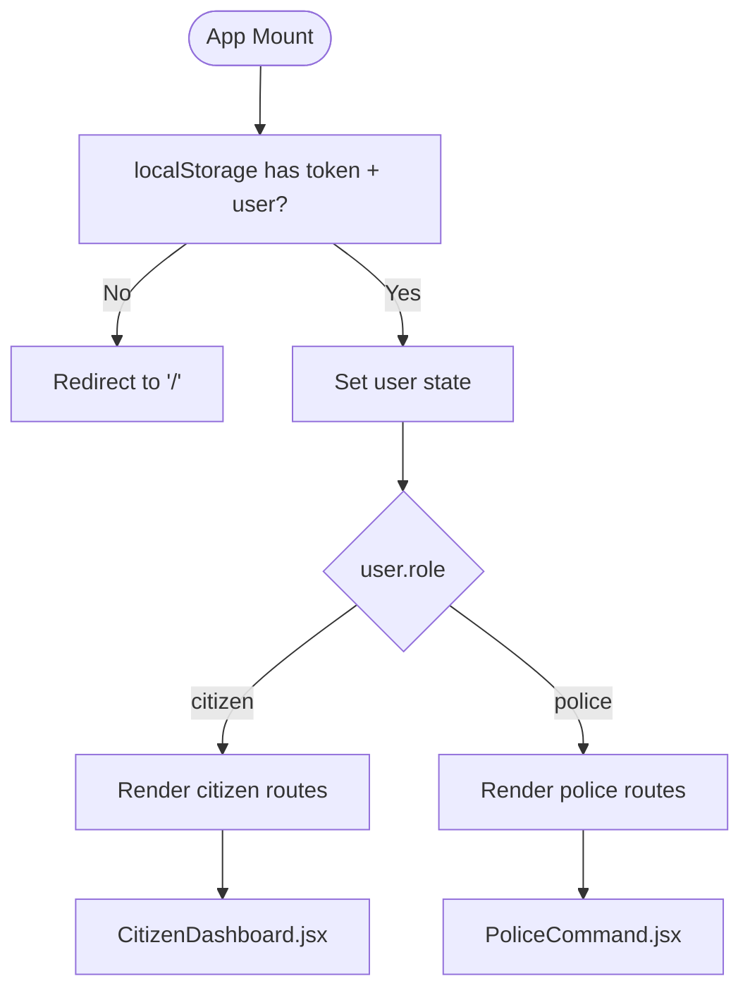
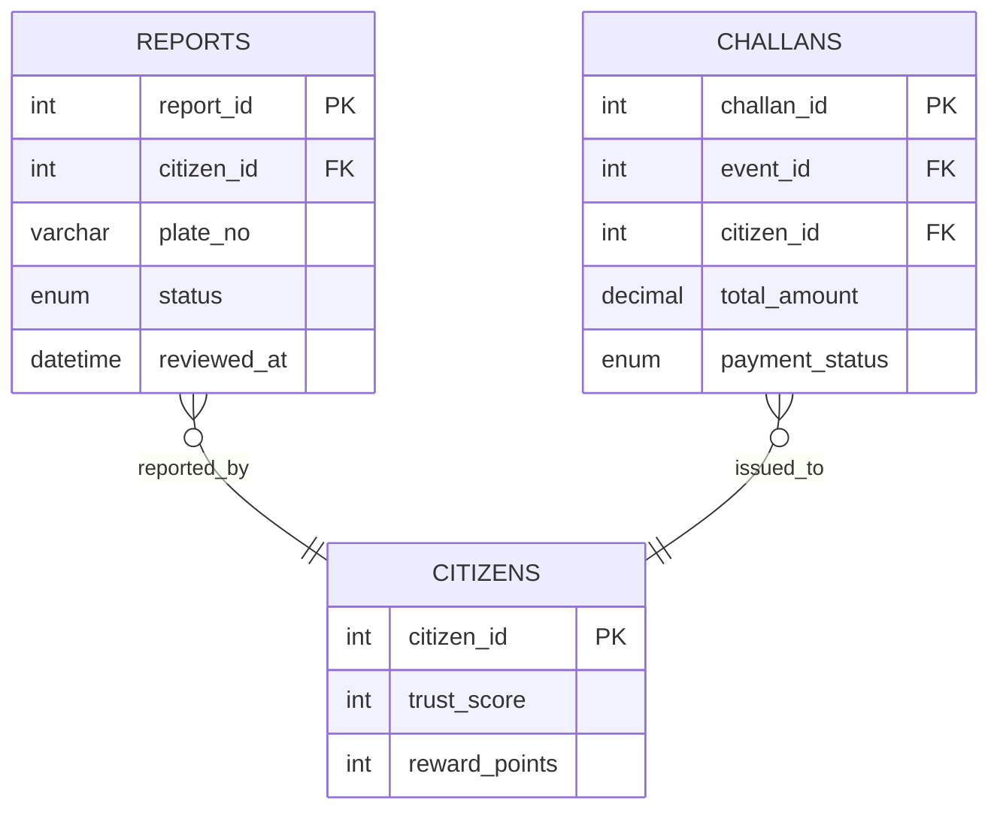
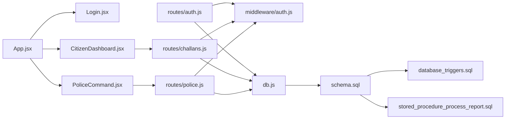

# Access Control

<cite>
**Referenced Files in This Document**
- [backend/middleware/auth.js](file://backend/middleware/auth.js)
- [backend/routes/auth.js](file://backend/routes/auth.js)
- [backend/routes/challans.js](file://backend/routes/challans.js)
- [backend/routes/police.js](file://backend/routes/police.js)
- [backend/db.js](file://backend/db.js)
- [frontend/src/App.jsx](file://frontend/src/App.jsx)
- [frontend/src/pages/Login.jsx](file://frontend/src/pages/Login.jsx)
- [frontend/src/pages/CitizenDashboard.jsx](file://frontend/src/pages/CitizenDashboard.jsx)
- [frontend/src/pages/PoliceCommand.jsx](file://frontend/src/pages/PoliceCommand.jsx)
- [db/schema.sql](file://db/schema.sql)
- [db/stored_procedure_process_report.sql](file://db/stored_procedure_process_report.sql)
- [db/database_triggers.sql](file://db/database_triggers.sql)
- [db/seed_demo_accounts.sql](file://db/seed_demo_accounts.sql)
</cite>

## Table of Contents
1. [Introduction](#introduction)
2. [Project Structure](#project-structure)
3. [Core Components](#core-components)
4. [Architecture Overview](#architecture-overview)
5. [Detailed Component Analysis](#detailed-component-analysis)
6. [Dependency Analysis](#dependency-analysis)
7. [Performance Considerations](#performance-considerations)
8. [Troubleshooting Guide](#troubleshooting-guide)
9. [Conclusion](#conclusion)
10. [Appendices](#appendices)

## Introduction
This document provides comprehensive documentation for the role-based access control (RBAC) system in the Traffic Violation Management System. It explains the citizen and police role definitions, permission matrices, and enforcement mechanisms across backend middleware, route protection, and frontend conditional rendering. It also covers session management, security boundaries, privilege escalation prevention, audit trails, and practical guidance for extending the system to support fine-grained permissions.

## Project Structure
The RBAC system spans three layers:
- Backend middleware and routes enforce authentication and role checks.
- Database schema and stored procedures enforce data-level constraints and auditability.
- Frontend routes and components conditionally render UI based on user roles.

**Diagram sources**
- [frontend/src/App.jsx:1-274](file://frontend/src/App.jsx#L1-L274)
- [frontend/src/pages/Login.jsx:1-186](file://frontend/src/pages/Login.jsx#L1-L186)
- [frontend/src/pages/CitizenDashboard.jsx:1-393](file://frontend/src/pages/CitizenDashboard.jsx#L1-L393)
- [frontend/src/pages/PoliceCommand.jsx:1-207](file://frontend/src/pages/PoliceCommand.jsx#L1-L207)
- [backend/middleware/auth.js:1-37](file://backend/middleware/auth.js#L1-L37)
- [backend/routes/auth.js:1-117](file://backend/routes/auth.js#L1-L117)
- [backend/routes/challans.js:1-101](file://backend/routes/challans.js#L1-L101)
- [backend/routes/police.js:1-109](file://backend/routes/police.js#L1-L109)
- [backend/db.js:1-26](file://backend/db.js#L1-L26)
- [db/schema.sql:1-942](file://db/schema.sql#L1-L942)
- [db/database_triggers.sql:1-48](file://db/database_triggers.sql#L1-L48)
- [db/stored_procedure_process_report.sql:1-115](file://db/stored_procedure_process_report.sql#L1-L115)

**Section sources**
- [frontend/src/App.jsx:1-274](file://frontend/src/App.jsx#L1-L274)
- [backend/middleware/auth.js:1-37](file://backend/middleware/auth.js#L1-L37)
- [backend/routes/auth.js:1-117](file://backend/routes/auth.js#L1-L117)
- [backend/routes/challans.js:1-101](file://backend/routes/challans.js#L1-L101)
- [backend/routes/police.js:1-109](file://backend/routes/police.js#L1-L109)
- [backend/db.js:1-26](file://backend/db.js#L1-L26)
- [db/schema.sql:1-942](file://db/schema.sql#L1-L942)

## Core Components
- Authentication middleware validates JWT and attaches user identity to requests.
- Role guards restrict access to routes based on user role.
- Route handlers enforce ownership and status constraints.
- Database triggers and stored procedures enforce trust scoring, audit trails, and transactional integrity.
- Frontend routes conditionally render content and protect navigation by role.

Key RBAC artifacts:
- Roles: citizen, police.
- Token payload includes id, email, name, role.
- Middleware enforces role gates for protected routes.
- Ownership checks ensure users act only on their data.
- Database-level constraints and triggers prevent privilege escalation and maintain auditability.

**Section sources**
- [backend/middleware/auth.js:1-37](file://backend/middleware/auth.js#L1-L37)
- [backend/routes/auth.js:1-117](file://backend/routes/auth.js#L1-L117)
- [backend/routes/challans.js:1-101](file://backend/routes/challans.js#L1-L101)
- [backend/routes/police.js:1-109](file://backend/routes/police.js#L1-L109)
- [db/schema.sql:1-942](file://db/schema.sql#L1-L942)
- [db/database_triggers.sql:1-48](file://db/database_triggers.sql#L1-L48)
- [db/stored_procedure_process_report.sql:1-115](file://db/stored_procedure_process_report.sql#L1-L115)

## Architecture Overview
The RBAC architecture combines JWT-based session management with layered enforcement:
- Transport-level: Authorization header carries bearer token.
- Application-level: Middleware decodes token and enforces role gates.
- Route-level: Controllers apply ownership and status checks.
- Data-level: Triggers and stored procedures enforce business rules and audit trails.

**Diagram sources**
- [backend/routes/auth.js:1-117](file://backend/routes/auth.js#L1-L117)
- [backend/middleware/auth.js:1-37](file://backend/middleware/auth.js#L1-L37)
- [backend/routes/challans.js:1-101](file://backend/routes/challans.js#L1-L101)
- [backend/routes/police.js:1-109](file://backend/routes/police.js#L1-L109)
- [backend/db.js:1-26](file://backend/db.js#L1-L26)
- [db/schema.sql:1-942](file://db/schema.sql#L1-L942)

## Detailed Component Analysis

### Backend Middleware: JWT and Role Guards
- authenticateToken extracts Bearer token, verifies signature, and attaches decoded user to req.user.
- requireCitizen and requirePolice compare req.user.role to enforced role and short-circuit with 403 if mismatch.
- JWT_SECRET is loaded from environment; tokens expire after 8 hours.

**Diagram sources**
- [backend/middleware/auth.js:1-37](file://backend/middleware/auth.js#L1-L37)

**Section sources**
- [backend/middleware/auth.js:1-37](file://backend/middleware/auth.js#L1-L37)

### Authentication Flow: Login and User Info
- POST /api/auth/login accepts email, password, and role, validates credentials against respective tables, and issues a signed JWT with id, email, name, role.
- GET /api/auth/me verifies the token and returns user profile based on role.

**Diagram sources**
- [backend/routes/auth.js:1-117](file://backend/routes/auth.js#L1-L117)
- [backend/db.js:1-26](file://backend/db.js#L1-L26)
- [db/schema.sql:1-942](file://db/schema.sql#L1-L942)

**Section sources**
- [backend/routes/auth.js:1-117](file://backend/routes/auth.js#L1-L117)
- [backend/db.js:1-26](file://backend/db.js#L1-L26)
- [db/schema.sql:1-942](file://db/schema.sql#L1-L942)

### Citizen Access Control: Challans and Payments
- GET /api/challans/my enforces authenticateToken + requireCitizen and filters by req.user.id.
- POST /api/challans/pay enforces authenticateToken + requireCitizen, performs row-level locking, verifies ownership, and updates payment status atomically.

**Diagram sources**
- [backend/routes/challans.js:1-101](file://backend/routes/challans.js#L1-L101)
- [backend/middleware/auth.js:1-37](file://backend/middleware/auth.js#L1-L37)
- [backend/db.js:1-26](file://backend/db.js#L1-L26)
- [db/schema.sql:1-942](file://db/schema.sql#L1-L942)

**Section sources**
- [backend/routes/challans.js:1-101](file://backend/routes/challans.js#L1-L101)
- [backend/middleware/auth.js:1-37](file://backend/middleware/auth.js#L1-L37)
- [backend/db.js:1-26](file://backend/db.js#L1-L26)
- [db/schema.sql:1-942](file://db/schema.sql#L1-L942)

### Police Access Control: Reports and Challan Issuance
- GET /api/police/pending enforces authenticateToken + requirePolice and returns a dashboard view of pending reports.
- PATCH /api/police/verify/:id enforces authenticateToken + requirePolice, validates rule_id, and issues a challan via stored procedure with full transaction safety.
- PATCH /api/police/reject/:id enforces authenticateToken + requirePolice and rejects a report.

**Diagram sources**
- [backend/routes/police.js:1-109](file://backend/routes/police.js#L1-L109)
- [backend/middleware/auth.js:1-37](file://backend/middleware/auth.js#L1-L37)
- [backend/db.js:1-26](file://backend/db.js#L1-L26)
- [db/stored_procedure_process_report.sql:1-115](file://db/stored_procedure_process_report.sql#L1-L115)

**Section sources**
- [backend/routes/police.js:1-109](file://backend/routes/police.js#L1-L109)
- [backend/middleware/auth.js:1-37](file://backend/middleware/auth.js#L1-L37)
- [backend/db.js:1-26](file://backend/db.js#L1-L26)
- [db/stored_procedure_process_report.sql:1-115](file://db/stored_procedure_process_report.sql#L1-L115)

### Frontend Access Control: Conditional Rendering and Navigation
- App routes enforce role-based visibility and redirects:
  - Unauthenticated users are redirected to login.
  - Authenticated users are routed to appropriate dashboards.
  - Role-gated routes (e.g., /dashboard for citizens, /police for officers) are protected.
- Login page posts to the backend login endpoint and persists token and user profile in localStorage.
- Dashboard pages fetch role-specific data and render accordingly.

**Diagram sources**
- [frontend/src/App.jsx:1-274](file://frontend/src/App.jsx#L1-L274)
- [frontend/src/pages/Login.jsx:1-186](file://frontend/src/pages/Login.jsx#L1-L186)
- [frontend/src/pages/CitizenDashboard.jsx:1-393](file://frontend/src/pages/CitizenDashboard.jsx#L1-L393)
- [frontend/src/pages/PoliceCommand.jsx:1-207](file://frontend/src/pages/PoliceCommand.jsx#L1-L207)

**Section sources**
- [frontend/src/App.jsx:1-274](file://frontend/src/App.jsx#L1-L274)
- [frontend/src/pages/Login.jsx:1-186](file://frontend/src/pages/Login.jsx#L1-L186)
- [frontend/src/pages/CitizenDashboard.jsx:1-393](file://frontend/src/pages/CitizenDashboard.jsx#L1-L393)
- [frontend/src/pages/PoliceCommand.jsx:1-207](file://frontend/src/pages/PoliceCommand.jsx#L1-L207)

### Database-Level Enforcement: Triggers, Views, and Stored Procedures
- Triggers automatically adjust citizen trust scores on report status changes.
- Views provide role-specific dashboards (e.g., Pending_Reports_Dashboard).
- Stored procedures encapsulate ACID transactions for report processing and challan issuance, preventing race conditions and ensuring audit trails.

**Diagram sources**
- [db/schema.sql:1-942](file://db/schema.sql#L1-L942)
- [db/database_triggers.sql:1-48](file://db/database_triggers.sql#L1-L48)
- [db/stored_procedure_process_report.sql:1-115](file://db/stored_procedure_process_report.sql#L1-L115)

**Section sources**
- [db/schema.sql:1-942](file://db/schema.sql#L1-L942)
- [db/database_triggers.sql:1-48](file://db/database_triggers.sql#L1-L48)
- [db/stored_procedure_process_report.sql:1-115](file://db/stored_procedure_process_report.sql#L1-L115)

## Dependency Analysis
- Routes depend on middleware for authentication and role enforcement.
- Route handlers depend on the database pool for data access.
- Database operations rely on schema, triggers, and stored procedures for consistency and auditability.
- Frontend depends on backend endpoints and local storage for session persistence.

**Diagram sources**
- [frontend/src/App.jsx:1-274](file://frontend/src/App.jsx#L1-L274)
- [frontend/src/pages/Login.jsx:1-186](file://frontend/src/pages/Login.jsx#L1-L186)
- [frontend/src/pages/CitizenDashboard.jsx:1-393](file://frontend/src/pages/CitizenDashboard.jsx#L1-L393)
- [frontend/src/pages/PoliceCommand.jsx:1-207](file://frontend/src/pages/PoliceCommand.jsx#L1-L207)
- [backend/routes/auth.js:1-117](file://backend/routes/auth.js#L1-L117)
- [backend/routes/challans.js:1-101](file://backend/routes/challans.js#L1-L101)
- [backend/routes/police.js:1-109](file://backend/routes/police.js#L1-L109)
- [backend/middleware/auth.js:1-37](file://backend/middleware/auth.js#L1-L37)
- [backend/db.js:1-26](file://backend/db.js#L1-L26)
- [db/schema.sql:1-942](file://db/schema.sql#L1-L942)
- [db/database_triggers.sql:1-48](file://db/database_triggers.sql#L1-L48)
- [db/stored_procedure_process_report.sql:1-115](file://db/stored_procedure_process_report.sql#L1-L115)

**Section sources**
- [backend/middleware/auth.js:1-37](file://backend/middleware/auth.js#L1-L37)
- [backend/routes/auth.js:1-117](file://backend/routes/auth.js#L1-L117)
- [backend/routes/challans.js:1-101](file://backend/routes/challans.js#L1-L101)
- [backend/routes/police.js:1-109](file://backend/routes/police.js#L1-L109)
- [backend/db.js:1-26](file://backend/db.js#L1-L26)
- [db/schema.sql:1-942](file://db/schema.sql#L1-L942)
- [db/database_triggers.sql:1-48](file://db/database_triggers.sql#L1-L48)
- [db/stored_procedure_process_report.sql:1-115](file://db/stored_procedure_process_report.sql#L1-L115)

## Performance Considerations
- JWT verification is lightweight; ensure minimal middleware overhead.
- Use database indexes on foreign keys and frequently filtered columns (e.g., citizen_id, status).
- Stored procedures and triggers centralize business logic and reduce client-side branching.
- Row-level locks in payment and report processing minimize contention while preserving correctness.

[No sources needed since this section provides general guidance]

## Troubleshooting Guide
Common access control issues and resolutions:
- 401 Access denied. No token provided:
  - Ensure Authorization header is present and formatted as Bearer <token>.
  - Verify frontend stores token in localStorage after login and attaches it to subsequent requests.
- 403 Invalid or expired token:
  - Confirm JWT_SECRET consistency and token expiration window.
  - Re-authenticate the user to obtain a fresh token.
- 403 Citizen access required / 403 Police access required:
  - Confirm login role matches the route’s required role.
  - Check that the token payload includes the correct role field.
- 403 You are not authorized to pay this challan:
  - Verify ownership check in payment route matches req.user.id with the challan’s citizen_id.
- 404 Report not found or already processed:
  - Ensure report status is Pending before attempting verification or rejection.
- Trust score not updating:
  - Confirm triggers fire on REPORTS status transitions and that the status change path is correct.

**Section sources**
- [backend/middleware/auth.js:1-37](file://backend/middleware/auth.js#L1-L37)
- [backend/routes/challans.js:1-101](file://backend/routes/challans.js#L1-L101)
- [backend/routes/police.js:1-109](file://backend/routes/police.js#L1-L109)
- [db/database_triggers.sql:1-48](file://db/database_triggers.sql#L1-L48)

## Conclusion
The system implements a robust RBAC model combining JWT-based session management, middleware role gates, route-level ownership checks, and database-level triggers and stored procedures. Frontend route protection ensures users only access permitted areas. Together, these layers prevent privilege escalation, maintain auditability, and provide a secure foundation for future extensions.

[No sources needed since this section summarizes without analyzing specific files]

## Appendices

### Permission Matrices
- Citizen
  - Access to own challans and reports.
  - Can pay challans with row-level locking.
  - Cannot access police-only endpoints.
- Police
  - Access to pending reports dashboard.
  - Can verify/reject reports and issue challans via stored procedures.
  - Cannot access citizen-only endpoints.

**Section sources**
- [backend/routes/challans.js:1-101](file://backend/routes/challans.js#L1-L101)
- [backend/routes/police.js:1-109](file://backend/routes/police.js#L1-L109)
- [db/stored_procedure_process_report.sql:1-115](file://db/stored_procedure_process_report.sql#L1-L115)

### Security Boundaries and Audit Trail
- Token-based session boundary separates transport and application layers.
- Database triggers and stored procedures enforce business rules and maintain audit trails.
- Demo seed accounts and schema define baseline entities and constraints.

**Section sources**
- [db/schema.sql:1-942](file://db/schema.sql#L1-L942)
- [db/database_triggers.sql:1-48](file://db/database_triggers.sql#L1-L48)
- [db/stored_procedure_process_report.sql:1-115](file://db/stored_procedure_process_report.sql#L1-L115)
- [db/seed_demo_accounts.sql:1-175](file://db/seed_demo_accounts.sql#L1-L175)

### Extending to Fine-Grained Permissions
Guidelines for extending the RBAC system:
- Introduce permission flags or scopes in the token payload and enforce them in middleware.
- Add resource-level attributes (e.g., department, station) and gate access based on claims.
- Implement policy evaluation functions to combine roles and permissions.
- Centralize permission checks in a shared authorization module.
- Add audit logging for permission decisions and sensitive actions.

[No sources needed since this section provides general guidance]