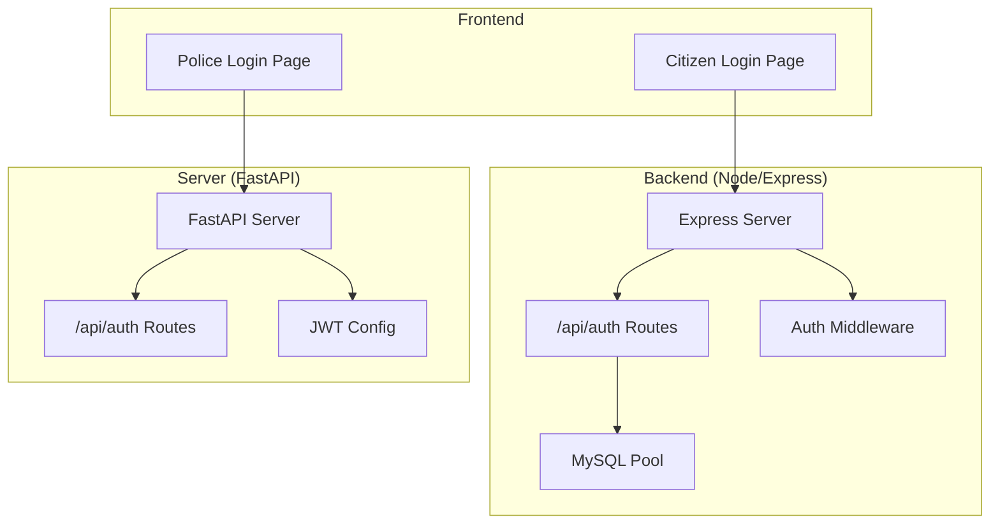
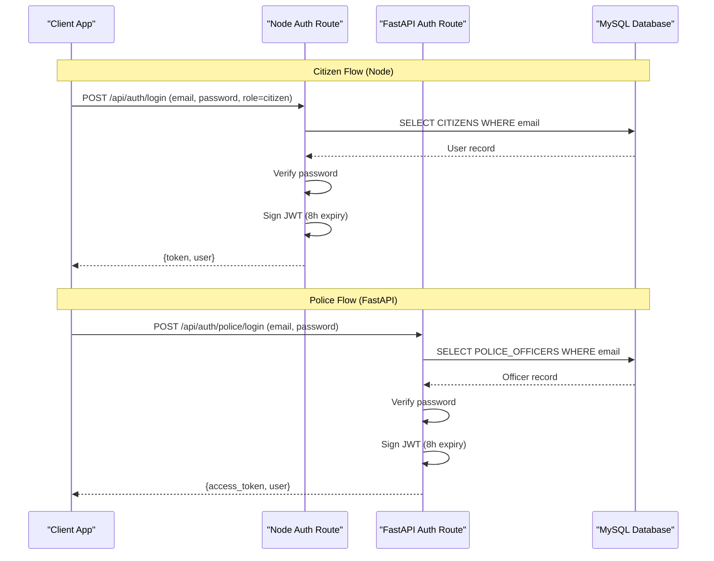
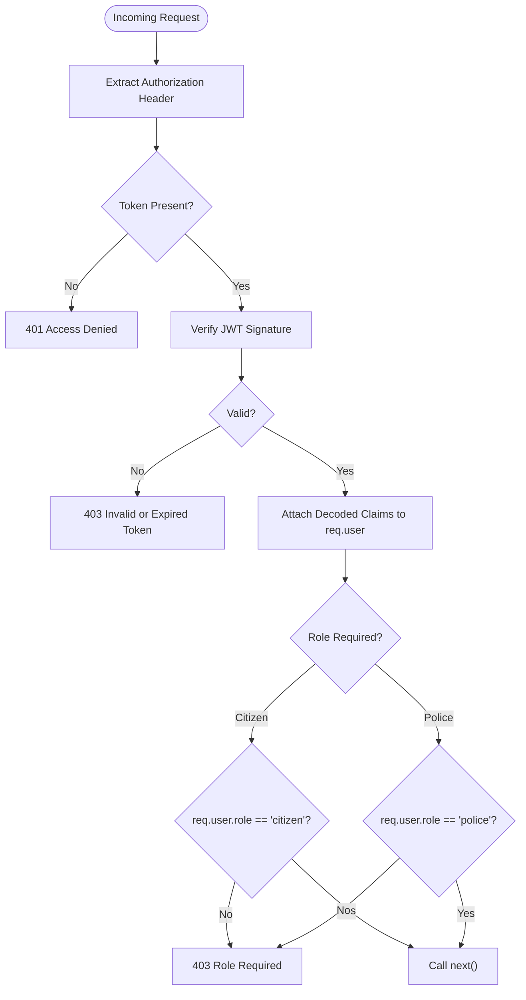
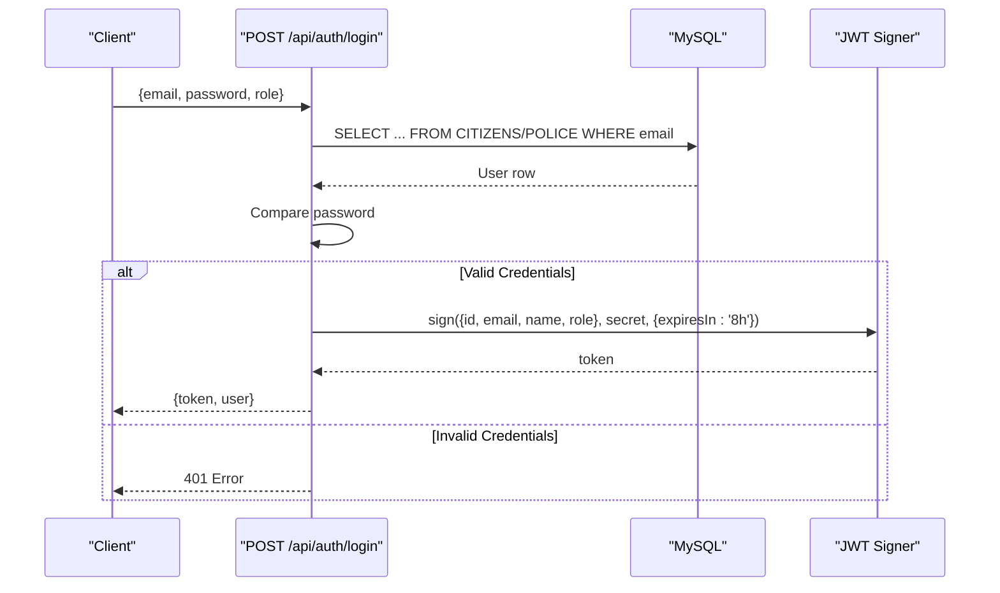
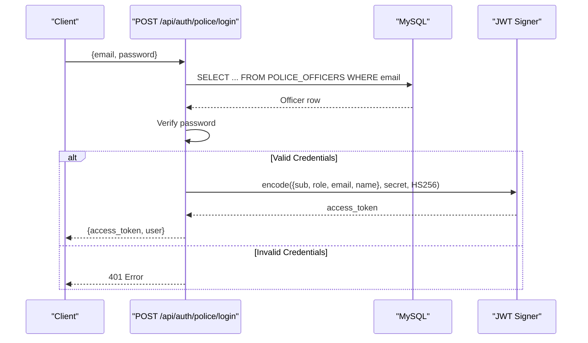
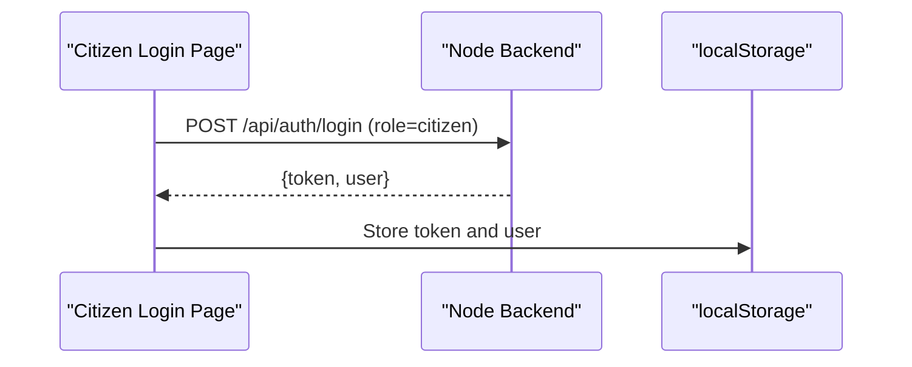
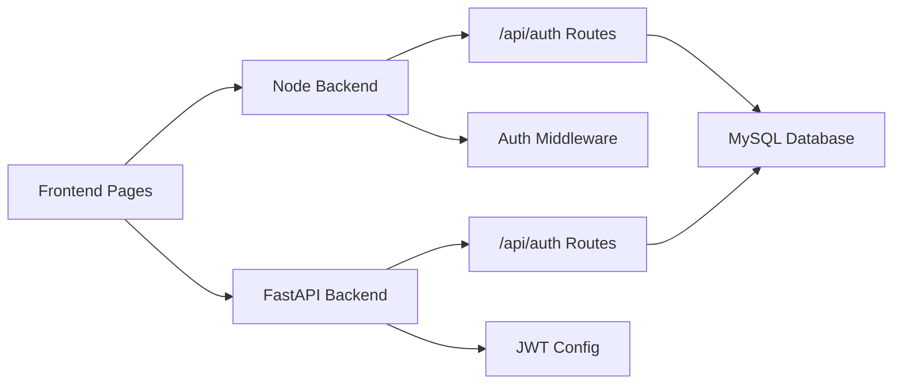

# Authentication System

<cite>
**Referenced Files in This Document**
- [auth.js](file://backend/middleware/auth.js)
- [auth.js](file://backend/routes/auth.js)
- [server.js](file://backend/server.js)
- [db.js](file://backend/db.js)
- [auth.py](file://server/routes/auth.py)
- [main.py](file://server/main.py)
- [config.py](file://server/config.py)
- [Login.jsx](file://frontend/src/pages/Login.jsx)
- [PoliceLogin.jsx](file://frontend/src/pages/PoliceLogin.jsx)
- [schema.sql](file://db/schema.sql)
</cite>

## Table of Contents
1. [Introduction](#introduction)
2. [Project Structure](#project-structure)
3. [Core Components](#core-components)
4. [Architecture Overview](#architecture-overview)
5. [Detailed Component Analysis](#detailed-component-analysis)
6. [Dependency Analysis](#dependency-analysis)
7. [Performance Considerations](#performance-considerations)
8. [Troubleshooting Guide](#troubleshooting-guide)
9. [Conclusion](#conclusion)
10. [Appendices](#appendices)

## Introduction
This document describes the dual-layer authentication system for the Traffic Violation Management System. It covers JWT-based authentication for two distinct user roles: citizens and police officers. The system provides:
- Role-aware login and token issuance
- Centralized middleware for token validation and role-based access control
- Separate authentication flows for citizen and police portals
- Token structure, expiration handling, and error responses
- Security best practices for token storage and transmission
- Troubleshooting guidance and production deployment considerations

## Project Structure
The authentication system spans three layers:
- Backend (Node.js/Express): Provides citizen and shared authentication routes and middleware
- Server (Python/FastAPI): Provides police authentication routes and profile management
- Frontend (React): Implements login flows for both portals and stores tokens locally

**Diagram sources**
- [server.js:1-42](file://backend/server.js#L1-L42)
- [auth.js:1-117](file://backend/routes/auth.js#L1-L117)
- [auth.js:1-37](file://backend/middleware/auth.js#L1-L37)
- [db.js:1-26](file://backend/db.js#L1-L26)
- [main.py:1-107](file://server/main.py#L1-L107)
- [auth.py:1-744](file://server/routes/auth.py#L1-L744)
- [config.py:1-41](file://server/config.py#L1-L41)

**Section sources**
- [server.js:1-42](file://backend/server.js#L1-L42)
- [main.py:1-107](file://server/main.py#L1-L107)

## Core Components
- Authentication middleware (Node/Express):
  - Validates bearer tokens and attaches user claims to requests
  - Enforces role-based access control for citizen and police
- Authentication routes (Node/Express):
  - Single login endpoint supporting role selection
  - Profile retrieval endpoint using JWT
- Authentication routes (FastAPI):
  - Separate login endpoints for citizens and police
  - Profile retrieval and update endpoints
- Frontend login pages:
  - Citizen portal login posts to the Node backend
  - Police portal login posts to the FastAPI backend

Key JWT configuration differences:
- Node backend: secret via environment variable, 8-hour expiry
- FastAPI: embedded secret and 8-hour expiry in code; settings class defines secret and expiry

**Section sources**
- [auth.js:1-37](file://backend/middleware/auth.js#L1-L37)
- [auth.js:1-117](file://backend/routes/auth.js#L1-L117)
- [auth.py:1-744](file://server/routes/auth.py#L1-L744)
- [config.py:18-22](file://server/config.py#L18-L22)
- [Login.jsx:26-68](file://frontend/src/pages/Login.jsx#L26-L68)
- [PoliceLogin.jsx:25-67](file://frontend/src/pages/PoliceLogin.jsx#L25-L67)

## Architecture Overview
The system implements a dual-layer authentication architecture:
- Citizen authentication: Node/Express backend handles login and token issuance; middleware enforces role checks
- Police authentication: FastAPI backend handles login and token issuance; middleware enforces role checks
- Shared database: Both backends connect to the same MySQL schema

**Diagram sources**
- [auth.js:9-76](file://backend/routes/auth.js#L9-L76)
- [auth.py:399-491](file://server/routes/auth.py#L399-L491)
- [schema.sql:26-43](file://db/schema.sql#L26-L43)
- [schema.sql:70-82](file://db/schema.sql#L70-L82)

## Detailed Component Analysis

### Node/Express Authentication Middleware
The middleware provides:
- Token extraction from Authorization header
- JWT verification using a secret from environment
- Role enforcement helpers for citizen and police

**Diagram sources**
- [auth.js:5-34](file://backend/middleware/auth.js#L5-L34)

**Section sources**
- [auth.js:1-37](file://backend/middleware/auth.js#L1-L37)

### Node/Express Authentication Routes
- POST /api/auth/login
  - Accepts email, password, and role
  - Validates credentials against CITIZENS or POLICE tables
  - Issues JWT with 8-hour expiry
  - Returns token and user profile (role-specific fields included)
- GET /api/auth/me
  - Verifies token and loads user profile from database

**Diagram sources**
- [auth.js:9-76](file://backend/routes/auth.js#L9-L76)

**Section sources**
- [auth.js:1-117](file://backend/routes/auth.js#L1-L117)
- [db.js:1-26](file://backend/db.js#L1-L26)

### FastAPI Authentication Routes
- POST /api/auth/citizen/login
  - Validates credentials against CITIZENS
  - Issues JWT with 8-hour expiry
  - Returns access_token and user profile
- POST /api/auth/police/login
  - Validates credentials against POLICE_OFFICERS
  - Issues JWT with 8-hour expiry
  - Returns access_token and user profile
- GET /api/auth/profile
  - Validates Bearer token and returns user profile from database

**Diagram sources**
- [auth.py:399-491](file://server/routes/auth.py#L399-L491)

**Section sources**
- [auth.py:1-744](file://server/routes/auth.py#L1-L744)
- [config.py:18-22](file://server/config.py#L18-L22)

### Frontend Authentication Flows
- Citizen login page posts to Node backend login endpoint and stores access_token in localStorage
- Police login page posts to FastAPI login endpoint and stores access_token in localStorage

**Diagram sources**
- [Login.jsx:26-68](file://frontend/src/pages/Login.jsx#L26-L68)

**Section sources**
- [Login.jsx:1-186](file://frontend/src/pages/Login.jsx#L1-L186)
- [PoliceLogin.jsx:1-186](file://frontend/src/pages/PoliceLogin.jsx#L1-L186)

## Dependency Analysis
- Backend server mounts auth routes and middleware
- Backend auth routes depend on database pool and JWT secret
- FastAPI server mounts auth routes and reads JWT configuration from settings
- Frontend depends on backend endpoints for authentication

**Diagram sources**
- [server.js:5-26](file://backend/server.js#L5-L26)
- [main.py:77-86](file://server/main.py#L77-L86)
- [auth.js:1-117](file://backend/routes/auth.js#L1-L117)
- [auth.py:1-744](file://server/routes/auth.py#L1-L744)
- [db.js:1-26](file://backend/db.js#L1-L26)

**Section sources**
- [server.js:1-42](file://backend/server.js#L1-L42)
- [main.py:1-107](file://server/main.py#L1-L107)

## Performance Considerations
- Token verification is CPU-bound; keep secrets secure and avoid frequent re-signing
- Use short expirations (as implemented) to reduce risk window
- Offload password hashing to thread pools (already handled in FastAPI)
- Ensure database connections are pooled and monitored

## Troubleshooting Guide
Common issues and resolutions:
- 401 No token provided
  - Ensure Authorization header is sent with "Bearer <token>"
- 401 Invalid credentials
  - Verify email/password correctness and role selection
- 403 Invalid or expired token
  - Regenerate token after expiration (8 hours)
- 403 Role required
  - Use appropriate endpoint for role (citizen vs police)
- 404 User not found
  - Occurs when token payload subject not present in database
- 500 Server errors
  - Check backend logs and database connectivity

Security best practices:
- Never log raw tokens
- Use HTTPS in production
- Rotate JWT secrets regularly
- Enforce CSRF protections at the application level
- Limit token scope and refresh tokens if needed

**Section sources**
- [auth.js:9-19](file://backend/middleware/auth.js#L9-L19)
- [auth.js:37-47](file://backend/routes/auth.js#L37-L47)
- [auth.py:580-589](file://server/routes/auth.py#L580-L589)

## Conclusion
The dual-layer authentication system cleanly separates citizen and police authentication while sharing a common database and JWT-based session model. The Node/Express backend supports a unified login endpoint with role selection, while the FastAPI backend provides dedicated endpoints for police. Both systems enforce role-based access control and use short-lived tokens to minimize risk. Production readiness requires environment-based secrets, HTTPS, and robust error handling.

## Appendices

### Token Structure and Expiration
- Node backend:
  - Payload includes id, email, name, role
  - Secret configurable via environment variable
  - Expiry: 8 hours
- FastAPI backend:
  - Payload includes sub, role, email, name
  - Secret configured in settings class
  - Expiry: 8 hours

**Section sources**
- [auth.js:49-58](file://backend/routes/auth.js#L49-L58)
- [auth.py:452-459](file://server/routes/auth.py#L452-L459)
- [config.py:18-22](file://server/config.py#L18-L22)

### Authentication Endpoints Summary
- Node backend:
  - POST /api/auth/login (role=citizen|police)
  - GET /api/auth/me
- FastAPI backend:
  - POST /api/auth/citizen/login
  - POST /api/auth/police/login
  - GET /api/auth/profile

**Section sources**
- [auth.js:9-114](file://backend/routes/auth.js#L9-L114)
- [auth.py:218-491](file://server/routes/auth.py#L218-L491)

### Database Schema Notes
- CITIZENS table contains password_hash, trust_score, and account_status
- POLICE_OFFICERS table contains password_hash and is_active
- ACTIVE_SESSIONS table exists for session management (not used by JWT)

**Section sources**
- [schema.sql:26-43](file://db/schema.sql#L26-L43)
- [schema.sql:70-82](file://db/schema.sql#L70-L82)
- [schema.sql:245-256](file://db/schema.sql#L245-L256)