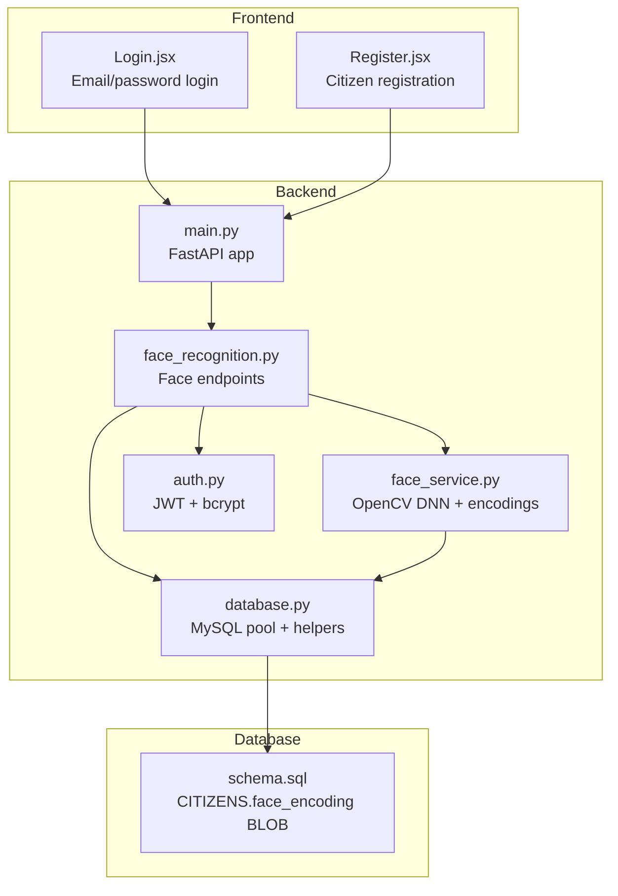
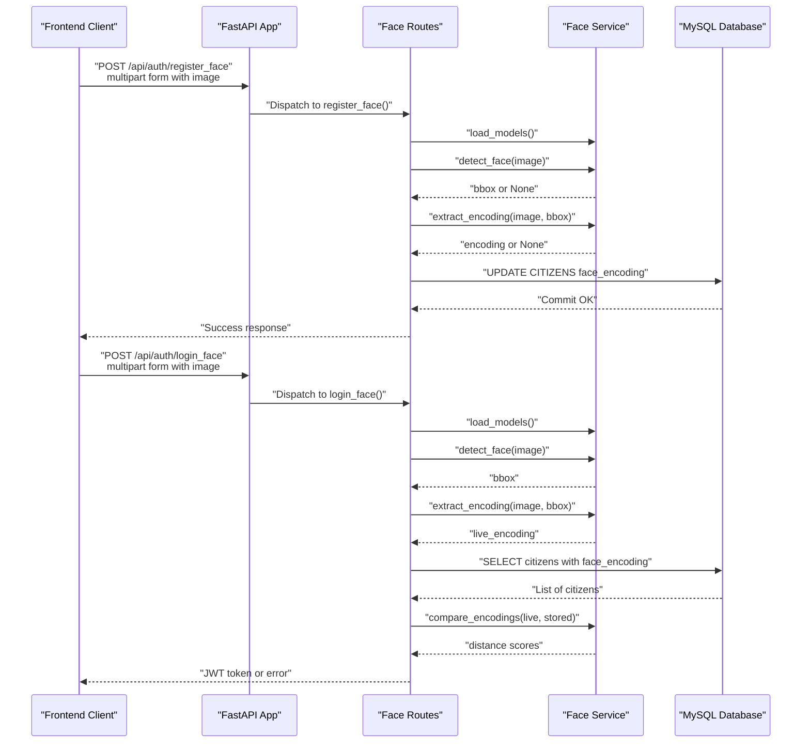
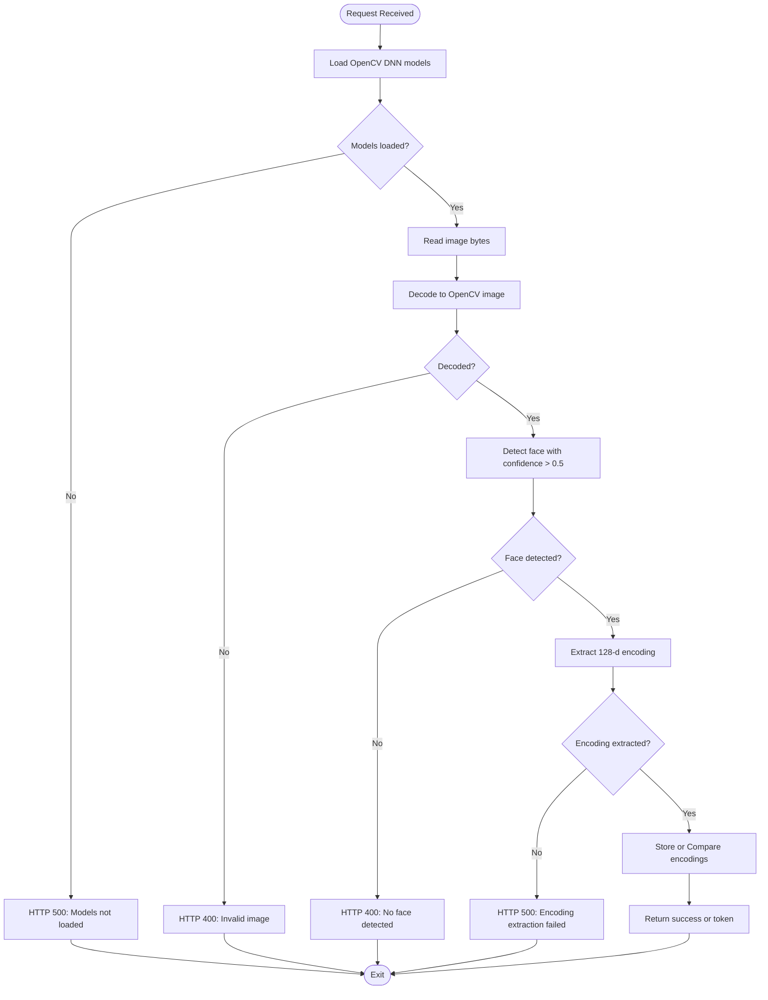
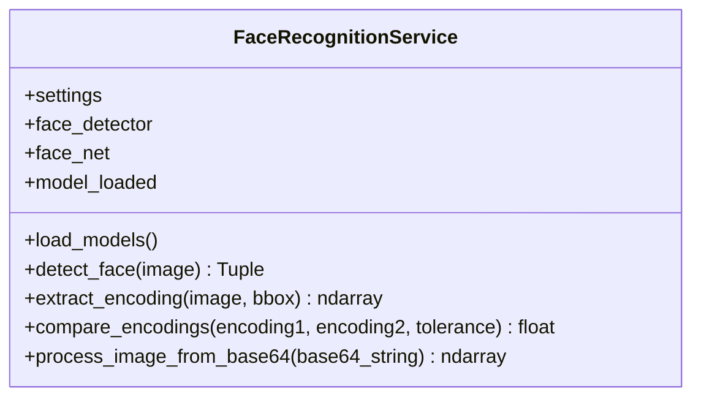
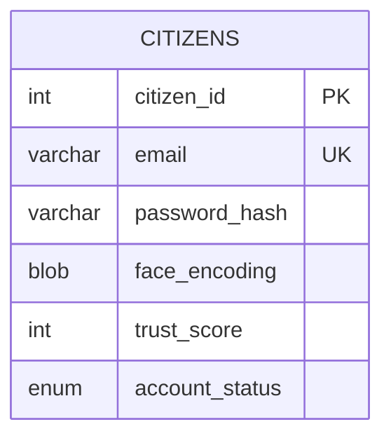
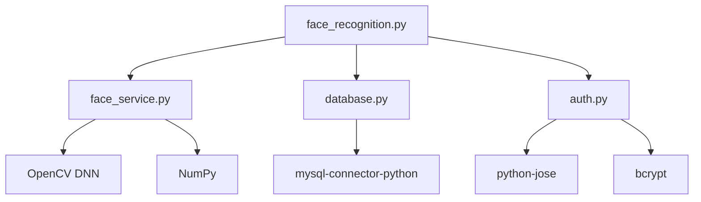
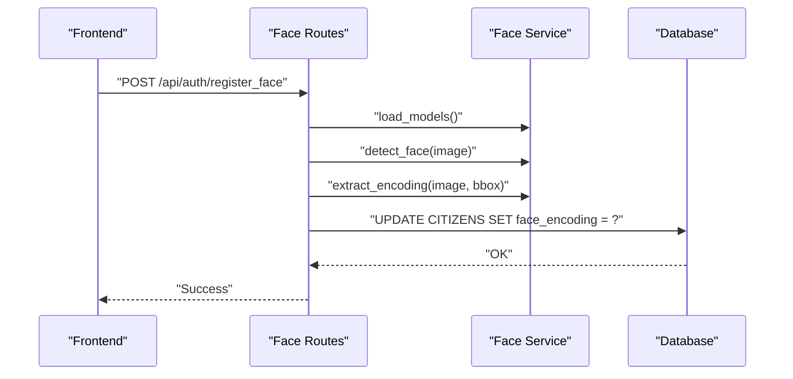
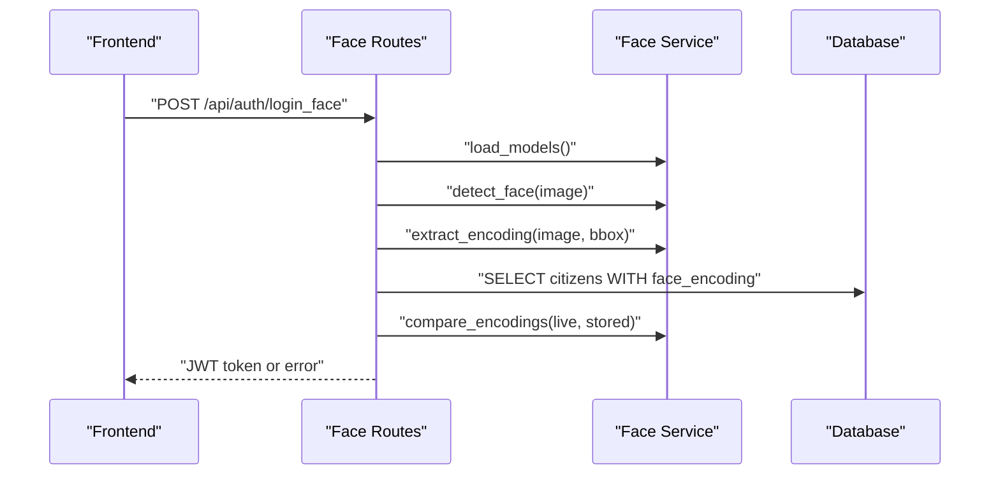

# Biometric Security

<cite>
**Referenced Files in This Document**
- [face_recognition.py](file://server/routes/face_recognition.py)
- [face_service.py](file://server/services/face_service.py)
- [main.py](file://server/main.py)
- [database.py](file://server/database.py)
- [auth.py](file://server/middleware/auth.py)
- [schema.sql](file://db/schema.sql)
- [requirements.txt](file://server/requirements.txt)
- [README.md](file://README.md)
- [Login.jsx](file://frontend/src/pages/Login.jsx)
- [Register.jsx](file://frontend/src/pages/Register.jsx)
</cite>

## Table of Contents
1. [Introduction](#introduction)
2. [Project Structure](#project-structure)
3. [Core Components](#core-components)
4. [Architecture Overview](#architecture-overview)
5. [Detailed Component Analysis](#detailed-component-analysis)
6. [Dependency Analysis](#dependency-analysis)
7. [Performance Considerations](#performance-considerations)
8. [Troubleshooting Guide](#troubleshooting-guide)
9. [Security and Privacy Compliance](#security-and-privacy-compliance)
10. [Conclusion](#conclusion)
11. [Appendices](#appendices)

## Introduction
This document provides comprehensive documentation for the face recognition biometric security system integrated into the Traffic Violation Management System. It explains the OpenCV DNN-based face detection pipeline, facial encoding extraction, and the face service implementation. It also documents the face registration and login endpoints, request/response formats, error handling strategies, webcam access permissions, image quality requirements, privacy considerations, and security measures for protecting biometric templates. Finally, it includes troubleshooting guidance and performance optimization techniques.

## Project Structure
The biometric security system spans the backend FastAPI server, a dedicated face recognition service, database schema for storing biometric templates, and the frontend components that capture images via the webcam.

**Diagram sources**
- [main.py:49-107](file://server/main.py#L49-L107)
- [face_recognition.py:1-282](file://server/routes/face_recognition.py#L1-L282)
- [face_service.py:1-177](file://server/services/face_service.py#L1-L177)
- [database.py:1-76](file://server/database.py#L1-L76)
- [schema.sql:26-43](file://db/schema.sql#L26-L43)
- [auth.py:1-182](file://server/middleware/auth.py#L1-L182)

**Section sources**
- [README.md:14-93](file://README.md#L14-L93)
- [main.py:49-107](file://server/main.py#L49-L107)

## Core Components
- Face Recognition Routes: Expose endpoints for face registration, face login, and face detection.
- Face Service: Implements OpenCV DNN face detection, image preprocessing, encoding extraction, and encoding comparison.
- Database Layer: Provides connection pooling and context-managed cursors for secure, ACID-compliant operations.
- Authentication Middleware: Handles JWT creation and bcrypt-based password hashing.
- Database Schema: Defines the CITIZENS table with a BLOB column for serialized face encodings.

Key implementation references:
- Face routes and endpoints: [face_recognition.py:28-282](file://server/routes/face_recognition.py#L28-L282)
- Face service and OpenCV DNN integration: [face_service.py:15-177](file://server/services/face_service.py#L15-L177)
- Database connection pool and helpers: [database.py:14-76](file://server/database.py#L14-L76)
- CITIZENS schema with face_encoding: [schema.sql:26-43](file://db/schema.sql#L26-L43)
- JWT and bcrypt middleware: [auth.py:45-182](file://server/middleware/auth.py#L45-L182)

**Section sources**
- [face_recognition.py:28-282](file://server/routes/face_recognition.py#L28-L282)
- [face_service.py:15-177](file://server/services/face_service.py#L15-L177)
- [database.py:14-76](file://server/database.py#L14-L76)
- [schema.sql:26-43](file://db/schema.sql#L26-L43)
- [auth.py:45-182](file://server/middleware/auth.py#L45-L182)

## Architecture Overview
The system integrates webcam capture on the frontend with backend endpoints that validate images, detect faces, compute encodings, and compare against stored templates. The database persists serialized encodings as BLOBs.

**Diagram sources**
- [face_recognition.py:28-231](file://server/routes/face_recognition.py#L28-L231)
- [face_service.py:24-149](file://server/services/face_service.py#L24-L149)
- [database.py:68-76](file://server/database.py#L68-L76)

## Detailed Component Analysis

### Face Recognition Routes
Endpoints:
- POST /api/auth/register_face: Registers a face encoding for a citizen after validating the image and detecting a face.
- POST /api/auth/login_face: Performs face-based login by comparing the live encoding against stored encodings.
- POST /api/auth/detect_face: Utility endpoint to detect faces in an image.

Processing logic highlights:
- Model loading guard ensures OpenCV DNN models are available before processing.
- Image decoding from multipart/form-data into OpenCV-compatible arrays.
- Face detection with confidence thresholding and bounding box selection.
- Encoding extraction and serialization to BLOB for storage.
- Comparison loop with configurable tolerance and best-match selection.
- JWT token issuance upon successful identification.

Example references:
- Registration flow: [face_recognition.py:28-107](file://server/routes/face_recognition.py#L28-L107)
- Login flow: [face_recognition.py:110-231](file://server/routes/face_recognition.py#L110-L231)
- Detection endpoint: [face_recognition.py:234-282](file://server/routes/face_recognition.py#L234-L282)

**Diagram sources**
- [face_recognition.py:34-107](file://server/routes/face_recognition.py#L34-L107)
- [face_recognition.py:117-231](file://server/routes/face_recognition.py#L117-L231)

**Section sources**
- [face_recognition.py:28-282](file://server/routes/face_recognition.py#L28-L282)

### Face Service Implementation
Responsibilities:
- Load OpenCV DNN Caffe model (deploy.prototxt + caffemodel).
- Detect faces using cv2.dnn.blobFromImage and forward pass.
- Extract encodings from detected regions with preprocessing (resize, grayscale, histogram equalization).
- Compare encodings using Euclidean distance.
- Provide base64-to-image conversion helper.

Implementation highlights:
- Model loading guarded by existence checks and warning logs.
- Detection loops over all detections, selects the highest confidence within a threshold.
- Encoding extraction flattens and normalizes pixel intensities to a fixed-size vector.
- Distance metric is configurable via compare_encodings.

References:
- Model loading and detection: [face_service.py:24-94](file://server/services/face_service.py#L24-L94)
- Encoding extraction and normalization: [face_service.py:96-142](file://server/services/face_service.py#L96-L142)
- Encoding comparison: [face_service.py:143-149](file://server/services/face_service.py#L143-L149)
- Base64 decoding helper: [face_service.py:151-172](file://server/services/face_service.py#L151-L172)

**Diagram sources**
- [face_service.py:15-177](file://server/services/face_service.py#L15-L177)

**Section sources**
- [face_service.py:15-177](file://server/services/face_service.py#L15-L177)

### Database Integration and Data Model
- CITIZENS table includes face_encoding as a BLOB to store serialized 128-d vectors.
- The database layer provides a connection pool and context-managed cursors for safe operations.
- Endpoints update or query face encodings atomically with transactions.

References:
- CITIZENS schema: [schema.sql:26-43](file://db/schema.sql#L26-L43)
- Connection pool and helpers: [database.py:14-76](file://server/database.py#L14-L76)
- Registration endpoint writes face_encoding: [face_recognition.py:78-95](file://server/routes/face_recognition.py#L78-L95)
- Login endpoint reads face_encoding for comparison: [face_recognition.py:158-162](file://server/routes/face_recognition.py#L158-L162)

**Diagram sources**
- [schema.sql:26-43](file://db/schema.sql#L26-L43)

**Section sources**
- [schema.sql:26-43](file://db/schema.sql#L26-L43)
- [database.py:14-76](file://server/database.py#L14-L76)
- [face_recognition.py:78-95](file://server/routes/face_recognition.py#L78-L95)
- [face_recognition.py:158-162](file://server/routes/face_recognition.py#L158-L162)

### Authentication and Tokenization
- JWT tokens are created for successful face login with user claims.
- bcrypt is used for password hashing in traditional authentication flows.
- Token payload includes user identity, role, and additional metadata.

References:
- Token creation and middleware: [auth.py:57-61](file://server/middleware/auth.py#L57-L61)
- Login flow returns JWT: [face_recognition.py:204-212](file://server/routes/face_recognition.py#L204-L212)

**Section sources**
- [auth.py:57-61](file://server/middleware/auth.py#L57-L61)
- [face_recognition.py:204-212](file://server/routes/face_recognition.py#L204-L212)

## Dependency Analysis
External dependencies relevant to biometric security:
- OpenCV DNN for face detection (Caffe model).
- NumPy for numerical operations and vector comparisons.
- MySQL Connector for secure database connectivity.
- Pydantic for request/response validation.
- python-jose and bcrypt for JWT and password hashing.

References:
- Dependencies list: [requirements.txt:1-12](file://server/requirements.txt#L1-L12)

**Diagram sources**
- [requirements.txt:1-12](file://server/requirements.txt#L1-L12)
- [face_service.py:5-6](file://server/services/face_service.py#L5-L6)
- [face_recognition.py:1-13](file://server/routes/face_recognition.py#L1-L13)
- [database.py:4-5](file://server/database.py#L4-L5)
- [auth.py:9-12](file://server/middleware/auth.py#L9-L12)

**Section sources**
- [requirements.txt:1-12](file://server/requirements.txt#L1-L12)

## Performance Considerations
- Model loading: The service loads the OpenCV DNN model once and caches it; ensure models are downloaded and placed under the models directory to avoid repeated failures.
- Detection confidence threshold: The detection logic filters detections below a confidence threshold; adjust this to balance false positives and missed detections.
- Encoding extraction: Preprocessing steps (resize, grayscale, histogram equalization) improve robustness; consider hardware acceleration if available.
- Comparison loop: The login endpoint iterates over all registered citizens; for large deployments, consider indexing strategies or approximate nearest neighbor libraries.
- Tolerance tuning: The default tolerance is adjustable; tune based on empirical testing to minimize false matches while maintaining usability.
- Image quality: Encourage users to capture images with adequate lighting and centered faces to reduce re-captures.

[No sources needed since this section provides general guidance]

## Troubleshooting Guide
Common issues and resolutions:
- Backend startup or module import errors: Verify all route modules are present and importable.
  - Reference: [main.py:21-26](file://server/main.py#L21-L26)
- Face detection models not found: Ensure deploy.prototxt and res10_300x300_ssd_iter_140000.caffemodel are downloaded and placed under the models directory.
  - Reference: [face_service.py:33-37](file://server/services/face_service.py#L33-L37)
- No face detected: Verify webcam permissions, lighting, and that the face fills the frame.
  - References: [face_recognition.py:59-63](file://server/routes/face_recognition.py#L59-L63), [face_recognition.py:142-146](file://server/routes/face_recognition.py#L142-L146)
- Encoding extraction failure: Ensure the detected region is valid and not empty; check image decoding.
  - References: [face_recognition.py:68-72](file://server/routes/face_recognition.py#L68-L72), [face_service.py:106-107](file://server/services/face_service.py#L106-L107)
- Database connectivity: Confirm MySQL is running and credentials are correct.
  - Reference: [database.py:20-43](file://server/database.py#L20-L43)
- Frontend cannot connect: Ensure backend runs on port 5000 and CORS is configured.
  - References: [main.py:60-66](file://server/main.py#L60-L66), [README.md:371-392](file://README.md#L371-L392)

**Section sources**
- [main.py:21-26](file://server/main.py#L21-L26)
- [face_service.py:33-37](file://server/services/face_service.py#L33-L37)
- [face_recognition.py:59-72](file://server/routes/face_recognition.py#L59-L72)
- [face_service.py:106-107](file://server/services/face_service.py#L106-L107)
- [database.py:20-43](file://server/database.py#L20-L43)
- [README.md:371-392](file://README.md#L371-L392)

## Security and Privacy Compliance
- Data at rest: face_encoding is stored as a BLOB in the database; ensure database encryption and access controls are enforced.
  - Reference: [schema.sql:26-43](file://db/schema.sql#L26-L43)
- Data in transit: Use HTTPS/TLS to protect transmission of images and tokens.
- Access control: JWT tokens carry user identity and role; enforce proper authorization on protected endpoints.
  - Reference: [auth.py:57-61](file://server/middleware/auth.py#L57-L61)
- Biometric template protection: Treat face encodings as sensitive biometric data; limit access to authorized services only.
- Retention policy: Define and enforce data retention for biometric templates per applicable regulations.
- Consent and transparency: Inform users about biometric data collection and usage; provide opt-out mechanisms where feasible.
- Bias and fairness: Monitor false positive/negative rates across demographic groups to prevent discriminatory outcomes.
- Audit trails: Maintain logs of face recognition attempts and template updates for forensic analysis.

[No sources needed since this section provides general guidance]

## Conclusion
The face recognition system integrates OpenCV DNN-based detection and a custom encoding pipeline to enable secure, biometric-enabled authentication. The backend exposes straightforward endpoints for registration and login, while the database securely stores serialized face encodings. Robust error handling, performance tuning, and adherence to privacy and security best practices are essential for production deployment.

[No sources needed since this section summarizes without analyzing specific files]

## Appendices

### Endpoint Definitions and Request/Response Formats
- POST /api/auth/register_face
  - Request: multipart/form-data with fields citizen_id and image (image file).
  - Response: success message and citizen details.
  - Errors: 400 for invalid image/no face; 500 for model not loaded/encoding failure.
  - Reference: [face_recognition.py:28-107](file://server/routes/face_recognition.py#L28-L107)

- POST /api/auth/login_face
  - Request: multipart/form-data with field image (image file).
  - Response: JWT token, user info, and confidence score.
  - Errors: 400 for invalid image/no face; 401 for unrecognized face; 500 for internal errors.
  - Reference: [face_recognition.py:110-231](file://server/routes/face_recognition.py#L110-L231)

- POST /api/auth/detect_face
  - Request: multipart/form-data with field image (image file).
  - Response: Boolean indicating face presence and optional bounding box.
  - Errors: 400 for invalid image; 500 for model not loaded.
  - Reference: [face_recognition.py:234-282](file://server/routes/face_recognition.py#L234-L282)

### Webcam Access Permissions and Image Quality Requirements
- Frontend integration: The frontend uses navigator.mediaDevices for webcam access.
  - Reference: [README.md:19-21](file://README.md#L19-L21)
- Permissions: Ensure the browser grants camera permissions; handle user prompts gracefully.
- Image quality: Encourage good lighting, centered face, and minimal occlusions.
  - Reference: [README.md:378-381](file://README.md#L378-L381)

### Threshold Configurations and Comparison Algorithms
- Detection confidence threshold: Faces with confidence below the threshold are ignored.
  - Reference: [face_service.py:80-81](file://server/services/face_service.py#L80-L81)
- Encoding comparison: Euclidean distance is used; lower distances indicate higher similarity.
  - Reference: [face_service.py:143-149](file://server/services/face_service.py#L143-L149)
- Tolerance: Tunable threshold for determining a match during login.
  - Reference: [face_recognition.py](file://server/routes/face_recognition.py#L173)

### Example Workflows

#### Face Registration Workflow

**Diagram sources**
- [face_recognition.py:28-107](file://server/routes/face_recognition.py#L28-L107)
- [face_service.py:24-142](file://server/services/face_service.py#L24-L142)
- [database.py:68-76](file://server/database.py#L68-L76)

#### Face Login Workflow

**Diagram sources**
- [face_recognition.py:110-231](file://server/routes/face_recognition.py#L110-L231)
- [face_service.py:24-149](file://server/services/face_service.py#L24-L149)
- [database.py:68-76](file://server/database.py#L68-L76)