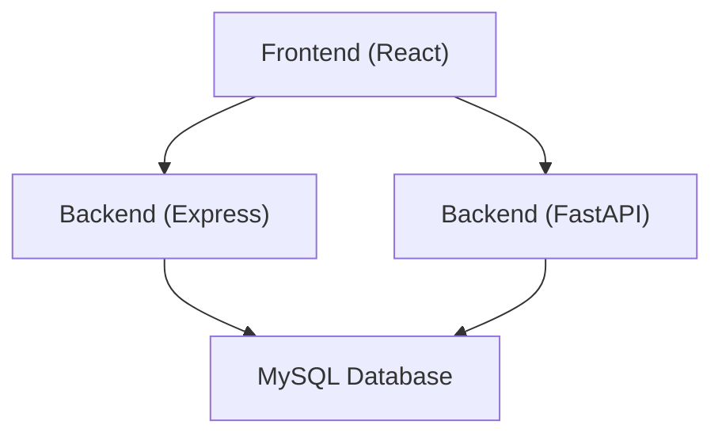
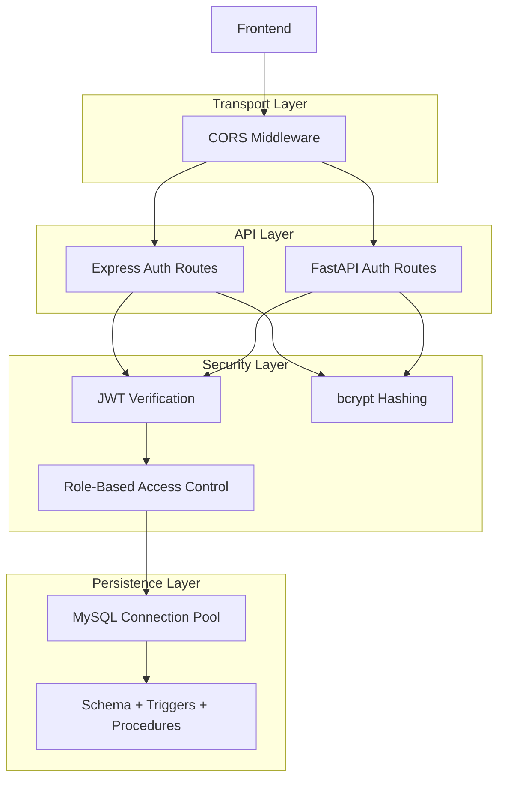
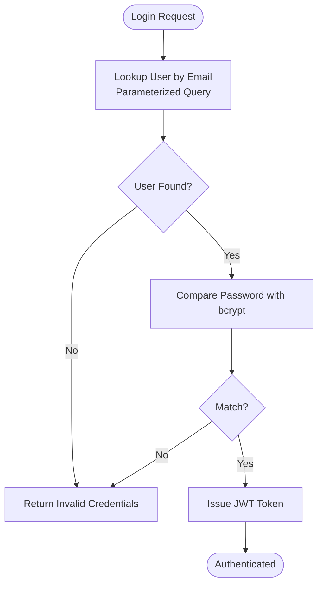
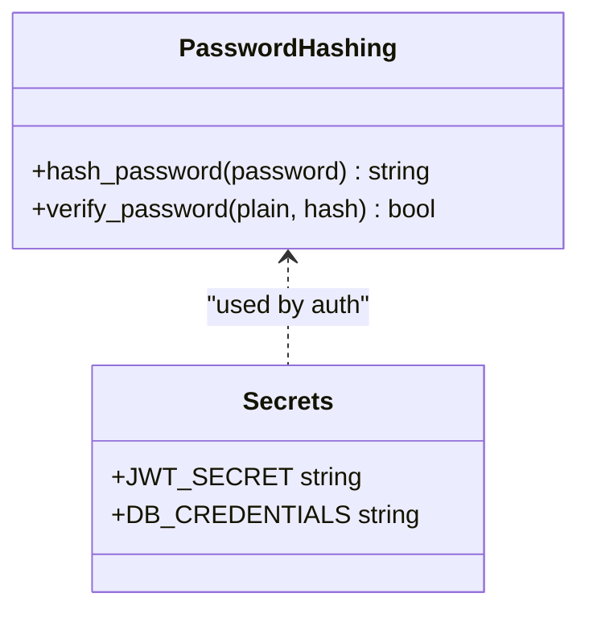
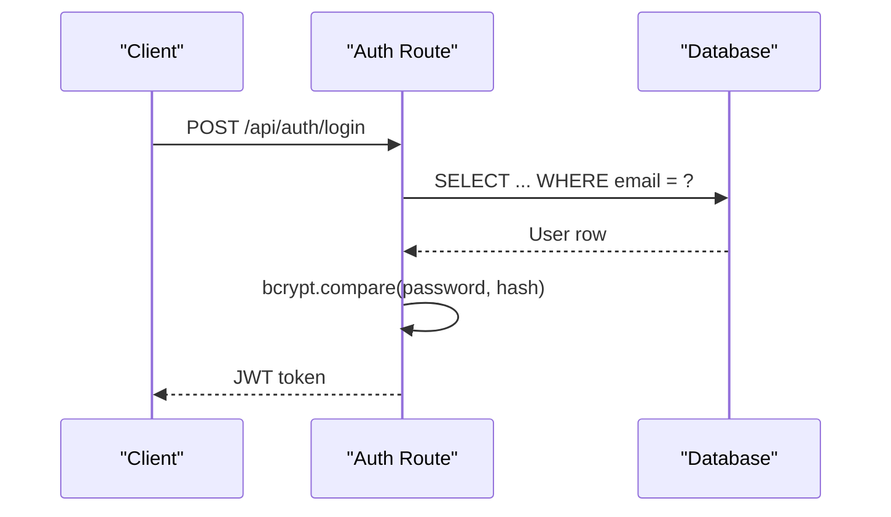
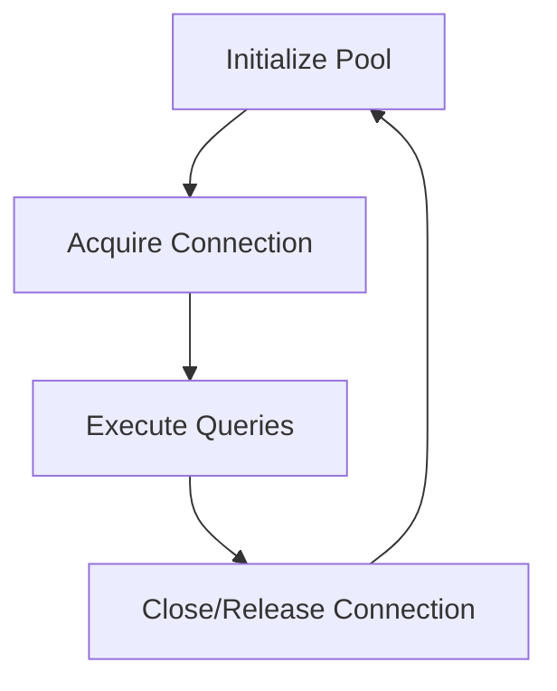
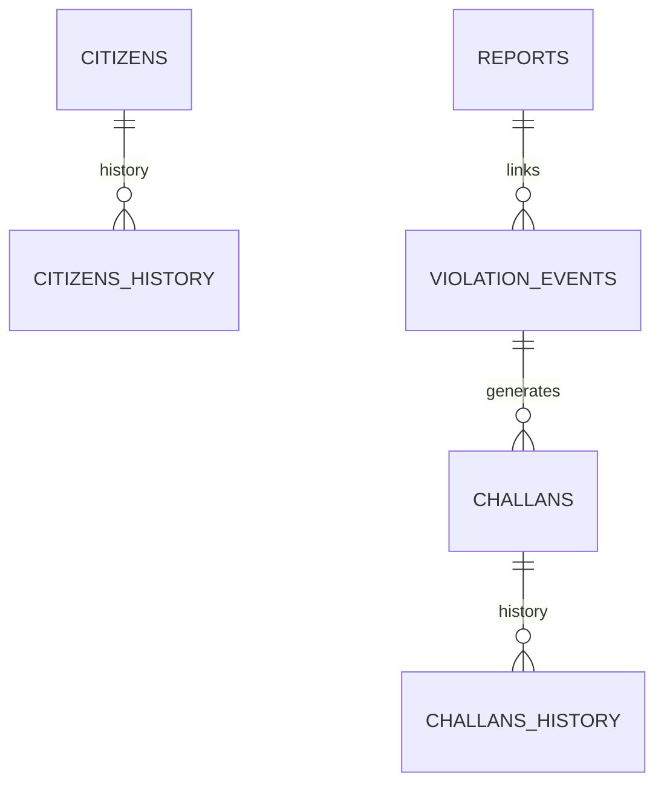
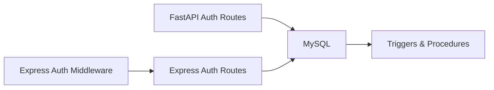

# Data Protection

<cite>
**Referenced Files in This Document**
- [backend/db.js](file://backend/db.js)
- [backend/middleware/auth.js](file://backend/middleware/auth.js)
- [backend/routes/auth.js](file://backend/routes/auth.js)
- [server/database.py](file://server/database.py)
- [server/middleware/auth.py](file://server/middleware/auth.py)
- [server/main.py](file://server/main.py)
- [db/schema.sql](file://db/schema.sql)
- [db/stored_procedure_process_report.sql](file://db/stored_procedure_process_report.sql)
- [db/stored_procedure_sp_issue_challan.sql](file://db/stored_procedure_sp_issue_challan.sql)
- [db/stored_procedure_sp_pay_challan.sql](file://db/stored_procedure_sp_pay_challan.sql)
- [db/database_triggers.sql](file://db/database_triggers.sql)
- [scripts/generate_password_hashes.py](file://scripts/generate_password_hashes.py)
- [scripts/check_account.py](file://scripts/check_account.py)
- [frontend/src/config.js](file://frontend/src/config.js)
</cite>

## Table of Contents
1. [Introduction](#introduction)
2. [Project Structure](#project-structure)
3. [Core Components](#core-components)
4. [Architecture Overview](#architecture-overview)
5. [Detailed Component Analysis](#detailed-component-analysis)
6. [Dependency Analysis](#dependency-analysis)
7. [Performance Considerations](#performance-considerations)
8. [Troubleshooting Guide](#troubleshooting-guide)
9. [Conclusion](#conclusion)
10. [Appendices](#appendices)

## Introduction
This document details the data protection and security measures implemented across the Traffic Violation Management System. It covers encrypted password storage using bcrypt, secure connection handling, SQL injection prevention via parameterized queries, data encryption strategies, secure credential storage, sensitive data handling, database connection security, access control mechanisms, audit logging, data retention, compliance considerations for government systems, backup security, data anonymization, secure deletion, and secure development practices with vulnerability assessment methodologies.

## Project Structure
The system comprises:
- Backend (Node.js/Express) for REST APIs and authentication middleware
- Backend (Python/FastAPI) for core business APIs and database connectivity
- Database (MySQL) with normalized schema, triggers, stored procedures, and temporal tables
- Frontend (React/Vite) for user interfaces and API configuration
- Scripts for password hashing and diagnostics

**Diagram sources**
- [frontend/src/config.js:1-34](file://frontend/src/config.js#L1-L34)
- [server/main.py:1-107](file://server/main.py#L1-L107)
- [backend/db.js:1-26](file://backend/db.js#L1-L26)

**Section sources**
- [frontend/src/config.js:1-34](file://frontend/src/config.js#L1-L34)
- [server/main.py:1-107](file://server/main.py#L1-L107)
- [backend/db.js:1-26](file://backend/db.js#L1-L26)

## Core Components
- Password hashing and verification using bcrypt in both backend stacks
- Parameterized queries to prevent SQL injection
- JWT-based authentication with role-based access control
- MySQL connection pooling and lifecycle management
- Audit trails via triggers and temporal tables
- Stored procedures enforcing ACID transactions and business rules
- Session and transient table management with automatic purges

**Section sources**
- [backend/routes/auth.js:1-117](file://backend/routes/auth.js#L1-L117)
- [backend/middleware/auth.js:1-37](file://backend/middleware/auth.js#L1-L37)
- [server/middleware/auth.py:1-182](file://server/middleware/auth.py#L1-L182)
- [server/database.py:1-76](file://server/database.py#L1-L76)
- [db/schema.sql:1-942](file://db/schema.sql#L1-L942)
- [db/stored_procedure_process_report.sql:1-115](file://db/stored_procedure_process_report.sql#L1-L115)

## Architecture Overview
The system enforces layered security:
- Transport security: HTTPS deployment and CORS configuration
- Authentication: JWT tokens with secret management
- Authorization: Role-based access control (citizen/police)
- Data protection: bcrypt hashing, parameterized queries, stored procedures
- Auditability: triggers, temporal tables, scheduled purges
- Resilience: connection pooling, transactional procedures, foreign keys

**Diagram sources**
- [server/main.py:57-67](file://server/main.py#L57-L67)
- [backend/middleware/auth.js:1-37](file://backend/middleware/auth.js#L1-L37)
- [server/middleware/auth.py:1-182](file://server/middleware/auth.py#L1-L182)
- [backend/routes/auth.js:1-117](file://backend/routes/auth.js#L1-L117)
- [server/database.py:1-76](file://server/database.py#L1-L76)
- [db/schema.sql:1-942](file://db/schema.sql#L1-L942)

## Detailed Component Analysis

### Database Security Implementation
- Encrypted password storage: password_hash fields store bcrypt hashes; verification compares plaintext against stored hash.
- Secure connection handling: connection pools with timeouts and keep-alive; explicit rollback on errors.
- SQL injection prevention: parameterized queries and stored procedures with bound parameters; no dynamic SQL concatenation observed in security-critical paths.
- Access control: role-based routing and checks; database-level constraints and foreign keys enforce referential integrity.
- Audit logging: triggers capture historical changes; temporal tables maintain validity windows; scheduled events purge stale sessions and uploads.
- Data retention: temporal columns (valid_from/valid_to) and dedicated OVERDUE_LOG for overdue records; purge events remove expired data.

**Diagram sources**
- [backend/routes/auth.js:32-47](file://backend/routes/auth.js#L32-L47)
- [server/middleware/auth.py:102-108](file://server/middleware/auth.py#L102-L108)

**Section sources**
- [db/schema.sql:26-43](file://db/schema.sql#L26-L43)
- [db/schema.sql:70-82](file://db/schema.sql#L70-L82)
- [backend/routes/auth.js:32-47](file://backend/routes/auth.js#L32-L47)
- [server/middleware/auth.py:102-108](file://server/middleware/auth.py#L102-L108)
- [server/database.py:45-76](file://server/database.py#L45-L76)
- [db/database_triggers.sql:1-48](file://db/database_triggers.sql#L1-L48)
- [db/schema.sql:245-300](file://db/schema.sql#L245-L300)

### Data Encryption Strategies and Credential Storage
- Password hashing: bcrypt is used consistently for storing passwords and verifying credentials.
- Secret management: JWT secrets are loaded from environment variables in Express; hardcoded secrets are present in FastAPI code and should be replaced with environment-backed secrets.
- Credential storage: database credentials are embedded in Python database module; these should be moved to environment variables/secrets manager.

**Diagram sources**
- [backend/routes/auth.js:44-47](file://backend/routes/auth.js#L44-L47)
- [server/middleware/auth.py:48-55](file://server/middleware/auth.py#L48-L55)
- [backend/middleware/auth.js](file://backend/middleware/auth.js#L3)

**Section sources**
- [scripts/generate_password_hashes.py:1-33](file://scripts/generate_password_hashes.py#L1-L33)
- [scripts/check_account.py:1-132](file://scripts/check_account.py#L1-L132)
- [server/middleware/auth.py:57-61](file://server/middleware/auth.py#L57-L61)
- [backend/middleware/auth.js](file://backend/middleware/auth.js#L3)

### Secure Query Patterns and Input Validation
- Parameterized queries: Both Express and FastAPI routes use parameterized statements for user lookup and inserts.
- Input validation: Basic presence checks for required fields; additional validation should be enforced at the API boundary (e.g., email format, role enumeration).
- Stored procedures: Enforce business rules and atomicity; include validation and error signaling.

**Diagram sources**
- [backend/routes/auth.js:9-76](file://backend/routes/auth.js#L9-L76)
- [server/middleware/auth.py:96-122](file://server/middleware/auth.py#L96-L122)

**Section sources**
- [backend/routes/auth.js:10-76](file://backend/routes/auth.js#L10-L76)
- [server/middleware/auth.py:96-122](file://server/middleware/auth.py#L96-L122)
- [db/stored_procedure_process_report.sql:33-54](file://db/stored_procedure_process_report.sql#L33-L54)

### Database Connection Security and Access Control
- Connection pooling: MySQL pools configured with timeouts and keep-alive; Python pool initializes with explicit parameters.
- Access control: role-based middleware restricts routes; database constraints and foreign keys protect referential integrity.
- Session management: ACTIVE_SESSIONS table stores short-lived sessions with expiry; scheduled event purges expired entries.

**Diagram sources**
- [server/database.py:14-50](file://server/database.py#L14-L50)
- [backend/db.js:3-13](file://backend/db.js#L3-L13)

**Section sources**
- [server/database.py:14-76](file://server/database.py#L14-L76)
- [backend/db.js:1-26](file://backend/db.js#L1-L26)
- [db/schema.sql:245-300](file://db/schema.sql#L245-L300)

### Audit Logging, Retention, and Compliance
- Audit trails: CITIZENS_HISTORY and CHALLANS_HISTORY capture changes with operation types and timestamps.
- Temporal data: valid_from/valid_to columns maintain versioned records.
- Scheduled purges: events remove expired sessions and unlinked uploads automatically.
- Compliance considerations: temporal tables and audit logs support traceability; ensure retention aligns with legal requirements.

**Diagram sources**
- [db/schema.sql:49-65](file://db/schema.sql#L49-L65)
- [db/schema.sql:199-219](file://db/schema.sql#L199-L219)
- [db/schema.sql:277-300](file://db/schema.sql#L277-L300)

**Section sources**
- [db/schema.sql:49-65](file://db/schema.sql#L49-L65)
- [db/schema.sql:199-219](file://db/schema.sql#L199-L219)
- [db/schema.sql:277-300](file://db/schema.sql#L277-L300)

### Backup Security, Anonymization, and Secure Deletion
- Backup security: ensure backups are encrypted at rest and in transit; restrict access to backup artifacts.
- Data anonymization: de-identify personal identifiers before analytics; retain only aggregated metrics.
- Secure deletion: use TRUNCATE/DROP cautiously; rely on soft deletes and temporal validity; schedule purges for sensitive data.

[No sources needed since this section provides general guidance]

### Secure Development Practices and Vulnerability Assessment
- Environment variables: replace hardcoded secrets with environment-backed configuration.
- Input sanitization: validate and sanitize inputs; apply rate limiting and WAF protections.
- Dependency hygiene: regularly update packages and scan for vulnerabilities.
- Penetration testing: perform periodic assessments targeting authentication, authorization, and data exposure.

[No sources needed since this section provides general guidance]

## Dependency Analysis
The authentication and authorization flows depend on:
- Express middleware for JWT verification and role checks
- FastAPI routes for citizen/police registration and login
- Database connectivity and stored procedures for transactional operations

**Diagram sources**
- [backend/middleware/auth.js:1-37](file://backend/middleware/auth.js#L1-L37)
- [backend/routes/auth.js:1-117](file://backend/routes/auth.js#L1-L117)
- [server/middleware/auth.py:1-182](file://server/middleware/auth.py#L1-L182)
- [server/database.py:1-76](file://server/database.py#L1-L76)
- [db/schema.sql:1-942](file://db/schema.sql#L1-L942)

**Section sources**
- [backend/middleware/auth.js:1-37](file://backend/middleware/auth.js#L1-L37)
- [backend/routes/auth.js:1-117](file://backend/routes/auth.js#L1-L117)
- [server/middleware/auth.py:1-182](file://server/middleware/auth.py#L1-L182)
- [server/database.py:1-76](file://server/database.py#L1-L76)
- [db/schema.sql:1-942](file://db/schema.sql#L1-L942)

## Performance Considerations
- Connection pooling reduces overhead and improves throughput.
- Parameterized queries and prepared statements minimize parsing and injection risks.
- Stored procedures encapsulate business logic and reduce network round trips.
- Indexes on frequently queried columns improve query performance.

[No sources needed since this section provides general guidance]

## Troubleshooting Guide
- Authentication failures: verify JWT secret configuration and token validity; check bcrypt hash correctness.
- Database connectivity: confirm pool initialization and connection timeouts; review scheduled events for purges.
- Account diagnostics: use diagnostic scripts to verify stored hashes and account existence.

**Section sources**
- [scripts/check_account.py:1-132](file://scripts/check_account.py#L1-L132)
- [scripts/generate_password_hashes.py:1-33](file://scripts/generate_password_hashes.py#L1-L33)
- [server/database.py:14-50](file://server/database.py#L14-L50)

## Conclusion
The system implements robust data protection through bcrypt-based password storage, parameterized queries, JWT-based authentication, role-based access control, connection pooling, and comprehensive audit trails. To strengthen security posture, replace hardcoded secrets with environment-backed configuration, enforce stricter input validation, and adopt enterprise-grade backup and incident response practices aligned with government compliance requirements.

## Appendices
- API endpoints and base URL configuration for frontend integration
- Stored procedures for challan issuance and payment processing
- Database triggers for trust score automation

**Section sources**
- [frontend/src/config.js:1-34](file://frontend/src/config.js#L1-L34)
- [db/stored_procedure_sp_issue_challan.sql:440-546](file://db/stored_procedure_sp_issue_challan.sql#L440-L546)
- [db/stored_procedure_sp_pay_challan.sql:552-629](file://db/stored_procedure_sp_pay_challan.sql#L552-L629)
- [db/database_triggers.sql:1-48](file://db/database_triggers.sql#L1-L48)