# Security Architecture

<cite>
**Referenced Files in This Document**
- [main.py](file://server/main.py)
- [config.py](file://server/config.py)
- [routes/auth.py](file://server/routes/auth.py)
- [routes/face_recognition.py](file://server/routes/face_recognition.py)
- [services/face_service.py](file://server/services/face_service.py)
- [database.py](file://server/database.py)
- [schema.sql](file://db/schema.sql)
- [backend/middleware/auth.js](file://backend/middleware/auth.js)
- [frontend/src/config.js](file://frontend/src/config.js)
</cite>

## Table of Contents
1. [Introduction](#introduction)
2. [Project Structure](#project-structure)
3. [Core Components](#core-components)
4. [Architecture Overview](#architecture-overview)
5. [Detailed Component Analysis](#detailed-component-analysis)
6. [Dependency Analysis](#dependency-analysis)
7. [Performance Considerations](#performance-considerations)
8. [Troubleshooting Guide](#troubleshooting-guide)
9. [Conclusion](#conclusion)
10. [Appendices](#appendices)

## Introduction
This document presents the comprehensive security architecture for the Traffic Violation Management System. It explains the multi-layered security approach including:
- JWT authentication with role-based access control
- bcrypt password hashing
- Face recognition biometric authentication
- Security middleware implementation
- Input validation using FastAPI Pydantic models
- SQL injection prevention through parameterized queries
- CORS configuration, token expiration handling, and secure face encoding storage
- Face recognition security model, webcam access permissions, and biometric data protection
- Security boundaries between different user roles, access control mechanisms, and audit logging
- Threat mitigation strategies, secure communication protocols, and compliance considerations for government systems

## Project Structure
The system follows a layered architecture:
- Frontend (React/Vite) communicates with the backend via HTTPS REST APIs
- Backend (FastAPI) exposes authentication, biometric, and business endpoints
- Database (MySQL 8.0+) persists user accounts, biometric encodings, and audit trails
- Security controls are implemented at the application, transport, and data layers

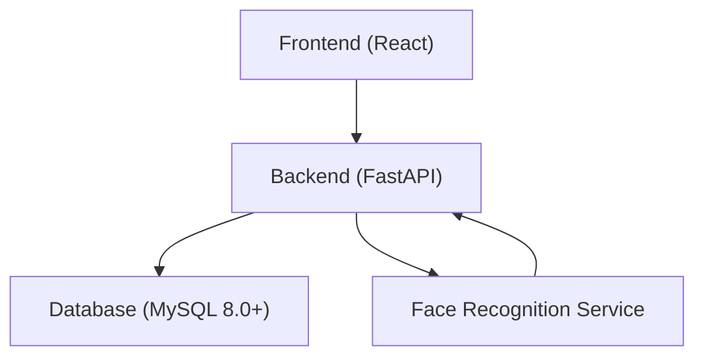

**Diagram sources**
- [main.py:50-107](file://server/main.py#L50-L107)
- [routes/auth.py:14-744](file://server/routes/auth.py#L14-L744)
- [routes/face_recognition.py:1-282](file://server/routes/face_recognition.py#L1-L282)
- [services/face_service.py:1-177](file://server/services/face_service.py#L1-L177)
- [schema.sql:26-43](file://db/schema.sql#L26-L43)

**Section sources**
- [main.py:50-107](file://server/main.py#L50-L107)
- [README.md:14-41](file://README.md#L14-L41)

## Core Components
- Authentication and Authorization
  - JWT-based authentication with HS256 signing
  - Role-based access control (citizen vs police)
  - Token expiration handling with 24-hour default expiry
- Password Security
  - bcrypt hashing with salt generation
  - Threadpool-based hashing to avoid blocking I/O
- Biometric Security
  - Face detection and encoding extraction using OpenCV DNN
  - Secure storage of serialized 128-d encodings in BLOB
  - Face login with configurable similarity tolerance
- Input Validation
  - Pydantic models for request/response validation
  - Explicit field validation (e.g., password length, email uniqueness)
- SQL Injection Prevention
  - Parameterized queries using %s placeholders
  - Centralized database connection management with pools
- Transport Security
  - CORS middleware configured for development
  - Environment-driven secrets and configuration
- Audit and Compliance
  - Temporal tables and history tables for auditability
  - Stored procedures with explicit transaction control and rollback

**Section sources**
- [routes/auth.py:29-32](file://server/routes/auth.py#L29-L32)
- [routes/auth.py:77-98](file://server/routes/auth.py#L77-L98)
- [routes/auth.py:100-112](file://server/routes/auth.py#L100-L112)
- [routes/face_recognition.py:28-108](file://server/routes/face_recognition.py#L28-L108)
- [services/face_service.py:15-177](file://server/services/face_service.py#L15-L177)
- [schema.sql:26-43](file://db/schema.sql#L26-L43)
- [database.py:14-76](file://server/database.py#L14-L76)
- [main.py:60-67](file://server/main.py#L60-L67)
- [config.py:18-31](file://server/config.py#L18-L31)

## Architecture Overview
The security architecture integrates authentication, authorization, cryptography, biometrics, and data protection across layers.

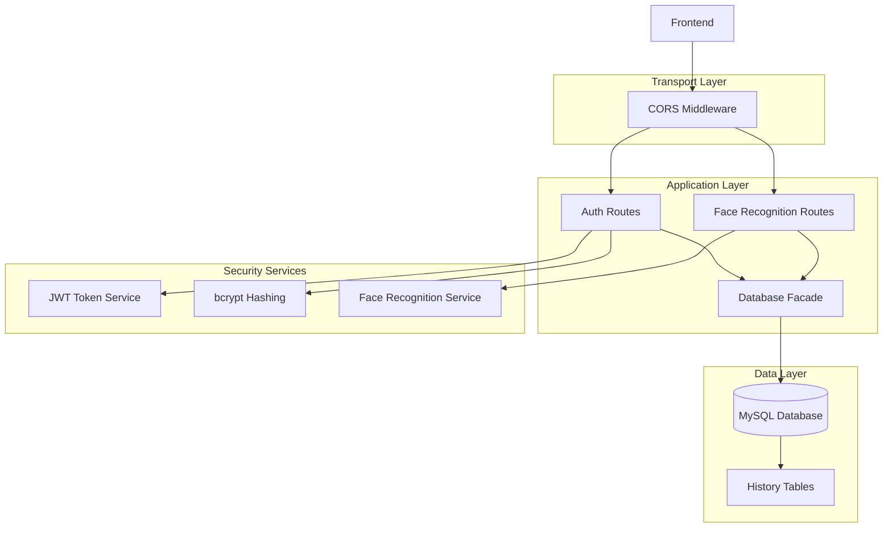

**Diagram sources**
- [main.py:60-67](file://server/main.py#L60-L67)
- [routes/auth.py:14-744](file://server/routes/auth.py#L14-L744)
- [routes/face_recognition.py:1-282](file://server/routes/face_recognition.py#L1-L282)
- [services/face_service.py:15-177](file://server/services/face_service.py#L15-L177)
- [database.py:14-76](file://server/database.py#L14-L76)
- [schema.sql:49-65](file://db/schema.sql#L49-L65)

## Detailed Component Analysis

### JWT Authentication and Role-Based Access Control
- Token Issuance
  - Tokens include subject (citizen_id or badge_no), role, and expiration
  - Expiration is set to 24 hours by default
- Token Validation
  - Authorization header parsing ("Bearer <token>")
  - HS256 signature verification
  - Expiration and invalid token error handling
- Role-Based Access
  - Role embedded in token payload
  - Route-level access checks enforced by middleware

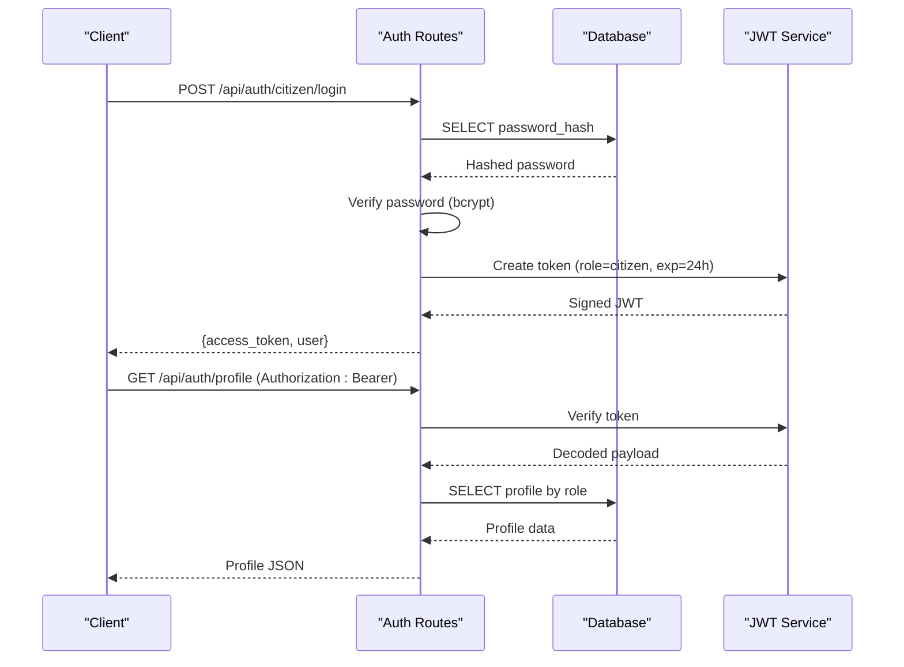

**Diagram sources**
- [routes/auth.py:218-293](file://server/routes/auth.py#L218-L293)
- [routes/auth.py:493-599](file://server/routes/auth.py#L493-L599)
- [routes/auth.py:100-112](file://server/routes/auth.py#L100-L112)

**Section sources**
- [routes/auth.py:29-32](file://server/routes/auth.py#L29-L32)
- [routes/auth.py:100-112](file://server/routes/auth.py#L100-L112)
- [routes/auth.py:493-599](file://server/routes/auth.py#L493-L599)

### Password Hashing with bcrypt
- Salt Generation
  - Unique salt per password
- Hashing
  - bcrypt hashing performed in threadpool to avoid blocking
- Verification
  - bcrypt verification against stored hash

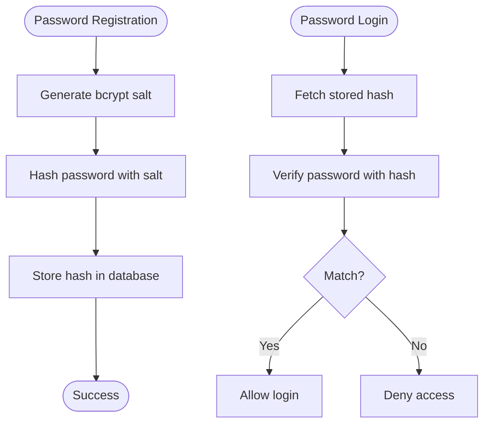

**Diagram sources**
- [routes/auth.py:77-98](file://server/routes/auth.py#L77-L98)
- [routes/auth.py:135-137](file://server/routes/auth.py#L135-L137)

**Section sources**
- [routes/auth.py:77-98](file://server/routes/auth.py#L77-L98)
- [routes/auth.py:135-137](file://server/routes/auth.py#L135-L137)

### Face Recognition Biometric Authentication
- Model Loading
  - OpenCV DNN ResNet-34 model for face detection
  - Model availability checked before inference
- Encoding Extraction
  - 128-d encoding vector extracted from detected face ROI
  - Vector normalized and stored as BLOB
- Face Registration
  - Image uploaded, face detected, encoding computed, stored in database
- Face Login
  - Live image encoding compared against stored encodings
  - Similarity threshold determines match; on success, JWT issued

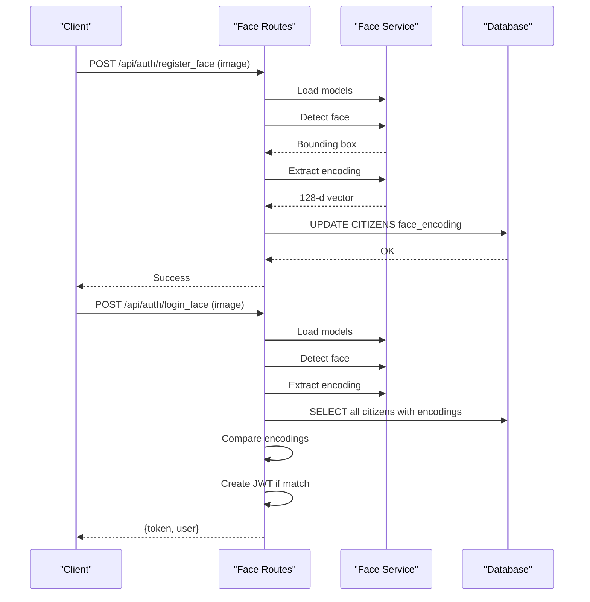

**Diagram sources**
- [routes/face_recognition.py:28-108](file://server/routes/face_recognition.py#L28-L108)
- [routes/face_recognition.py:110-232](file://server/routes/face_recognition.py#L110-L232)
- [services/face_service.py:24-177](file://server/services/face_service.py#L24-L177)
- [schema.sql:26-43](file://db/schema.sql#L26-L43)

**Section sources**
- [routes/face_recognition.py:28-108](file://server/routes/face_recognition.py#L28-L108)
- [routes/face_recognition.py:110-232](file://server/routes/face_recognition.py#L110-L232)
- [services/face_service.py:24-177](file://server/services/face_service.py#L24-L177)
- [schema.sql:26-43](file://db/schema.sql#L26-L43)

### Input Validation with Pydantic
- Request Models
  - Strongly typed request/response models for all endpoints
  - Fields validated (e.g., password length, email uniqueness)
- Validation Flow
  - FastAPI validates incoming requests against models
  - Errors raised as HTTP 422 Unprocessable Entity

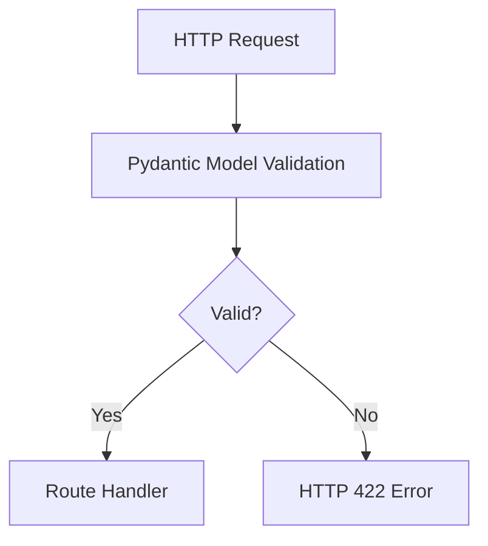

**Diagram sources**
- [routes/auth.py:36-63](file://server/routes/auth.py#L36-L63)
- [routes/face_recognition.py:19-26](file://server/routes/face_recognition.py#L19-L26)

**Section sources**
- [routes/auth.py:36-63](file://server/routes/auth.py#L36-L63)
- [routes/face_recognition.py:19-26](file://server/routes/face_recognition.py#L19-L26)

### SQL Injection Prevention with Parameterized Queries
- Database Access Pattern
  - Centralized connection management with pools
  - All queries use parameterized statements (%s placeholders)
- Transaction Control
  - Explicit commit/rollback in route handlers
  - Stored procedures enforce transaction boundaries

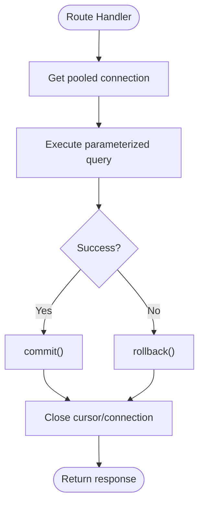

**Diagram sources**
- [database.py:14-76](file://server/database.py#L14-L76)
- [routes/auth.py:145-170](file://server/routes/auth.py#L145-L170)
- [routes/face_recognition.py:78-95](file://server/routes/face_recognition.py#L78-L95)

**Section sources**
- [database.py:14-76](file://server/database.py#L14-L76)
- [routes/auth.py:145-170](file://server/routes/auth.py#L145-L170)
- [routes/face_recognition.py:78-95](file://server/routes/face_recognition.py#L78-L95)

### CORS Configuration
- Development Setup
  - CORS configured to allow all origins, credentials, methods, and headers
- Production Considerations
  - Origins should be restricted to trusted domains
  - Headers and methods should be minimized to required values

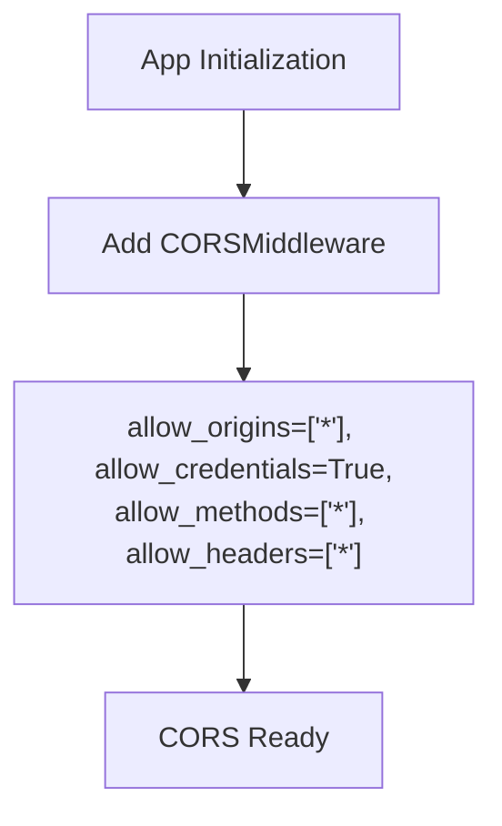

**Diagram sources**
- [main.py:60-67](file://server/main.py#L60-L67)

**Section sources**
- [main.py:60-67](file://server/main.py#L60-L67)

### Token Expiration Handling
- Expiration Policy
  - Tokens expire after 24 hours by default
- Error Handling
  - ExpiredSignatureError and InvalidTokenError mapped to HTTP 401 Unauthorized

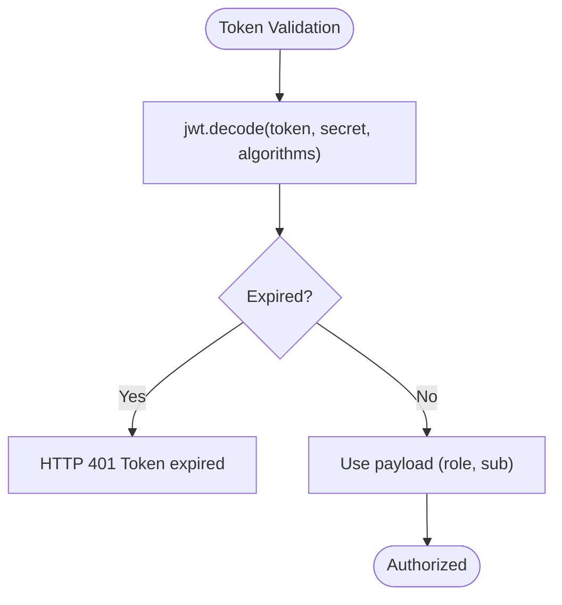

**Diagram sources**
- [routes/auth.py:580-589](file://server/routes/auth.py#L580-L589)

**Section sources**
- [routes/auth.py:580-589](file://server/routes/auth.py#L580-L589)

### Secure Face Encoding Storage
- Storage Schema
  - face_encoding stored as BLOB in CITIZENS table
- Encoding Format
  - 128-d float32 vector serialized to bytes
- Retrieval and Comparison
  - Deserialization to numpy array for distance computation
  - Threshold-based matching for login

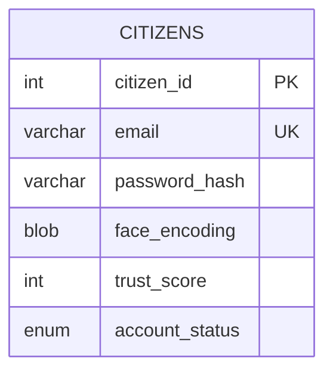

**Diagram sources**
- [schema.sql:26-43](file://db/schema.sql#L26-L43)

**Section sources**
- [schema.sql:26-43](file://db/schema.sql#L26-L43)
- [routes/face_recognition.py:175-196](file://server/routes/face_recognition.py#L175-L196)

### Webcam Access Permissions and Biometric Data Protection
- Frontend Integration
  - Uses navigator.mediaDevices for webcam access
  - Controlled components for form inputs and capture
- Data Handling
  - Images captured and sent to backend for processing
  - No persistent client-side biometric storage
- Privacy Controls
  - Users can choose biometric registration
  - Encodings are securely stored server-side

**Section sources**
- [frontend/src/config.js:1-34](file://frontend/src/config.js#L1-L34)

### Security Boundaries Between Roles and Access Control
- Role Embedding
  - JWT payload includes role (citizen/police)
- Access Control
  - Middleware enforces role-specific access
  - Route handlers validate user identity and role
- Audit Trail
  - Temporal tables and history tables maintain auditability

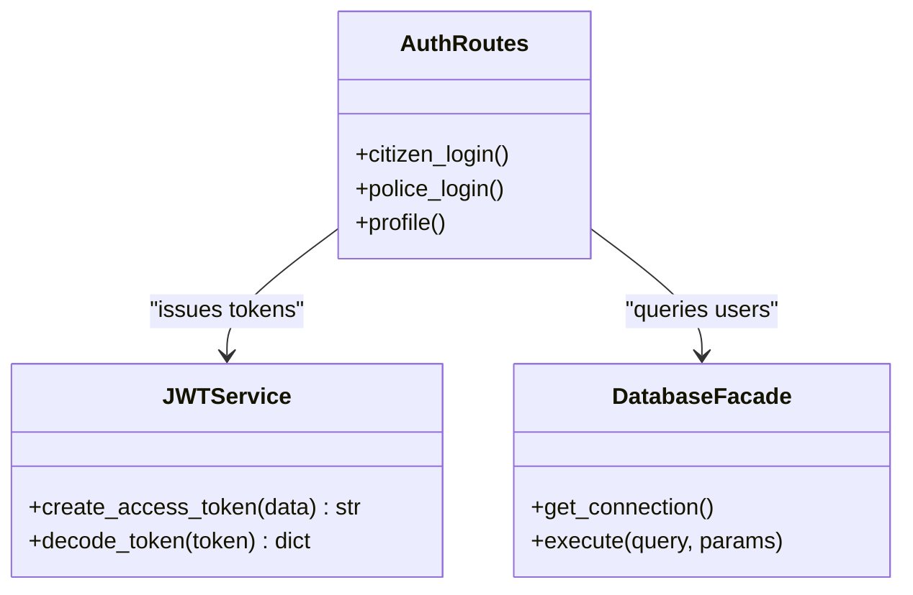

**Diagram sources**
- [routes/auth.py:100-112](file://server/routes/auth.py#L100-L112)
- [routes/auth.py:218-293](file://server/routes/auth.py#L218-L293)
- [database.py:14-76](file://server/database.py#L14-L76)

**Section sources**
- [routes/auth.py:100-112](file://server/routes/auth.py#L100-L112)
- [routes/auth.py:218-293](file://server/routes/auth.py#L218-L293)
- [schema.sql:49-65](file://db/schema.sql#L49-L65)

### Audit Logging and Compliance
- Audit Tables
  - CITIZENS_HISTORY and CHALLANS_HISTORY for temporal auditing
- Stored Procedures
  - Explicit transaction control with rollback on errors
- Compliance Considerations
  - Data retention policies via temporal tables
  - Audit trails for sensitive operations (issuing challans, payments)

**Section sources**
- [schema.sql:49-65](file://db/schema.sql#L49-L65)
- [schema.sql:198-235](file://db/schema.sql#L198-L235)

## Dependency Analysis
The security architecture relies on clear separation of concerns:
- Application layer depends on database facade and security services
- Face recognition service encapsulates OpenCV logic
- Configuration drives secrets and runtime behavior

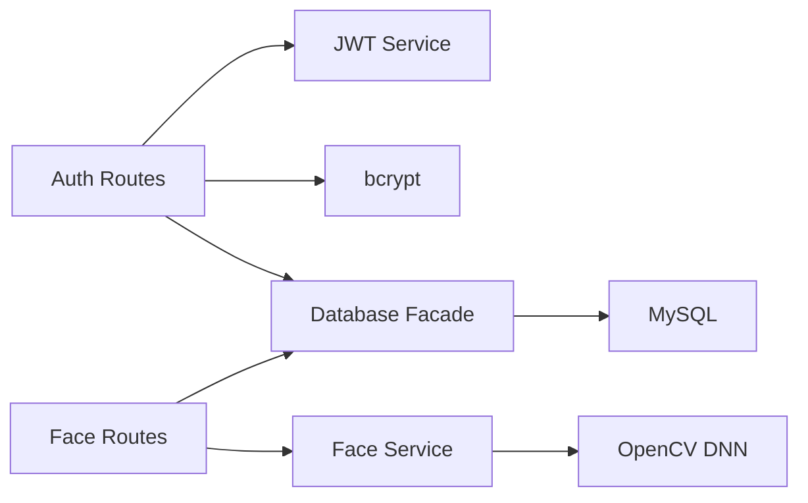

**Diagram sources**
- [routes/auth.py:14-744](file://server/routes/auth.py#L14-L744)
- [routes/face_recognition.py:1-282](file://server/routes/face_recognition.py#L1-L282)
- [services/face_service.py:1-177](file://server/services/face_service.py#L1-L177)
- [database.py:1-76](file://server/database.py#L1-L76)

**Section sources**
- [routes/auth.py:14-744](file://server/routes/auth.py#L14-L744)
- [routes/face_recognition.py:1-282](file://server/routes/face_recognition.py#L1-L282)
- [services/face_service.py:1-177](file://server/services/face_service.py#L1-L177)
- [database.py:1-76](file://server/database.py#L1-L76)

## Performance Considerations
- Asynchronous Hashing
  - bcrypt operations run in threadpool to prevent blocking I/O
- Connection Pooling
  - MySQL connection pool reduces overhead and improves throughput
- Face Recognition
  - Model loading and detection occur per-request; consider caching models in production
- Token Expiry
  - 24-hour expiry balances usability and security

[No sources needed since this section provides general guidance]

## Troubleshooting Guide
- CORS Issues
  - Verify allow_origins and credentials settings in middleware
- JWT Errors
  - Check token expiration and algorithm configuration
- Database Connectivity
  - Confirm pool initialization and connection timeouts
- Face Recognition Failures
  - Ensure OpenCV models are downloaded and accessible
- Audit Failures
  - Verify stored procedures and transaction control

**Section sources**
- [main.py:60-67](file://server/main.py#L60-L67)
- [routes/auth.py:580-589](file://server/routes/auth.py#L580-L589)
- [database.py:14-76](file://server/database.py#L14-L76)
- [services/face_service.py:24-46](file://server/services/face_service.py#L24-L46)

## Conclusion
The Traffic Violation Management System implements a robust, multi-layered security architecture combining JWT authentication, bcrypt hashing, and face recognition biometrics. Security is enforced through Pydantic validation, parameterized queries, CORS configuration, and comprehensive audit logging. The architecture supports role-based access control and is designed for compliance with government-grade security requirements.

[No sources needed since this section summarizes without analyzing specific files]

## Appendices

### Security Configuration Reference
- JWT Secret and Algorithm
  - Secret and algorithm configured via environment settings
- Database Credentials
  - Hardcoded in current implementation; should be moved to environment variables
- CORS Origins
  - Should be restricted in production environments

**Section sources**
- [config.py:18-31](file://server/config.py#L18-L31)
- [database.py:20-35](file://server/database.py#L20-L35)
- [main.py:60-67](file://server/main.py#L60-L67)