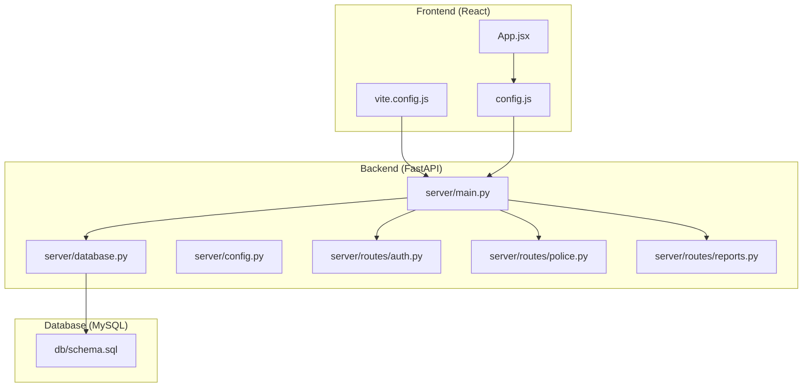
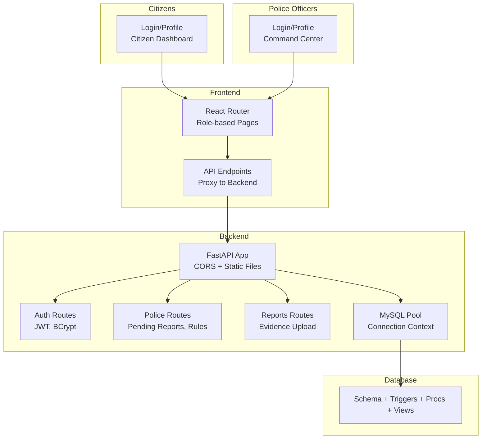
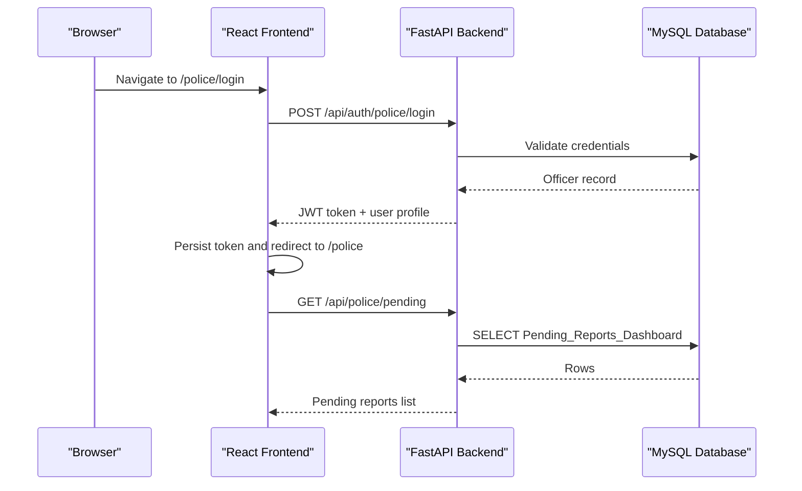
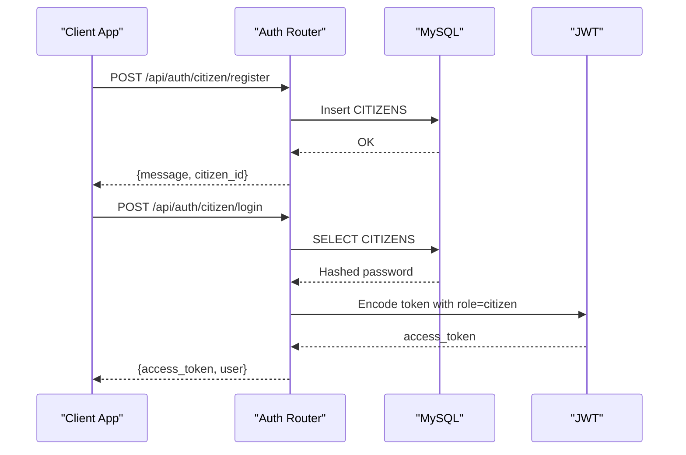
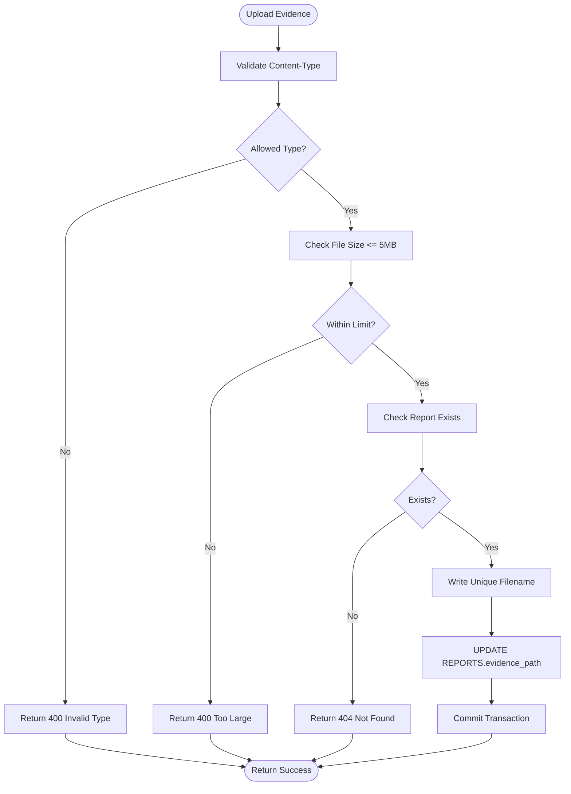
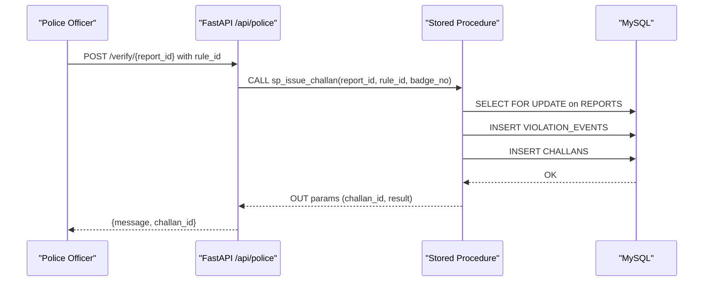
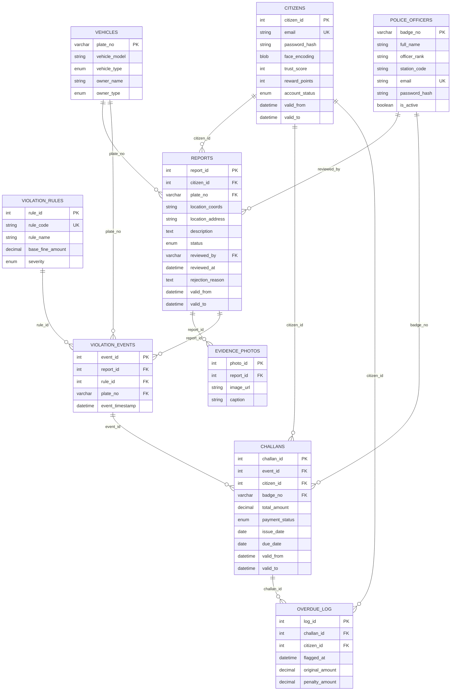
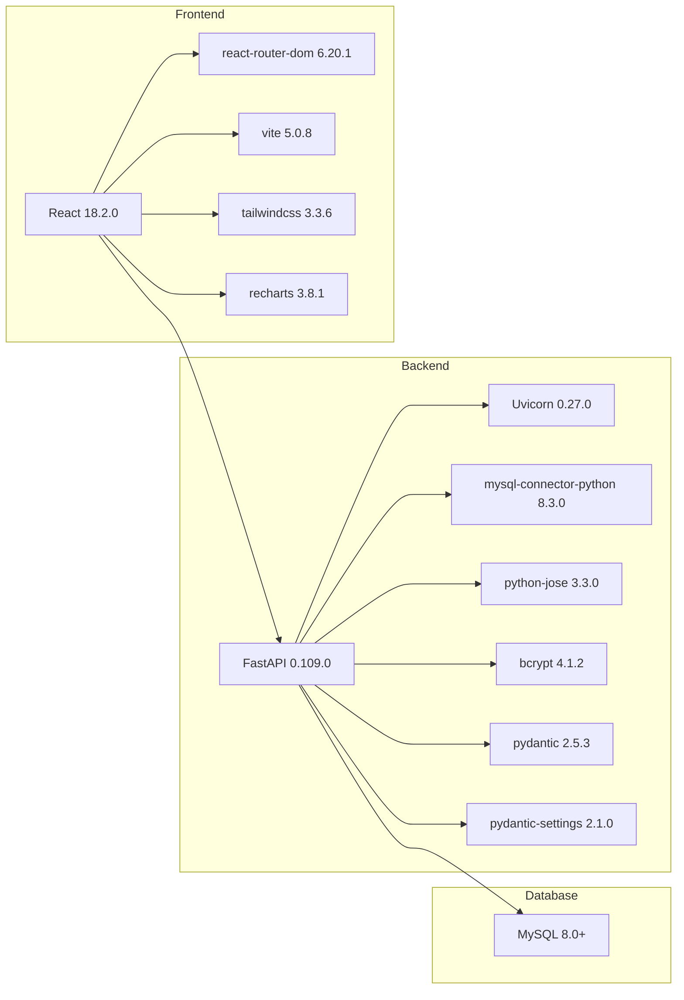
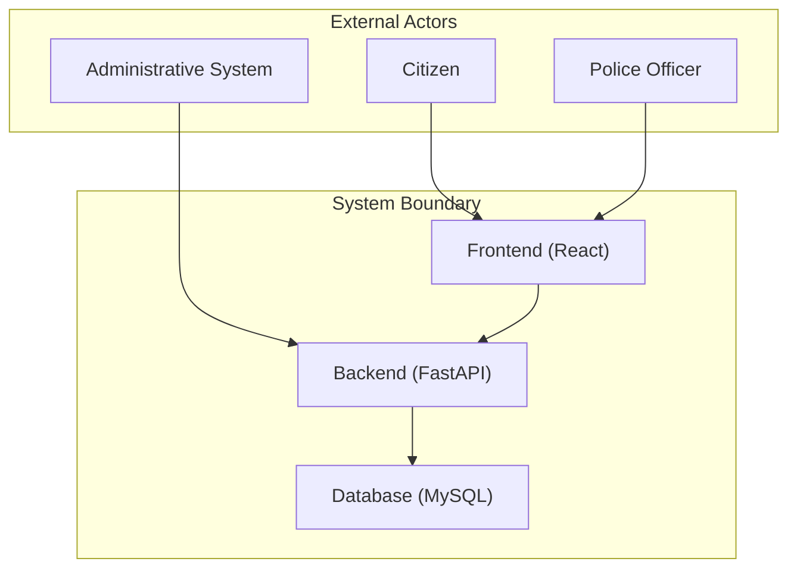

# System Architecture

<cite>
**Referenced Files in This Document**
- [README.md](file://README.md)
- [main.py](file://server/main.py)
- [requirements.txt](file://server/requirements.txt)
- [database.py](file://server/database.py)
- [config.py](file://server/config.py)
- [auth.py](file://server/routes/auth.py)
- [police.py](file://server/routes/police.py)
- [reports.py](file://server/routes/reports.py)
- [schema.sql](file://db/schema.sql)
- [App.jsx](file://frontend/src/App.jsx)
- [config.js](file://frontend/src/config.js)
- [vite.config.js](file://frontend/vite.config.js)
</cite>

## Table of Contents
1. [Introduction](#introduction)
2. [Project Structure](#project-structure)
3. [Core Components](#core-components)
4. [Architecture Overview](#architecture-overview)
5. [Detailed Component Analysis](#detailed-component-analysis)
6. [Dependency Analysis](#dependency-analysis)
7. [Performance Considerations](#performance-considerations)
8. [Troubleshooting Guide](#troubleshooting-guide)
9. [Conclusion](#conclusion)
10. [Appendices](#appendices)

## Introduction
This document describes the Traffic Violation Management System (TVMS) architecture. The system follows a three-layer design:
- React frontend serving dual portals: citizen and police
- FastAPI backend exposing REST APIs
- MySQL database with advanced features (stored procedures, triggers, views, temporal tables)

It implements a dual-API approach with separate citizen and police portals to align with distinct user roles, responsibilities, and security contexts. The backend leverages FastAPI for performance and developer ergonomics, while the frontend uses React for modern UI/UX and responsive navigation. The database employs MySQL 8.0+ with PL/SQL-like constructs to enforce business rules, maintain audit trails, and ensure concurrency safety.

## Project Structure
The repository is organized into:
- server: FastAPI backend with routes, database pool, configuration, and middleware
- frontend: React application with routing and UI components
- db: Database schema, triggers, stored procedures, and supporting scripts
- scripts: Deployment and setup helpers

**Diagram sources**
- [main.py:1-107](file://server/main.py#L1-L107)
- [database.py:1-76](file://server/database.py#L1-L76)
- [config.py:1-41](file://server/config.py#L1-L41)
- [auth.py:1-740](file://server/routes/auth.py#L1-L740)
- [police.py:1-220](file://server/routes/police.py#L1-L220)
- [reports.py:1-200](file://server/routes/reports.py#L1-L200)
- [schema.sql:1-942](file://db/schema.sql#L1-L942)
- [App.jsx:1-274](file://frontend/src/App.jsx#L1-L274)
- [config.js:1-34](file://frontend/src/config.js#L1-L34)
- [vite.config.js:1-23](file://frontend/vite.config.js#L1-L23)

**Section sources**
- [README.md:45-94](file://README.md#L45-L94)
- [main.py:1-107](file://server/main.py#L1-L107)
- [database.py:1-76](file://server/database.py#L1-L76)
- [config.py:1-41](file://server/config.py#L1-L41)
- [schema.sql:1-942](file://db/schema.sql#L1-L942)
- [App.jsx:1-274](file://frontend/src/App.jsx#L1-L274)
- [config.js:1-34](file://frontend/src/config.js#L1-L34)
- [vite.config.js:1-23](file://frontend/vite.config.js#L1-L23)

## Core Components
- Frontend (React)
  - Routing and role-based navigation
  - API endpoints configuration
  - Proxy configuration to backend
- Backend (FastAPI)
  - Central application lifecycle and CORS
  - Route registration for authentication, reports, challans, vehicles, rules, and optional police/trust routes
  - Database connection pooling and settings
  - Health checks and static file serving for uploads
- Database (MySQL)
  - 5NF-normalized schema with temporal versioning
  - Triggers for trust scoring and audit trails
  - Stored procedures for challan issuance, payment, rejection, and overdue flagging
  - Views for dashboards and performance metrics

Key implementation references:
- Backend entrypoint and router mounting: [main.py:77-87](file://server/main.py#L77-L87)
- Database pool initialization and context managers: [database.py:14-76](file://server/database.py#L14-L76)
- Authentication routes (citizen and police): [auth.py:114-491](file://server/routes/auth.py#L114-L491)
- Police portal endpoints: [police.py:25-220](file://server/routes/police.py#L25-L220)
- Reports upload and creation: [reports.py:50-200](file://server/routes/reports.py#L50-L200)
- Database schema and stored procedures: [schema.sql:116-546](file://db/schema.sql#L116-L546)

**Section sources**
- [main.py:1-107](file://server/main.py#L1-L107)
- [database.py:1-76](file://server/database.py#L1-L76)
- [auth.py:1-740](file://server/routes/auth.py#L1-L740)
- [police.py:1-220](file://server/routes/police.py#L1-L220)
- [reports.py:1-200](file://server/routes/reports.py#L1-L200)
- [schema.sql:1-942](file://db/schema.sql#L1-L942)

## Architecture Overview
The system enforces a clean separation of concerns:
- Frontend handles UI, routing, and local persistence (localStorage)
- Backend exposes REST endpoints with JWT-based authentication and authorization
- Database encapsulates business logic via triggers, procedures, and views

**Diagram sources**
- [main.py:50-103](file://server/main.py#L50-L103)
- [database.py:14-76](file://server/database.py#L14-L76)
- [auth.py:114-491](file://server/routes/auth.py#L114-L491)
- [police.py:25-220](file://server/routes/police.py#L25-L220)
- [reports.py:50-200](file://server/routes/reports.py#L50-L200)
- [schema.sql:116-546](file://db/schema.sql#L116-L546)
- [App.jsx:1-274](file://frontend/src/App.jsx#L1-L274)
- [config.js:1-34](file://frontend/src/config.js#L1-L34)
- [vite.config.js:1-23](file://frontend/vite.config.js#L1-L23)

## Detailed Component Analysis

### Dual-API Design: Citizen and Police Portals
Rationale:
- Role segregation reduces attack surface and simplifies access control
- Separate dashboards optimize UX for each stakeholder
- Business logic isolation ensures compliance and auditability

Implementation highlights:
- Frontend routes differentiate between citizen and police contexts
- Backend routes mount police-specific endpoints conditionally
- Authentication routes support two user types with distinct payloads

**Diagram sources**
- [App.jsx:180-239](file://frontend/src/App.jsx#L180-L239)
- [config.js:17-21](file://frontend/src/config.js#L17-L21)
- [auth.py:399-491](file://server/routes/auth.py#L399-L491)
- [police.py:25-46](file://server/routes/police.py#L25-L46)
- [schema.sql:764-780](file://db/schema.sql#L764-L780)

**Section sources**
- [App.jsx:1-274](file://frontend/src/App.jsx#L1-L274)
- [config.js:1-34](file://frontend/src/config.js#L1-L34)
- [auth.py:114-491](file://server/routes/auth.py#L114-L491)
- [police.py:25-220](file://server/routes/police.py#L25-L220)
- [schema.sql:764-780](file://db/schema.sql#L764-L780)

### Authentication and Authorization Flow
- JWT-based session tokens with configurable expiry
- Role-aware profile retrieval and updates
- Password hashing with bcrypt
- Conditional route inclusion for police/trust modules

**Diagram sources**
- [auth.py:114-308](file://server/routes/auth.py#L114-L308)
- [schema.sql:26-43](file://db/schema.sql#L26-L43)

**Section sources**
- [auth.py:1-740](file://server/routes/auth.py#L1-L740)
- [schema.sql:26-43](file://db/schema.sql#L26-L43)

### Evidence Upload Pipeline
- Frontend uploads images to backend with multipart/form-data
- Backend validates type and size, persists file, and updates report metadata
- Static file serving exposes uploads to clients

**Diagram sources**
- [reports.py:50-121](file://server/routes/reports.py#L50-L121)

**Section sources**
- [reports.py:1-200](file://server/routes/reports.py#L1-L200)
- [main.py:69-72](file://server/main.py#L69-L72)

### Challan Issuance and Payment with Concurrency Control
- Stored procedures encapsulate ACID transactions
- Row-level locks prevent race conditions
- Audit trails maintained via triggers and history tables

**Diagram sources**
- [police.py:48-94](file://server/routes/police.py#L48-L94)
- [schema.sql:440-546](file://db/schema.sql#L440-L546)

**Section sources**
- [police.py:1-220](file://server/routes/police.py#L1-L220)
- [schema.sql:440-546](file://db/schema.sql#L440-L546)

### Database Model and Business Logic
The database schema defines core entities and advanced features:
- Core entities: CITIZENS, POLICE_OFFICERS, VEHICLES, VIOLATION_RULES, REPORTS, EVIDENCE_PHOTOS, VIOLATION_EVENTS, CHALLANS, OVERDUE_LOG
- Temporal versioning via valid_from/valid_to and dedicated HISTORY tables
- Triggers for trust score automation and audit trail creation
- Stored procedures for challan issuance, payment, rejection, and overdue flagging
- Views for dashboards and performance metrics

**Diagram sources**
- [schema.sql:26-235](file://db/schema.sql#L26-L235)

**Section sources**
- [schema.sql:1-942](file://db/schema.sql#L1-L942)

## Dependency Analysis
Technology stack and version compatibility:
- Backend
  - FastAPI 0.109.0, Uvicorn 0.27.0
  - mysql-connector-python 8.3.0
  - python-jose[cryptography] 3.3.0, passlib[bcrypt] 1.7.4, bcrypt 4.1.2
  - pydantic 2.5.3, pydantic-settings 2.1.0
  - aiofiles 23.2.1
- Frontend
  - React 18.2.0, React Router DOM 6.20.1
  - Vite 5.0.8, Tailwind CSS 3.3.6
  - Leaflet 1.9.4, React Leaflet 5.0.0, Recharts 3.8.1
- Database
  - MySQL 8.0+ with triggers, stored procedures, and events

External integrations:
- OpenCV DNN models for face recognition (models directory)
- WebRTC (navigator.mediaDevices) for webcam capture

**Diagram sources**
- [requirements.txt:1-13](file://server/requirements.txt#L1-L13)
- [package.json:1-30](file://frontend/package.json#L1-L30)
- [README.md:287-297](file://README.md#L287-L297)

**Section sources**
- [requirements.txt:1-13](file://server/requirements.txt#L1-L13)
- [package.json:1-30](file://frontend/package.json#L1-L30)
- [README.md:287-297](file://README.md#L287-L297)

## Performance Considerations
- Backend
  - Connection pooling reduces overhead and improves throughput under load
  - Async FastAPI enables efficient I/O-bound workloads
  - Stored procedures centralize critical logic and reduce round-trips
- Database
  - Indexes on frequently filtered columns (status, dates, foreign keys)
  - Triggers and views precompute dashboards for real-time insights
  - Events auto-purge transient data to control growth
- Frontend
  - Vite bundling and proxy reduce latency during development
  - Local state caching minimizes repeated network requests

[No sources needed since this section provides general guidance]

## Troubleshooting Guide
Common issues and resolutions:
- Backend startup failures
  - Verify MySQL service is running and credentials are correct
  - Ensure dependencies are installed per requirements.txt
- Frontend cannot connect to backend
  - Confirm Vite proxy targets the backend host/port
  - Check CORS configuration and allowed origins
- Database errors
  - Recreate schema using provided scripts
  - Validate MySQL version meets minimum requirements
- Authentication problems
  - Confirm JWT secret and algorithm alignment
  - Check bcrypt hashing and token expiry settings

**Section sources**
- [README.md:371-392](file://README.md#L371-L392)
- [vite.config.js:7-22](file://frontend/vite.config.js#L7-L22)
- [config.py:18-27](file://server/config.py#L18-L27)

## Conclusion
The TVMS architecture cleanly separates concerns across a React frontend, FastAPI backend, and MySQL database. The dual-API design supports distinct citizen and police experiences while maintaining unified business logic and robust data integrity. Advanced database features (triggers, procedures, views, temporal tables) ensure compliance, auditability, and concurrency safety. The technology choices balance performance, maintainability, and academic rigor.

[No sources needed since this section summarizes without analyzing specific files]

## Appendices

### System Context Diagrams
High-level interactions among citizens, police officers, and administrative systems:

[No sources needed since this diagram shows conceptual workflow, not actual code structure]

### Infrastructure Requirements and Deployment Topology
- Minimum hardware
  - CPU: Quad-core recommended
  - RAM: 8 GB minimum, 16 GB recommended
  - Disk: SSD with 50 GB free space for OS, database, and logs
- Software stack
  - OS: Windows/Linux/macOS
  - Runtime: Python 3.10+, Node.js 18+
  - Database: MySQL 8.0+
- Network
  - Ports: 5000 (backend), 5173 (frontend), 3306 (MySQL)
  - CORS and reverse proxy configuration for development and production
- Scalability
  - Horizontal scaling: Stateless backend behind a load balancer
  - Database: Primary-standby replication and read replicas for reporting
  - CDN: Serve static uploads and evidence photos
- Monitoring and Observability
  - Backend: Uvicorn logs, structured logging, health endpoints
  - Database: Slow query log, event scheduler monitoring, backup verification
  - Frontend: Error boundaries, performance metrics collection
- Disaster Recovery
  - Automated backups with retention policies
  - Point-in-time recovery procedures
  - Geo-redundant storage for evidence files

[No sources needed since this section provides general guidance]