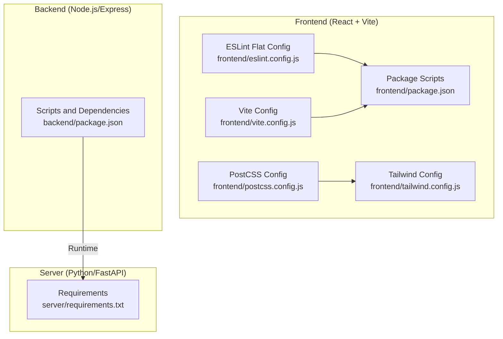
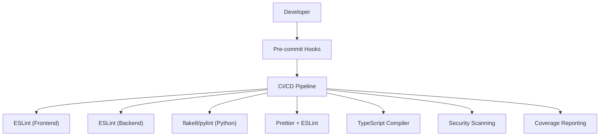
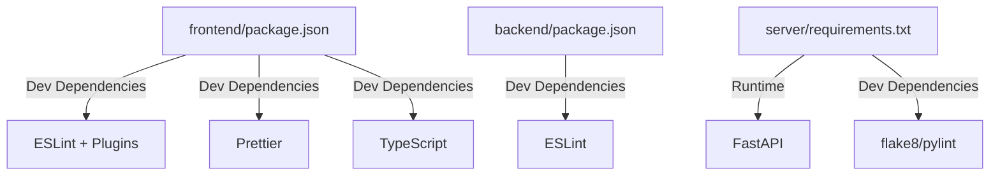

# Code Quality Tools

<cite>
**Referenced Files in This Document**
- [frontend/eslint.config.js](file://frontend/eslint.config.js)
- [frontend/package.json](file://frontend/package.json)
- [frontend/vite.config.js](file://frontend/vite.config.js)
- [frontend/postcss.config.js](file://frontend/postcss.config.js)
- [frontend/tailwind.config.js](file://frontend/tailwind.config.js)
- [backend/package.json](file://backend/package.json)
- [server/requirements.txt](file://server/requirements.txt)
- [README.md](file://README.md)
</cite>

## Table of Contents
1. [Introduction](#introduction)
2. [Project Structure](#project-structure)
3. [Core Components](#core-components)
4. [Architecture Overview](#architecture-overview)
5. [Detailed Component Analysis](#detailed-component-analysis)
6. [Dependency Analysis](#dependency-analysis)
7. [Performance Considerations](#performance-considerations)
8. [Troubleshooting Guide](#troubleshooting-guide)
9. [Conclusion](#conclusion)
10. [Appendices](#appendices)

## Introduction
This document provides comprehensive code quality and static analysis guidance for the Traffic Violation Management System. It covers:
- ESLint configuration and recommended practices for React code quality
- Prettier setup for consistent formatting across frontend and backend
- Python linting with flake8 and pylint for backend quality
- TypeScript configuration for enhanced type safety
- Security scanning, dependency vulnerability checks, and automated code review processes
- Pre-commit hooks, CI/CD quality gates, and automated validation
- Code coverage measurement and continuous improvement strategies

## Project Structure
The repository is organized into three primary areas:
- Frontend (React + Vite): configuration and linting via ESLint flat config
- Backend (Node.js/Express): development scripts and runtime dependencies
- Server (Python/FastAPI): dependency management via requirements.txt

**Diagram sources**
- [frontend/eslint.config.js](file://frontend/eslint.config.js)
- [frontend/package.json](file://frontend/package.json)
- [frontend/vite.config.js](file://frontend/vite.config.js)
- [frontend/postcss.config.js](file://frontend/postcss.config.js)
- [frontend/tailwind.config.js](file://frontend/tailwind.config.js)
- [backend/package.json](file://backend/package.json)
- [server/requirements.txt](file://server/requirements.txt)

**Section sources**
- [README.md](file://README.md)

## Core Components
This section outlines the current state of code quality tooling and recommended enhancements.

- Frontend ESLint
  - Current configuration uses a flat config extending recommended rules for JavaScript and React, plus React Hooks and React Refresh plugins.
  - Recommended additions: import sorting, accessibility rules, and stricter React rulesets tailored to the project’s component patterns.

- Frontend Formatting and Build
  - Prettier is not configured in the repository. Introduce Prettier alongside ESLint for consistent formatting.
  - Tailwind and PostCSS are present; align formatting rules to avoid conflicts.

- Backend Node.js
  - No dedicated linting configuration exists. Add ESLint for JavaScript/Node.js with appropriate environments and plugin presets.
  - Consider adding a linter script to package.json for automated checks.

- Server Python
  - No flake8 or pylint configuration found. Add both tools with minimal shared baseline rules and integrate into CI.
  - requirements.txt lists FastAPI and related packages; ensure linting and type checking are part of the development workflow.

- TypeScript
  - The project does not include a tsconfig.json. Add a strict tsconfig.json for enhanced type safety and static analysis.

- Security and Vulnerabilities
  - No security scanning or dependency vulnerability checks are configured. Integrate npm audit, safety, or similar tools into CI.

- Automated Code Review
  - No pre-commit hooks or CI quality gates are configured. Set up pre-commit hooks and CI jobs to enforce linting, formatting, and tests.

- Coverage and Metrics
  - No code coverage configuration is present. Add coverage reporting and integrate metrics into CI.

**Section sources**
- [frontend/eslint.config.js](file://frontend/eslint.config.js)
- [frontend/package.json](file://frontend/package.json)
- [frontend/vite.config.js](file://frontend/vite.config.js)
- [frontend/postcss.config.js](file://frontend/postcss.config.js)
- [frontend/tailwind.config.js](file://frontend/tailwind.config.js)
- [backend/package.json](file://backend/package.json)
- [server/requirements.txt](file://server/requirements.txt)

## Architecture Overview
The code quality pipeline integrates local developer workflows with CI/CD gates. The diagram below illustrates how linting, formatting, testing, and security checks fit into the development lifecycle.

[No sources needed since this diagram shows conceptual workflow, not actual code structure]

## Detailed Component Analysis

### Frontend ESLint Configuration
Current state:
- Uses ESLint flat config with recommended base rules, React Hooks, and React Refresh plugins.
- Targets JavaScript/JSX files and sets browser globals.

Recommended enhancements:
- Import sorting: configure a plugin to enforce consistent import order and grouping.
- Accessibility: add accessibility-related rules aligned with React components.
- React-specific rules: tighten JSX and component structure rules to match project conventions.
- Global ignores: ensure distribution artifacts are excluded from linting.

Implementation guidance:
- Extend the existing flat config with additional plugin configs.
- Define overrides for JSX and component files.
- Add a lint script to package.json.

**Section sources**
- [frontend/eslint.config.js](file://frontend/eslint.config.js)
- [frontend/package.json](file://frontend/package.json)

### Frontend Formatting with Prettier
Current state:
- Prettier is not configured in the repository.

Recommended setup:
- Install Prettier and configure an editor integration.
- Create a Prettier configuration file to align with existing Tailwind and PostCSS setups.
- Add a format script to package.json and integrate with pre-commit hooks.

Benefits:
- Consistent formatting reduces diffs and improves readability.
- Aligns with ESLint’s style enforcement.

**Section sources**
- [frontend/package.json](file://frontend/package.json)
- [frontend/postcss.config.js](file://frontend/postcss.config.js)
- [frontend/tailwind.config.js](file://frontend/tailwind.config.js)

### Backend Node.js Linting
Current state:
- No dedicated linting configuration exists.

Recommended setup:
- Add ESLint for Node.js with appropriate env and parser options.
- Configure plugins for Express and modern JavaScript features.
- Add a lint script to package.json and include it in pre-commit hooks.

**Section sources**
- [backend/package.json](file://backend/package.json)

### Python Linting with flake8 and pylint
Current state:
- No flake8 or pylint configuration found.

Recommended setup:
- Create a flake8 configuration with minimal baseline rules.
- Create a pylint configuration with sensible defaults and disable noisy warnings.
- Add scripts to requirements.txt-based workflow and integrate into CI.

**Section sources**
- [server/requirements.txt](file://server/requirements.txt)

### TypeScript Configuration
Current state:
- No tsconfig.json is present.

Recommended setup:
- Add a strict tsconfig.json to enable enhanced type safety and static analysis.
- Configure module resolution, target, and strictness based on project needs.
- Integrate with IDEs and CI for type checking.

**Section sources**
- [frontend/package.json](file://frontend/package.json)

### Security Scanning and Dependency Vulnerability Checks
Current state:
- No security scanning configuration is present.

Recommended setup:
- Integrate npm audit for Node.js dependencies.
- Integrate safety or bandit for Python dependencies.
- Add security checks to CI quality gates.

**Section sources**
- [backend/package.json](file://backend/package.json)
- [server/requirements.txt](file://server/requirements.txt)

### Automated Code Review Processes
Current state:
- No pre-commit hooks or CI quality gates are configured.

Recommended setup:
- Configure pre-commit hooks to run linting, formatting, and tests locally.
- Add CI jobs to enforce the same checks on pull requests.
- Gate merges until quality criteria are met.

**Section sources**
- [frontend/package.json](file://frontend/package.json)
- [backend/package.json](file://backend/package.json)
- [server/requirements.txt](file://server/requirements.txt)

### Code Coverage Measurement
Current state:
- No code coverage configuration is present.

Recommended setup:
- Add coverage reporting for frontend and backend tests.
- Integrate coverage thresholds in CI to prevent regressions.
- Track and report coverage metrics over time.

**Section sources**
- [frontend/package.json](file://frontend/package.json)
- [backend/package.json](file://backend/package.json)

## Dependency Analysis
This section maps the current tooling dependencies and highlights gaps.

**Diagram sources**
- [frontend/package.json](file://frontend/package.json)
- [backend/package.json](file://backend/package.json)
- [server/requirements.txt](file://server/requirements.txt)

**Section sources**
- [frontend/package.json](file://frontend/package.json)
- [backend/package.json](file://backend/package.json)
- [server/requirements.txt](file://server/requirements.txt)

## Performance Considerations
- Keep linting and formatting checks fast by limiting file globs and using incremental checks where possible.
- Run type checking and security scans in parallel within CI to reduce total pipeline time.
- Cache dependencies and tooling outputs to speed up repeated runs.

[No sources needed since this section provides general guidance]

## Troubleshooting Guide
Common issues and resolutions:
- ESLint fails on JSX syntax: ensure parser options include JSX support and React plugin is enabled.
- Prettier conflicts with Tailwind: configure Prettier to sort Tailwind classes and align with PostCSS.
- Python linting errors: start with minimal flake8 rules and gradually increase strictness; adjust pylint disables for project-specific exceptions.
- CI failures on missing coverage: add coverage configuration and set minimum thresholds to pass PR checks.

**Section sources**
- [frontend/eslint.config.js](file://frontend/eslint.config.js)
- [frontend/package.json](file://frontend/package.json)
- [backend/package.json](file://backend/package.json)
- [server/requirements.txt](file://server/requirements.txt)

## Conclusion
The Traffic Violation Management System currently has a solid foundation for frontend linting but lacks comprehensive code quality tooling across all stacks. By integrating Prettier, Python linting, TypeScript configuration, security scanning, pre-commit hooks, CI quality gates, and coverage reporting, the project can achieve consistent, maintainable, and secure code quality at scale.

[No sources needed since this section summarizes without analyzing specific files]

## Appendices
- Example scripts to add to package.json:
  - Frontend: lint and format scripts
  - Backend: lint script
  - Server: lint and test scripts
- CI templates to enforce quality gates
- Pre-commit hook configuration examples

[No sources needed since this section provides general guidance]