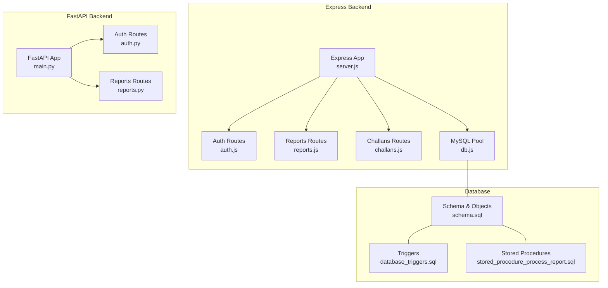
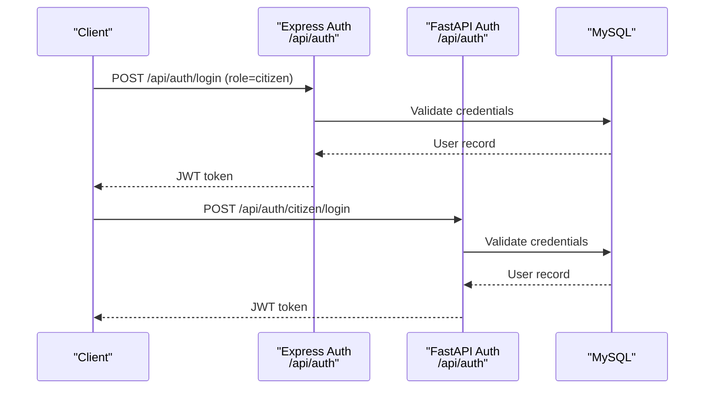
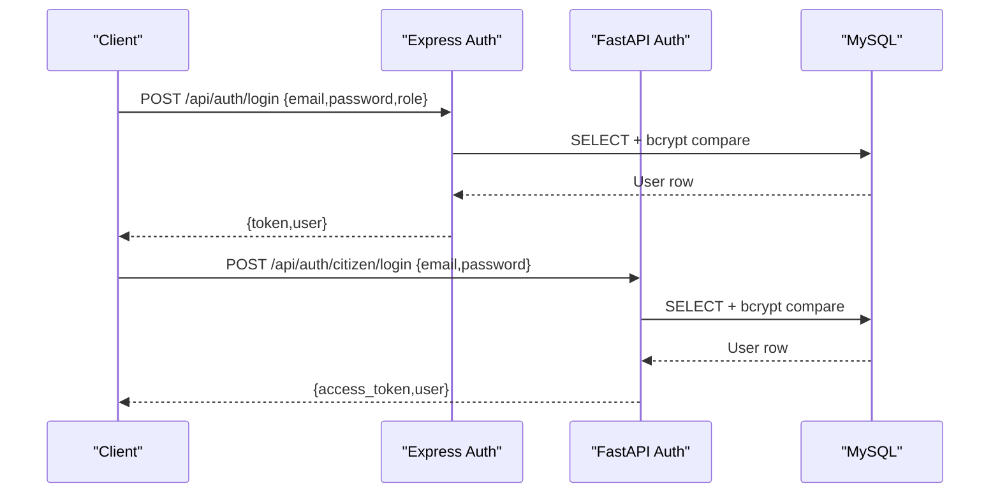
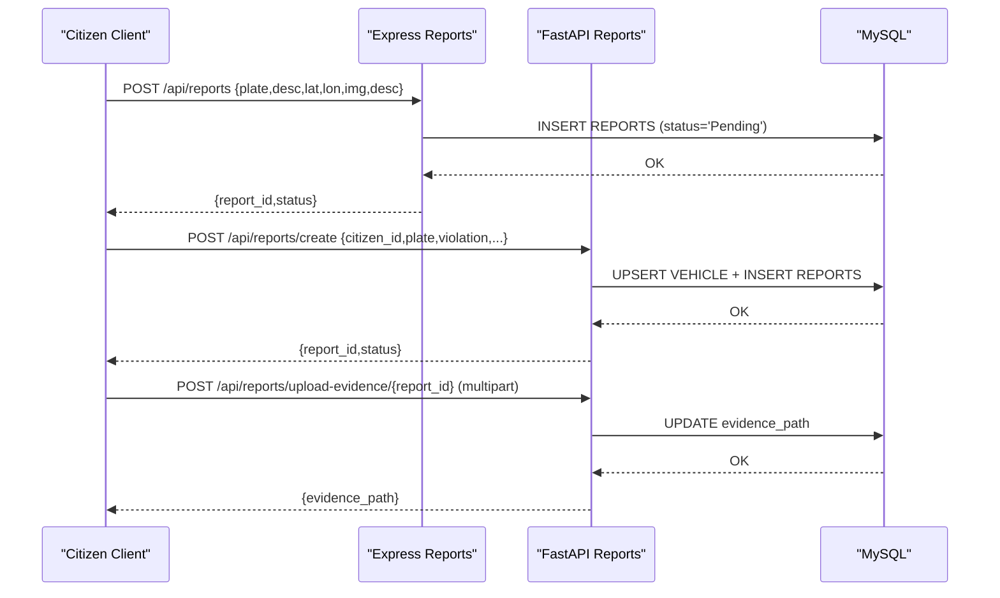
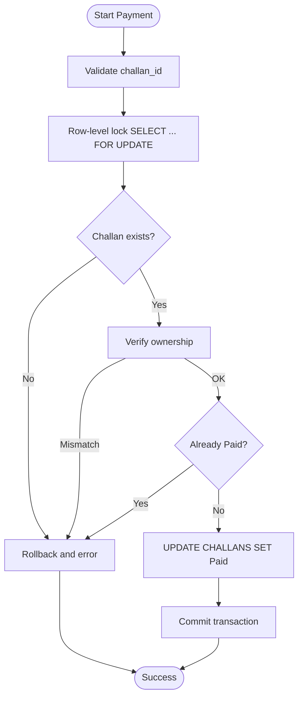
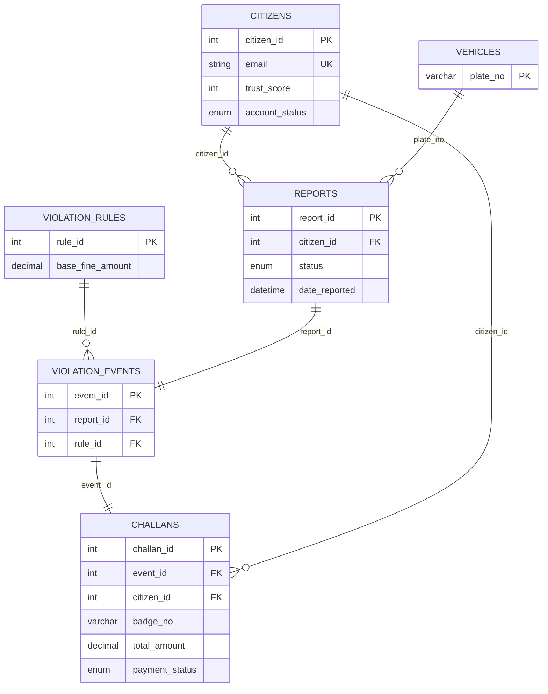
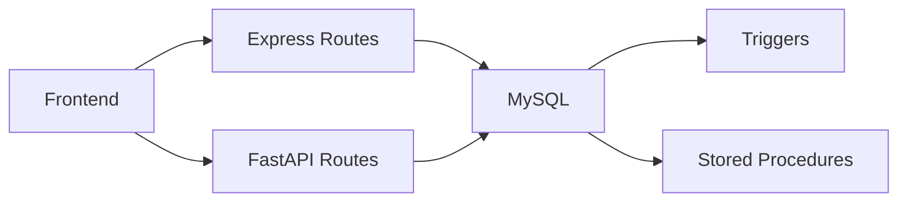

# Integration Testing

<cite>
**Referenced Files in This Document**
- [server.js](file://backend/server.js)
- [main.py](file://server/main.py)
- [db.js](file://backend/db.js)
- [database.py](file://server/database.py)
- [auth.js](file://backend/routes/auth.js)
- [reports.js](file://backend/routes/reports.js)
- [challans.js](file://backend/routes/challans.js)
- [auth.py](file://server/routes/auth.py)
- [reports.py](file://server/routes/reports.py)
- [schema.sql](file://db/schema.sql)
- [stored_procedure_process_report.sql](file://db/stored_procedure_process_report.sql)
- [database_triggers.sql](file://db/database_triggers.sql)
- [setup_demo_environment.bat](file://scripts/setup_demo_environment.bat)
- [test_profile_api.py](file://scripts/test_profile_api.py)
- [test_trust_score_triggers.py](file://scripts/test_trust_score_triggers.py)
</cite>

## Table of Contents
1. [Introduction](#introduction)
2. [Project Structure](#project-structure)
3. [Core Components](#core-components)
4. [Architecture Overview](#architecture-overview)
5. [Detailed Component Analysis](#detailed-component-analysis)
6. [Dependency Analysis](#dependency-analysis)
7. [Performance Considerations](#performance-considerations)
8. [Troubleshooting Guide](#troubleshooting-guide)
9. [Conclusion](#conclusion)
10. [Appendices](#appendices)

## Introduction
This document provides comprehensive integration testing guidance for the Traffic Violation Management System. It covers end-to-end validation across the Express.js backend, FastAPI backend, and shared MySQL database. It documents API endpoint testing procedures (authentication, report submission, challan generation), database integration testing (transactions, triggers, stored procedures), cross-service communication, real-time dashboards, payment processing workflows, and biometric authentication readiness. It also outlines automated verification scripts, test data setup, environment configuration, and performance validation strategies.

## Project Structure
The system comprises:
- Express.js API server exposing citizen and police endpoints
- FastAPI service hosting advanced routes, analytics, and evidence handling
- Shared MySQL database with normalized schema, triggers, and stored procedures
- Automated setup and verification scripts for environment bootstrapping and validation

**Diagram sources**
- [server.js:1-42](file://backend/server.js#L1-L42)
- [main.py:1-107](file://server/main.py#L1-L107)
- [db.js:1-26](file://backend/db.js#L1-L26)
- [schema.sql:1-942](file://db/schema.sql#L1-L942)
- [database_triggers.sql:1-48](file://db/database_triggers.sql#L1-L48)
- [stored_procedure_process_report.sql:1-115](file://db/stored_procedure_process_report.sql#L1-L115)

**Section sources**
- [server.js:1-42](file://backend/server.js#L1-L42)
- [main.py:1-107](file://server/main.py#L1-L107)
- [db.js:1-26](file://backend/db.js#L1-L26)
- [database.py:1-76](file://server/database.py#L1-L76)
- [schema.sql:1-942](file://db/schema.sql#L1-L942)

## Core Components
- Express server: CORS-enabled, JSON body parsing, health checks, centralized 404/500 handlers, and mounted routes for auth, reports, police, and challans.
- FastAPI server: CORS middleware, static file serving for evidence uploads, modular routers, health check, and root endpoint.
- Database connectivity: Express uses mysql2/promise pool; FastAPI uses mysql connector pooling with context-managed transactions and rollback on errors.
- Routing modules: Express routes enforce role-based access and JWT-based authentication; FastAPI routes implement citizen/police registration/login and report lifecycle operations.

Key integration touchpoints:
- Cross-service authentication: Both stacks use JWT; ensure consistent secret and claims across services.
- Evidence upload pipeline: FastAPI handles file uploads and updates report metadata; ensure upload directory permissions and static mount.
- Report lifecycle: Express and FastAPI share the same schema; triggers manage trust scoring; stored procedures encapsulate ACID workflows.

**Section sources**
- [server.js:1-42](file://backend/server.js#L1-L42)
- [main.py:50-103](file://server/main.py#L50-L103)
- [db.js:1-26](file://backend/db.js#L1-L26)
- [database.py:14-76](file://server/database.py#L14-L76)
- [auth.js:1-117](file://backend/routes/auth.js#L1-L117)
- [auth.py:114-491](file://server/routes/auth.py#L114-L491)
- [reports.js:147-410](file://server/routes/reports.py#L147-L410)
- [reports.py:50-121](file://server/routes/reports.py#L50-L121)
- [challans.js:31-98](file://backend/routes/challans.js#L31-L98)

## Architecture Overview
The integration architecture supports:
- Dual-backend design: Express for citizen-facing endpoints and FastAPI for advanced operations and analytics.
- Centralized database with triggers and stored procedures enforcing business rules.
- Evidence upload pipeline integrated via FastAPI static file serving.
- Real-time dashboards consuming shared REPORTS and CITIZENS data.

**Diagram sources**
- [auth.js:9-76](file://backend/routes/auth.js#L9-L76)
- [auth.py:218-293](file://server/routes/auth.py#L218-L293)

## Detailed Component Analysis

### Authentication Workflows
Testing strategy:
- Validate login endpoints for both stacks return valid JWTs and user profiles.
- Confirm token decoding yields expected claims (role, sub).
- Test protected profile retrieval with Authorization header.
- Verify error propagation for invalid/expired tokens and missing headers.

**Diagram sources**
- [auth.js:9-76](file://backend/routes/auth.js#L9-L76)
- [auth.py:218-293](file://server/routes/auth.py#L218-L293)

**Section sources**
- [auth.js:9-117](file://backend/routes/auth.js#L9-L117)
- [auth.py:114-491](file://server/routes/auth.py#L114-L491)
- [test_profile_api.py:1-49](file://scripts/test_profile_api.py#L1-L49)

### Report Submission Pipeline
Testing strategy:
- Express citizen submits report via POST /api/reports with required fields.
- FastAPI citizen creates report via POST /api/reports/create; optionally uploads evidence via POST /api/reports/upload-evidence/{report_id}.
- Verify report status transitions and trust score updates via triggers.
- Validate pending reports retrieval for police via FastAPI GET /api/reports/police/pending.

**Diagram sources**
- [reports.js:7-31](file://backend/routes/reports.js#L7-L31)
- [reports.py:147-223](file://server/routes/reports.py#L147-L223)
- [reports.py:50-121](file://server/routes/reports.py#L50-L121)

**Section sources**
- [reports.js:7-51](file://backend/routes/reports.js#L7-L51)
- [reports.py:147-410](file://server/routes/reports.py#L147-L410)

### Challan Generation and Payment Processing
Testing strategy:
- Challan payment flow: Express POST /api/challans/pay uses row-level locks and transactions to prevent double payments.
- Stored procedures: ACID-compliant workflows for report processing and challan issuance; verify transaction rollback on errors.
- Trust score updates: Triggers fire on REPORTS status changes; validate via stored procedure and manual updates.

**Diagram sources**
- [challans.js:31-98](file://backend/routes/challans.js#L31-L98)

**Section sources**
- [challans.js:31-98](file://backend/routes/challans.js#L31-L98)
- [stored_procedure_process_report.sql:8-98](file://db/stored_procedure_process_report.sql#L8-L98)
- [database_triggers.sql:8-35](file://db/database_triggers.sql#L8-L35)

### Database Integration Testing
Objectives:
- Transaction handling: Validate rollback on exceptions and commit semantics in both Express and FastAPI.
- Trigger execution: Confirm trust score increments/decrements on report status changes.
- Stored procedure validation: Execute procedures with valid/invalid inputs and verify outcomes.

**Diagram sources**
- [schema.sql:26-220](file://db/schema.sql#L26-L220)

**Section sources**
- [schema.sql:1-942](file://db/schema.sql#L1-L942)
- [database_triggers.sql:8-35](file://db/database_triggers.sql#L8-L35)
- [stored_procedure_process_report.sql:8-98](file://db/stored_procedure_process_report.sql#L8-L98)

### Cross-Service Communication Testing
Guidelines:
- CORS configuration: Both servers allow all origins; verify browser-side requests succeed.
- Health checks: Confirm /api/health endpoints return OK on both services.
- Static file serving: Evidence uploads served via FastAPI static mount; ensure upload directory exists and is writable.
- Token consistency: Ensure JWT secrets and claims are aligned across services for seamless cross-auth.

**Section sources**
- [server.js:14-20](file://backend/server.js#L14-L20)
- [main.py:88-95](file://server/main.py#L88-L95)
- [main.py:69-72](file://server/main.py#L69-L72)

### Real-Time Features and Biometric Authentication
Notes:
- Real-time dashboard feeds: Pending reports view aggregates REPORTS and CITIZENS; ensure polling or SSE is implemented in frontend.
- Biometric readiness: CITIZENS table includes a face_encoding BLOB column; implement face recognition service and API in FastAPI.

**Section sources**
- [schema.sql:26-43](file://db/schema.sql#L26-L43)
- [reports.py:411-460](file://server/routes/reports.py#L411-L460)

### Environment Setup and Automated Verification
Scripts:
- Demo environment setup: Generates password hashes, seeds demo accounts, and validates pipeline end-to-end.
- Profile API test: Logs in, decodes JWT, and retrieves profile.
- Trust score trigger verification: Installs triggers if missing, finds test data, and validates +10/-10 score changes.

**Section sources**
- [setup_demo_environment.bat:1-79](file://scripts/setup_demo_environment.bat#L1-L79)
- [test_profile_api.py:1-49](file://scripts/test_profile_api.py#L1-L49)
- [test_trust_score_triggers.py:1-198](file://scripts/test_trust_score_triggers.py#L1-L198)

## Dependency Analysis
- Express routes depend on shared JWT secret and database pool.
- FastAPI routes depend on PyMySQL and local static upload directory.
- Database depends on triggers and stored procedures for business logic.
- Frontend interacts with both backends via HTTP; ensure consistent CORS and token handling.

**Diagram sources**
- [auth.js:1-117](file://backend/routes/auth.js#L1-L117)
- [auth.py:114-491](file://server/routes/auth.py#L114-L491)
- [schema.sql:304-430](file://db/schema.sql#L304-L430)
- [stored_procedure_process_report.sql:6-100](file://db/stored_procedure_process_report.sql#L6-L100)

**Section sources**
- [auth.js:1-117](file://backend/routes/auth.js#L1-L117)
- [auth.py:114-491](file://server/routes/auth.py#L114-L491)
- [schema.sql:304-430](file://db/schema.sql#L304-L430)

## Performance Considerations
- Connection pooling: Tune pool sizes and timeouts in both Express and FastAPI to handle concurrent requests.
- Transactions: Keep transaction durations minimal; release connections promptly.
- Triggers: Avoid heavy logic in triggers; delegate to stored procedures if needed.
- Uploads: Limit file sizes and types; stream uploads to reduce memory overhead.
- Caching: Consider caching frequently accessed views (leaderboard, analytics) with cache invalidation on data changes.

## Troubleshooting Guide
Common issues and resolutions:
- Database connection failures: Verify host, port, user, password, and database name; check pool initialization logs.
- CORS errors: Confirm allow-all configuration on both servers; verify client-origin matches.
- JWT validation failures: Ensure consistent JWT secret and algorithm across services; check token expiry.
- Upload failures: Confirm upload directory exists and is writable; validate file types and sizes.
- Trigger not firing: Run trigger verification script; ensure triggers are installed and report status transitions occur.

**Section sources**
- [database.py:14-76](file://server/database.py#L14-L76)
- [db.js:15-23](file://backend/db.js#L15-L23)
- [test_trust_score_triggers.py:17-48](file://scripts/test_trust_score_triggers.py#L17-L48)

## Conclusion
This integration testing guide provides a structured approach to validating end-to-end workflows, database integrity, cross-service communication, and operational resilience. By leveraging the provided scripts and following the outlined procedures, teams can ensure reliable operation of the Traffic Violation Management System across authentication, reporting, challan processing, and database consistency.

## Appendices

### Example Test Scenarios
- Complete user workflow:
  - Citizen registers (FastAPI), logs in (both stacks), submits report (Express/FastAPI), uploads evidence (FastAPI), receives trust score updates (triggers), and pays challan (Express).
- Error propagation:
  - Attempt unauthorized payment (wrong citizen), double payment (race condition), invalid report status update, and invalid token scenarios.
- Performance validation:
  - Load test endpoints with varying concurrency; measure response times and error rates; monitor database transaction throughput and trigger execution latency.

[No sources needed since this section provides general guidance]