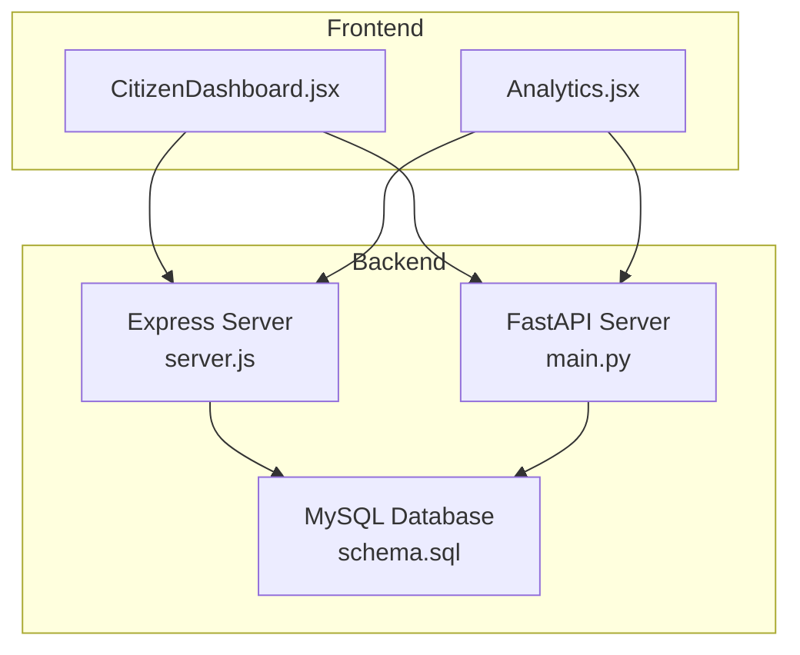
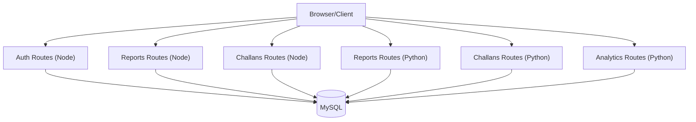
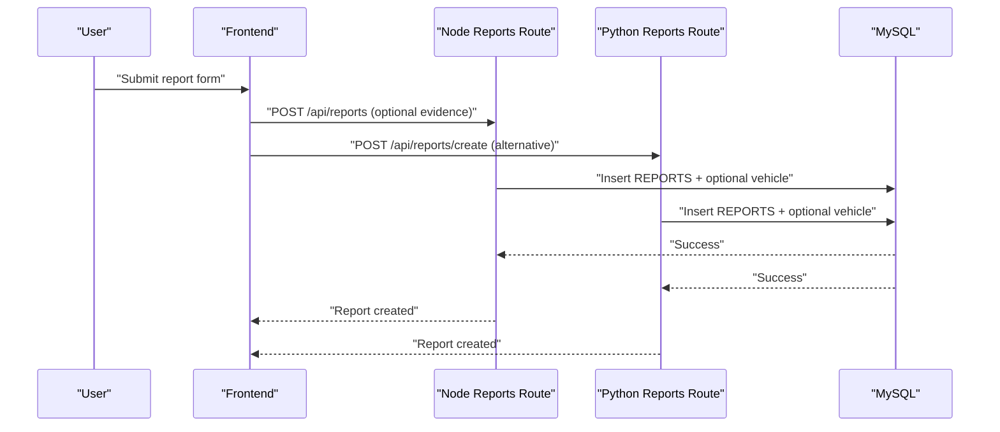
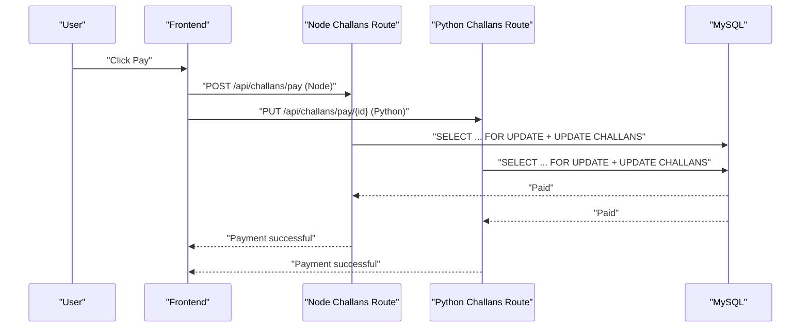
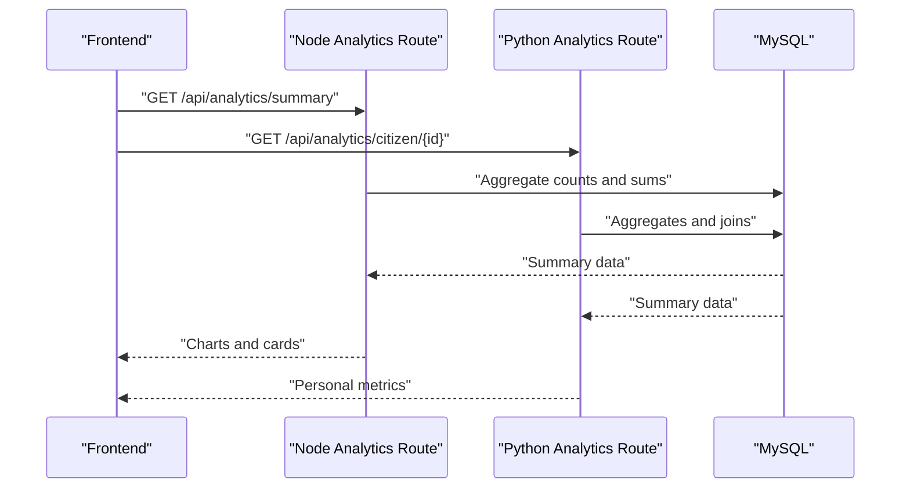
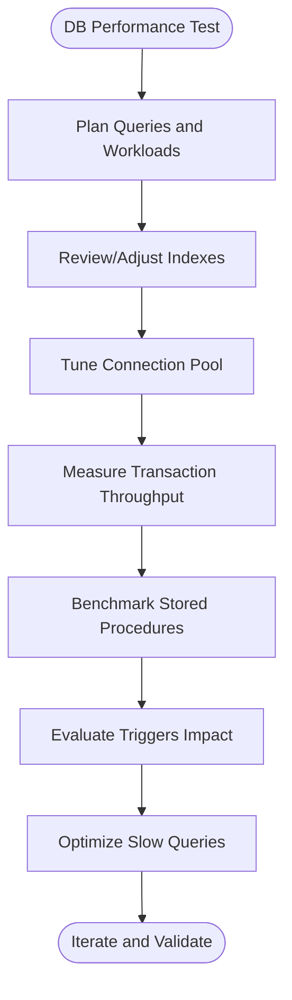
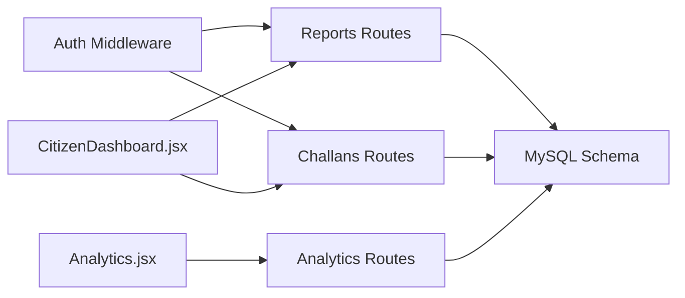

# Performance Testing

<cite>
**Referenced Files in This Document**
- [backend/server.js](file://backend/server.js)
- [backend/db.js](file://backend/db.js)
- [backend/routes/reports.js](file://backend/routes/reports.js)
- [backend/routes/challans.js](file://backend/routes/challans.js)
- [backend/middleware/auth.js](file://backend/middleware/auth.js)
- [db/schema.sql](file://db/schema.sql)
- [db/stored_procedure_process_report.sql](file://db/stored_procedure_process_report.sql)
- [db/database_triggers.sql](file://db/database_triggers.sql)
- [frontend/src/pages/CitizenDashboard.jsx](file://frontend/src/pages/CitizenDashboard.jsx)
- [frontend/src/pages/Analytics.jsx](file://frontend/src/pages/Analytics.jsx)
- [server/main.py](file://server/main.py)
- [server/database.py](file://server/database.py)
- [server/routes/reports.py](file://server/routes/reports.py)
- [server/routes/challans.py](file://server/routes/challans.py)
- [server/routes/analytics.py](file://server/routes/analytics.py)
- [package.json](file://package.json)
</cite>

## Table of Contents
1. [Introduction](#introduction)
2. [Project Structure](#project-structure)
3. [Core Components](#core-components)
4. [Architecture Overview](#architecture-overview)
5. [Detailed Component Analysis](#detailed-component-analysis)
6. [Dependency Analysis](#dependency-analysis)
7. [Performance Considerations](#performance-considerations)
8. [Troubleshooting Guide](#troubleshooting-guide)
9. [Conclusion](#conclusion)
10. [Appendices](#appendices)

## Introduction
This document provides comprehensive performance testing guidance for the Traffic Violation Management System (TVMS). It focuses on load and stress testing strategies for concurrent user scenarios (simultaneous report submissions, payment processing, and real-time dashboard updates), database performance testing (query optimization, connection pooling, and transaction throughput), and operational monitoring and regression practices. It also outlines methodologies for API response times, memory usage, and CPU utilization under varying loads, and offers practical recommendations for bottleneck identification, slow query optimization, and scaling.

## Project Structure
The TVMS comprises:
- A Node.js/Express backend exposing REST endpoints for authentication, reports, challans, and related operations.
- A Python/FastAPI backend implementing analytics, reports, challans, and supporting routes.
- A MySQL database with normalized schema, triggers, stored procedures, and views optimized for reporting and audit trails.
- A React-based frontend that consumes the APIs and renders dashboards and forms.

**Diagram sources**
- [backend/server.js:1-42](file://backend/server.js#L1-L42)
- [server/main.py:1-107](file://server/main.py#L1-L107)
- [db/schema.sql:1-942](file://db/schema.sql#L1-L942)
- [frontend/src/pages/CitizenDashboard.jsx:1-340](file://frontend/src/pages/CitizenDashboard.jsx#L1-L340)
- [frontend/src/pages/Analytics.jsx:1-271](file://frontend/src/pages/Analytics.jsx#L1-L271)

**Section sources**
- [backend/server.js:1-42](file://backend/server.js#L1-L42)
- [server/main.py:1-107](file://server/main.py#L1-L107)
- [db/schema.sql:1-942](file://db/schema.sql#L1-L942)
- [package.json:1-21](file://package.json#L1-L21)

## Core Components
- Express server (Node.js): Provides health checks, routing, and middleware for the legacy backend.
- FastAPI server (Python): Full production backend with CORS, static file serving, and modular routers.
- Database: MySQL with connection pools, triggers, stored procedures, and views for analytics.
- Frontend dashboards: Real-time citizen and analytics dashboards consuming backend APIs.

Key performance-relevant elements:
- Authentication middleware enforcing role-based access.
- Route handlers for report submission, retrieval, payment processing, and analytics.
- Database connection pools and transactional operations for concurrency safety.

**Section sources**
- [backend/server.js:1-42](file://backend/server.js#L1-L42)
- [backend/middleware/auth.js:1-37](file://backend/middleware/auth.js#L1-L37)
- [server/main.py:1-107](file://server/main.py#L1-L107)
- [server/database.py:1-76](file://server/database.py#L1-L76)
- [db/schema.sql:1-942](file://db/schema.sql#L1-L942)

## Architecture Overview
The system supports two backend stacks:
- Node.js/Express for authentication, reports, and challans endpoints.
- Python/FastAPI for analytics, reports, challans, and related routes.

Both backends connect to the same MySQL database, leveraging connection pooling and transactional integrity.

**Diagram sources**
- [backend/server.js:1-42](file://backend/server.js#L1-L42)
- [backend/routes/reports.js:1-54](file://backend/routes/reports.js#L1-L54)
- [backend/routes/challans.js:1-101](file://backend/routes/challans.js#L1-L101)
- [server/main.py:1-107](file://server/main.py#L1-L107)
- [server/routes/reports.py:1-563](file://server/routes/reports.py#L1-L563)
- [server/routes/challans.py:1-450](file://server/routes/challans.py#L1-L450)
- [server/routes/analytics.py:1-526](file://server/routes/analytics.py#L1-L526)
- [db/schema.sql:1-942](file://db/schema.sql#L1-L942)

## Detailed Component Analysis

### Load Testing Strategies

#### Concurrent Report Submissions (Citizen)
- Objective: Validate submission throughput and latency under concurrent load.
- Scenarios:
  - Simultaneous POST to report creation endpoints (Node and Python backends).
  - Include vehicle creation fallback and evidence upload steps.
- Metrics:
  - Response time percentiles (p50, p95, p99).
  - Throughput (requests/sec).
  - Error rates (4xx/5xx).
  - Database insert latency and connection pool saturation.
- Tools:
  - Apache JMeter or k6 for scripting concurrent users.
  - Use realistic payloads and include optional evidence uploads.

**Diagram sources**
- [backend/routes/reports.js:1-54](file://backend/routes/reports.js#L1-L54)
- [server/routes/reports.py:1-563](file://server/routes/reports.py#L1-L563)
- [db/schema.sql:115-167](file://db/schema.sql#L115-L167)

**Section sources**
- [backend/routes/reports.js:1-54](file://backend/routes/reports.js#L1-L54)
- [server/routes/reports.py:1-563](file://server/routes/reports.py#L1-L563)
- [db/schema.sql:115-167](file://db/schema.sql#L115-L167)

#### Concurrent Payment Processing (Citizen)
- Objective: Validate payment throughput and race condition prevention.
- Scenarios:
  - Simultaneous POST/PATCH to payment endpoints.
  - Row-level locking and transaction isolation must prevent double payment.
- Metrics:
  - Payment success rate.
  - Deadlock and rollback frequency.
  - Latency per payment operation.
- Tools:
  - k6 or Locust to simulate concurrent payments.
  - Monitor database locks and transaction logs.

**Diagram sources**
- [backend/routes/challans.js:31-98](file://backend/routes/challans.js#L31-L98)
- [server/routes/challans.py:336-397](file://server/routes/challans.py#L336-L397)
- [db/schema.sql:173-195](file://db/schema.sql#L173-L195)

**Section sources**
- [backend/routes/challans.js:31-98](file://backend/routes/challans.js#L31-L98)
- [server/routes/challans.py:336-397](file://server/routes/challans.py#L336-L397)
- [db/schema.sql:173-195](file://db/schema.sql#L173-L195)

#### Real-Time Dashboard Updates
- Objective: Validate dashboard rendering and data refresh under concurrent users.
- Scenarios:
  - Simultaneous GET requests to analytics and citizen dashboard endpoints.
  - Frontend polling or periodic refresh of summary cards and charts.
- Metrics:
  - Dashboard response times.
  - Backend CPU and memory under load.
  - Database query performance for aggregates and joins.
- Tools:
  - k6 or Artillery for concurrent GETs.
  - Monitor backend resource usage and database query plans.

**Diagram sources**
- [server/routes/analytics.py:36-124](file://server/routes/analytics.py#L36-L124)
- [frontend/src/pages/Analytics.jsx:1-271](file://frontend/src/pages/Analytics.jsx#L1-L271)
- [db/schema.sql:764-800](file://db/schema.sql#L764-L800)

**Section sources**
- [server/routes/analytics.py:36-124](file://server/routes/analytics.py#L36-L124)
- [frontend/src/pages/Analytics.jsx:1-271](file://frontend/src/pages/Analytics.jsx#L1-L271)
- [db/schema.sql:764-800](file://db/schema.sql#L764-L800)

### Stress Testing Approaches
- Gradually increase load to identify breaking points:
  - Ramp-up users from baseline to peak capacity.
  - Sustain load for extended periods to detect memory leaks or connection exhaustion.
- Peak traffic validation:
  - Simultaneous spikes across report submissions, payments, and dashboard queries.
  - Monitor error rates, timeouts, and degraded response times.
- Database stress:
  - Long-running transactions and high-concurrency DML operations.
  - Evaluate lock contention and deadlock occurrences.

[No sources needed since this section provides general guidance]

### Database Performance Testing
- Query optimization:
  - Analyze EXPLAIN plans for frequent queries (aggregates, joins, filters).
  - Add missing indexes on join/filter columns (e.g., status, citizen_id, due_date).
- Connection pooling:
  - Tune pool size and timeouts based on observed concurrency.
  - Monitor pool utilization and queue wait times.
- Transaction throughput:
  - Measure commit latency under concurrent updates.
  - Validate row-level locking effectiveness in payment and report processing.
- Stored procedures and triggers:
  - Benchmark stored procedure calls and trigger-driven updates.
  - Ensure minimal overhead and consistent performance.

**Diagram sources**
- [db/schema.sql:133-194](file://db/schema.sql#L133-L194)
- [db/stored_procedure_process_report.sql:1-115](file://db/stored_procedure_process_report.sql#L1-L115)
- [db/database_triggers.sql:1-48](file://db/database_triggers.sql#L1-L48)

**Section sources**
- [db/schema.sql:133-194](file://db/schema.sql#L133-L194)
- [db/stored_procedure_process_report.sql:1-115](file://db/stored_procedure_process_report.sql#L1-L115)
- [db/database_triggers.sql:1-48](file://db/database_triggers.sql#L1-L48)

### API Response Times, Memory, and CPU
- Methodology:
  - Use synthetic load tests to capture p50/p95/p99 response times.
  - Correlate metrics with backend resource usage (CPU, memory, GC).
  - Track database query durations and lock waits.
- Baseline establishment:
  - Run tests at 25%, 50%, 75%, and 100% of estimated peak capacity.
  - Record metrics and compare to targets (e.g., p95 < 500ms).
- Regression detection:
  - Automate nightly or CI-triggered performance runs.
  - Alert on regressions exceeding thresholds.

[No sources needed since this section provides general guidance]

### Performance Monitoring Setup
- Backend monitoring:
  - Enable logging and structured metrics in both servers.
  - Use profiling tools to capture CPU and memory profiles.
- Database monitoring:
  - Track slow query log, process list, and InnoDB metrics.
  - Monitor pool usage and query execution times.
- Frontend monitoring:
  - Measure client-side render times and network timings.
  - Track dashboard refresh intervals and retry behavior.

[No sources needed since this section provides general guidance]

### Benchmark Creation and Regression Testing
- Benchmarks:
  - Define SLOs for critical endpoints (e.g., report submission < 300ms p95).
  - Establish baseline metrics for each major workflow.
- Regression testing:
  - Integrate performance tests into CI pipelines.
  - Compare current runs against baselines and fail builds on regressions.

[No sources needed since this section provides general guidance]

### Identifying Bottlenecks and Optimizing Slow Queries
- Steps:
  - Capture slow queries and analyze execution plans.
  - Add targeted indexes and rewrite inefficient joins.
  - Reduce N+1 queries and optimize aggregations.
  - Validate improvements with load tests.
- Examples in TVMS:
  - Analytics endpoints performing multiple COUNT and SUM operations.
  - Payment endpoints using row-level locks; ensure appropriate indexing on primary keys and foreign keys.

**Section sources**
- [server/routes/analytics.py:36-124](file://server/routes/analytics.py#L36-L124)
- [server/routes/challans.py:336-397](file://server/routes/challans.py#L336-L397)
- [db/schema.sql:133-194](file://db/schema.sql#L133-L194)

### Scaling Recommendations
- Horizontal scaling:
  - Scale backend instances behind a load balancer.
  - Use sticky sessions only if required; otherwise prefer stateless design.
- Database scaling:
  - Consider read replicas for analytics-heavy workloads.
  - Partition by citizen_id or date ranges if growth demands.
- Caching:
  - Cache frequently accessed dashboard summaries and static views.
  - Use CDN for evidence images and static assets.

[No sources needed since this section provides general guidance]

## Dependency Analysis
- Backend-to-database dependencies:
  - Both Node and Python backends rely on the same MySQL schema and connection pools.
  - Authentication middleware enforces role-based access across endpoints.
- Frontend-to-backend dependencies:
  - Dashboards consume multiple endpoints; ensure endpoint availability and resilience.
- Internal dependencies:
  - Stored procedures and triggers encapsulate business logic and audit trails.

**Diagram sources**
- [backend/middleware/auth.js:1-37](file://backend/middleware/auth.js#L1-L37)
- [backend/routes/reports.js:1-54](file://backend/routes/reports.js#L1-L54)
- [backend/routes/challans.js:1-101](file://backend/routes/challans.js#L1-L101)
- [server/routes/analytics.py:1-526](file://server/routes/analytics.py#L1-L526)
- [db/schema.sql:1-942](file://db/schema.sql#L1-L942)
- [frontend/src/pages/CitizenDashboard.jsx:1-340](file://frontend/src/pages/CitizenDashboard.jsx#L1-L340)
- [frontend/src/pages/Analytics.jsx:1-271](file://frontend/src/pages/Analytics.jsx#L1-L271)

**Section sources**
- [backend/middleware/auth.js:1-37](file://backend/middleware/auth.js#L1-L37)
- [backend/routes/reports.js:1-54](file://backend/routes/reports.js#L1-L54)
- [backend/routes/challans.js:1-101](file://backend/routes/challans.js#L1-L101)
- [server/routes/analytics.py:1-526](file://server/routes/analytics.py#L1-L526)
- [db/schema.sql:1-942](file://db/schema.sql#L1-L942)

## Performance Considerations
- Concurrency:
  - Use row-level locks and transactions to prevent race conditions in payment and report processing.
- Indexing:
  - Ensure indexes on status, citizen_id, due_date, and foreign keys to speed up filtering and joins.
- Pool sizing:
  - Adjust pool size and timeouts to match expected concurrent workload.
- Caching:
  - Cache dashboard summaries and reduce repeated heavy queries.
- Observability:
  - Instrument endpoints with timing and error metrics; monitor database query performance.

[No sources needed since this section provides general guidance]

## Troubleshooting Guide
- Common symptoms:
  - High response times under load.
  - Increased error rates and timeouts.
  - Elevated database lock waits or deadlocks.
- Actions:
  - Inspect slow query logs and execution plans.
  - Verify connection pool saturation and timeouts.
  - Confirm proper indexing and absence of N+1 queries.
  - Validate authentication middleware correctness and token verification overhead.

**Section sources**
- [backend/middleware/auth.js:1-37](file://backend/middleware/auth.js#L1-L37)
- [server/database.py:1-76](file://server/database.py#L1-L76)
- [db/schema.sql:133-194](file://db/schema.sql#L133-L194)

## Conclusion
Effective performance testing for TVMS requires coordinated load and stress tests across report submissions, payment processing, and dashboard updates. Database optimization through indexing, connection pooling tuning, and transactional integrity is essential. Continuous monitoring, benchmarking, and regression testing ensure sustained performance as the system evolves.

[No sources needed since this section summarizes without analyzing specific files]

## Appendices

### Endpoint Reference for Performance Testing
- Node.js endpoints:
  - Reports: POST /api/reports, GET /api/reports/my
  - Challans: GET /api/challans/my, POST /api/challans/pay
  - Auth: /api/health
- Python endpoints:
  - Reports: POST /api/reports/create, GET /api/reports/my-reports/{id}, PUT /api/reports/update/{id}, DELETE /api/reports/delete/{id}
  - Challans: POST /api/challans/create, GET /api/challans/my, GET /api/challans/report/{report_id}, PUT /api/challans/pay/{id}, DELETE /api/challans/{id}
  - Analytics: GET /api/analytics/summary, GET /api/analytics/citizen/{id}, GET /api/analytics/violation-types, GET /api/analytics/recent-activity, GET /api/analytics/status-trend

**Section sources**
- [backend/server.js:18-31](file://backend/server.js#L18-L31)
- [backend/routes/reports.js:7-51](file://backend/routes/reports.js#L7-L51)
- [backend/routes/challans.js:7-98](file://backend/routes/challans.js#L7-L98)
- [server/main.py:77-86](file://server/main.py#L77-L86)
- [server/routes/reports.py:147-511](file://server/routes/reports.py#L147-L511)
- [server/routes/challans.py:47-397](file://server/routes/challans.py#L47-L397)
- [server/routes/analytics.py:36-526](file://server/routes/analytics.py#L36-L526)