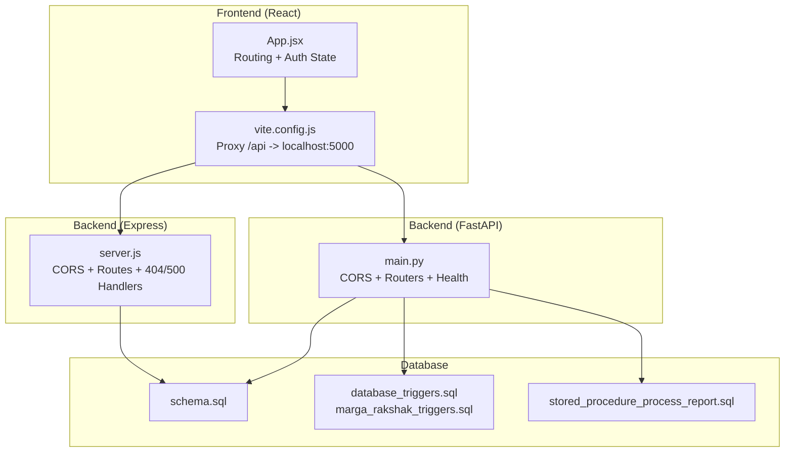
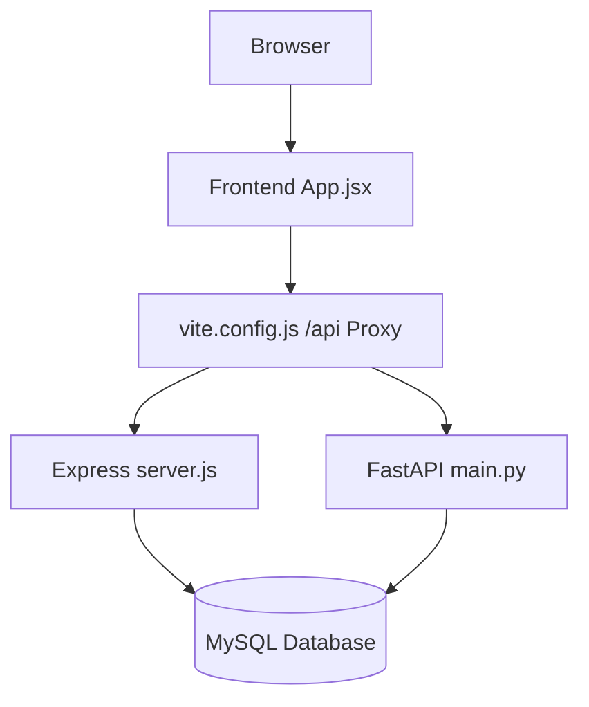
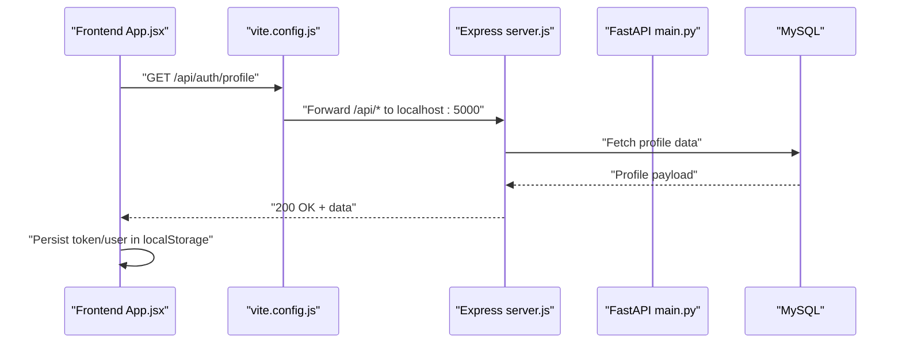
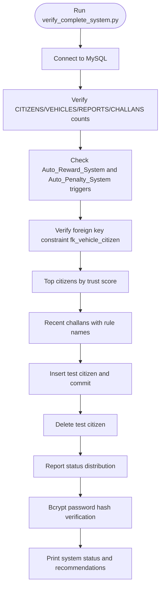
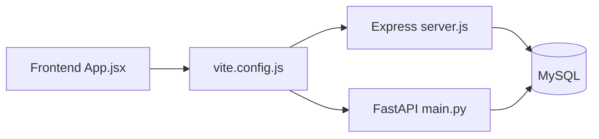

# Testing and Quality Assurance

<cite>
**Referenced Files in This Document**
- [server.js](file://backend/server.js)
- [main.py](file://server/main.py)
- [App.jsx](file://frontend/src/App.jsx)
- [vite.config.js](file://frontend/vite.config.js)
- [eslint.config.js](file://frontend/eslint.config.js)
- [package.json](file://frontend/package.json)
- [package.json](file://backend/package.json)
- [test_profile_api.py](file://scripts/test_profile_api.py)
- [verify_complete_system.py](file://scripts/verify_complete_system.py)
- [verify_database_persistence.py](file://scripts/verify_database_persistence.py)
- [check_account.py](file://scripts/check_account.py)
- [check_police_officers.py](file://scripts/check_police_officers.py)
- [test_challan_pipeline.py](file://server/test_challan_pipeline.py)
- [schema.sql](file://db/schema.sql)
- [seed_demo_accounts.sql](file://db/seed_demo_accounts.sql)
- [stored_procedure_process_report.sql](file://db/stored_procedure_process_report.sql)
- [database_triggers.sql](file://db/database_triggers.sql)
- [marga_rakshak_triggers.sql](file://db/marga_rakshak_triggers.sql)
- [install_triggers.bat](file://scripts/install_triggers.bat)
- [setup_db.bat](file://scripts/setup_db.bat)
- [setup_demo_environment.bat](file://scripts/setup_demo_environment.bat)
- [generate_password_hashes.py](file://scripts/generate_password_hashes.py)
- [quick_profile_check.py](file://scripts/quick_profile_check.py)
- [REPORTS_API_DOCUMENTATION.md](file://server/REPORTS_API_DOCUMENTATION.md)
</cite>

## Table of Contents
1. [Introduction](#introduction)
2. [Project Structure](#project-structure)
3. [Core Components](#core-components)
4. [Architecture Overview](#architecture-overview)
5. [Detailed Component Analysis](#detailed-component-analysis)
6. [Dependency Analysis](#dependency-analysis)
7. [Performance Considerations](#performance-considerations)
8. [Troubleshooting Guide](#troubleshooting-guide)
9. [Conclusion](#conclusion)
10. [Appendices](#appendices)

## Introduction
This document provides comprehensive testing and quality assurance guidance for the Traffic Violation Management System (TVMS). It covers unit testing strategies for frontend and backend components, integration testing procedures for API endpoints, database operations, and cross-component communication, automated testing scripts for profile APIs, challan pipeline validation, and system completeness verification. It also outlines performance testing approaches for concurrent user scenarios, payment processing race conditions, and real-time dashboard updates, along with code quality tools configuration, linting rules, static analysis, and best practices for biometric authentication, database transactions, and security validation.

## Project Structure
The TVMS comprises:
- Frontend built with React and Vite, routing through React Router and proxied to the backend API.
- Backend implemented with Express.js and FastAPI (Python), exposing REST endpoints and serving static uploads.
- Database scripts and triggers supporting trust scoring, challan generation, and referential integrity.
- Automated verification scripts for profile API, system completeness, persistence, and diagnostics.

**Diagram sources**
- [App.jsx:1-274](file://frontend/src/App.jsx#L1-L274)
- [vite.config.js:1-23](file://frontend/vite.config.js#L1-L23)
- [server.js:1-42](file://backend/server.js#L1-L42)
- [main.py:1-107](file://server/main.py#L1-L107)
- [schema.sql](file://db/schema.sql)
- [database_triggers.sql](file://db/database_triggers.sql)
- [marga_rakshak_triggers.sql](file://db/marga_rakshak_triggers.sql)
- [stored_procedure_process_report.sql](file://db/stored_procedure_process_report.sql)

**Section sources**
- [App.jsx:1-274](file://frontend/src/App.jsx#L1-L274)
- [vite.config.js:1-23](file://frontend/vite.config.js#L1-L23)
- [server.js:1-42](file://backend/server.js#L1-L42)
- [main.py:1-107](file://server/main.py#L1-L107)

## Core Components
- Frontend routing and authentication state management with local storage persistence.
- Proxy configuration to forward API calls to the backend server.
- Backend Express server with CORS, JSON parsing, health checks, and centralized error handling.
- FastAPI server with CORS, router inclusion, static file mounting, and health endpoints.
- Database schema, triggers, and stored procedures enabling trust scoring and challan lifecycle automation.
- Automated verification scripts for profile API, system completeness, persistence, and diagnostics.

**Section sources**
- [App.jsx:27-76](file://frontend/src/App.jsx#L27-L76)
- [vite.config.js:7-21](file://frontend/vite.config.js#L7-L21)
- [server.js:13-37](file://backend/server.js#L13-L37)
- [main.py:50-103](file://server/main.py#L50-L103)
- [schema.sql](file://db/schema.sql)
- [database_triggers.sql](file://db/database_triggers.sql)
- [marga_rakshak_triggers.sql](file://db/marga_rakshak_triggers.sql)
- [stored_procedure_process_report.sql](file://db/stored_procedure_process_report.sql)

## Architecture Overview
The system integrates frontend, backend, and database components. The frontend proxies API calls to the backend servers, which communicate with the database through schema-defined relations and triggers. Static uploads are served by the backend.

**Diagram sources**
- [App.jsx:1-274](file://frontend/src/App.jsx#L1-L274)
- [vite.config.js:7-21](file://frontend/vite.config.js#L7-L21)
- [server.js:13-37](file://backend/server.js#L13-L37)
- [main.py:77-95](file://server/main.py#L77-L95)

## Detailed Component Analysis

### Frontend Unit Testing Strategy
- Use React Testing Library for component tests focusing on user interactions, state transitions, and route guards.
- Mock React Router navigation and local storage to simulate login/logout flows and protected routes.
- Test form components (e.g., Login, Register, SubmitReport) with controlled inputs and event handlers.
- Validate context providers (e.g., ToastProvider) behavior under test conditions.
- Linting with ESLint configured for React hooks and refresh plugin.

Recommended steps:
- Add a test runner script in frontend package.json for React tests.
- Create isolated tests for each page component and shared UI components.
- Snapshot testing for stable UI components to detect regressions.
- Accessibility checks using testing-library axe extensions.

**Section sources**
- [App.jsx:27-76](file://frontend/src/App.jsx#L27-L76)
- [eslint.config.js:1-22](file://frontend/eslint.config.js#L1-L22)
- [package.json:1-30](file://frontend/package.json#L1-L30)

### Backend Unit Testing Strategy (Express)
- Test route handlers with supertest or similar HTTP assertion libraries.
- Mock database connections and middleware behavior to isolate logic.
- Validate error handling paths (404, 500) and CORS configuration.
- Test middleware functions (e.g., auth.js) independently.

Recommended steps:
- Add a test script in backend package.json.
- Group tests per route module (auth, reports, police, challans).
- Use in-memory mocks for database responses and JWT tokens.

**Section sources**
- [server.js:13-37](file://backend/server.js#L13-L37)
- [package.json:1-22](file://backend/package.json#L1-22)

### Backend Unit Testing Strategy (FastAPI)
- Use pytest with FastAPI test client to assert endpoint responses.
- Parameterize tests for different roles (citizen, police) and statuses.
- Mock external services (e.g., uploads) and database sessions.
- Validate static file serving and CORS behavior.

Recommended steps:
- Create a dedicated tests directory under server.
- Include fixtures for router initialization and database session.
- Test health endpoints, upload mounts, and router inclusion.

**Section sources**
- [main.py:77-95](file://server/main.py#L77-L95)
- [package.json:1-22](file://backend/package.json#L1-22)

### Integration Testing Procedures
- API Endpoint Validation:
  - Profile API test script validates login and profile retrieval with bearer tokens.
  - Use Postman/Newman or curl for manual validation of endpoints documented in REPORTS_API_DOCUMENTATION.
- Database Operation Testing:
  - System completeness script verifies triggers, foreign keys, trust scores, challans, and persistence guarantees.
  - Persistence verification script ensures permanent storage and bcrypt password verification.
- Cross-Component Communication:
  - Frontend proxy configuration ensures /api and /uploads reach backend servers.
  - Validate token propagation from login to protected routes and profile retrieval.

**Diagram sources**
- [App.jsx:52-70](file://frontend/src/App.jsx#L52-L70)
- [vite.config.js:9-19](file://frontend/vite.config.js#L9-L19)
- [server.js:18-20](file://backend/server.js#L18-L20)
- [main.py:89-95](file://server/main.py#L89-L95)

**Section sources**
- [test_profile_api.py:1-49](file://scripts/test_profile_api.py#L1-L49)
- [verify_complete_system.py:18-256](file://scripts/verify_complete_system.py#L18-L256)
- [verify_database_persistence.py:18-162](file://scripts/verify_database_persistence.py#L18-L162)
- [vite.config.js:7-21](file://frontend/vite.config.js#L7-L21)

### Automated Testing Scripts
- Profile API Testing:
  - Logs in, decodes JWT, and retrieves profile data to validate authentication and user info.
- System Completeness Verification:
  - Checks database connectivity, triggers, foreign keys, trust scores, challans, persistence, report status flow, and password hashing.
- Database Persistence Verification:
  - Confirms permanent storage, foreign keys, triggers, and bcrypt verification.
- Diagnostics:
  - Account diagnostic tool checks existence and resets passwords securely.
  - Police officers listing script validates officer records.

**Diagram sources**
- [verify_complete_system.py:18-256](file://scripts/verify_complete_system.py#L18-L256)

**Section sources**
- [test_profile_api.py:1-49](file://scripts/test_profile_api.py#L1-L49)
- [verify_complete_system.py:18-256](file://scripts/verify_complete_system.py#L18-L256)
- [verify_database_persistence.py:18-162](file://scripts/verify_database_persistence.py#L18-L162)
- [check_account.py:20-124](file://scripts/check_account.py#L20-L124)
- [check_police_officers.py:16-60](file://scripts/check_police_officers.py#L16-L60)

### Performance Testing Approaches
- Concurrent User Scenarios:
  - Simulate simultaneous login, report submission, and dashboard polling using wrk or k6 against health and auth endpoints.
  - Monitor response times and error rates under load.
- Payment Processing Race Conditions:
  - Stress test payment endpoints with concurrent requests to validate idempotency and database transaction isolation.
  - Use database-level checks to ensure atomicity and prevent double-charging.
- Real-Time Dashboard Updates:
  - Validate 3-second polling intervals for dashboard components and ensure no stale data due to caching.
  - Introduce synthetic load to assess frontend rendering and state updates.

[No sources needed since this section provides general guidance]

### Code Quality Tools and Static Analysis
- Frontend:
  - ESLint configuration includes recommended rules for React and hooks, with React Refresh plugin.
  - Enforce consistent linting across development and CI pipelines.
- Backend:
  - Python linting with flake8 or ruff; configure pre-commit hooks for static checks.
  - Type hints and mypy for FastAPI route validation.
- Database:
  - SQLFluff for SQL linting; enforce naming conventions and query standards.

**Section sources**
- [eslint.config.js:1-22](file://frontend/eslint.config.js#L1-L22)
- [package.json:1-22](file://backend/package.json#L1-L22)

### Best Practices for Biometric Authentication, Transactions, and Security
- Biometric Authentication:
  - Validate face recognition service endpoints and ensure secure upload handling for evidence images.
  - Apply strict input validation and sanitization for biometric data.
- Database Transactions:
  - Use explicit transactions for trust score updates and challan creation; rollback on errors.
  - Ensure referential integrity via foreign keys and constraints.
- Security Validation:
  - Enforce HTTPS in production, secure cookies, and CSRF protection.
  - Validate JWT signatures server-side and implement token expiration.
  - Sanitize inputs and escape outputs to prevent injection attacks.

[No sources needed since this section provides general guidance]

## Dependency Analysis
- Frontend depends on:
  - React Router for routing and local storage for auth persistence.
  - Vite proxy to forward API requests to backend servers.
- Backend depends on:
  - Express/FastAPI for routing and middleware.
  - MySQL for persistent storage and triggers for automation.
- Database depends on:
  - Schema, triggers, and stored procedures for trust scoring and report processing.

**Diagram sources**
- [App.jsx:1-274](file://frontend/src/App.jsx#L1-L274)
- [vite.config.js:7-21](file://frontend/vite.config.js#L7-L21)
- [server.js:13-37](file://backend/server.js#L13-L37)
- [main.py:77-95](file://server/main.py#L77-L95)

**Section sources**
- [App.jsx:1-274](file://frontend/src/App.jsx#L1-L274)
- [vite.config.js:7-21](file://frontend/vite.config.js#L7-L21)
- [server.js:13-37](file://backend/server.js#L13-L37)
- [main.py:77-95](file://server/main.py#L77-L95)

## Performance Considerations
- Concurrency:
  - Use connection pooling for database clients and rate limiting for API endpoints.
- Payment Processing:
  - Implement idempotency keys and optimistic locking to avoid race conditions.
- Real-Time Dashboards:
  - Optimize polling intervals and cache strategy; consider server-sent events or WebSockets for live updates.

[No sources needed since this section provides general guidance]

## Troubleshooting Guide
- Profile API Issues:
  - Confirm backend is running, credentials are correct, and token is present in Authorization header.
- Database Connectivity:
  - Verify MySQL is running, database exists, and credentials match configuration.
- Trigger and Migration Problems:
  - Ensure triggers are installed and foreign key migrations are executed.
- Frontend Routing and Auth:
  - Check local storage for token/user and proxy configuration for /api and /uploads.

**Section sources**
- [test_profile_api.py:8-24](file://scripts/test_profile_api.py#L8-L24)
- [verify_database_persistence.py:154-162](file://scripts/verify_database_persistence.py#L154-L162)
- [verify_complete_system.py:241-244](file://scripts/verify_complete_system.py#L241-L244)
- [vite.config.js:9-19](file://frontend/vite.config.js#L9-L19)

## Conclusion
The TVMS employs a layered testing strategy combining frontend unit tests, backend API tests, and robust database verification scripts. Integration tests validate cross-component communication, while automated scripts ensure system completeness and persistence. Performance and security best practices should be enforced across frontend, backend, and database layers to maintain reliability and scalability.

[No sources needed since this section summarizes without analyzing specific files]

## Appendices

### Appendix A: Continuous Integration Pipeline Configuration
- Install dependencies for both frontend and backend.
- Run linters and type checks.
- Execute unit tests for frontend and backend.
- Run database verification scripts and system completeness checks.
- Build and serve artifacts for preview/deployment.

[No sources needed since this section provides general guidance]

### Appendix B: Test Case Implementation Examples
- Frontend:
  - Example: Render Login page and simulate form submission with invalid credentials; assert error toast appears.
  - Example: Mock localStorage and navigate to protected route; assert redirect to home.
- Backend:
  - Example: Test GET /api/health returns 200 with expected fields.
  - Example: Test POST /api/auth/citizen/login with valid/invalid credentials; assert JWT presence or error.
- Database:
  - Example: Insert test citizen, verify commit, and assert trust score initial value.

[No sources needed since this section provides general guidance]