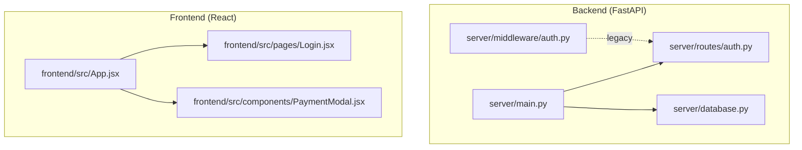
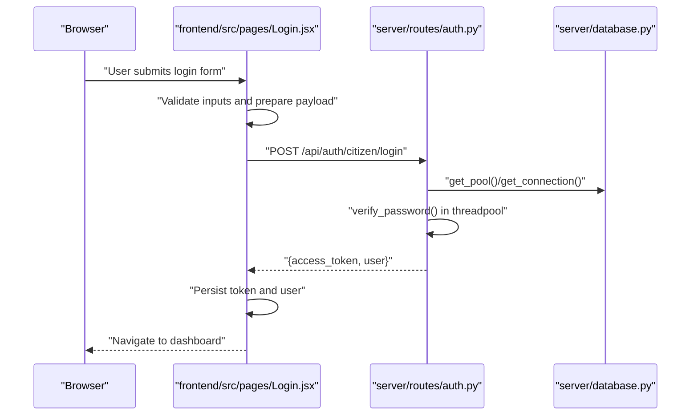
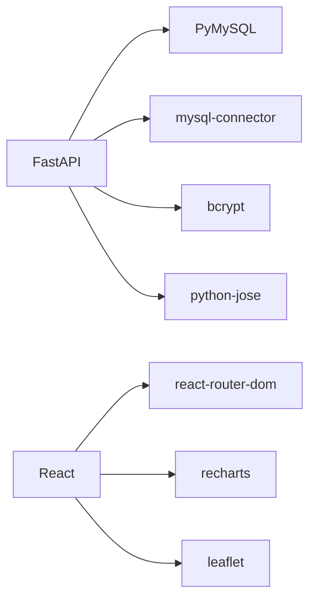

# Unit Testing

<cite>
**Referenced Files in This Document**
- [backend/package.json](file://backend/package.json)
- [frontend/package.json](file://frontend/package.json)
- [server/main.py](file://server/main.py)
- [server/middleware/auth.py](file://server/middleware/auth.py)
- [server/routes/auth.py](file://server/routes/auth.py)
- [server/database.py](file://server/database.py)
- [server/test_db.py](file://server/test_db.py)
- [server/test_db_connection.py](file://server/test_db_connection.py)
- [server/test_pymysql.py](file://server/test_pymysql.py)
- [server/test_registration.py](file://server/test_registration.py)
- [server/test_challan_pipeline.py](file://server/test_challan_pipeline.py)
- [frontend/src/App.jsx](file://frontend/src/App.jsx)
- [frontend/src/pages/Login.jsx](file://frontend/src/pages/Login.jsx)
- [frontend/src/components/PaymentModal.jsx](file://frontend/src/components/PaymentModal.jsx)
</cite>

## Table of Contents
1. [Introduction](#introduction)
2. [Project Structure](#project-structure)
3. [Core Components](#core-components)
4. [Architecture Overview](#architecture-overview)
5. [Detailed Component Analysis](#detailed-component-analysis)
6. [Dependency Analysis](#dependency-analysis)
7. [Performance Considerations](#performance-considerations)
8. [Troubleshooting Guide](#troubleshooting-guide)
9. [Conclusion](#conclusion)
10. [Appendices](#appendices)

## Introduction
This document provides a comprehensive guide to implementing unit testing for the Traffic Violation Management System. It covers backend unit testing patterns for FastAPI functions, database operations, and authentication logic; frontend React component testing using React Testing Library; and practical strategies for mocking external dependencies such as payment gateways, face recognition services, and database connections. Guidance is included on test organization, naming conventions, assertion patterns, asynchronous operations, error handling, edge cases, component isolation, and test data management.

## Project Structure
The system comprises:
- A FastAPI backend under server/ with route modules, middleware, and database utilities.
- A React frontend under frontend/ with page and component modules.
- Minimal backend dependencies declared in backend/package.json and frontend dependencies in frontend/package.json.

**Diagram sources**
- [server/main.py:1-107](file://server/main.py#L1-L107)
- [server/routes/auth.py:1-744](file://server/routes/auth.py#L1-L744)
- [server/middleware/auth.py:1-182](file://server/middleware/auth.py#L1-L182)
- [server/database.py:1-76](file://server/database.py#L1-L76)
- [frontend/src/App.jsx:1-274](file://frontend/src/App.jsx#L1-L274)
- [frontend/src/pages/Login.jsx:1-186](file://frontend/src/pages/Login.jsx#L1-L186)
- [frontend/src/components/PaymentModal.jsx:1-99](file://frontend/src/components/PaymentModal.jsx#L1-L99)

**Section sources**
- [backend/package.json:1-22](file://backend/package.json#L1-L22)
- [frontend/package.json:1-30](file://frontend/package.json#L1-L30)
- [server/main.py:1-107](file://server/main.py#L1-L107)

## Core Components
- Backend FastAPI application initialization and router mounting.
- Authentication routes for citizens and police, including registration, login, profile retrieval, and updates.
- Database utilities for connection pooling and context-managed cursors.
- Frontend routing and page components for login and payment modal.

Key testing targets:
- Individual route handlers and helper functions (authentication, hashing, token creation).
- Database operations (inserts, selects, updates, transactions).
- Frontend components (Login, PaymentModal) and user interactions.
- Asynchronous flows and error propagation.

**Section sources**
- [server/main.py:74-87](file://server/main.py#L74-L87)
- [server/routes/auth.py:114-216](file://server/routes/auth.py#L114-L216)
- [server/routes/auth.py:218-307](file://server/routes/auth.py#L218-L307)
- [server/routes/auth.py:310-396](file://server/routes/auth.py#L310-L396)
- [server/routes/auth.py:399-490](file://server/routes/auth.py#L399-L490)
- [server/routes/auth.py:493-599](file://server/routes/auth.py#L493-L599)
- [server/routes/auth.py:602-744](file://server/routes/auth.py#L602-L744)
- [server/database.py:14-76](file://server/database.py#L14-L76)
- [frontend/src/App.jsx:27-273](file://frontend/src/App.jsx#L27-L273)
- [frontend/src/pages/Login.jsx:15-69](file://frontend/src/pages/Login.jsx#L15-L69)
- [frontend/src/components/PaymentModal.jsx:10-22](file://frontend/src/components/PaymentModal.jsx#L10-L22)

## Architecture Overview
The backend exposes authentication endpoints and mounts them under /api/auth. The frontend consumes these endpoints via fetch and manages user state and navigation.

**Diagram sources**
- [frontend/src/pages/Login.jsx:15-69](file://frontend/src/pages/Login.jsx#L15-L69)
- [server/routes/auth.py:218-307](file://server/routes/auth.py#L218-L307)
- [server/database.py:45-76](file://server/database.py#L45-L76)

## Detailed Component Analysis

### Backend Authentication Unit Tests
Recommended strategies:
- Isolate route handlers by injecting mocks for database connections and cryptographic functions.
- Mock bcrypt hashing and JWT token creation to avoid slow synchronous operations.
- Use context managers to simulate database failures and rollback scenarios.
- Assert HTTP status codes, response shape, and error messages.

Key test scenarios:
- Registration validation (password match, length) and duplicate email handling.
- Login validation (invalid credentials, inactive accounts) and token generation.
- Profile retrieval and updates with proper role-based queries.
- Transaction rollback on exceptions.

Mocking strategies:
- Replace database connection functions with in-memory fixtures or mock pools.
- Patch bcrypt hash/verify and JWT encode/decode to deterministic outputs.
- Use pytest fixtures to manage temporary test data and cleanup.

Assertion patterns:
- Validate response keys and nested structures.
- Assert HTTPException details and status codes.
- Confirm database mutations via controlled test harnesses.

**Section sources**
- [server/routes/auth.py:114-216](file://server/routes/auth.py#L114-L216)
- [server/routes/auth.py:218-307](file://server/routes/auth.py#L218-L307)
- [server/routes/auth.py:310-396](file://server/routes/auth.py#L310-L396)
- [server/routes/auth.py:399-490](file://server/routes/auth.py#L399-L490)
- [server/routes/auth.py:493-599](file://server/routes/auth.py#L493-L599)
- [server/routes/auth.py:602-744](file://server/routes/auth.py#L602-L744)
- [server/database.py:14-76](file://server/database.py#L14-L76)

### Database Operations Unit Tests
Recommended strategies:
- Use a dedicated test database or in-memory MySQL-compatible store.
- Wrap operations in transactions and roll back after each test.
- Mock connection pooling to simulate timeouts and errors.
- Validate CRUD operations and constraint violations.

Mocking strategies:
- Replace get_pool/get_connection with a test pool.
- Stub cursor.execute to raise specific exceptions for negative tests.

Assertion patterns:
- Confirm inserted records and derived values (badge numbers, timestamps).
- Validate SELECT results and JOIN summaries.
- Assert rollback behavior on exceptions.

**Section sources**
- [server/database.py:14-76](file://server/database.py#L14-L76)
- [server/test_db.py:1-41](file://server/test_db.py#L1-L41)
- [server/test_db_connection.py:1-34](file://server/test_db_connection.py#L1-L34)
- [server/test_pymysql.py:1-43](file://server/test_pymysql.py#L1-L43)

### Authentication Middleware and Utility Functions
Legacy middleware file exists alongside the primary routes. For unit testing:
- Treat helper functions (hashing, token creation) as pure functions where possible.
- Mock external libraries (bcrypt, JWT) to return deterministic values.
- Validate error propagation and HTTP exceptions.

**Section sources**
- [server/middleware/auth.py:45-62](file://server/middleware/auth.py#L45-L62)
- [server/middleware/auth.py:68-123](file://server/middleware/auth.py#L68-L123)
- [server/middleware/auth.py:128-182](file://server/middleware/auth.py#L128-L182)

### Frontend React Component Testing (React Testing Library)
Recommended strategies:
- Render components in isolation with minimal providers.
- Mock fetch globally or use a testing fetch library to stub API responses.
- Simulate user interactions (typing, clicking) and assert DOM updates.
- Test form validation by attempting submission with invalid inputs.

Key components to test:
- Login page: form inputs, loading states, toast notifications, navigation.
- PaymentModal: rendering, error/success states, confirm/cancel actions.

Mocking strategies:
- Mock window.fetch to return controlled responses.
- Mock localStorage to isolate persistence behavior.
- Mock context providers (ToastProvider) with minimal implementations.

Assertion patterns:
- Assert visible text, button states, and navigation changes.
- Validate error messages and loading indicators.

**Section sources**
- [frontend/src/pages/Login.jsx:15-69](file://frontend/src/pages/Login.jsx#L15-L69)
- [frontend/src/components/PaymentModal.jsx:10-22](file://frontend/src/components/PaymentModal.jsx#L10-L22)
- [frontend/src/App.jsx:27-273](file://frontend/src/App.jsx#L27-L273)

### API Endpoint Logic and Authentication Flow
Recommended strategies:
- Test the complete flow: request preparation, endpoint invocation, response parsing, and state updates.
- Validate both success and failure paths (network errors, HTTP errors, validation errors).
- Use a test harness that starts the FastAPI app and hits endpoints directly (pytest with test client).

Mocking strategies:
- Replace database dependencies with a test pool.
- Mock external services (payment gateway, face recognition) behind service abstractions.

**Section sources**
- [server/test_registration.py:1-40](file://server/test_registration.py#L1-L40)
- [server/test_challan_pipeline.py:1-99](file://server/test_challan_pipeline.py#L1-L99)

### Utility Functions and Edge Cases
Recommended strategies:
- Test boundary conditions (empty inputs, very long passwords, invalid emails).
- Validate error handling paths (expired tokens, malformed tokens, missing headers).
- Assert defensive checks (inactive accounts, non-existent users).

**Section sources**
- [server/routes/auth.py:114-216](file://server/routes/auth.py#L114-L216)
- [server/routes/auth.py:493-599](file://server/routes/auth.py#L493-L599)

## Dependency Analysis
Backend dependencies and their roles:
- FastAPI: application framework and routing.
- PyMySQL/mysql-connector: database connectivity.
- bcrypt: password hashing.
- python-jose: JWT encoding/decoding.

Frontend dependencies and their roles:
- react/react-dom: UI framework.
- react-router-dom: routing.
- recharts/leaflet: visualization and maps.

**Diagram sources**
- [backend/package.json:10-17](file://backend/package.json#L10-L17)
- [frontend/package.json:11-19](file://frontend/package.json#L11-L19)

**Section sources**
- [backend/package.json:10-17](file://backend/package.json#L10-L17)
- [frontend/package.json:11-19](file://frontend/package.json#L11-L19)

## Performance Considerations
- Prefer mocking expensive operations (database, cryptography) to keep tests fast.
- Use connection pooling in tests with small pool sizes to simulate resource constraints.
- Avoid real network calls in unit tests; use stubs or in-process servers.
- Parallelize independent tests to reduce CI time.

## Troubleshooting Guide
Common issues and resolutions:
- Database connectivity failures: ensure test database is reachable and credentials are correct; use connection timeouts and retries in tests.
- Authentication failures: verify token signing secret and expiration; assert correct payload structure.
- Frontend fetch failures: mock fetch with appropriate status codes and JSON bodies; assert error handling paths.
- Asynchronous operations: use async-aware test runners and await all promises; avoid relying on timing assumptions.

**Section sources**
- [server/test_db_connection.py:1-34](file://server/test_db_connection.py#L1-L34)
- [server/test_pymysql.py:1-43](file://server/test_pymysql.py#L1-L43)
- [server/routes/auth.py:100-112](file://server/routes/auth.py#L100-L112)
- [frontend/src/pages/Login.jsx:37-51](file://frontend/src/pages/Login.jsx#L37-L51)

## Conclusion
Effective unit testing in this system requires isolating dependencies, mocking external systems, and validating both success and failure paths. Backend tests should target route handlers and database operations, while frontend tests should focus on component behavior and user interactions. Adopting consistent naming, assertion patterns, and test organization will improve maintainability and reliability.

## Appendices

### Test Organization and Naming Conventions
- Group tests by module (e.g., test_auth.py, test_database.py).
- Name test functions descriptively (test_citizen_login_success, test_invalid_credentials).
- Use fixtures for shared setup (e.g., test database pool, mock tokens).
- Separate unit tests from integration tests; keep unit tests independent.

### Assertion Patterns
- Assert HTTP status codes and response shapes.
- Validate error messages and exception types.
- Confirm database state changes and constraints.

### Asynchronous Operations and Edge Cases
- Test async handlers with proper awaits and timeouts.
- Cover edge cases: empty inputs, invalid tokens, inactive accounts, database errors.

### Component Isolation Techniques
- Wrap components with minimal providers for focused tests.
- Mock global APIs (fetch, localStorage) per test.
- Use fake timers for time-dependent logic.