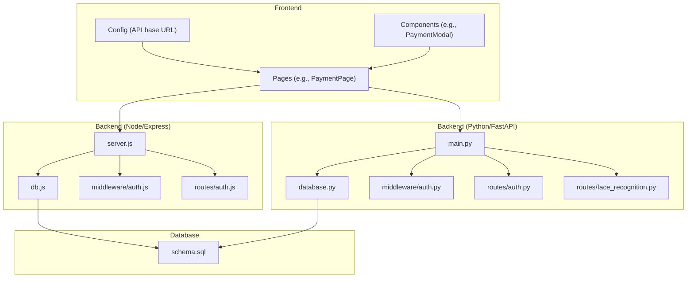
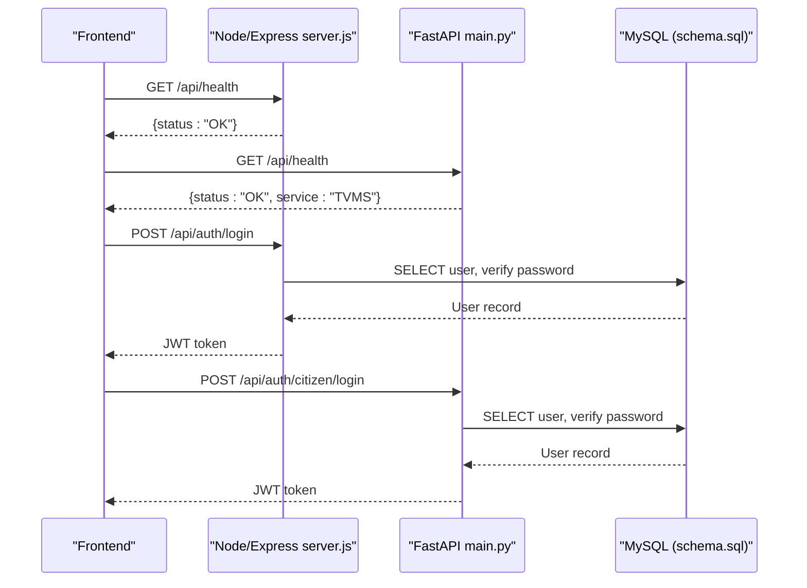
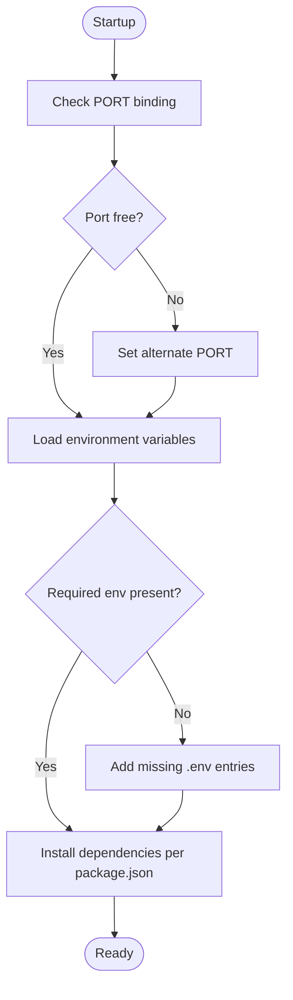
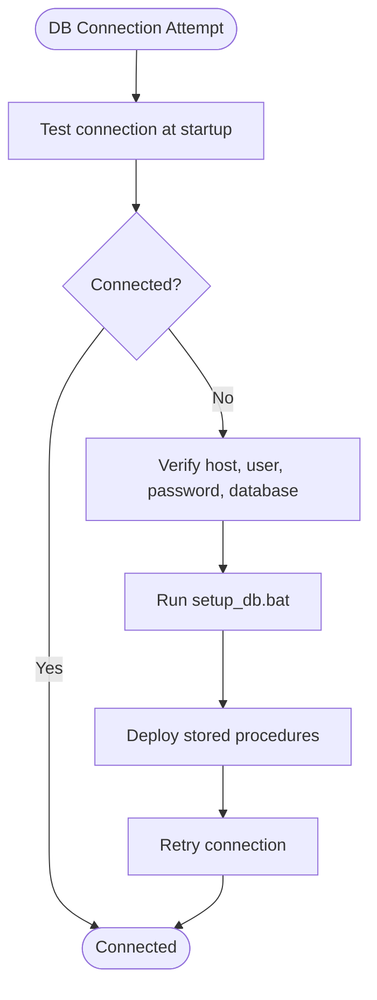
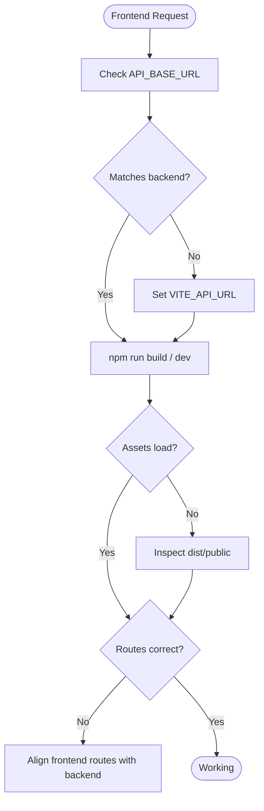
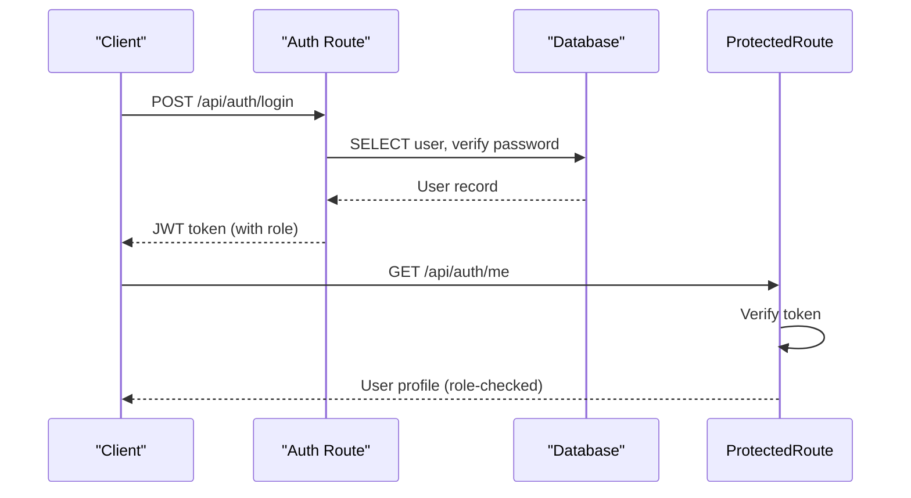
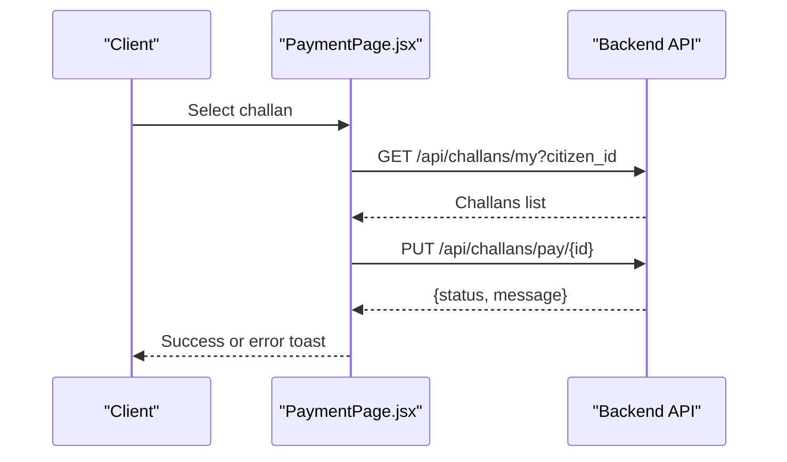
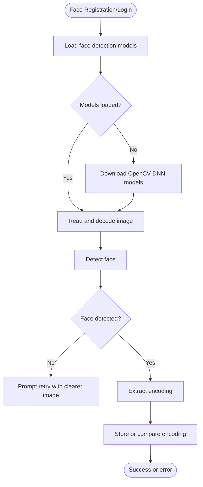
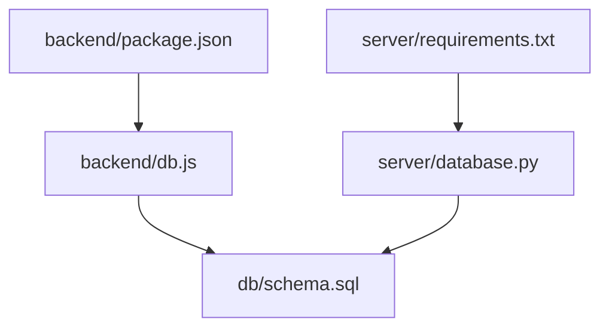

# Common Issues and Solutions

<cite>
**Referenced Files in This Document**
- [backend/package.json](file://backend/package.json)
- [backend/server.js](file://backend/server.js)
- [backend/db.js](file://backend/db.js)
- [backend/middleware/auth.js](file://backend/middleware/auth.js)
- [backend/routes/auth.js](file://backend/routes/auth.js)
- [frontend/package.json](file://frontend/package.json)
- [frontend/src/config.js](file://frontend/src/config.js)
- [frontend/src/pages/PaymentPage.jsx](file://frontend/src/pages/PaymentPage.jsx)
- [frontend/src/components/PaymentModal.jsx](file://frontend/src/components/PaymentModal.jsx)
- [server/main.py](file://server/main.py)
- [server/database.py](file://server/database.py)
- [server/middleware/auth.py](file://server/middleware/auth.py)
- [server/routes/auth.py](file://server/routes/auth.py)
- [server/routes/face_recognition.py](file://server/routes/face_recognition.py)
- [db/schema.sql](file://db/schema.sql)
- [scripts/setup_db.bat](file://scripts/setup_db.bat)
- [scripts/deploy_stored_procedure.bat](file://scripts/deploy_stored_procedure.bat)
</cite>

## Table of Contents
1. [Introduction](#introduction)
2. [Project Structure](#project-structure)
3. [Core Components](#core-components)
4. [Architecture Overview](#architecture-overview)
5. [Detailed Component Analysis](#detailed-component-analysis)
6. [Dependency Analysis](#dependency-analysis)
7. [Performance Considerations](#performance-considerations)
8. [Troubleshooting Guide](#troubleshooting-guide)
9. [Conclusion](#conclusion)

## Introduction
This document provides a comprehensive troubleshooting guide for the Traffic Violation Management System. It focuses on diagnosing and resolving common issues across backend startup failures, database connectivity, frontend integration, authentication, payment processing, and face recognition. Each section outlines diagnostic steps and step-by-step resolutions tailored to the repository’s implementation.

## Project Structure
The system comprises:
- Backend API (Node.js/Express) exposing REST endpoints under /api
- Python/FastAPI backend (server/) with dedicated routes and middleware
- Frontend (React/Vite) consuming the backend APIs
- Database (MySQL) with a production-grade schema and stored procedures
- Windows setup scripts for database initialization and deployment

**Diagram sources**
- [backend/server.js:1-42](file://backend/server.js#L1-L42)
- [backend/db.js:1-26](file://backend/db.js#L1-L26)
- [backend/middleware/auth.js:1-37](file://backend/middleware/auth.js#L1-L37)
- [backend/routes/auth.js:1-117](file://backend/routes/auth.js#L1-L117)
- [frontend/src/config.js:1-34](file://frontend/src/config.js#L1-L34)
- [frontend/src/pages/PaymentPage.jsx:1-481](file://frontend/src/pages/PaymentPage.jsx#L1-L481)
- [frontend/src/components/PaymentModal.jsx:1-99](file://frontend/src/components/PaymentModal.jsx#L1-L99)
- [server/main.py:1-107](file://server/main.py#L1-L107)
- [server/database.py:1-76](file://server/database.py#L1-L76)
- [server/middleware/auth.py:1-182](file://server/middleware/auth.py#L1-L182)
- [server/routes/auth.py:1-744](file://server/routes/auth.py#L1-L744)
- [server/routes/face_recognition.py:1-282](file://server/routes/face_recognition.py#L1-L282)
- [db/schema.sql:1-942](file://db/schema.sql#L1-L942)

**Section sources**
- [backend/server.js:1-42](file://backend/server.js#L1-L42)
- [server/main.py:1-107](file://server/main.py#L1-L107)
- [frontend/src/config.js:1-34](file://frontend/src/config.js#L1-L34)
- [db/schema.sql:1-942](file://db/schema.sql#L1-L942)

## Core Components
- Backend (Node/Express): Exposes /api/* endpoints, includes health checks, CORS, and centralized error handling. Database connection pool is tested at startup.
- Backend (Python/FastAPI): Provides authentication, face recognition, analytics, reports, challans, vehicles, rules, and trust endpoints. Includes CORS middleware and static file serving for uploads.
- Frontend: Configures API base URL and endpoint constants; PaymentPage demonstrates payment flow and local storage usage.
- Database: Schema defines core entities, triggers, stored procedures, views, and transient tables for session and upload cleanup.

Key implementation references:
- Backend startup and routes: [backend/server.js:1-42](file://backend/server.js#L1-L42)
- Database pool and connection test: [backend/db.js:1-26](file://backend/db.js#L1-L26)
- Python backend main app and CORS: [server/main.py:50-107](file://server/main.py#L50-L107)
- Python database pool and connection context manager: [server/database.py:14-76](file://server/database.py#L14-L76)
- Frontend API base URL and endpoints: [frontend/src/config.js:1-34](file://frontend/src/config.js#L1-L34)

**Section sources**
- [backend/server.js:1-42](file://backend/server.js#L1-L42)
- [backend/db.js:1-26](file://backend/db.js#L1-L26)
- [server/main.py:50-107](file://server/main.py#L50-L107)
- [server/database.py:14-76](file://server/database.py#L14-L76)
- [frontend/src/config.js:1-34](file://frontend/src/config.js#L1-L34)

## Architecture Overview
The system uses dual backend implementations:
- Node/Express backend for REST endpoints and health checks
- Python/FastAPI backend for advanced features (authentication, face recognition, analytics)

**Diagram sources**
- [backend/server.js:18-31](file://backend/server.js#L18-L31)
- [server/main.py:88-103](file://server/main.py#L88-L103)
- [backend/routes/auth.js:9-76](file://backend/routes/auth.js#L9-L76)
- [server/routes/auth.py:218-293](file://server/routes/auth.py#L218-L293)
- [db/schema.sql:26-43](file://db/schema.sql#L26-L43)

## Detailed Component Analysis

### Backend Startup Failures
Symptoms:
- Port already in use
- Missing dependencies
- Environment variables not loaded

Diagnostic steps:
- Verify port availability and change PORT if needed
- Confirm dependencies installed
- Check environment variable loading

Resolution steps:
- Change PORT in backend/server.js or set environment variable
- Install dependencies using backend/package.json scripts
- Ensure .env is present and contains required keys

**Diagram sources**
- [backend/server.js:10-11](file://backend/server.js#L10-L11)
- [backend/package.json:6-20](file://backend/package.json#L6-L20)

**Section sources**
- [backend/server.js:10-11](file://backend/server.js#L10-L11)
- [backend/package.json:6-20](file://backend/package.json#L6-L20)

### Database Connectivity Problems
Symptoms:
- Connection timeout
- Authentication failure
- Schema mismatch

Diagnostic steps:
- Verify MySQL is running and accessible
- Confirm credentials and database name
- Validate schema installation and stored procedures

Resolution steps:
- Use scripts/setup_db.bat to initialize schema
- Ensure database name matches backend configuration
- Deploy stored procedures using scripts/deploy_stored_procedure.bat

**Diagram sources**
- [backend/db.js:15-23](file://backend/db.js#L15-L23)
- [server/database.py:20-43](file://server/database.py#L20-L43)
- [scripts/setup_db.bat:30-35](file://scripts/setup_db.bat#L30-L35)
- [scripts/deploy_stored_procedure.bat:15-15](file://scripts/deploy_stored_procedure.bat#L15-L15)

**Section sources**
- [backend/db.js:15-23](file://backend/db.js#L15-L23)
- [server/database.py:20-43](file://server/database.py#L20-L43)
- [scripts/setup_db.bat:30-35](file://scripts/setup_db.bat#L30-L35)
- [scripts/deploy_stored_procedure.bat:15-15](file://scripts/deploy_stored_procedure.bat#L15-L15)

### Frontend Integration Challenges
Symptoms:
- CORS errors
- Asset loading failures
- Routing issues

Diagnostic steps:
- Confirm API base URL matches backend
- Verify static assets and build artifacts
- Check React Router configuration

Resolution steps:
- Set VITE_API_URL in frontend environment
- Rebuild frontend using package.json scripts
- Ensure routes align with backend endpoints

**Diagram sources**
- [frontend/src/config.js:1-3](file://frontend/src/config.js#L1-L3)
- [frontend/package.json:6-10](file://frontend/package.json#L6-L10)

**Section sources**
- [frontend/src/config.js:1-3](file://frontend/src/config.js#L1-L3)
- [frontend/package.json:6-10](file://frontend/package.json#L6-L10)

### Authentication-Related Issues
Symptoms:
- JWT token expiration
- Role-based access errors
- Session management problems

Diagnostic steps:
- Validate token presence and format
- Verify role claims in token
- Check backend authentication middleware

Resolution steps:
- Regenerate token after expiration
- Enforce role-specific routes
- Use backend auth middleware consistently

**Diagram sources**
- [backend/routes/auth.js:9-76](file://backend/routes/auth.js#L9-L76)
- [backend/middleware/auth.js:5-20](file://backend/middleware/auth.js#L5-L20)
- [server/routes/auth.py:218-293](file://server/routes/auth.py#L218-L293)
- [server/middleware/auth.py:57-61](file://server/middleware/auth.py#L57-L61)

**Section sources**
- [backend/routes/auth.js:9-76](file://backend/routes/auth.js#L9-L76)
- [backend/middleware/auth.js:5-20](file://backend/middleware/auth.js#L5-L20)
- [server/routes/auth.py:218-293](file://server/routes/auth.py#L218-L293)
- [server/middleware/auth.py:57-61](file://server/middleware/auth.py#L57-L61)

### Payment Processing Errors
Symptoms:
- Transaction failures
- Gateway timeouts
- Amount validation issues

Diagnostic steps:
- Verify challan status and ownership
- Check payment endpoint and response
- Validate amount and due date

Resolution steps:
- Use backend payment endpoints
- Ensure challan belongs to the logged-in user
- Handle validation errors gracefully

**Diagram sources**
- [frontend/src/pages/PaymentPage.jsx:23-80](file://frontend/src/pages/PaymentPage.jsx#L23-L80)
- [frontend/src/components/PaymentModal.jsx:10-22](file://frontend/src/components/PaymentModal.jsx#L10-L22)

**Section sources**
- [frontend/src/pages/PaymentPage.jsx:23-80](file://frontend/src/pages/PaymentPage.jsx#L23-L80)
- [frontend/src/components/PaymentModal.jsx:10-22](file://frontend/src/components/PaymentModal.jsx#L10-L22)

### Face Recognition Problems
Symptoms:
- Model loading failures
- Webcam access denied
- Recognition accuracy issues

Diagnostic steps:
- Verify OpenCV DNN models are downloaded
- Check image upload and decoding
- Validate face encoding extraction and comparison

Resolution steps:
- Follow setup instructions to download models
- Ensure image format and quality
- Adjust tolerance thresholds for comparison

**Diagram sources**
- [server/routes/face_recognition.py:34-107](file://server/routes/face_recognition.py#L34-L107)
- [server/routes/face_recognition.py:117-231](file://server/routes/face_recognition.py#L117-L231)

**Section sources**
- [server/routes/face_recognition.py:34-107](file://server/routes/face_recognition.py#L34-L107)
- [server/routes/face_recognition.py:117-231](file://server/routes/face_recognition.py#L117-L231)

## Dependency Analysis
- Backend (Node/Express) depends on Express, CORS, dotenv, bcryptjs, jsonwebtoken, mysql2
- Backend (Python/FastAPI) depends on FastAPI, pydantic, bcrypt, jwt, pymysql
- Both backends connect to MySQL using schema.sql definitions

**Diagram sources**
- [backend/package.json:10-16](file://backend/package.json#L10-L16)
- [server/database.py:4-7](file://server/database.py#L4-L7)
- [db/schema.sql:1-16](file://db/schema.sql#L1-L16)

**Section sources**
- [backend/package.json:10-16](file://backend/package.json#L10-L16)
- [server/database.py:4-7](file://server/database.py#L4-L7)
- [db/schema.sql:1-16](file://db/schema.sql#L1-L16)

## Performance Considerations
- Use connection pools to avoid connection overhead
- Implement proper indexing on frequently queried columns
- Minimize payload sizes for face recognition and evidence uploads
- Enable keep-alive and appropriate timeouts for database connections

## Troubleshooting Guide

### Backend Startup Failures
- Port conflicts
  - Action: Change PORT in backend/server.js or set environment variable
  - Reference: [backend/server.js:10-11](file://backend/server.js#L10-L11)
- Missing dependencies
  - Action: Install dependencies using backend/package.json scripts
  - Reference: [backend/package.json:6-20](file://backend/package.json#L6-L20)
- Environment variables
  - Action: Ensure .env contains required keys for DB and JWT
  - Reference: [backend/server.js:3-3](file://backend/server.js#L3-L3), [backend/middleware/auth.js:3-3](file://backend/middleware/auth.js#L3-L3)

### Database Connectivity Problems
- Connection timeouts
  - Action: Increase connection timeout or adjust network settings
  - Reference: [server/database.py:34-34](file://server/database.py#L34-L34)
- Authentication failures
  - Action: Verify MySQL root password and user permissions
  - Reference: [scripts/setup_db.bat:22-35](file://scripts/setup_db.bat#L22-L35)
- Schema mismatch
  - Action: Re-run schema installation and stored procedure deployment
  - Reference: [scripts/setup_db.bat:30-35](file://scripts/setup_db.bat#L30-L35), [scripts/deploy_stored_procedure.bat:15-15](file://scripts/deploy_stored_procedure.bat#L15-L15)

### Frontend Integration Challenges
- CORS issues
  - Action: Ensure API base URL matches backend origin
  - Reference: [frontend/src/config.js:1-3](file://frontend/src/config.js#L1-L3)
- Asset loading failures
  - Action: Rebuild frontend using package.json scripts
  - Reference: [frontend/package.json:6-10](file://frontend/package.json#L6-L10)
- Routing problems
  - Action: Align frontend routes with backend endpoints
  - Reference: [frontend/src/config.js:5-31](file://frontend/src/config.js#L5-L31)

### Authentication-Related Issues
- JWT token expiration
  - Action: Generate a new token after expiration
  - Reference: [backend/routes/auth.js:49-58](file://backend/routes/auth.js#L49-L58), [server/routes/auth.py:100-111](file://server/routes/auth.py#L100-L111)
- Role-based access errors
  - Action: Enforce role-specific middleware and routes
  - Reference: [backend/middleware/auth.js:22-34](file://backend/middleware/auth.js#L22-L34), [server/middleware/auth.py:57-61](file://server/middleware/auth.py#L57-L61)
- Session management problems
  - Action: Use backend auth middleware and validate tokens
  - Reference: [backend/middleware/auth.js:5-20](file://backend/middleware/auth.js#L5-L20), [server/middleware/auth.py:57-61](file://server/middleware/auth.py#L57-L61)

### Payment Processing Errors
- Transaction failures
  - Action: Verify challan ownership and status before payment
  - Reference: [frontend/src/pages/PaymentPage.jsx:54-80](file://frontend/src/pages/PaymentPage.jsx#L54-L80)
- Gateway timeouts
  - Action: Implement retry logic and handle network errors
  - Reference: [frontend/src/pages/PaymentPage.jsx:54-80](file://frontend/src/pages/PaymentPage.jsx#L54-L80)
- Amount validation issues
  - Action: Validate amount and due date before processing
  - Reference: [frontend/src/pages/PaymentPage.jsx:23-44](file://frontend/src/pages/PaymentPage.jsx#L23-L44)

### Face Recognition Problems
- Model loading failures
  - Action: Download OpenCV DNN models as per setup instructions
  - Reference: [scripts/setup_db.bat:52-52](file://scripts/setup_db.bat#L52-L52)
- Webcam access denied
  - Action: Ensure browser permissions and HTTPS for media access
  - Reference: [server/routes/face_recognition.py:34-42](file://server/routes/face_recognition.py#L34-L42)
- Recognition accuracy issues
  - Action: Adjust tolerance threshold and improve image quality
  - Reference: [server/routes/face_recognition.py:173-173](file://server/routes/face_recognition.py#L173-L173)

**Section sources**
- [backend/server.js:10-11](file://backend/server.js#L10-L11)
- [backend/package.json:6-20](file://backend/package.json#L6-L20)
- [backend/middleware/auth.js:3-3](file://backend/middleware/auth.js#L3-L3)
- [server/database.py:34-34](file://server/database.py#L34-L34)
- [scripts/setup_db.bat:22-52](file://scripts/setup_db.bat#L22-L52)
- [scripts/deploy_stored_procedure.bat:15-15](file://scripts/deploy_stored_procedure.bat#L15-L15)
- [frontend/src/config.js:1-3](file://frontend/src/config.js#L1-L3)
- [frontend/package.json:6-10](file://frontend/package.json#L6-L10)
- [frontend/src/pages/PaymentPage.jsx:23-80](file://frontend/src/pages/PaymentPage.jsx#L23-L80)
- [server/routes/face_recognition.py:34-42](file://server/routes/face_recognition.py#L34-L42)

## Conclusion
By following the diagnostic and resolution steps outlined above, most common issues in the Traffic Violation Management System can be systematically addressed. Ensure proper environment configuration, database setup, and alignment between frontend and backend endpoints. For advanced features like face recognition, adhere to model setup and tolerance tuning guidelines.