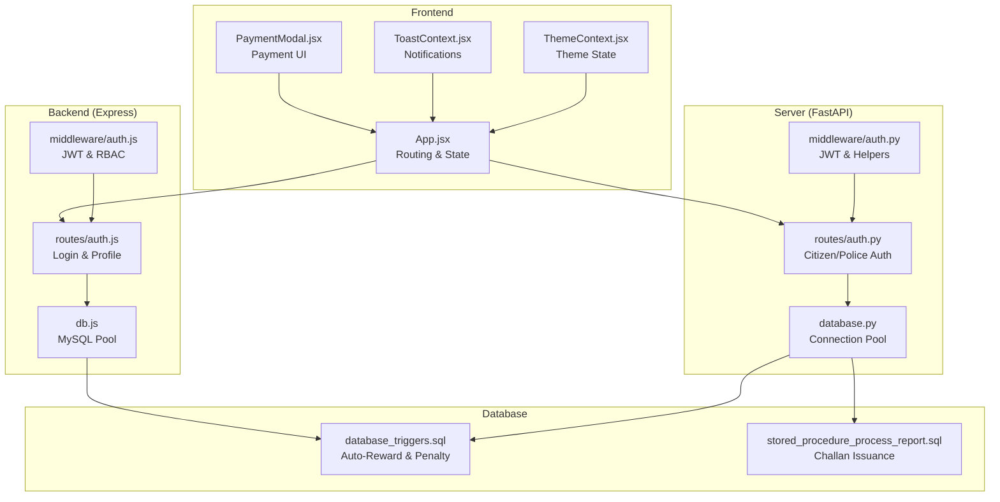
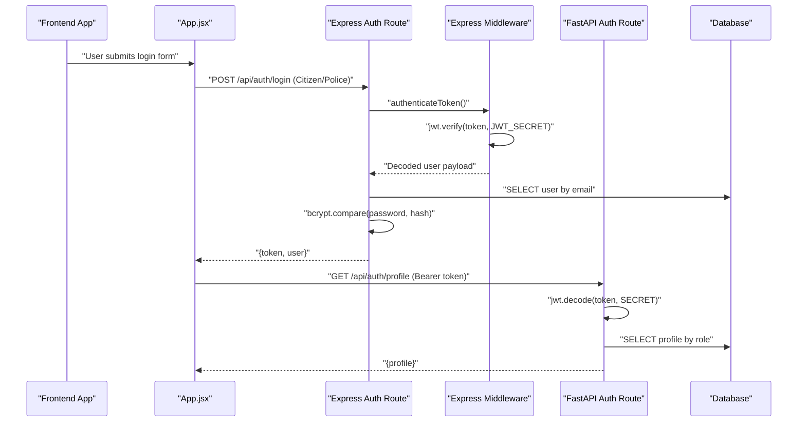
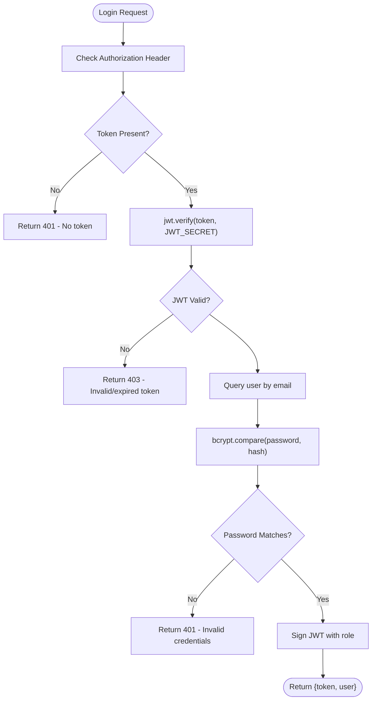
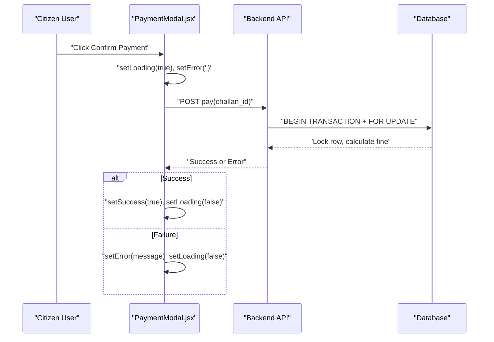
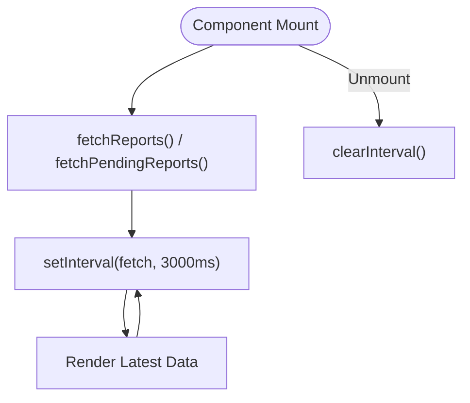
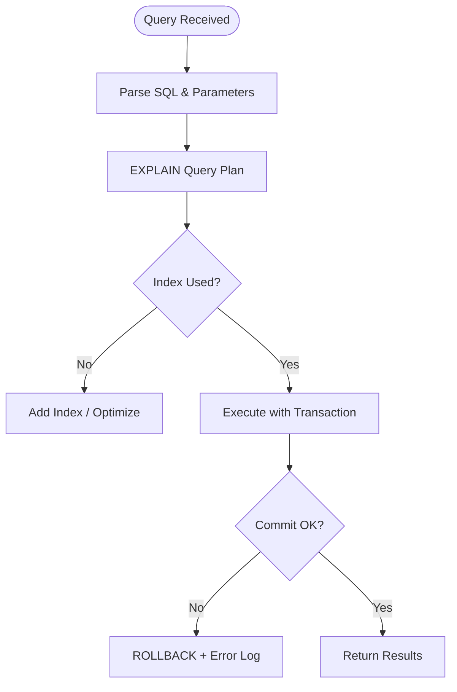
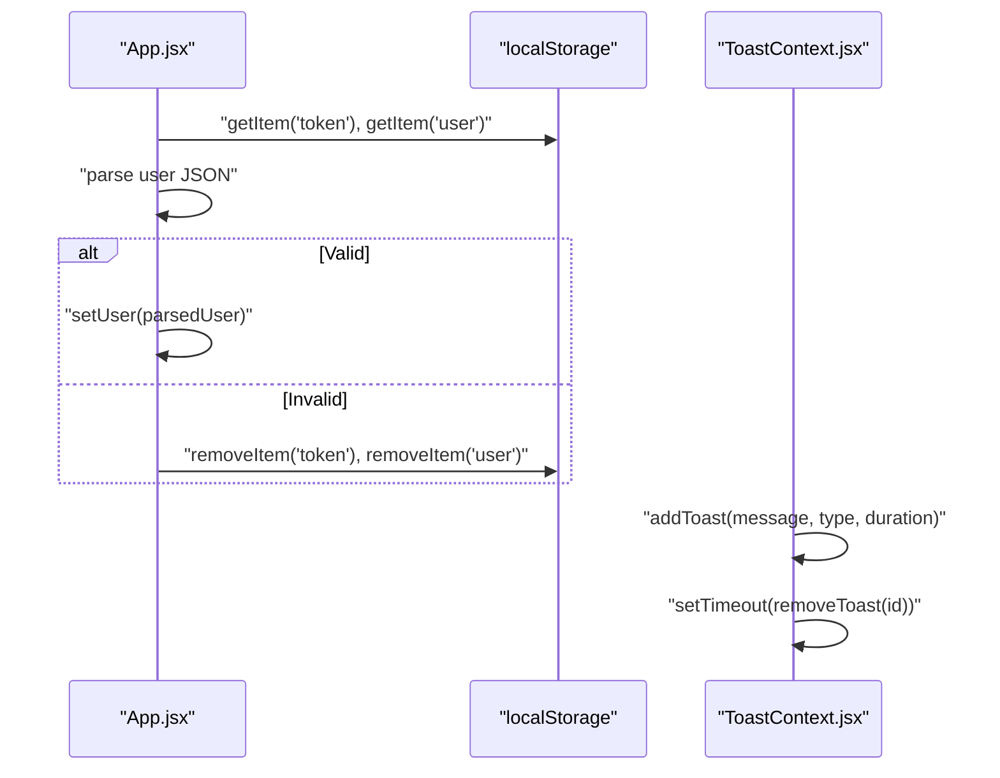
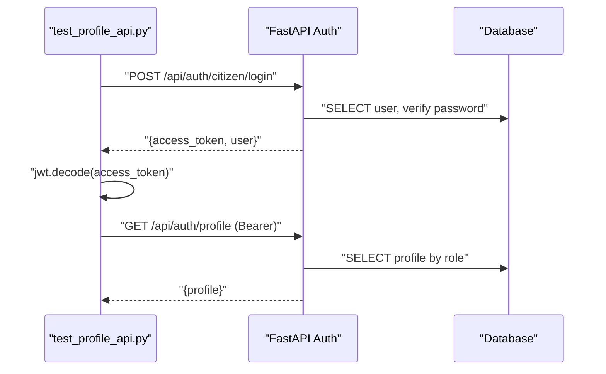
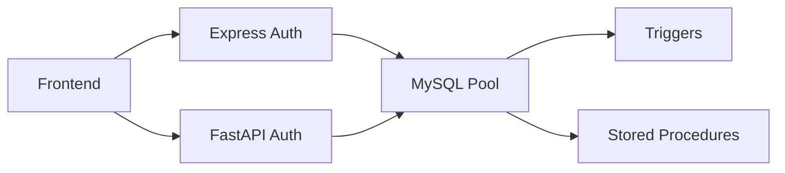

# Debugging Techniques

<cite>
**Referenced Files in This Document**
- [backend/middleware/auth.js](file://backend/middleware/auth.js)
- [backend/routes/auth.js](file://backend/routes/auth.js)
- [backend/db.js](file://backend/db.js)
- [server/middleware/auth.py](file://server/middleware/auth.py)
- [server/routes/auth.py](file://server/routes/auth.py)
- [server/database.py](file://server/database.py)
- [db/stored_procedure_process_report.sql](file://db/stored_procedure_process_report.sql)
- [db/database_triggers.sql](file://db/database_triggers.sql)
- [frontend/src/App.jsx](file://frontend/src/App.jsx)
- [frontend/src/components/PaymentModal.jsx](file://frontend/src/components/PaymentModal.jsx)
- [frontend/src/context/ToastContext.jsx](file://frontend/src/context/ToastContext.jsx)
- [frontend/src/context/ThemeContext.jsx](file://frontend/src/context/ThemeContext.jsx)
- [REALTIME_SYNC_DOCUMENTATION.md](file://REALTIME_SYNC_DOCUMENTATION.md)
- [scripts/test_profile_api.py](file://scripts/test_profile_api.py)
</cite>

## Table of Contents
1. [Introduction](#introduction)
2. [Project Structure](#project-structure)
3. [Core Components](#core-components)
4. [Architecture Overview](#architecture-overview)
5. [Detailed Component Analysis](#detailed-component-analysis)
6. [Dependency Analysis](#dependency-analysis)
7. [Performance Considerations](#performance-considerations)
8. [Troubleshooting Guide](#troubleshooting-guide)
9. [Conclusion](#conclusion)
10. [Appendices](#appendices)

## Introduction
This document provides systematic debugging techniques for the Traffic Violation Management System. It focuses on:
- Authentication failures: JWT validation, password verification, and role-based access control
- Payment processing: transaction logs, gateway responses, and amount calculation
- Real-time data synchronization: polling intervals, event propagation, and state consistency
- Database query debugging: SQL profiling, trigger execution, and stored procedure troubleshooting
- Frontend debugging: component state, API integration, and UI rendering
- Backend service debugging: FastAPI route testing, Express.js middleware, and cross-platform compatibility

## Project Structure
The system comprises:
- Backend (Express.js): authentication routes, middleware, and database pool
- Server (FastAPI): authentication endpoints, database utilities, and logging
- Database: triggers and stored procedures for trust scoring and report processing
- Frontend (React): routing, state persistence, and UI components
- Scripts: tests and verification utilities

**Diagram sources**
- [frontend/src/App.jsx:1-274](file://frontend/src/App.jsx#L1-L274)
- [frontend/src/components/PaymentModal.jsx:1-99](file://frontend/src/components/PaymentModal.jsx#L1-L99)
- [frontend/src/context/ToastContext.jsx:1-113](file://frontend/src/context/ToastContext.jsx#L1-L113)
- [frontend/src/context/ThemeContext.jsx:1-39](file://frontend/src/context/ThemeContext.jsx#L1-L39)
- [backend/middleware/auth.js:1-37](file://backend/middleware/auth.js#L1-L37)
- [backend/routes/auth.js:1-117](file://backend/routes/auth.js#L1-L117)
- [backend/db.js:1-26](file://backend/db.js#L1-L26)
- [server/middleware/auth.py:1-182](file://server/middleware/auth.py#L1-L182)
- [server/routes/auth.py:1-744](file://server/routes/auth.py#L1-L744)
- [server/database.py:1-76](file://server/database.py#L1-L76)
- [db/database_triggers.sql:1-48](file://db/database_triggers.sql#L1-L48)
- [db/stored_procedure_process_report.sql:1-115](file://db/stored_procedure_process_report.sql#L1-L115)

**Section sources**
- [backend/middleware/auth.js:1-37](file://backend/middleware/auth.js#L1-L37)
- [backend/routes/auth.js:1-117](file://backend/routes/auth.js#L1-L117)
- [backend/db.js:1-26](file://backend/db.js#L1-L26)
- [server/middleware/auth.py:1-182](file://server/middleware/auth.py#L1-L182)
- [server/routes/auth.py:1-744](file://server/routes/auth.py#L1-L744)
- [server/database.py:1-76](file://server/database.py#L1-L76)
- [db/database_triggers.sql:1-48](file://db/database_triggers.sql#L1-L48)
- [db/stored_procedure_process_report.sql:1-115](file://db/stored_procedure_process_report.sql#L1-L115)
- [frontend/src/App.jsx:1-274](file://frontend/src/App.jsx#L1-L274)
- [frontend/src/components/PaymentModal.jsx:1-99](file://frontend/src/components/PaymentModal.jsx#L1-L99)
- [frontend/src/context/ToastContext.jsx:1-113](file://frontend/src/context/ToastContext.jsx#L1-L113)
- [frontend/src/context/ThemeContext.jsx:1-39](file://frontend/src/context/ThemeContext.jsx#L1-L39)

## Core Components
- Authentication middleware and routes (Express.js): JWT extraction, validation, and role enforcement
- Authentication routes (FastAPI): password hashing, token generation, and profile retrieval
- Database utilities: connection pools and context managers
- Triggers and stored procedures: automated trust score adjustments and challan issuance
- Frontend routing and state: token persistence, navigation guards, and UI feedback

Key debugging anchors:
- JWT secret mismatches and token expiration
- Password hashing and comparison failures
- Role-based access control bypass attempts
- Database connectivity and transaction rollbacks
- Frontend state restoration and toast notifications

**Section sources**
- [backend/middleware/auth.js:1-37](file://backend/middleware/auth.js#L1-L37)
- [backend/routes/auth.js:1-117](file://backend/routes/auth.js#L1-L117)
- [server/middleware/auth.py:1-182](file://server/middleware/auth.py#L1-L182)
- [server/routes/auth.py:1-744](file://server/routes/auth.py#L1-L744)
- [server/database.py:1-76](file://server/database.py#L1-L76)
- [db/database_triggers.sql:1-48](file://db/database_triggers.sql#L1-L48)
- [db/stored_procedure_process_report.sql:1-115](file://db/stored_procedure_process_report.sql#L1-L115)
- [frontend/src/App.jsx:1-274](file://frontend/src/App.jsx#L1-L274)
- [frontend/src/context/ToastContext.jsx:1-113](file://frontend/src/context/ToastContext.jsx#L1-L113)

## Architecture Overview
The system relies on:
- Centralized database as the single source of truth
- HTTP polling for real-time updates (3-second intervals)
- Explicit JWT-based authentication with role checks
- Self-contained FastAPI endpoints with minimal external dependencies
- Express.js middleware for role-based access control

**Diagram sources**
- [backend/routes/auth.js:1-117](file://backend/routes/auth.js#L1-L117)
- [backend/middleware/auth.js:1-37](file://backend/middleware/auth.js#L1-L37)
- [server/routes/auth.py:1-744](file://server/routes/auth.py#L1-L744)
- [frontend/src/App.jsx:1-274](file://frontend/src/App.jsx#L1-L274)

## Detailed Component Analysis

### Authentication Debugging (JWT, Password, RBAC)
Common failure modes:
- Missing or malformed Authorization header
- Expired or invalid JWT signature
- Wrong JWT_SECRET or algorithm mismatch
- Incorrect role claims causing RBAC rejections
- bcrypt compare failures due to encoding or mismatched hashes

Recommended debugging steps:
- Verify Authorization header format and presence
- Confirm JWT_SECRET alignment across services
- Validate token payload (role, sub) and expiration
- Inspect bcrypt hashing pipeline and compare inputs
- Check RBAC middleware conditions for role enforcement

**Diagram sources**
- [backend/routes/auth.js:1-117](file://backend/routes/auth.js#L1-L117)
- [backend/middleware/auth.js:1-37](file://backend/middleware/auth.js#L1-L37)
- [server/routes/auth.py:1-744](file://server/routes/auth.py#L1-L744)
- [server/middleware/auth.py:1-182](file://server/middleware/auth.py#L1-L182)

**Section sources**
- [backend/middleware/auth.js:1-37](file://backend/middleware/auth.js#L1-L37)
- [backend/routes/auth.js:1-117](file://backend/routes/auth.js#L1-L117)
- [server/middleware/auth.py:1-182](file://server/middleware/auth.py#L1-L182)
- [server/routes/auth.py:1-744](file://server/routes/auth.py#L1-L744)

### Payment Processing Debugging
Focus areas:
- PaymentModal state transitions and error propagation
- Transaction logs and gateway response handling
- Amount calculation and currency formatting
- Row-level locking and concurrency safety

Debugging checklist:
- Confirm payment modal receives challan_id and amount
- Capture and log onPay promise resolution/rejection
- Validate gateway response structure and status codes
- Verify amount field binding and rounding behavior
- Ensure database locking prevents race conditions

**Diagram sources**
- [frontend/src/components/PaymentModal.jsx:1-99](file://frontend/src/components/PaymentModal.jsx#L1-L99)
- [db/stored_procedure_process_report.sql:1-115](file://db/stored_procedure_process_report.sql#L1-L115)

**Section sources**
- [frontend/src/components/PaymentModal.jsx:1-99](file://frontend/src/components/PaymentModal.jsx#L1-L99)
- [db/stored_procedure_process_report.sql:1-115](file://db/stored_procedure_process_report.sql#L1-L115)

### Real-Time Data Synchronization Debugging
The system uses 3-second polling to maintain consistency:
- Frontend auto-refresh intervals for pending reports and personal reports
- Direct database queries without caching
- ACID-compliant transactions and triggers for automation

Debugging tips:
- Verify polling intervals and cleanup on component unmount
- Confirm direct database queries on each poll
- Validate trigger firing for trust score changes
- Cross-check latency guarantees and network overhead

**Diagram sources**
- [REALTIME_SYNC_DOCUMENTATION.md:115-152](file://REALTIME_SYNC_DOCUMENTATION.md#L115-L152)

**Section sources**
- [REALTIME_SYNC_DOCUMENTATION.md:1-392](file://REALTIME_SYNC_DOCUMENTATION.md#L1-L392)
- [frontend/src/App.jsx:1-274](file://frontend/src/App.jsx#L1-L274)

### Database Query Debugging
Techniques:
- Enable slow query logs and analyze query patterns
- Use EXPLAIN to inspect query plans and missing indexes
- Verify stored procedure parameters and transaction boundaries
- Confirm trigger execution via audit logs or manual verification queries

**Diagram sources**
- [db/stored_procedure_process_report.sql:1-115](file://db/stored_procedure_process_report.sql#L1-L115)
- [db/database_triggers.sql:1-48](file://db/database_triggers.sql#L1-L48)

**Section sources**
- [db/stored_procedure_process_report.sql:1-115](file://db/stored_procedure_process_report.sql#L1-L115)
- [db/database_triggers.sql:1-48](file://db/database_triggers.sql#L1-L48)

### Frontend Debugging Techniques
Common issues:
- Token parsing failures and localStorage corruption
- Navigation guards not redirecting properly
- Toast notifications not appearing or timing out incorrectly
- Theme switching not persisting

Debugging steps:
- Log localStorage state on app initialization
- Validate token presence and structure in handleLogin
- Inspect navigation guards and user role checks
- Verify toast lifecycle and container mounting
- Confirm theme persistence and DOM class toggles

**Diagram sources**
- [frontend/src/App.jsx:1-274](file://frontend/src/App.jsx#L1-L274)
- [frontend/src/context/ToastContext.jsx:1-113](file://frontend/src/context/ToastContext.jsx#L1-L113)
- [frontend/src/context/ThemeContext.jsx:1-39](file://frontend/src/context/ThemeContext.jsx#L1-L39)

**Section sources**
- [frontend/src/App.jsx:1-274](file://frontend/src/App.jsx#L1-L274)
- [frontend/src/context/ToastContext.jsx:1-113](file://frontend/src/context/ToastContext.jsx#L1-L113)
- [frontend/src/context/ThemeContext.jsx:1-39](file://frontend/src/context/ThemeContext.jsx#L1-L39)

### Backend Service Debugging
FastAPI route testing:
- Use script-based tests to validate login and profile retrieval
- Mock JWT decoding and verify token payload
- Validate HTTP exceptions and error messages

Express.js middleware:
- Confirm Authorization header parsing and bearer token extraction
- Validate JWT_SECRET and error responses for missing/expired tokens
- Test role-based guards for citizen/police endpoints

Cross-platform compatibility:
- Align JWT secrets and algorithms across services
- Ensure consistent environment variable configuration
- Validate database driver compatibility (PyMySQL vs mysql2/promise)

**Diagram sources**
- [scripts/test_profile_api.py:1-49](file://scripts/test_profile_api.py#L1-L49)
- [server/routes/auth.py:1-744](file://server/routes/auth.py#L1-L744)

**Section sources**
- [scripts/test_profile_api.py:1-49](file://scripts/test_profile_api.py#L1-L49)
- [backend/middleware/auth.js:1-37](file://backend/middleware/auth.js#L1-L37)
- [backend/routes/auth.js:1-117](file://backend/routes/auth.js#L1-L117)
- [server/routes/auth.py:1-744](file://server/routes/auth.py#L1-L744)

## Dependency Analysis
- Frontend depends on backend endpoints for authentication and profile data
- Backend routes depend on database pools and JWT libraries
- FastAPI routes depend on PyMySQL and bcrypt for secure operations
- Database triggers and stored procedures enforce business rules and automation

**Diagram sources**
- [frontend/src/App.jsx:1-274](file://frontend/src/App.jsx#L1-L274)
- [backend/db.js:1-26](file://backend/db.js#L1-L26)
- [server/database.py:1-76](file://server/database.py#L1-L76)
- [db/database_triggers.sql:1-48](file://db/database_triggers.sql#L1-L48)
- [db/stored_procedure_process_report.sql:1-115](file://db/stored_procedure_process_report.sql#L1-L115)

**Section sources**
- [frontend/src/App.jsx:1-274](file://frontend/src/App.jsx#L1-L274)
- [backend/db.js:1-26](file://backend/db.js#L1-L26)
- [server/database.py:1-76](file://server/database.py#L1-L76)
- [db/database_triggers.sql:1-48](file://db/database_triggers.sql#L1-L48)
- [db/stored_procedure_process_report.sql:1-115](file://db/stored_procedure_process_report.sql#L1-L115)

## Performance Considerations
- Real-time sync latency is bounded by 3-second polling intervals
- Database queries are lightweight SELECTs; avoid caching to preserve freshness
- Use connection pooling to manage concurrent connections efficiently
- Monitor slow queries and add appropriate indexes for frequently filtered columns

[No sources needed since this section provides general guidance]

## Troubleshooting Guide
Authentication failures:
- Verify JWT_SECRET consistency across services
- Check token expiration and algorithm alignment
- Confirm bcrypt hashing and compare inputs
- Validate RBAC middleware role checks

Payment issues:
- Inspect PaymentModal state transitions and error handling
- Log gateway responses and transaction outcomes
- Validate amount calculations and currency formatting

Real-time sync:
- Confirm polling intervals and cleanup on unmount
- Ensure direct database queries on each poll
- Verify trigger execution for trust score updates

Database:
- Use EXPLAIN to analyze query plans
- Confirm stored procedure parameters and transaction boundaries
- Validate trigger execution via verification queries

Frontend:
- Log localStorage state restoration
- Verify navigation guards and user role checks
- Confirm toast and theme provider lifecycles

Backend:
- Use script-based tests to validate endpoints
- Align JWT secrets and algorithms
- Ensure database driver compatibility

**Section sources**
- [backend/middleware/auth.js:1-37](file://backend/middleware/auth.js#L1-L37)
- [backend/routes/auth.js:1-117](file://backend/routes/auth.js#L1-L117)
- [server/middleware/auth.py:1-182](file://server/middleware/auth.py#L1-L182)
- [server/routes/auth.py:1-744](file://server/routes/auth.py#L1-L744)
- [frontend/src/App.jsx:1-274](file://frontend/src/App.jsx#L1-L274)
- [frontend/src/components/PaymentModal.jsx:1-99](file://frontend/src/components/PaymentModal.jsx#L1-L99)
- [REALTIME_SYNC_DOCUMENTATION.md:1-392](file://REALTIME_SYNC_DOCUMENTATION.md#L1-L392)
- [db/database_triggers.sql:1-48](file://db/database_triggers.sql#L1-L48)
- [db/stored_procedure_process_report.sql:1-115](file://db/stored_procedure_process_report.sql#L1-L115)
- [scripts/test_profile_api.py:1-49](file://scripts/test_profile_api.py#L1-L49)

## Conclusion
This guide consolidates practical debugging strategies for authentication, payments, real-time synchronization, database operations, and frontend/backend integration. By focusing on explicit checks, logging, and systematic validation, teams can quickly isolate and resolve issues while maintaining system reliability and data consistency.

[No sources needed since this section summarizes without analyzing specific files]

## Appendices
- Logging strategies: capture JWT payloads, database connection states, and transaction outcomes
- Monitoring approaches: track endpoint latencies, error rates, and polling frequency
- Tools: Postman for API testing, browser devtools for frontend diagnostics, and database clients for SQL verification

[No sources needed since this section provides general guidance]