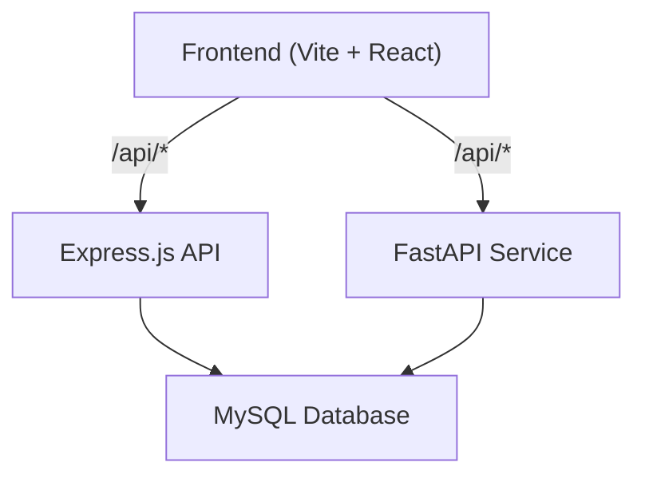
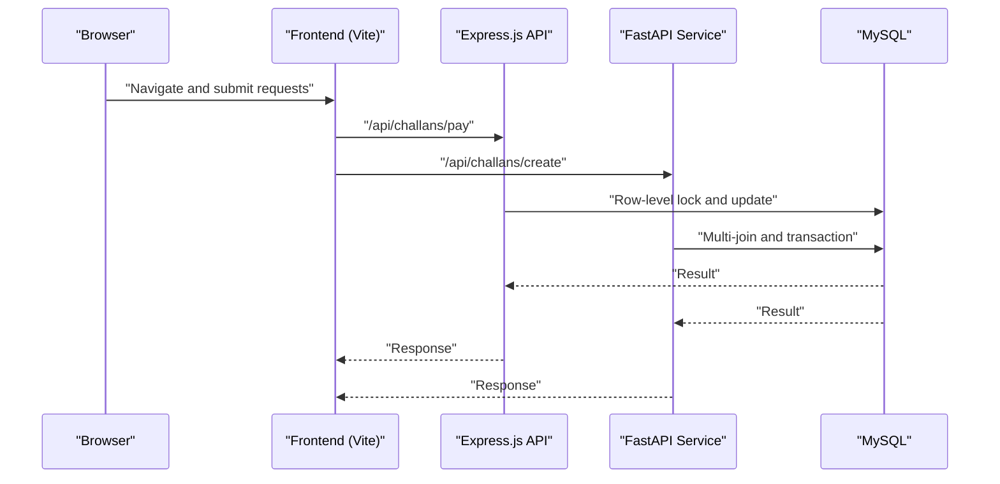
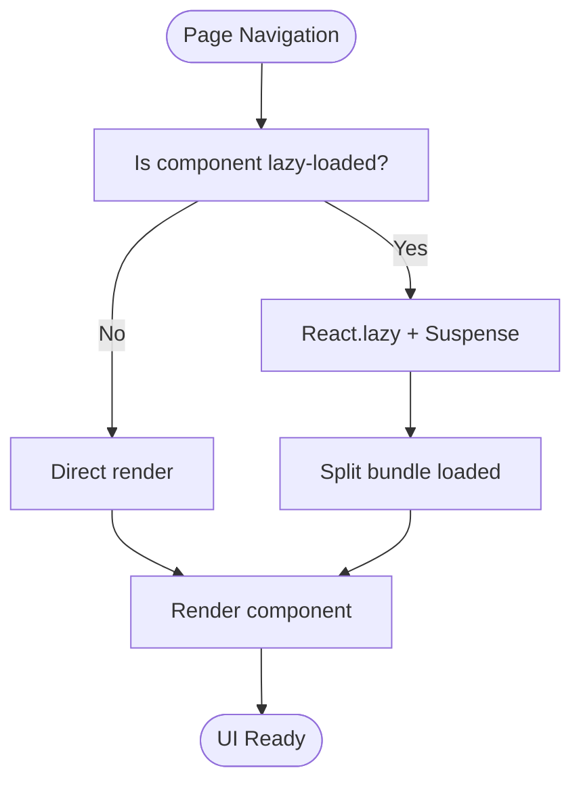
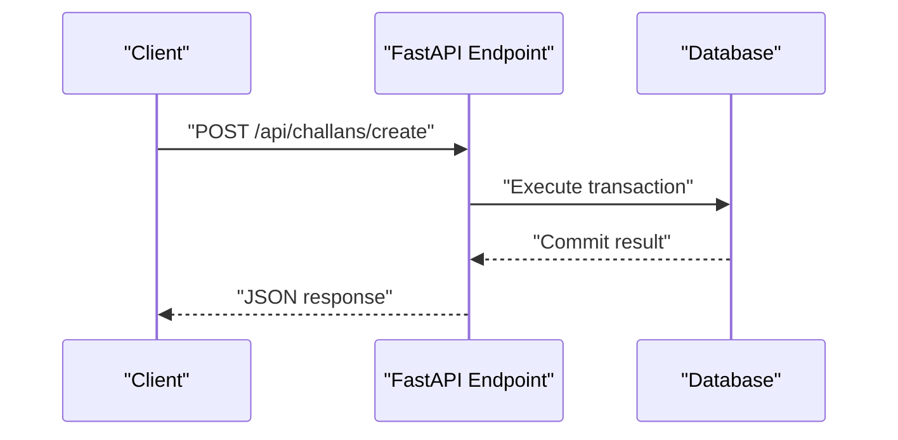
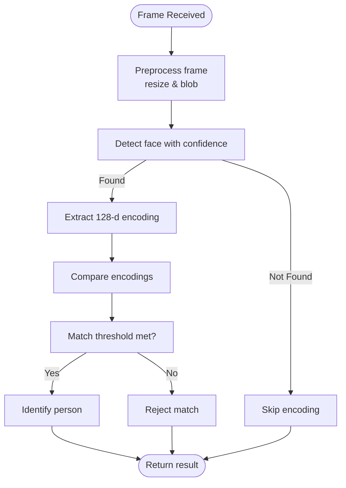
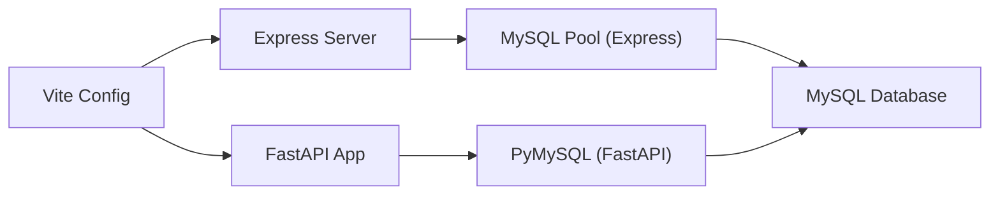

# Performance Optimization

<cite>
**Referenced Files in This Document**
- [backend/package.json](file://backend/package.json)
- [backend/server.js](file://backend/server.js)
- [backend/db.js](file://backend/db.js)
- [backend/routes/challans.js](file://backend/routes/challans.js)
- [server/main.py](file://server/main.py)
- [server/database.py](file://server/database.py)
- [server/services/face_service.py](file://server/services/face_service.py)
- [db/schema.sql](file://db/schema.sql)
- [db/stored_procedure_process_report.sql](file://db/stored_procedure_process_report.sql)
- [db/database_triggers.sql](file://db/database_triggers.sql)
- [frontend/vite.config.js](file://frontend/vite.config.js)
- [frontend/src/App.jsx](file://frontend/src/App.jsx)
- [frontend/src/main.jsx](file://frontend/src/main.jsx)
</cite>

## Table of Contents
1. [Introduction](#introduction)
2. [Project Structure](#project-structure)
3. [Core Components](#core-components)
4. [Architecture Overview](#architecture-overview)
5. [Detailed Component Analysis](#detailed-component-analysis)
6. [Dependency Analysis](#dependency-analysis)
7. [Performance Considerations](#performance-considerations)
8. [Troubleshooting Guide](#troubleshooting-guide)
9. [Conclusion](#conclusion)
10. [Appendices](#appendices)

## Introduction
This document provides a comprehensive performance optimization guide for the Traffic Violation Management System. It covers database optimization (query optimization, indexing, connection pooling), frontend performance (bundle optimization, lazy loading, asset compression), backend service tuning (FastAPI and Express.js), real-time features (WebSocket and streaming), face recognition optimization, monitoring and profiling techniques, and scalability strategies for handling peak traffic.

## Project Structure
The system comprises:
- Backend API built with Express.js and a MySQL connection pool
- FastAPI microservice for advanced routes and database operations
- Frontend built with Vite and React, proxied to backend APIs
- Robust database schema with triggers, stored procedures, and views optimized for transactional integrity and reporting

**Diagram sources**
- [frontend/vite.config.js:1-23](file://frontend/vite.config.js#L1-L23)
- [backend/server.js:1-42](file://backend/server.js#L1-L42)
- [server/main.py:1-107](file://server/main.py#L1-L107)
- [backend/db.js:1-26](file://backend/db.js#L1-L26)
- [server/database.py:1-76](file://server/database.py#L1-L76)

**Section sources**
- [backend/package.json:1-22](file://backend/package.json#L1-L22)
- [frontend/vite.config.js:1-23](file://frontend/vite.config.js#L1-L23)
- [frontend/src/App.jsx:1-274](file://frontend/src/App.jsx#L1-L274)
- [frontend/src/main.jsx:1-14](file://frontend/src/main.jsx#L1-L14)
- [server/main.py:1-107](file://server/main.py#L1-L107)
- [backend/server.js:1-42](file://backend/server.js#L1-L42)
- [server/database.py:1-76](file://server/database.py#L1-L76)
- [backend/db.js:1-26](file://backend/db.js#L1-L26)

## Core Components
- Express.js API: Lightweight API gateway handling authentication, challan payments, and basic CRUD operations with a MySQL pool.
- FastAPI Service: Advanced routes for challans, analytics, and trusted operations with explicit database configuration and connection lifecycle management.
- Frontend (Vite): Single-page application with routing and development proxy to backend APIs.
- Database: Normalized schema with indexes, triggers, stored procedures, and views to support high-integrity workflows.

Key performance-relevant configurations:
- Express.js connection pool with fixed limits and keep-alive
- FastAPI database configuration with timeouts and cursor classes
- Frontend proxy for local development and API alignment

**Section sources**
- [backend/db.js:1-26](file://backend/db.js#L1-L26)
- [server/database.py:1-76](file://server/database.py#L1-L76)
- [frontend/vite.config.js:1-23](file://frontend/vite.config.js#L1-L23)
- [server/main.py:50-107](file://server/main.py#L50-L107)
- [backend/server.js:10-42](file://backend/server.js#L10-L42)

## Architecture Overview
The system integrates a React SPA with dual backend services:
- Express.js for lightweight endpoints and payment transactions
- FastAPI for robust, typed endpoints and complex queries

**Diagram sources**
- [frontend/src/App.jsx:1-274](file://frontend/src/App.jsx#L1-L274)
- [backend/routes/challans.js:31-98](file://backend/routes/challans.js#L31-L98)
- [server/routers/challans.py:47-139](file://server/routes/challans.py#L47-L139)

## Detailed Component Analysis

### Database Performance Optimization
- Indexes: Strategic indexes on frequently filtered and joined columns (e.g., CITIZENS(email), REPORTS(status, citizen_id), CHALLANS(payment_status, citizen_id)).
- Triggers and Stored Procedures: Use triggers for automatic trust scoring and stored procedures for atomic operations (issuing challans, payments) to reduce application-level complexity and improve consistency.
- Transactions and Row-Level Locking: Enforce concurrency-safe updates with explicit locks to avoid race conditions during payment processing.
- Connection Pool Tuning:
  - Express.js: Pool size set to moderate value with keep-alive enabled; adjust based on observed concurrency and latency.
  - FastAPI: Explicit timeouts and cursor configuration to bound query duration and resource usage.

Recommended actions:
- Add composite indexes for frequent filter combinations (e.g., CHALLANS(citizen_id, issue_date), REPORTS(status, date_reported)).
- Monitor slow query logs and query execution plans to identify missing indexes.
- Use prepared statements and parameterized queries to reduce parsing overhead.
- Consider read replicas for analytical queries (e.g., views used in dashboards).

**Section sources**
- [db/schema.sql:26-43](file://db/schema.sql#L26-L43)
- [db/schema.sql:116-136](file://db/schema.sql#L116-L136)
- [db/schema.sql:173-195](file://db/schema.sql#L173-L195)
- [db/database_triggers.sql:8-35](file://db/database_triggers.sql#L8-L35)
- [db/stored_procedure_process_report.sql:33-48](file://db/stored_procedure_process_report.sql#L33-L48)
- [backend/db.js:3-13](file://backend/db.js#L3-L13)
- [server/database.py:22-35](file://server/database.py#L22-L35)

### Frontend Performance Improvements
- Bundle Optimization:
  - Enable production builds with minification and tree-shaking via Vite.
  - Split vendor and application bundles to leverage caching.
- Lazy Loading:
  - Use React.lazy and Suspense for heavy pages (e.g., Analytics, Leaderboard) to defer loading until navigation.
- Asset Compression:
  - Compress images and videos; serve modern formats (AVIF/WebP) where supported.
  - Enable gzip/Brotli compression on the web server/proxy.
- Proxy and Network:
  - Keep the existing proxy configuration (/api and /uploads) for local development; ensure production reverse proxy preserves headers and enables compression.

**Diagram sources**
- [frontend/src/App.jsx:1-274](file://frontend/src/App.jsx#L1-L274)

**Section sources**
- [frontend/vite.config.js:1-23](file://frontend/vite.config.js#L1-L23)
- [frontend/src/App.jsx:1-274](file://frontend/src/App.jsx#L1-L274)
- [frontend/src/main.jsx:1-14](file://frontend/src/main.jsx#L1-L14)

### Backend Service Performance Tuning
- Express.js:
  - Middleware stack is minimal; ensure CORS and JSON parsing are sufficient.
  - Use connection pooling and release connections promptly.
  - Add request timeout middleware for long-running endpoints.
- FastAPI:
  - Configure Uvicorn workers and keep-alive settings for production deployments.
  - Centralize database configuration and reuse connections via context managers.
  - Add rate limiting and input validation to reduce unnecessary work.

**Diagram sources**
- [server/main.py:50-107](file://server/main.py#L50-L107)
- [server/database.py:35-44](file://server/database.py#L35-L44)
- [server/routes/challans.py:47-139](file://server/routes/challans.py#L47-L139)

**Section sources**
- [backend/server.js:10-42](file://backend/server.js#L10-L42)
- [server/main.py:50-107](file://server/main.py#L50-L107)
- [server/database.py:14-50](file://server/database.py#L14-L50)

### Real-Time Feature Performance
- Current state: No WebSocket or streaming endpoints are present in the referenced files.
- Recommendations:
  - Introduce server-sent events (SSE) for push notifications (e.g., challan status updates).
  - For bidirectional real-time, integrate WebSocket libraries and manage per-connection resources carefully.
  - Use message queuing (e.g., Redis pub/sub) for scalable fan-out of events.
  - Apply backpressure and connection limits to protect the server under load.

[No sources needed since this section provides general guidance]

### Face Recognition Performance Optimization
- Model Loading:
  - Load models once and reuse across requests to avoid repeated initialization overhead.
- Webcam Processing:
  - Downscale frames before detection; apply efficient preprocessing (e.g., resize to 300x300).
  - Use confidence thresholds to reduce false positives and unnecessary computation.
- Encoding Extraction:
  - Normalize and flatten efficiently; consider PCA-like downsampling to 128 dimensions.
  - Cache or memoize recent encodings to avoid recomputation for repeated frames.
- Memory Management:
  - Release OpenCV buffers and close video captures promptly.
  - Monitor memory usage and restart workers if fragmentation increases.

**Diagram sources**
- [server/services/face_service.py:47-150](file://server/services/face_service.py#L47-L150)

**Section sources**
- [server/services/face_service.py:15-177](file://server/services/face_service.py#L15-L177)

## Dependency Analysis
- Express.js depends on mysql2/promise for connection pooling.
- FastAPI uses PyMySQL for database connectivity and defines DB configuration centrally.
- Frontend proxies API calls to backend services for local development.

**Diagram sources**
- [frontend/vite.config.js:1-23](file://frontend/vite.config.js#L1-L23)
- [backend/db.js:1-26](file://backend/db.js#L1-L26)
- [server/database.py:1-76](file://server/database.py#L1-L76)
- [server/main.py:50-107](file://server/main.py#L50-L107)

**Section sources**
- [backend/package.json:10-17](file://backend/package.json#L10-L17)
- [backend/db.js:1-26](file://backend/db.js#L1-L26)
- [server/database.py:1-76](file://server/database.py#L1-L76)
- [frontend/vite.config.js:1-23](file://frontend/vite.config.js#L1-L23)

## Performance Considerations
- Database
  - Use EXPLAIN to analyze slow queries and add appropriate indexes.
  - Prefer batch operations for bulk inserts/updates.
  - Monitor connection pool saturation and adjust pool size accordingly.
- Backend
  - Add circuit breakers for downstream dependencies.
  - Implement request timeouts and retry policies for transient failures.
  - Use asynchronous I/O where feasible (e.g., FastAPI async endpoints).
- Frontend
  - Measure CLS, FID, and LCP; optimize Largest Contentful Paint.
  - Defer non-critical JavaScript and split chunks.
- Real-time
  - Use connection pooling and limit concurrent streams.
  - Implement exponential backoff for reconnection attempts.
- Face Recognition
  - Reduce resolution and frame rate for live streams.
  - Cache results for short TTL to minimize repeated work.

[No sources needed since this section provides general guidance]

## Troubleshooting Guide
- Database Connectivity
  - Verify pool creation and connection timeouts; ensure credentials and host are correct.
  - Check for connection leaks by ensuring connections are closed in finally blocks.
- Express.js Endpoints
  - Validate row-level locking and transaction boundaries for payment endpoints.
  - Confirm proper error handling and rollback on exceptions.
- Frontend
  - Use browser devtools to inspect network latency and bundle sizes.
  - Verify proxy configuration for API paths (/api, /uploads).
- Monitoring
  - Enable logging for database errors and slow queries.
  - Track response times and error rates at API gateways.

**Section sources**
- [server/database.py:52-76](file://server/database.py#L52-L76)
- [backend/routes/challans.js:40-98](file://backend/routes/challans.js#L40-L98)
- [frontend/vite.config.js:7-21](file://frontend/vite.config.js#L7-L21)

## Conclusion
By aligning database, backend, and frontend optimizations—through strategic indexing, connection pooling, lazy loading, and model-efficient processing—the Traffic Violation Management System can achieve robust performance and scalability. Implement monitoring and iterative profiling to sustain performance under real-world loads.

[No sources needed since this section summarizes without analyzing specific files]

## Appendices
- Scalability and Capacity Planning
  - Horizontal scaling: Deploy multiple instances behind a load balancer; ensure shared storage for uploads and consistent session handling.
  - Load balancing: Use sticky sessions for stateful operations; distribute static assets via CDN.
  - Peak traffic: Provision burstable CPU/memory; autoscale based on request rate and database queue length.

[No sources needed since this section provides general guidance]