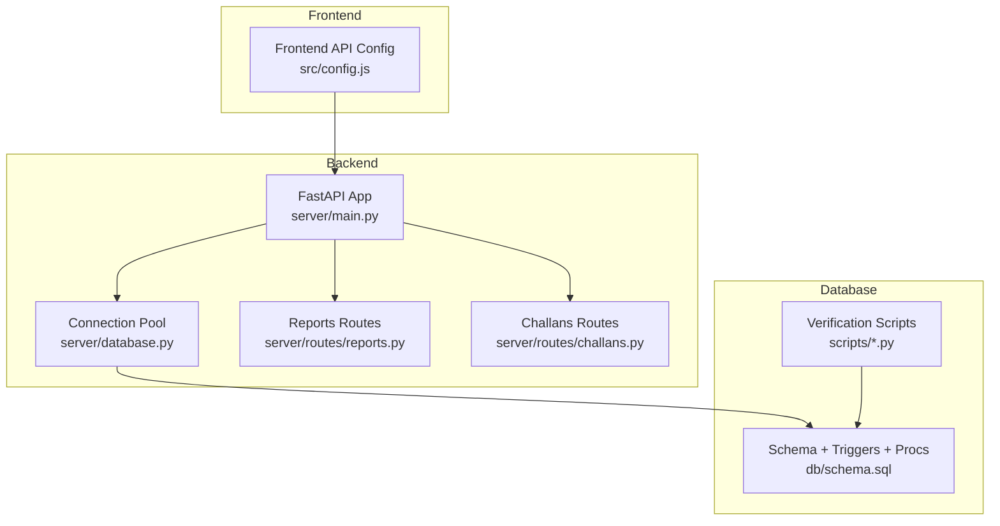
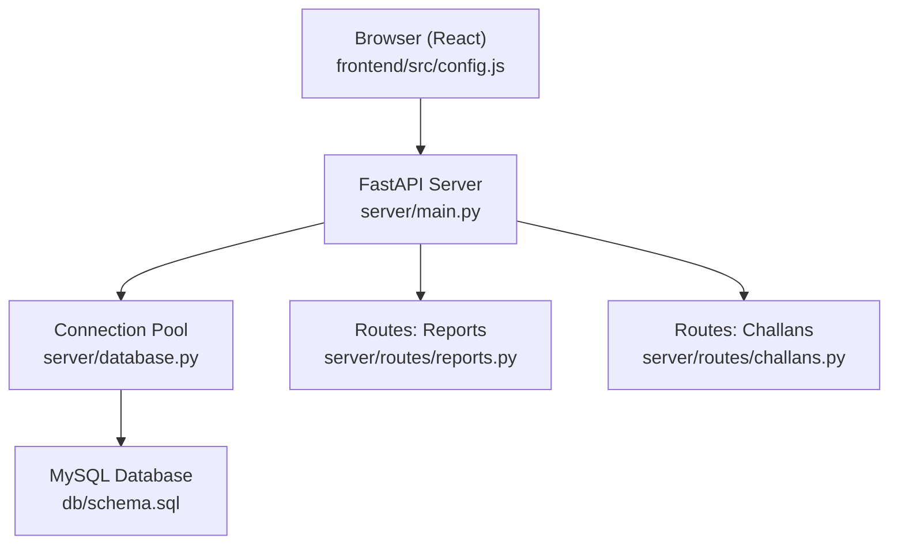
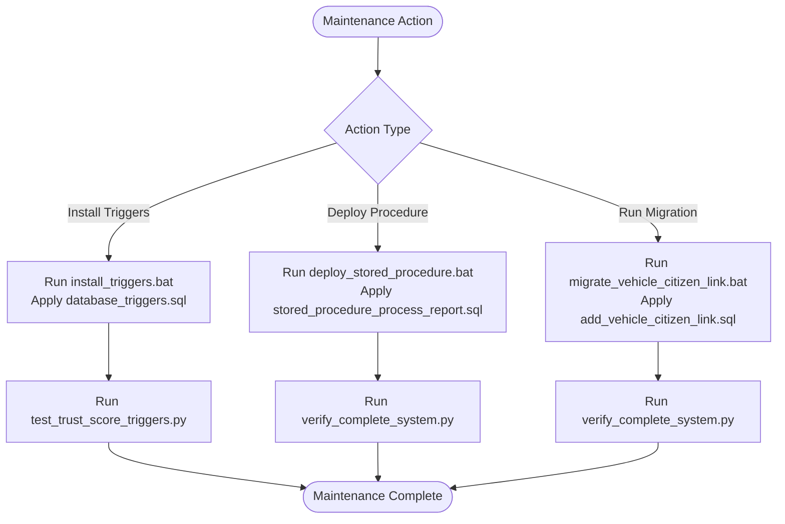
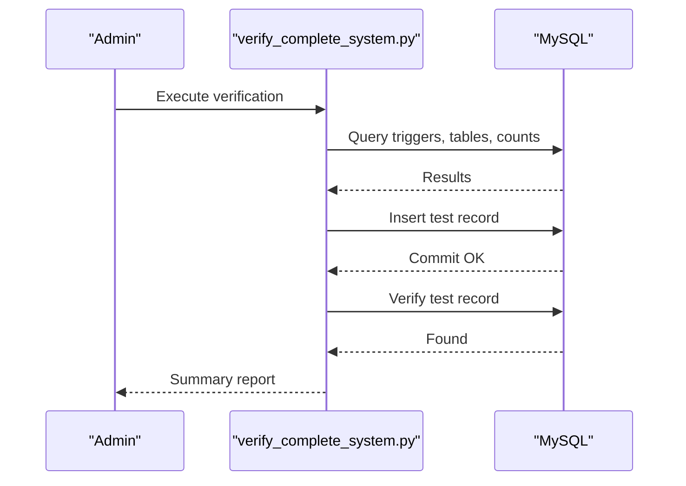
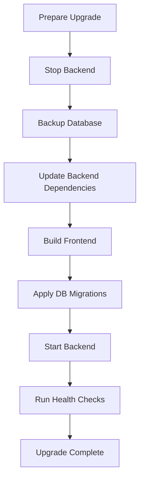
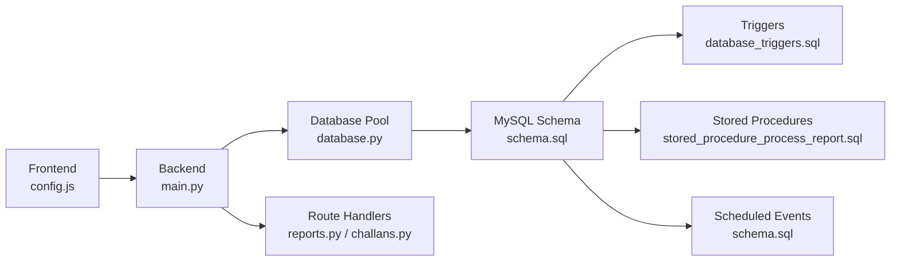

# System Maintenance

<cite>
**Referenced Files in This Document**
- [README.md](file://README.md)
- [setup_db.bat](file://scripts/setup_db.bat)
- [install_triggers.bat](file://scripts/install_triggers.bat)
- [deploy_stored_procedure.bat](file://scripts/deploy_stored_procedure.bat)
- [migrate_vehicle_citizen_link.bat](file://scripts/migrate_vehicle_citizen_link.bat)
- [schema.sql](file://db/schema.sql)
- [database_triggers.sql](file://db/database_triggers.sql)
- [stored_procedure_process_report.sql](file://db/stored_procedure_process_report.sql)
- [add_vehicle_citizen_link.sql](file://db/add_vehicle_citizen_link.sql)
- [verify_complete_system.py](file://scripts/verify_complete_system.py)
- [verify_database_persistence.py](file://scripts/verify_database_persistence.py)
- [test_trust_score_triggers.py](file://scripts/test_trust_score_triggers.py)
- [setup_demo_environment.bat](file://scripts/setup_demo_environment.bat)
- [database.py](file://server/database.py)
- [main.py](file://server/main.py)
- [config.py](file://server/config.py)
- [config.js](file://frontend/src/config.js)
- [reports.py](file://server/routes/reports.py)
- [challans.py](file://server/routes/challans.py)
</cite>

## Table of Contents
1. [Introduction](#introduction)
2. [Project Structure](#project-structure)
3. [Core Components](#core-components)
4. [Architecture Overview](#architecture-overview)
5. [Detailed Component Analysis](#detailed-component-analysis)
6. [Dependency Analysis](#dependency-analysis)
7. [Performance Considerations](#performance-considerations)
8. [Troubleshooting Guide](#troubleshooting-guide)
9. [Conclusion](#conclusion)
10. [Appendices](#appendices)

## Introduction
This document provides comprehensive system maintenance procedures for the Traffic Violation Management System. It covers database maintenance (trigger verification, stored procedure validation, schema updates), system health checks (automated verification scripts, integrity validation, dependency testing), maintenance workflows (backend upgrades, frontend builds, database migrations), performance optimization (query tuning, connection pooling, monitoring), preventive maintenance (cleanup, log rotation, backups), external integrations (payment gateways, email services, face recognition), and monitoring/alerting configurations for proactive issue detection.

## Project Structure
The system comprises:
- Backend: FastAPI application with route handlers for reports, challans, and related operations
- Database: MySQL schema with triggers, stored procedures, views, and temporal tables
- Frontend: React/Vite client consuming the backend API
- Scripts: Automated setup, verification, and migration utilities

**Diagram sources**
- [main.py:1-107](file://server/main.py#L1-L107)
- [database.py:1-76](file://server/database.py#L1-L76)
- [reports.py:1-563](file://server/routes/reports.py#L1-L563)
- [challans.py:1-450](file://server/routes/challans.py#L1-L450)
- [schema.sql:1-942](file://db/schema.sql#L1-L942)
- [config.js:1-34](file://frontend/src/config.js#L1-L34)

**Section sources**
- [README.md:1-415](file://README.md#L1-L415)
- [main.py:1-107](file://server/main.py#L1-L107)
- [database.py:1-76](file://server/database.py#L1-L76)
- [schema.sql:1-942](file://db/schema.sql#L1-L942)
- [config.js:1-34](file://frontend/src/config.js#L1-L34)

## Core Components
- Database layer: MySQL 8.0+ with 5NF-normalized schema, temporal tables, triggers, stored procedures, views, and scheduled events
- Backend layer: FastAPI application with connection pooling, route handlers, and CORS configuration
- Frontend layer: React/Vite client with API endpoints configured via environment variables
- Maintenance utilities: Windows batch scripts and Python verification scripts for setup, trigger validation, stored procedure deployment, and migrations

Key capabilities:
- ACID transactions and row-level locking for payment processing
- Automatic trust score updates via triggers
- Temporal versioning for audit trails
- Event-driven cleanup of transient data
- Self-contained route handlers with embedded database connectivity

**Section sources**
- [README.md:14-41](file://README.md#L14-L41)
- [schema.sql:1-942](file://db/schema.sql#L1-L942)
- [database.py:1-76](file://server/database.py#L1-L76)
- [main.py:1-107](file://server/main.py#L1-L107)

## Architecture Overview
The system follows a layered architecture:
- Presentation: React frontend consumes REST endpoints
- Application: FastAPI routes encapsulate business logic and interact with the database
- Data: MySQL with advanced features (triggers, procedures, events)

**Diagram sources**
- [config.js:1-34](file://frontend/src/config.js#L1-L34)
- [main.py:1-107](file://server/main.py#L1-L107)
- [database.py:1-76](file://server/database.py#L1-L76)
- [schema.sql:1-942](file://db/schema.sql#L1-L942)
- [reports.py:1-563](file://server/routes/reports.py#L1-L563)
- [challans.py:1-450](file://server/routes/challans.py#L1-L450)

## Detailed Component Analysis

### Database Maintenance Procedures
- Trigger verification
  - Use the dedicated verification script to confirm trigger presence and behavior
  - The script checks for specific triggers and validates their action timing and manipulation
  - Reference: [test_trust_score_triggers.py:1-198](file://scripts/test_trust_score_triggers.py#L1-L198)
- Stored procedure validation
  - Use the verification script to confirm stored procedure existence and deployment
  - The script queries routine metadata to validate successful creation
  - Reference: [verify_complete_system.py:1-260](file://scripts/verify_complete_system.py#L1-L260)
- Schema update processes
  - Apply migrations via batch scripts that execute SQL files
  - Example: vehicle-citizen link migration and verification
  - References:
    - [migrate_vehicle_citizen_link.bat:1-54](file://scripts/migrate_vehicle_citizen_link.bat#L1-L54)
    - [add_vehicle_citizen_link.sql:1-38](file://db/add_vehicle_citizen_link.sql#L1-L38)

**Diagram sources**
- [install_triggers.bat:1-55](file://scripts/install_triggers.bat#L1-L55)
- [deploy_stored_procedure.bat:1-44](file://scripts/deploy_stored_procedure.bat#L1-L44)
- [migrate_vehicle_citizen_link.bat:1-54](file://scripts/migrate_vehicle_citizen_link.bat#L1-L54)
- [database_triggers.sql:1-48](file://db/database_triggers.sql#L1-L48)
- [stored_procedure_process_report.sql:1-115](file://db/stored_procedure_process_report.sql#L1-L115)
- [add_vehicle_citizen_link.sql:1-38](file://db/add_vehicle_citizen_link.sql#L1-L38)
- [test_trust_score_triggers.py:1-198](file://scripts/test_trust_score_triggers.py#L1-L198)
- [verify_complete_system.py:1-260](file://scripts/verify_complete_system.py#L1-L260)

**Section sources**
- [install_triggers.bat:1-55](file://scripts/install_triggers.bat#L1-L55)
- [deploy_stored_procedure.bat:1-44](file://scripts/deploy_stored_procedure.bat#L1-L44)
- [migrate_vehicle_citizen_link.bat:1-54](file://scripts/migrate_vehicle_citizen_link.bat#L1-L54)
- [database_triggers.sql:1-48](file://db/database_triggers.sql#L1-L48)
- [stored_procedure_process_report.sql:1-115](file://db/stored_procedure_process_report.sql#L1-L115)
- [add_vehicle_citizen_link.sql:1-38](file://db/add_vehicle_citizen_link.sql#L1-L38)
- [test_trust_score_triggers.py:1-198](file://scripts/test_trust_score_triggers.py#L1-L198)
- [verify_complete_system.py:1-260](file://scripts/verify_complete_system.py#L1-L260)

### System Health Checks
- Automated verification scripts
  - Complete system verification covering triggers, foreign keys, trust score, challan system, persistence, and password hashing
  - Reference: [verify_complete_system.py:1-260](file://scripts/verify_complete_system.py#L1-L260)
- Database integrity validation
  - Persistence verification ensuring data permanence and foreign key constraints
  - Reference: [verify_database_persistence.py:1-165](file://scripts/verify_database_persistence.py#L1-L165)
- Component dependency testing
  - Demo environment setup script to validate pipeline integrity
  - Reference: [setup_demo_environment.bat:1-79](file://scripts/setup_demo_environment.bat#L1-L79)

**Diagram sources**
- [verify_complete_system.py:1-260](file://scripts/verify_complete_system.py#L1-L260)
- [schema.sql:1-942](file://db/schema.sql#L1-L942)

**Section sources**
- [verify_complete_system.py:1-260](file://scripts/verify_complete_system.py#L1-L260)
- [verify_database_persistence.py:1-165](file://scripts/verify_database_persistence.py#L1-L165)
- [setup_demo_environment.bat:1-79](file://scripts/setup_demo_environment.bat#L1-L79)

### Maintenance Workflows
- Backend service upgrades
  - Update Python dependencies and restart the server
  - Ensure uploads directory exists and is mounted
  - Reference: [main.py:1-107](file://server/main.py#L1-L107), [config.py:1-41](file://server/config.py#L1-L41)
- Frontend build processes
  - Install dependencies and run development server or build for production
  - Configure API base URL via environment variable
  - Reference: [config.js:1-34](file://frontend/src/config.js#L1-L34)
- Database schema migrations
  - Use migration scripts to alter schema safely
  - Verify migration outcomes and restart backend if required
  - References:
    - [migrate_vehicle_citizen_link.bat:1-54](file://scripts/migrate_vehicle_citizen_link.bat#L1-L54)
    - [add_vehicle_citizen_link.sql:1-38](file://db/add_vehicle_citizen_link.sql#L1-L38)

**Diagram sources**
- [main.py:1-107](file://server/main.py#L1-L107)
- [config.py:1-41](file://server/config.py#L1-L41)
- [config.js:1-34](file://frontend/src/config.js#L1-L34)
- [migrate_vehicle_citizen_link.bat:1-54](file://scripts/migrate_vehicle_citizen_link.bat#L1-L54)
- [add_vehicle_citizen_link.sql:1-38](file://db/add_vehicle_citizen_link.sql#L1-L38)

**Section sources**
- [main.py:1-107](file://server/main.py#L1-L107)
- [config.py:1-41](file://server/config.py#L1-L41)
- [config.js:1-34](file://frontend/src/config.js#L1-L34)
- [migrate_vehicle_citizen_link.bat:1-54](file://scripts/migrate_vehicle_citizen_link.bat#L1-L54)
- [add_vehicle_citizen_link.sql:1-38](file://db/add_vehicle_citizen_link.sql#L1-L38)

### Performance Optimization Techniques
- Query optimization
  - Leverage indexes defined in the schema for frequent joins and filters
  - Reference indexes in schema for citizens, reports, challans, and vehicles
  - Reference: [schema.sql:26-195](file://db/schema.sql#L26-L195)
- Connection pooling
  - Use the backend connection pool with configurable size and timeouts
  - Reference: [database.py:1-76](file://server/database.py#L1-L76)
- Resource utilization monitoring
  - Monitor backend logs and database metrics
  - Use health endpoints for basic service checks
  - Reference: [main.py:88-95](file://server/main.py#L88-L95)

**Section sources**
- [schema.sql:26-195](file://db/schema.sql#L26-L195)
- [database.py:1-76](file://server/database.py#L1-L76)
- [main.py:88-95](file://server/main.py#L88-L95)

### Preventive Maintenance Schedules
- Regular database cleanup
  - Rely on scheduled events for transient data cleanup
  - References:
    - [schema.sql:277-300](file://db/schema.sql#L277-L300)
- Log rotation
  - Manage application logs via system log rotation tools
  - Reference: [main.py:28-34](file://server/main.py#L28-L34)
- System backup verification
  - Periodically verify database backups and restore procedures
  - Reference: [setup_db.bat:1-64](file://scripts/setup_db.bat#L1-L64)

**Section sources**
- [schema.sql:277-300](file://db/schema.sql#L277-L300)
- [main.py:28-34](file://server/main.py#L28-L34)
- [setup_db.bat:1-64](file://scripts/setup_db.bat#L1-L64)

### External Integrations Maintenance
- Payment gateways
  - Integrate payment callbacks and reconciliation workflows
  - Ensure transaction references and statuses are persisted
  - Reference: [challans.py:336-398](file://server/routes/challans.py#L336-L398)
- Email services
  - Maintain SMTP configuration and notification templates
  - Reference: [config.py:1-41](file://server/config.py#L1-L41)
- Face recognition models
  - Validate model files and tolerance settings
  - Reference: [config.py:29-31](file://server/config.py#L29-L31)

**Section sources**
- [challans.py:336-398](file://server/routes/challans.py#L336-L398)
- [config.py:1-41](file://server/config.py#L1-L41)

### Monitoring and Alerting
- System health checks
  - Use the built-in health endpoint for service status
  - Reference: [main.py:88-95](file://server/main.py#L88-L95)
- Database monitoring
  - Use verification scripts to validate triggers, procedures, and integrity
  - References:
    - [verify_complete_system.py:1-260](file://scripts/verify_complete_system.py#L1-L260)
    - [verify_database_persistence.py:1-165](file://scripts/verify_database_persistence.py#L1-L165)
- Alerting configuration
  - Set up alerts for database downtime, trigger failures, and migration issues
  - Reference: [install_triggers.bat:1-55](file://scripts/install_triggers.bat#L1-L55)

**Section sources**
- [main.py:88-95](file://server/main.py#L88-L95)
- [verify_complete_system.py:1-260](file://scripts/verify_complete_system.py#L1-L260)
- [verify_database_persistence.py:1-165](file://scripts/verify_database_persistence.py#L1-L165)
- [install_triggers.bat:1-55](file://scripts/install_triggers.bat#L1-L55)

## Dependency Analysis
- Backend depends on:
  - MySQL connection pool for database operations
  - Route handlers for API endpoints
- Frontend depends on:
  - Backend API endpoints configured via environment variables
- Database depends on:
  - Triggers and stored procedures for business logic
  - Scheduled events for cleanup

**Diagram sources**
- [config.js:1-34](file://frontend/src/config.js#L1-L34)
- [main.py:1-107](file://server/main.py#L1-L107)
- [database.py:1-76](file://server/database.py#L1-L76)
- [schema.sql:1-942](file://db/schema.sql#L1-L942)
- [reports.py:1-563](file://server/routes/reports.py#L1-L563)
- [challans.py:1-450](file://server/routes/challans.py#L1-L450)
- [database_triggers.sql:1-48](file://db/database_triggers.sql#L1-L48)
- [stored_procedure_process_report.sql:1-115](file://db/stored_procedure_process_report.sql#L1-L115)

**Section sources**
- [config.js:1-34](file://frontend/src/config.js#L1-L34)
- [main.py:1-107](file://server/main.py#L1-L107)
- [database.py:1-76](file://server/database.py#L1-L76)
- [schema.sql:1-942](file://db/schema.sql#L1-L942)
- [reports.py:1-563](file://server/routes/reports.py#L1-L563)
- [challans.py:1-450](file://server/routes/challans.py#L1-L450)
- [database_triggers.sql:1-48](file://db/database_triggers.sql#L1-L48)
- [stored_procedure_process_report.sql:1-115](file://db/stored_procedure_process_report.sql#L1-L115)

## Performance Considerations
- Optimize queries with appropriate indexes and avoid N+1 selects
- Use connection pooling to reduce overhead
- Monitor backend and database performance metrics regularly
- Keep database statistics updated for optimal query plans

## Troubleshooting Guide
Common issues and resolutions:
- Backend startup failures
  - Verify MySQL availability and credentials
  - Ensure dependencies are installed
  - Reference: [README.md:371-392](file://README.md#L371-L392)
- Face detection problems
  - Confirm model downloads and webcam permissions
  - Reference: [README.md:378-381](file://README.md#L378-L381)
- Frontend connectivity issues
  - Check backend port and proxy configuration
  - Reference: [README.md:383-386](file://README.md#L383-L386)
- Database errors
  - Recreate database using setup script
  - Reference: [setup_db.bat:1-64](file://scripts/setup_db.bat#L1-L64)

**Section sources**
- [README.md:371-392](file://README.md#L371-L392)
- [setup_db.bat:1-64](file://scripts/setup_db.bat#L1-L64)

## Conclusion
This maintenance guide consolidates database, backend, and frontend procedures for the Traffic Violation Management System. By following the documented workflows—verification scripts, migration procedures, performance tuning, and preventive maintenance—you can maintain system reliability, integrity, and performance while supporting external integrations and proactive monitoring.

## Appendices
- Database setup and initialization
  - Reference: [setup_db.bat:1-64](file://scripts/setup_db.bat#L1-L64)
- Demo environment provisioning
  - Reference: [setup_demo_environment.bat:1-79](file://scripts/setup_demo_environment.bat#L1-L79)