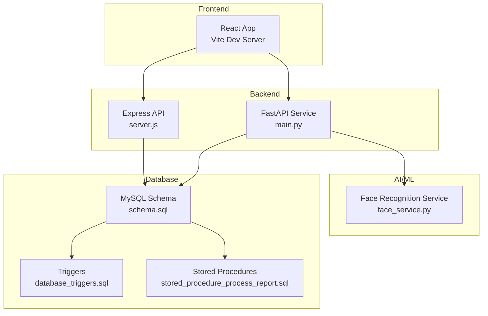
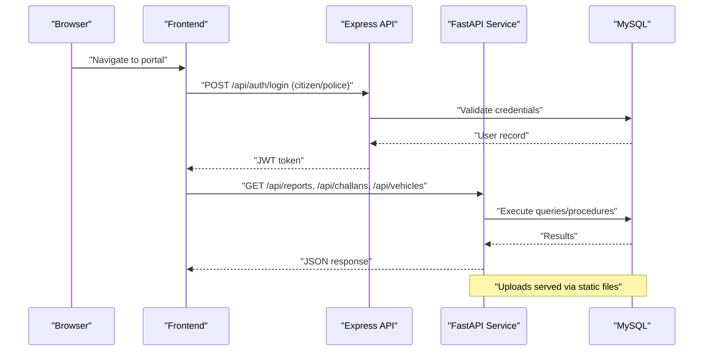
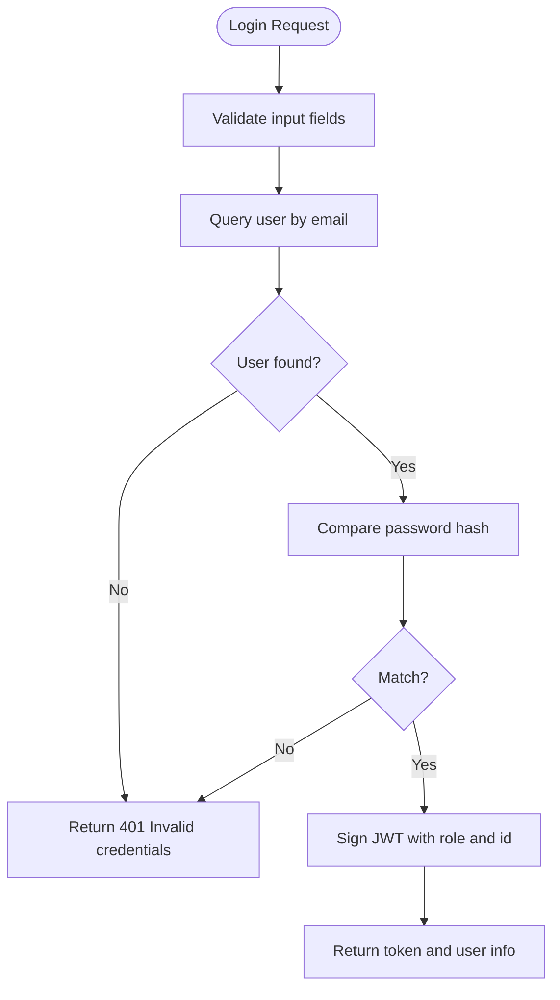
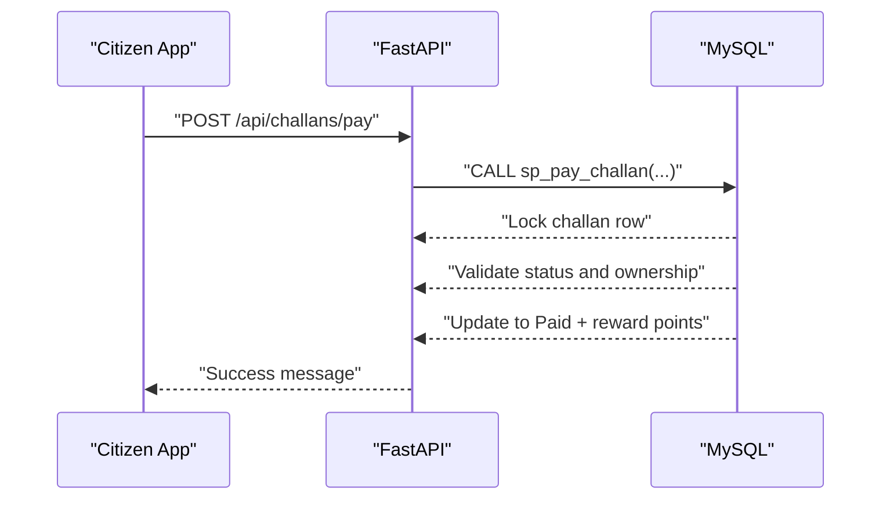
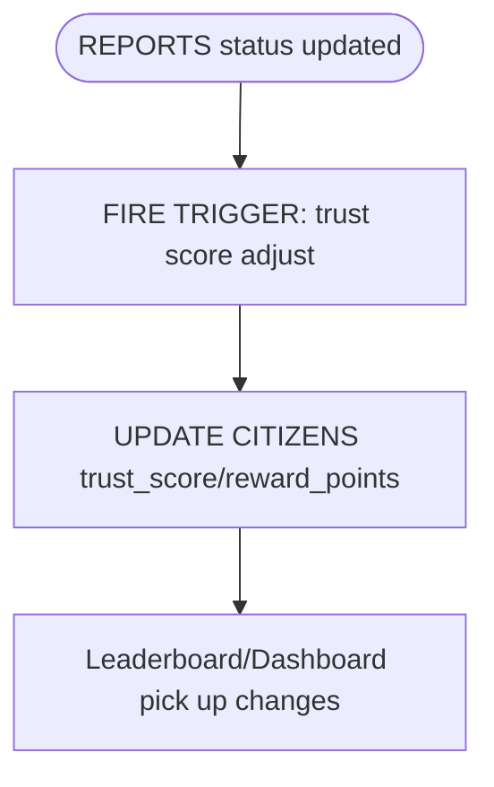
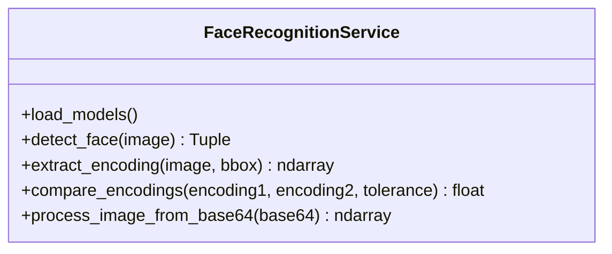
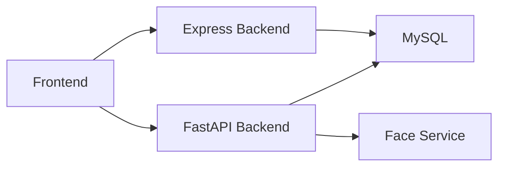

# Troubleshooting and Maintenance

<cite>
**Referenced Files in This Document**
- [backend/package.json](file://backend/package.json)
- [backend/server.js](file://backend/server.js)
- [backend/db.js](file://backend/db.js)
- [backend/middleware/auth.js](file://backend/middleware/auth.js)
- [backend/routes/auth.js](file://backend/routes/auth.js)
- [frontend/package.json](file://frontend/package.json)
- [server/main.py](file://server/main.py)
- [server/routes/auth.py](file://server/routes/auth.py)
- [server/services/face_service.py](file://server/services/face_service.py)
- [db/schema.sql](file://db/schema.sql)
- [db/database_triggers.sql](file://db/database_triggers.sql)
- [db/stored_procedure_process_report.sql](file://db/stored_procedure_process_report.sql)
- [scripts/setup_db.bat](file://scripts/setup_db.bat)
- [scripts/install_triggers.bat](file://scripts/install_triggers.bat)
- [scripts/deploy_stored_procedure.bat](file://scripts/deploy_stored_procedure.bat)
</cite>

## Table of Contents
1. [Introduction](#introduction)
2. [Project Structure](#project-structure)
3. [Core Components](#core-components)
4. [Architecture Overview](#architecture-overview)
5. [Detailed Component Analysis](#detailed-component-analysis)
6. [Dependency Analysis](#dependency-analysis)
7. [Performance Considerations](#performance-considerations)
8. [Troubleshooting Guide](#troubleshooting-guide)
9. [Maintenance Procedures](#maintenance-procedures)
10. [Monitoring and Alerting](#monitoring-and-alerting)
11. [Escalation and Recovery](#escalation-and-recovery)
12. [Preventive Maintenance Schedule](#preventive-maintenance-schedule)
13. [Conclusion](#conclusion)

## Introduction
This document provides comprehensive troubleshooting and maintenance guidance for the Traffic Violation Management System. It covers backend startup and runtime issues, database connectivity and schema integrity, frontend integration concerns, authentication and payment processing failures, real-time synchronization problems, face recognition and webcam access issues, and operational maintenance including database cleanup, log rotation, performance tuning, monitoring, and emergency recovery.

## Project Structure
The system comprises:
- Backend API (Node.js/Express) exposing authentication, reports, challans, and police endpoints
- FastAPI backend (Python) with authentication, analytics, reports, challans, vehicles, rules, and optional police/trust endpoints
- Frontend (React/Vite) for citizen and police portals
- Database (MySQL) with normalized schema, triggers, stored procedures, and views
- Windows batch scripts for setup, trigger deployment, and stored procedure deployment
- Face recognition service (OpenCV DNN) for biometric features

**Diagram sources**
- [backend/server.js:1-42](file://backend/server.js#L1-L42)
- [server/main.py:1-107](file://server/main.py#L1-L107)
- [db/schema.sql:1-942](file://db/schema.sql#L1-L942)
- [db/database_triggers.sql:1-48](file://db/database_triggers.sql#L1-L48)
- [db/stored_procedure_process_report.sql:1-115](file://db/stored_procedure_process_report.sql#L1-L115)
- [server/services/face_service.py:1-177](file://server/services/face_service.py#L1-L177)

**Section sources**
- [backend/server.js:1-42](file://backend/server.js#L1-L42)
- [server/main.py:1-107](file://server/main.py#L1-L107)
- [db/schema.sql:1-942](file://db/schema.sql#L1-L942)

## Core Components
- Express backend: JSON middleware, CORS, health checks, global error handling, and route mounting
- FastAPI backend: CORS middleware, static file serving for uploads, modular routers, health endpoint
- Authentication: JWT-based login for citizens and police; password hashing and verification
- Database: connection pooling, connection test on startup, triggers for trust scoring, stored procedures for ACID transactions
- Frontend: React SPA with routing and UI components
- Face recognition: OpenCV DNN-based detection and encoding extraction

**Section sources**
- [backend/server.js:1-42](file://backend/server.js#L1-L42)
- [server/main.py:1-107](file://server/main.py#L1-L107)
- [backend/middleware/auth.js:1-37](file://backend/middleware/auth.js#L1-L37)
- [backend/routes/auth.js:1-117](file://backend/routes/auth.js#L1-L117)
- [server/routes/auth.py:1-744](file://server/routes/auth.py#L1-L744)
- [backend/db.js:1-26](file://backend/db.js#L1-L26)
- [db/schema.sql:1-942](file://db/schema.sql#L1-L942)
- [frontend/package.json:1-30](file://frontend/package.json#L1-L30)

## Architecture Overview
The system uses a dual-backend architecture:
- Node.js/Express for citizen-facing endpoints and basic auth
- FastAPI for advanced features, uploads, and biometric services
- Shared MySQL database with triggers and stored procedures enforcing business rules
- Frontend communicates with both backends via REST APIs

**Diagram sources**
- [backend/routes/auth.js:1-117](file://backend/routes/auth.js#L1-L117)
- [server/routes/auth.py:1-744](file://server/routes/auth.py#L1-L744)
- [server/main.py:69-103](file://server/main.py#L69-L103)
- [db/schema.sql:1-942](file://db/schema.sql#L1-L942)

## Detailed Component Analysis

### Authentication Failures (Backend)
Common symptoms:
- 401 Access Denied or Invalid/expired token
- 401 Invalid credentials during login
- CORS errors preventing frontend requests

Debugging steps:
- Verify JWT_SECRET consistency across auth middleware and routes
- Confirm Authorization header format: Bearer <token>
- Check environment variables for DB_HOST, DB_USER, DB_PASSWORD, DB_NAME
- Validate bcrypt password comparison and database credentials

**Diagram sources**
- [backend/routes/auth.js:9-76](file://backend/routes/auth.js#L9-L76)
- [backend/middleware/auth.js:5-20](file://backend/middleware/auth.js#L5-L20)

**Section sources**
- [backend/middleware/auth.js:1-37](file://backend/middleware/auth.js#L1-L37)
- [backend/routes/auth.js:1-117](file://backend/routes/auth.js#L1-L117)
- [server/routes/auth.py:218-293](file://server/routes/auth.py#L218-L293)

### Payment Processing Errors
Symptoms:
- Payment stuck in Unpaid after retry
- Concurrent payment attempts causing inconsistencies
- Unauthorized access to another citizen’s challan

Resolution:
- Use the ACID-compliant stored procedure for payment processing
- Ensure row-level locking via SELECT ... FOR UPDATE
- Verify challan ownership before payment

**Diagram sources**
- [db/stored_procedure_process_report.sql:552-629](file://db/stored_procedure_process_report.sql#L552-L629)
- [db/schema.sql:552-629](file://db/schema.sql#L552-L629)

**Section sources**
- [db/stored_procedure_process_report.sql:552-629](file://db/stored_procedure_process_report.sql#L552-L629)
- [db/schema.sql:552-629](file://db/schema.sql#L552-L629)

### Real-Time Data Synchronization Problems
Symptoms:
- Trust score not updating after verification/rejection
- Reports not reflecting status changes immediately
- Discrepancies in leaderboards or dashboards

Resolution:
- Verify triggers firing on REPORTS status changes
- Confirm event scheduler enabled for cleanup tasks
- Check views for stale data and refresh intervals

**Diagram sources**
- [db/database_triggers.sql:8-35](file://db/database_triggers.sql#L8-L35)
- [db/schema.sql:358-382](file://db/schema.sql#L358-L382)

**Section sources**
- [db/database_triggers.sql:1-48](file://db/database_triggers.sql#L1-L48)
- [db/schema.sql:358-382](file://db/schema.sql#L358-L382)

### Face Recognition Issues
Symptoms:
- Model loading fails or logs warnings
- No face detected or low-confidence detections
- Webcam access blocked or camera not found

Resolution:
- Ensure OpenCV DNN models are downloaded and placed under server/models/
- Verify model file paths and permissions
- Test webcam access and browser permissions
- Adjust confidence thresholds and image preprocessing

**Diagram sources**
- [server/services/face_service.py:15-177](file://server/services/face_service.py#L15-L177)

**Section sources**
- [server/services/face_service.py:1-177](file://server/services/face_service.py#L1-L177)

### Database Connectivity and Startup
Symptoms:
- Backend fails to start due to DB connection errors
- Pool connection test failure logged
- Environment variables not picked up

Resolution:
- Set DB_HOST, DB_USER, DB_PASSWORD, DB_NAME
- Verify MySQL service is running and accessible
- Check network/firewall rules and credentials
- Review pool configuration limits and keep-alive settings

**Section sources**
- [backend/db.js:1-26](file://backend/db.js#L1-L26)
- [backend/server.js:18-20](file://backend/server.js#L18-L20)

### Frontend Integration Challenges
Symptoms:
- 404 endpoints or CORS errors
- Token not sent with requests
- Build or dev server failing

Resolution:
- Confirm backend is running and listening on expected port
- Ensure Authorization: Bearer <token> header is set
- Check Vite dev server logs and port conflicts
- Validate environment proxy settings if applicable

**Section sources**
- [backend/server.js:13-31](file://backend/server.js#L13-L31)
- [frontend/package.json:1-30](file://frontend/package.json#L1-L30)

## Dependency Analysis
- Express backend depends on environment variables and MySQL2 pool
- FastAPI backend depends on PyMySQL/mysql-connector, bcrypt, JWT libraries
- Both backends depend on shared database schema and triggers
- Frontend depends on both backend APIs
- Face recognition service depends on OpenCV and model files

**Diagram sources**
- [backend/server.js:1-42](file://backend/server.js#L1-L42)
- [server/main.py:1-107](file://server/main.py#L1-L107)
- [db/schema.sql:1-942](file://db/schema.sql#L1-L942)
- [server/services/face_service.py:1-177](file://server/services/face_service.py#L1-L177)

**Section sources**
- [backend/package.json:1-22](file://backend/package.json#L1-L22)
- [server/main.py:1-107](file://server/main.py#L1-L107)

## Performance Considerations
- Connection pooling: tune connectionLimit and queueLimit based on workload
- Indexes: ensure appropriate indexes on frequently queried columns (status, dates, foreign keys)
- Stored procedures: leverage row-level locks and atomic transactions to avoid contention
- Event scheduler: scheduled cleanup reduces orphaned data growth
- Logging: moderate log levels in production to reduce I/O overhead

[No sources needed since this section provides general guidance]

## Troubleshooting Guide

### Backend Startup Problems
- Symptoms: server fails to start, port already in use, module import errors
- Steps:
  - Check Node.js and Python installations
  - Verify package.json dependencies and install missing packages
  - Ensure environment variables are exported
  - Run health checks: GET /api/health on both backends

**Section sources**
- [backend/server.js:39-41](file://backend/server.js#L39-L41)
- [server/main.py:105-107](file://server/main.py#L105-L107)

### Database Connectivity Issues
- Symptoms: “MySQL connection failed” logs, 500 errors querying DB
- Steps:
  - Confirm DB_HOST, DB_USER, DB_PASSWORD, DB_NAME
  - Test connectivity with mysql client
  - Check firewall and network ACLs
  - Validate pool configuration and keep-alive settings

**Section sources**
- [backend/db.js:15-23](file://backend/db.js#L15-L23)

### Frontend Integration Challenges
- Symptoms: CORS errors, 404 endpoints, token not recognized
- Steps:
  - Verify backend CORS configuration allows frontend origin
  - Confirm Authorization header format and token validity
  - Check Vite dev server and build configurations

**Section sources**
- [backend/server.js:13-15](file://backend/server.js#L13-L15)
- [frontend/package.json:1-30](file://frontend/package.json#L1-L30)

### Authentication Failures
- Symptoms: 401 Access Denied, Invalid token, Invalid credentials
- Steps:
  - Validate JWT_SECRET consistency
  - Check bcrypt hashing and verification
  - Confirm user roles and IDs in tokens

**Section sources**
- [backend/middleware/auth.js:1-37](file://backend/middleware/auth.js#L1-L37)
- [backend/routes/auth.js:1-117](file://backend/routes/auth.js#L1-L117)
- [server/routes/auth.py:1-744](file://server/routes/auth.py#L1-L744)

### Payment Processing Errors
- Symptoms: Payment stuck, concurrent race conditions
- Steps:
  - Use stored procedures with row-level locks
  - Verify challan ownership and status
  - Check transaction rollback on exceptions

**Section sources**
- [db/stored_procedure_process_report.sql:552-629](file://db/stored_procedure_process_report.sql#L552-L629)
- [db/schema.sql:552-629](file://db/schema.sql#L552-L629)

### Real-Time Data Synchronization Problems
- Symptoms: Trust score not updating, stale dashboards
- Steps:
  - Verify triggers fire on status changes
  - Check event scheduler for cleanup jobs
  - Refresh views and confirm data propagation

**Section sources**
- [db/database_triggers.sql:1-48](file://db/database_triggers.sql#L1-L48)
- [db/schema.sql:358-382](file://db/schema.sql#L358-L382)

### Face Recognition Issues
- Symptoms: Model not found, no detections, webcam errors
- Steps:
  - Download and place OpenCV DNN models
  - Verify model file paths and permissions
  - Test webcam access and browser permissions
  - Adjust detection confidence thresholds

**Section sources**
- [server/services/face_service.py:24-46](file://server/services/face_service.py#L24-L46)

### Database Maintenance
- Trigger verification:
  - Run verification queries to confirm triggers exist
- Stored procedure validation:
  - Confirm procedures created and callable
- Schema updates:
  - Apply incremental migrations and re-run verification scripts

**Section sources**
- [db/database_triggers.sql:43-48](file://db/database_triggers.sql#L43-L48)
- [db/stored_procedure_process_report.sql:106-115](file://db/stored_procedure_process_report.sql#L106-L115)
- [scripts/install_triggers.bat:17-52](file://scripts/install_triggers.bat#L17-L52)
- [scripts/deploy_stored_procedure.bat:14-41](file://scripts/deploy_stored_procedure.bat#L14-L41)

## Maintenance Procedures

### Database Cleanup
- Scheduled events purge expired sessions and unverified uploads
- Monitor cleanup job frequency and adjust schedule if needed

**Section sources**
- [db/schema.sql:277-300](file://db/schema.sql#L277-L300)

### Log Rotation
- Rotate application logs to prevent disk exhaustion
- Use system logrotate or equivalent

[No sources needed since this section provides general guidance]

### Performance Optimization
- Tune MySQL connection pool and query indexes
- Optimize stored procedure logic and minimize row scans
- Reduce unnecessary logging in production

[No sources needed since this section provides general guidance]

### Database Cleanup, Log Rotation, and Performance Optimization
- Use scheduled events for automatic cleanup
- Implement log rotation policies
- Monitor slow queries and optimize indexes

**Section sources**
- [db/schema.sql:277-300](file://db/schema.sql#L277-L300)

## Monitoring and Alerting
- Health endpoints: /api/health on both backends
- Database event scheduler status: ensure enabled
- Frontend error boundaries and console logging
- Implement centralized logging and alerting for critical failures

**Section sources**
- [backend/server.js:17-20](file://backend/server.js#L17-L20)
- [server/main.py:88-95](file://server/main.py#L88-L95)

## Escalation and Recovery

### Critical System Failures
- Immediate actions:
  - Check backend health endpoints
  - Verify database connectivity and event scheduler
  - Restart services if necessary
- Recovery:
  - Rollback recent schema or procedure changes
  - Restore from backups if data corruption suspected

**Section sources**
- [scripts/setup_db.bat:10-20](file://scripts/setup_db.bat#L10-L20)
- [db/schema.sql:8-8](file://db/schema.sql#L8-L8)

### Emergency Recovery Protocols
- Restore database from latest backup
- Recreate triggers and stored procedures using provided scripts
- Re-deploy backend services and restart

**Section sources**
- [scripts/install_triggers.bat:17-52](file://scripts/install_triggers.bat#L17-L52)
- [scripts/deploy_stored_procedure.bat:14-41](file://scripts/deploy_stored_procedure.bat#L14-L41)

## Preventive Maintenance Schedule
- Daily:
  - Monitor health endpoints and logs
  - Verify scheduled events are running
- Weekly:
  - Audit database triggers and stored procedures
  - Review slow queries and optimize indexes
- Monthly:
  - Validate backup integrity and restore drills
  - Update OpenCV models and verify face recognition service

**Section sources**
- [db/schema.sql:277-300](file://db/schema.sql#L277-L300)
- [server/services/face_service.py:24-46](file://server/services/face_service.py#L24-L46)

## Conclusion
This guide consolidates troubleshooting and maintenance practices for the Traffic Violation Management System. By validating environment configuration, ensuring database integrity, leveraging stored procedures and triggers, and implementing robust monitoring and recovery procedures, teams can maintain system reliability and performance.