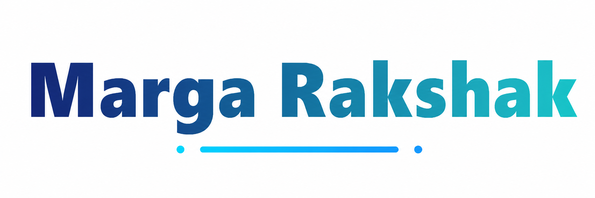
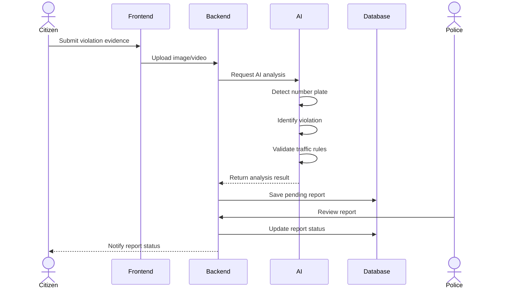

<div align="center">
  
</div>

---

Margarakshak enables municipalities to enforce transit regulations at scale through a modular, three-tier architectural framework. By orchestrating vision-based AI agents, crowdsourced telemetry ingestion, and automated rule validation workflows, it creates a seamless pipeline from initial incident capture to final citation processing.

---

## 💻 Technology Stack

| Layer | Technology |
|---|---|
| Frontend | React.js, Vite, CSS |
| Backend | Node.js, Express.js |
| AI Models | Google Gemini (Vision + Chat), Mistral AI |
| Database | MySQL 8.0 |
| Authentication | JWT |
| Hosting | Vercel (Frontend), Render (Backend) |

---

## 🏛️ Overall System Architecture

The application follows a modular three-tier architecture consisting of the presentation layer, backend API, AI service, and database. Each component operates independently and communicates through REST APIs.


---

## 🔄 Traffic Violation Processing Workflow

The following sequence diagram illustrates how a citizen report is processed from submission to challan generation.



---

## 🔄 Core Data Flow

1. Citizen uploads traffic violation evidence through the portal.
2. The backend stores the uploaded media and forwards it to the AI service.
3. The Vision Agent extracts the vehicle registration number and identifies the violation.
4. The Rule Validation Agent determines the applicable traffic rule and fine.
5. The processed report is stored in the database with a **Pending Review** status.
6. A police officer verifies the report through the dashboard.
7. Once approved, the system generates the challan and updates the violation history.
8. The citizen receives the report status and reward points for verified submissions.

---

## 🧠 Multi-Agent AI Engine

The AI service is designed as a collection of specialized agents. Each agent performs a dedicated task, allowing the system to process reports in a structured manner.

### Agents

- **Vision Agent**
  - Extracts vehicle registration numbers using OCR.
  - Identifies traffic violations from uploaded images.

- **Rule Validation Agent**
  - Maps detected violations to applicable Motor Vehicles Act provisions.
  - Calculates the corresponding fine.

- **Vehicle Verification Agent**
  - Validates extracted vehicle information before report generation.

- **Hotspot Prediction Agent**
  - Analyses historical reports to identify high-risk traffic locations.

- **AskRakshak Assistant**
  - Answers user queries related to traffic rules, challans, and reporting procedures.

---

## 🚀 Local Setup

### Prerequisites

- Node.js 18 or later
- Python 3.9 or later
- MySQL 8.0

### Clone Repository

```bash
git clone https://github.com/yuvanvishnupandi/Marga-Rakshak-Traffic-Violation-Management-System.git
cd Marga-Rakshak-Traffic-Violation-Management-System
```

### Database

Create a MySQL database named `traffic_violation_db` and import the provided SQL schema from `backend/database_schema.sql`.

### Backend

```bash
cd backend
npm install
npm start
```

### AI Service

```bash
cd ai_service
pip install -r requirements.txt
uvicorn main:app --reload --port 8000
```

### Frontend

```bash
cd frontend
npm install
npm run dev
```

### Quick Start (Windows)

```cmd
start.bat
```

---

<p align="center">
  Built for safer roads and smarter enforcement — Government of Tamil Nadu
</p>
