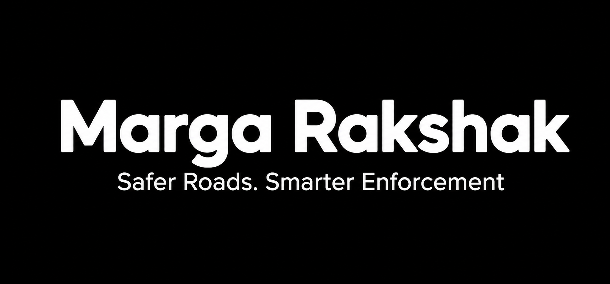
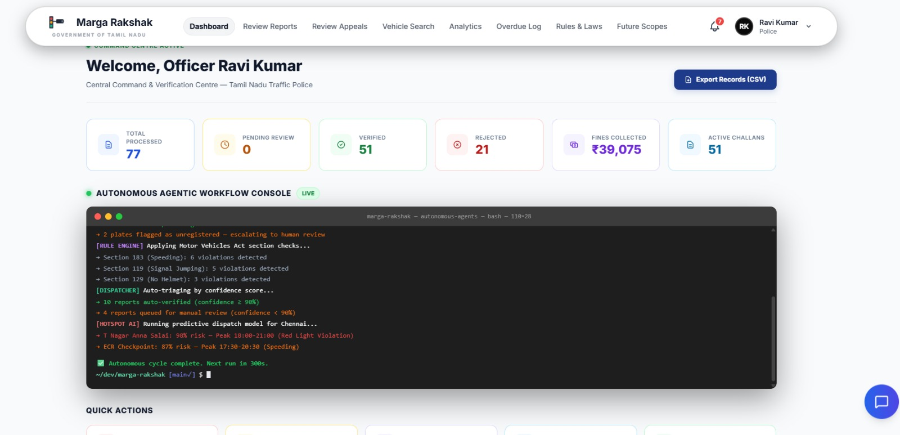
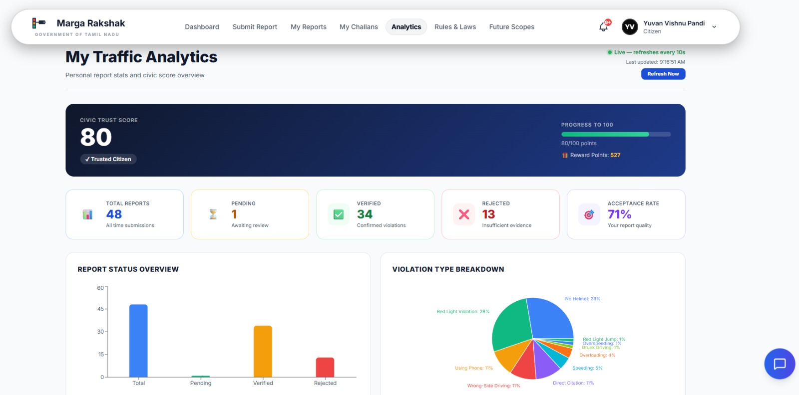
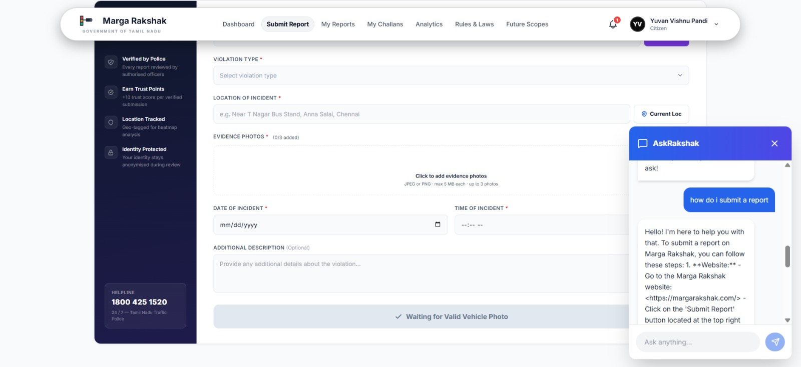
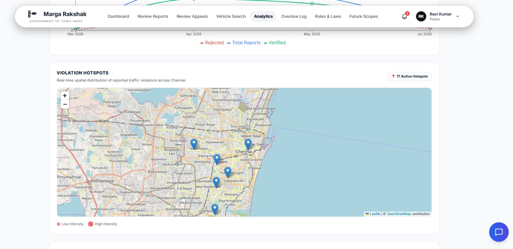
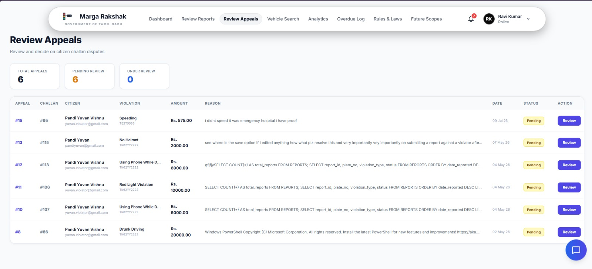
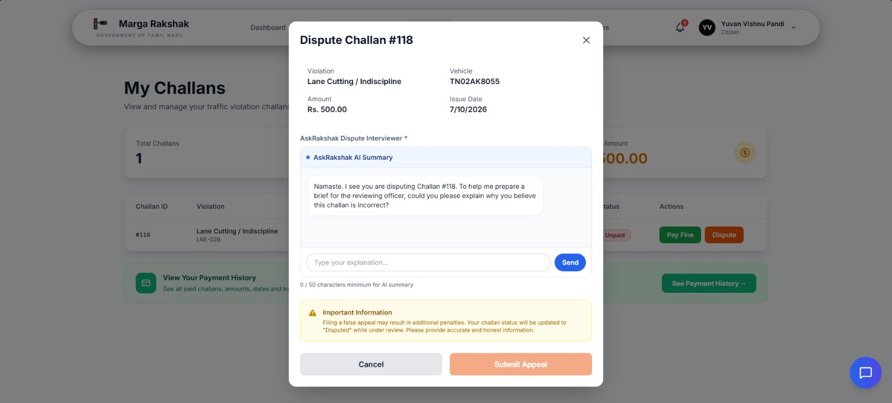
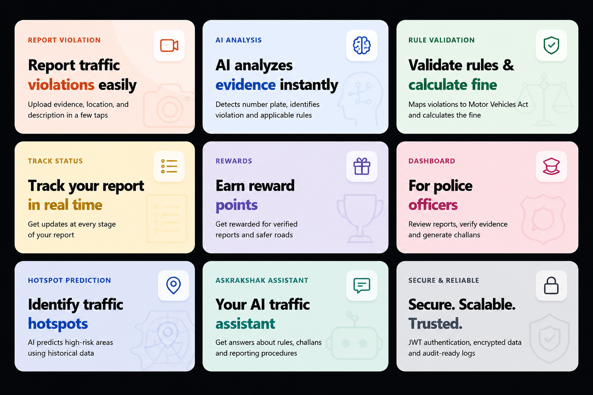
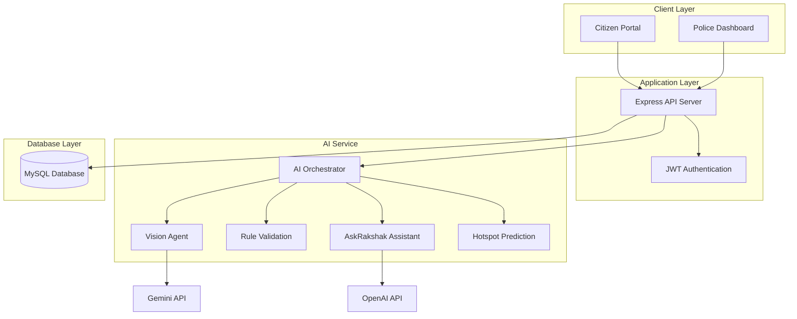
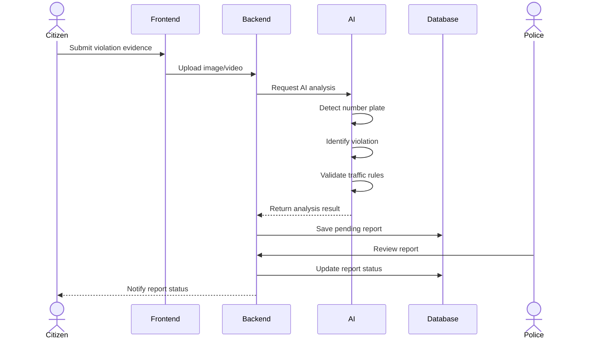

<div align="center">
  
</div>

<br />

<div align="center">
<p>An AI-powered mobility enforcement platform — with computer vision, automated evidence processing, e-challan management, analytics, and role-based administration.</p>
<br />

<a href="https://margarakshak-xi.vercel.app"></a>
&nbsp;
<a href="https://github.com/yuvanvishnupandi/margarakshak"></a>
<br />
<a href="LICENSE"></a>
<a href="https://github.com/yuvanvishnupandi/margarakshak">
<a href="https://github.com/yuvanvishnupandi/margarakshak/commits/main"></a>

</div>

---

<div align="center">

<table>
  <tr>
    <td></td>
    <td></td>
  </tr>
  <tr>
    <td></td>
    <td></td>
  </tr>
  <tr>
    <td></td>
    <td></td>
  </tr>
  
</table>

</div>


---
## What you get
<div align="center">


</div>
<details>
<summary><b>See all features</b></summary>

<table>
<tr>
<td width="50%" valign="top">

#### 📸 Citizen reporting

- **One-tap evidence upload** — capture and submit violation photos/videos from the citizen portal
- **Automatic plate recognition** — OCR-based number plate extraction, no manual entry
- **Violation detection** — Vision Agent classifies the offense straight from the image
- **Challan payment** — pay issued challans directly through the portal
- **Appeals** — contest a challan and track resolution status
- **Reward points** — citizens earn points for verified, accurate submissions

</td>
<td width="50%" valign="top">

#### 👮 Police dashboard

- **Review queue** — every AI-processed report lands here before any challan is issued
- **One-click approve/reject** — human-in-the-loop verification, no automated punishment
- **Vehicle registration lookup** — cross-check vehicle details on demand
- **Violation history** — per-vehicle record across all past reports
- **Hotspot map** — high-risk locations surfaced from historical report density
- **Role-based access** — JWT-secured, officer-only actions

</td>
</tr>
<tr>
<td width="50%" valign="top">

#### 🧠 Multi-agent AI engine

- **Vision Agent** — OCR plate extraction + violation identification
- **Rule Validation Agent** — maps detected violations to Motor Vehicles Act provisions and calculates fines
- **Vehicle Verification Agent** — cross-checks extracted vehicle data before report generation
- **Hotspot Prediction Agent** — analyses historical reports to flag high-risk zones
- **AskRakshak Assistant** — chatbot for traffic-rule and challan queries 

</td>
<td width="50%" valign="top">

#### ⚙️ Platform

- **REST API backend** — Express.js, modular route structure
- **JWT authentication** — secure sessions for citizens and officers
- **MySQL 8.0** — relational schema for reports, vehicles, users, challans
- **Independent AI service** — FastAPI microservice, decoupled from the main API
- **Cloud-native deploy** — Vercel (frontend) + Render (backend)

</td>
</tr>
</table>

</details>

<br />

## Get started

```bash
git clone https://github.com/yuvanvishnupandi/margarakshak.git
cd margarakshak
```

Create a MySQL database named `traffic_violation_db`, import the schema from `backend/database_schema.sql`, then start the backend, AI service, and frontend (see [Local Setup](#local-setup) below) — or run `start.bat` on Windows to launch all three at once.


<br />

## Tech stack

<div align="center">


</div>

Frontend on React + Vite. Backend on Express.js with JWT auth. AI service runs independently on FastAPI, orchestrating Gemini Vision for plate/violation detection and Groq for the AskRakshak chat assistant. Data in MySQL 8.0.

<br />

<h2 id="architecture">🏛️ Overall system architecture</h2>

The application follows a modular three-tier architecture consisting of the presentation layer, backend API, AI service, and database. Each component operates independently and communicates through REST APIs.



<br />

## 🔄 Traffic violation processing workflow

The following sequence diagram illustrates how a citizen report is processed from submission to challan generation.



<br />

## 🔄 Core data flow

1. Citizen uploads traffic violation evidence through the portal.
2. The backend stores the uploaded media and forwards it to the AI service.
3. The Vision Agent extracts the vehicle registration number and identifies the violation.
4. The Rule Validation Agent determines the applicable traffic rule and fine.
5. The processed report is stored in the database with a **Pending Review** status.
6. A police officer verifies the report through the dashboard.
7. Once approved, the system generates the challan and updates the violation history.
8. The citizen receives the report status and reward points for verified submissions.

<br />

<h2 id="multi-agent-ai-engine">🧠 Multi-agent AI engine</h2>

The AI service is designed as a collection of specialized agents. Each agent performs a dedicated task, allowing the system to process reports in a structured manner.

<details>
<summary><b>See all agents</b></summary>

<br />

- **Vision Agent**
  - Extracts vehicle registration numbers using OCR.
  - Identifies traffic violations from uploaded images.

- **Rule Validation Agent**
  - Maps detected violations to applicable Motor Vehicles Act provisions.
  - Calculates the corresponding fine.

- **Vehicle Verification Agent**
  - Validates extracted vehicle information before report generation.

- **Hotspot Prediction Agent**
  - Analyses historical reports to identify high-risk traffic locations.

- **AskRakshak Assistant**
  - Answers user queries related to traffic rules, challans, and reporting procedures.

</details>

<br />

<h2 id="local-setup">🚀 Local setup</h2>

### Prerequisites

- Node.js 18 or later
- Python 3.9 or later
- MySQL 8.0

### Clone repository

```bash
git clone https://github.com/yuvanvishnupandi/margarakshak.git
cd margarakshak
```

### Database

Create a MySQL database named `traffic_violation_db` and import the provided SQL schema from `backend/database_schema.sql`.

<details>
<summary><b>Backend setup</b></summary>

```bash
cd backend
npm install
npm start
```

</details>

<details>
<summary><b>AI service setup</b></summary>

```bash
cd ai_service
pip install -r requirements.txt
uvicorn main:app --reload --port 8000
```

</details>

<details>
<summary><b>Frontend setup</b></summary>

```bash
cd frontend
npm install
npm run dev
```

</details>

### Quick start (Windows)

```cmd
start.bat
```

<br />

<h2 id="environment-variables">Environment variables</h2>
<details>
<summary><b>Full reference</b></summary>

<br />

> Template based on the services in use — confirm exact variable names against your `.env.example` files before deploying.

| Variable | Description | Where |
|----------|-------------|-------|
| `PORT` | Backend API port | `backend/.env` |
| `DB_HOST` / `DB_USER` / `DB_PASSWORD` / `DB_NAME` | MySQL connection details for `traffic_violation_db` | `backend/.env` |
| `JWT_SECRET` | Signing secret for citizen/officer session tokens | `backend/.env` |
| `GEMINI_API_KEY` | Google Gemini key for the Vision Agent and violation detection | `ai_service/.env` |
| `MISTRAL_API_KEY` | Mistral AI key, used alongside Gemini in the AI pipeline | `ai_service/.env` |
|`OPENAI_API_KEY` | OpenAI API key powering the AskRakshak chat assistant | `ai_service/.env` |
| `AI_SERVICE_URL` | URL the backend uses to reach the AI microservice (e.g. `http://localhost:8000`) | `backend/.env` |
| `VITE_API_URL` | Base URL the frontend uses to call the backend API | `frontend/.env` |

</details>

<br />

## Data & storage

- **Database** — MySQL 8.0, schema in `backend/database_schema.sql`
- **Uploads** — violation evidence (photos/videos) handled by the backend at upload time
- **AI service** — stateless FastAPI microservice; no persistent storage of its own
- **Hosting** — frontend on Vercel, backend on Render

<br />

## License

Marga Rakshak is [MIT licensed](LICENSE).


---


