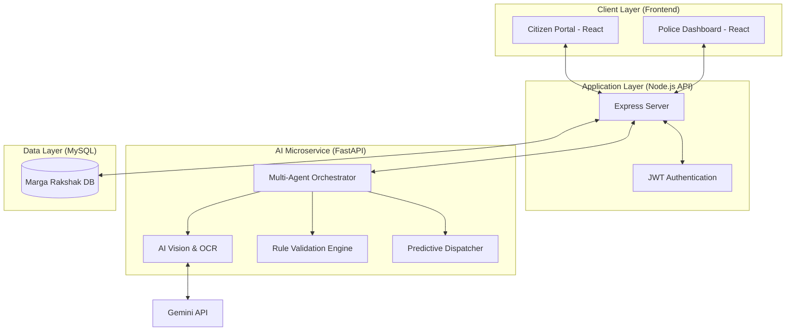
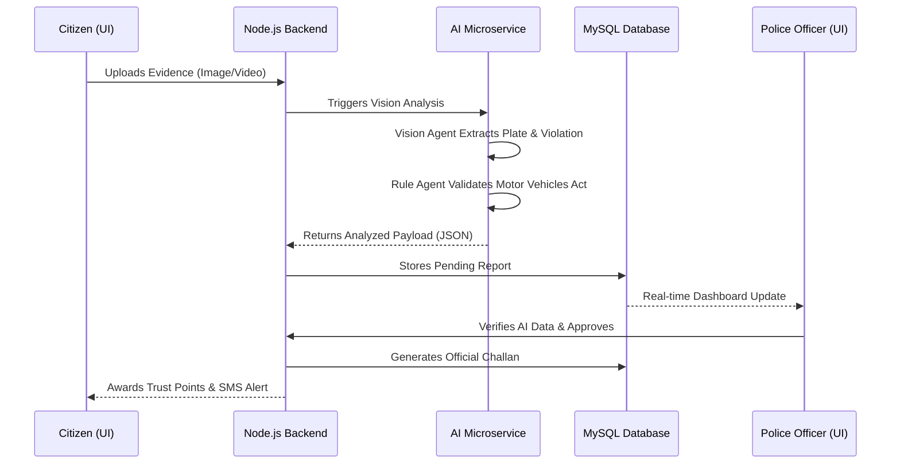
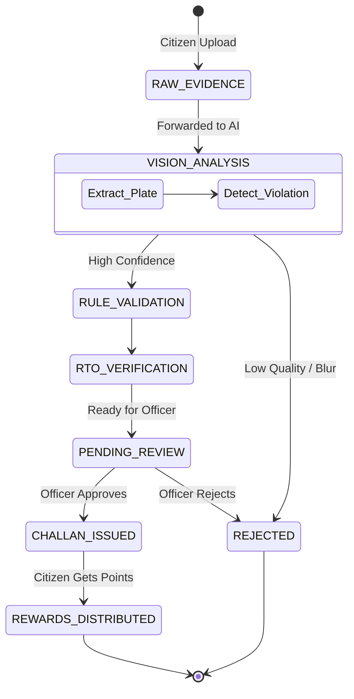

<div align="center">
  
  <h1>Marga Rakshak</h1>
  <p><strong>Government of Tamil Nadu – Smart Traffic Enforcement System</strong></p>
  <p>An intelligent, multi-agent AI-powered traffic violation management platform.</p>
</div>

---

**Live Production Deployment:** [https://margarakshak-xi.vercel.app](https://margarakshak-xi.vercel.app)  
**Demo Video:** [Watch on DropBox](https://www.dropbox.com/scl/fi/olhgipdy6tnqgd7rynyvz/Screen-Recording-2026-05-07-095126.mp4?rlkey=us8acshyuceu60xhs9i9mjt5c&st=tacksy62&dl=0)

---

## 🏛️ System Architecture

This document provides a high-level technical overview of the **Marga Rakshak System**. The platform is designed using a decoupled, multi-tier architecture to ensure scalability, security, and real-time processing of traffic violations.

### 🗺️ System Overview

The system consists of three primary layers:
1. **Frontend (UI)**: Built with React.js and Vite, providing distinct, real-time dashboards for Citizens (reporting & tracking) and Police Officers (monitoring & administration).
2. **Backend (API)**: A Node.js and Express-driven service that handles authentication, business logic, and acts as the bridge between the UI and the database.
3. **AI Microservice**: A FastAPI Python backend that orchestrates the Multi-Agent System (Vision, Rules, Dispatch, and Conversational AI).
4. **Database (Storage)**: A MySQL instance containing the highly relational data schema for users, vehicles, challans, and AI logs.

### 🏗️ Architecture Diagram



---

## ⚡ Dynamic Interaction Sequence

The following sequence diagram illustrates the lifecycle of an **AI-Assisted Violation Report**:



---

## 💻 Technology Stack

| Layer | Technology | Role |
| :--- | :--- | :--- |
| **Frontend** | [React.js](https://reactjs.org/) + [Vite](https://vitejs.dev/) | Lightning-fast component framework for the UI. |
| **Styling** | Vanilla CSS + [Tailwind CSS](https://tailwindcss.com/) | Utility-first and custom CSS for glassmorphism and modern UI. |
| **Backend API** | [Node.js](https://nodejs.org/) + [Express](https://expressjs.com/) | High-performance asynchronous API server. |
| **AI Microservice** | [FastAPI](https://fastapi.tiangolo.com/) | High-performance Python framework for AI agent routing. |
| **Database** | [MySQL 8.0](https://www.mysql.com/) | Relational database for scalable data integrity. |
| **AI Models** | Gemini 2.5 Flash & Groq | Vision analysis, OCR, and ultra-fast RAG inference. |

---

## 🔄 Core Data Flow

The lifecycle of a traffic violation resolution follows this deterministic path:

1. **Detection**: Citizens capture evidence of a violation and submit it through the portal.
2. **Analysis**: The `Vision Agent` processes the media to extract the license plate and identify the offense type.
3. **Validation**: The `Rule Engine` and `RTO Agent` calculate the precise penalty based on the Motor Vehicles Act and verify vehicle registration.
4. **Decision**: The system routes the pre-processed, high-confidence report to the Police Command Dashboard (`PENDING_REVIEW`).
5. **Resolution**: A human officer performs a 1-click verification. The system generates the legal Challan, deducts reputation points from the offender, and rewards the reporting citizen with Trust Points.

---

## 🧠 Multi-Agent Engine Design

The **Marga Rakshak AI Engine** is a deterministic orchestrator that blends Large Language Models with a rule-based expert system. 

### 🤖 The 5 Core Agents
- 📸 **Vision Agent (Gemini 2.5 Flash):** Automatically scans uploaded evidence (images/videos) to extract license plate numbers, identify vehicle types, and detect specific violations (e.g., No Helmet, Over-speeding).
- ⚖️ **Rule Engine:** Validates the detected violations against the official Indian Motor Vehicles Act.
- 🗄️ **RTO Database Agent:** Cross-references extracted license plates with the live Regional Transport Office (RTO) database.
- 🚨 **Predictive Hotspot Dispatcher:** A proactive intelligence engine that analyzes verified reports and generates real-time predictive duty dispatch alerts.
- 💬 **AskRakshak (Conversational AI):** A contextual, floating AI assistant that acts as a legal expert, helping citizens understand traffic laws and active challans.

### 🔄 AI Lifecycle State Machine

The following state diagram illustrates the automated transitions a piece of evidence undergoes:



---

## 🚀 Local Setup Instructions

**Prerequisites:** Node.js (v18+), Python (3.9+), and MySQL.

1. **Clone the repository:**
   ```bash
   git clone https://github.com/yuvanvishnupandi/Traffic-Violation-Management-System.git
   cd Traffic-Violation-Management-System
   ```

2. **Database Setup:**
   - Create a MySQL database named `traffic_violation_db`.
   - Run the SQL schema provided in `backend/database_schema.sql`.

3. **Environment Variables:**
   - Create a `.env` file in the `backend/` directory with your MySQL credentials, JWT secret, and Google Gemini API Key.
   - Create a `.env` file in the `ai_service/` directory with your Groq API Key and Google Gemini API Key.

4. **Start the Application:**
   Windows users can simply run the provided batch script to start all services simultaneously:
   ```cmd
   start.bat
   ```
   *Alternatively, start services manually:*
   - Backend: `cd backend && npm install && npm start`
   - AI Service: `cd ai_service && pip install -r requirements.txt && uvicorn main:app --reload --port 8000`
   - Frontend: `cd frontend && npm install && npm run dev`

---
*Built with ❤️ for a safer tomorrow.*
