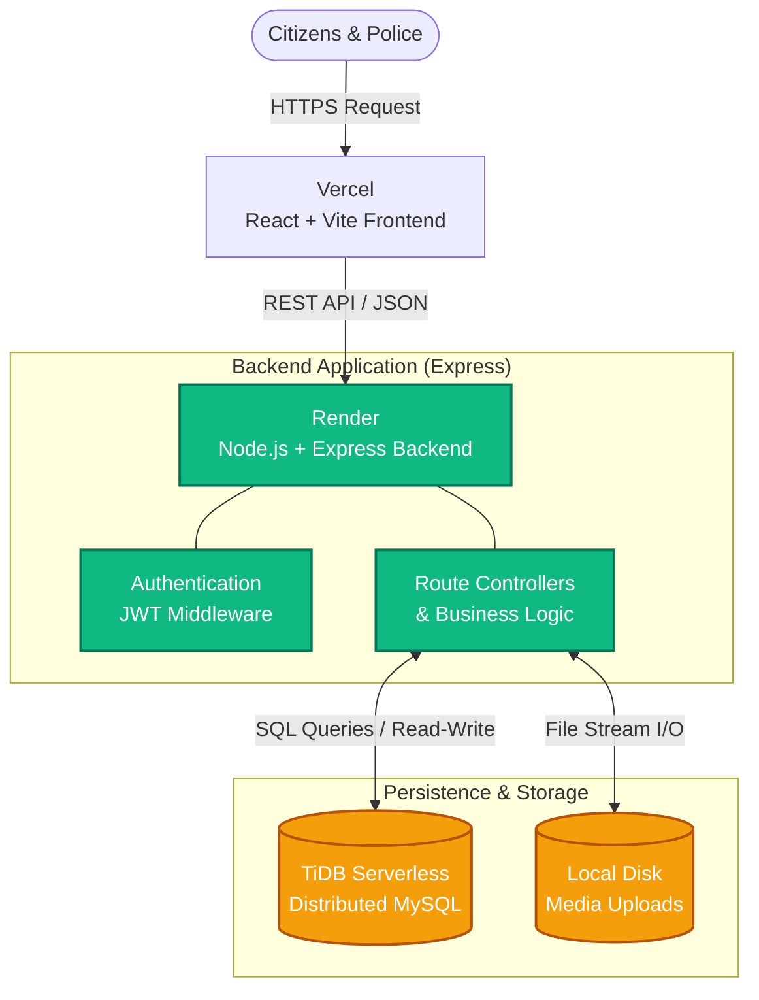

<div align="center">
  
</div>

**Live Production Deployment:** [https://margarakshak-xi.vercel.app](https://margarakshak-xi.vercel.app)  
**Demo Video:** [Watch on DropBox](https://www.dropbox.com/scl/fi/olhgipdy6tnqgd7rynyvz/Screen-Recording-2026-05-07-095126.mp4?rlkey=us8acshyuceu60xhs9i9mjt5c&st=tacksy62&dl=0)

## Overview

Marga Rakshak is an end-to-end traffic violation platform built to bridge the gap between everyday citizens and traffic authorities. By crowdsourcing violation reports, it simplifies enforcement workflows and helps maintain safer roads. 

Citizens can seamlessly register vehicles, submit media evidence of offenses, track fines, and build a trustworthy profile. The system actively incentivizes reliable reporting through gamified rewards. Meanwhile, Traffic Officers are equipped with a powerful administrative suite to evaluate submissions, issue automated fines, handle disputes, and monitor city-wide traffic behavior via data visualizations.

## Core Capabilities

- **Secure Portals:** Independent, authenticated interfaces tailored specifically for everyday users and law enforcement.
- **Evidence Submission:** Intuitive tools to capture and upload media for roadway offenses directly from the client.
- **Fine Processing Lifecycle:** End-to-end flow from the moment an officer issues a ticket to the citizen's final payment.
- **Gamified Reliability:** A dynamic scoring algorithm that boosts the reputation of honest reporters and penalizes false claims, issuing tangible rewards for positive community impact.
- **Dispute Resolution:** A structured channel for users to contest tickets they believe were issued unfairly, complete with officer review workflows.
- **Instant Alerts:** Automated status updates keeping users informed whenever their submissions are processed or new fines are issued.
- **Data Insights:** Comprehensive dashboards featuring geographic heatmaps of offenses and public leaderboards to highlight top community contributors.

## System Architecture

Marga Rakshak is built on a robust, decoupled architecture separating the client-side application from the API services and data layer.



### Technology Stack
- **Frontend Development:** React 18, Vite, React Router, Tailwind CSS, Recharts, React Leaflet
- **Backend Services:** Node.js, Express.js, JWT Authentication, Multer for file handling
- **Database & Storage:** TiDB (Serverless MySQL)
- **Hosting & CI/CD:** Vercel (Frontend), Render (Backend)

## Project Structure

```text
Traffic-Violation-Management-System/
├── frontend/             # React application (UI and Views)
│   ├── public/           # Static assets (images, icons)
│   ├── src/
│   │   ├── components/   # Reusable UI components
│   │   ├── context/      # React context (State management)
│   │   ├── pages/        # Page layouts and routing components
│   │   ├── App.jsx       # Root application component
│   │   └── config.js     # Environment configuration
│   └── package.json      # Frontend dependencies
├── backend/              # Node.js REST API server
│   ├── routes/           # API route controllers
│   ├── server.js         # Express server entry point
│   └── package.json      # Backend dependencies
├── db/                   # Database configuration
│   ├── schema.sql        # SQL table definitions
│   └── triggers.sql      # Automated SQL triggers
├── server/uploads/       # Local storage for media evidence
└── package.json          # Workspace configuration
```

## Local Development Setup

To run the project in a local development environment:

1. **Clone the repository**
   ```bash
   git clone https://github.com/yuvanvishnupandi/Traffic-Violation-Management-System.git
   cd Traffic-Violation-Management-System
   ```

2. **Install dependencies**
   Install the root, frontend, and backend packages.
   ```bash
   npm install
   cd frontend && npm install
   cd ../backend && npm install
   cd ..
   ```

3. **Configure environment variables**
   - Create `backend/.env` containing your MySQL database credentials and `JWT_SECRET`.  
   - Create `frontend/.env` containing `VITE_API_URL=http://localhost:5000`.

4. **Initialize development servers**
   ```bash
   npm run dev
   ```
   *The Express API will run on port 5000, and the Vite development server will run on port 5173.*
