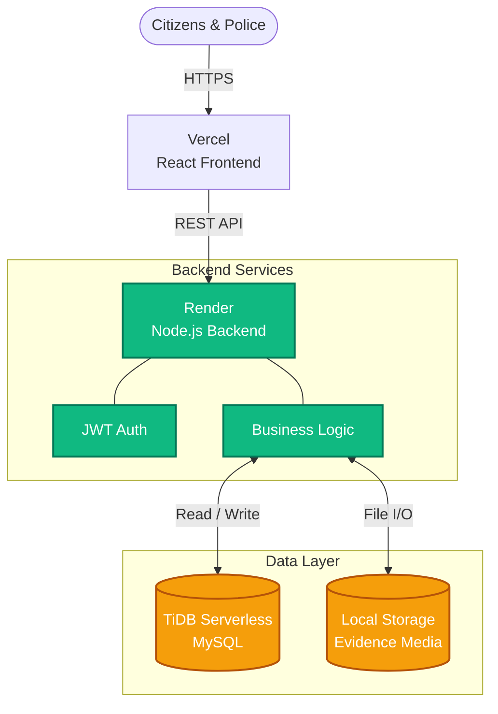

<div align="center">
  
  <h1>Marga Rakshak</h1>
  <p><b>Smart Traffic Enforcement System</b></p>
</div>

**Live Production Deployment:** [https://margarakshak-xi.vercel.app](https://margarakshak-xi.vercel.app)  
**Demo Video:** [Watch on DropBox](https://www.dropbox.com/scl/fi/olhgipdy6tnqgd7rynyvz/Screen-Recording-2026-05-07-095126.mp4?rlkey=us8acshyuceu60xhs9i9mjt5c&st=tacksy62&dl=0)

## Overview

Marga Rakshak is a comprehensive full-stack traffic violation management platform designed to connect citizens directly with traffic enforcement authorities. The goal is to streamline violation reporting and simplify the challan issuance process.

**For Citizens:**  
Register vehicles, report traffic violations with photo/video evidence, view and pay challans securely online, and track trust scores. The platform incentivizes accurate reporting through a built-in reward system.

**For Police Officers:**  
A dedicated operational dashboard to review citizen-submitted reports. Officers can verify evidence, generate official challans, process citizen appeals, search vehicle databases, and monitor traffic analytics.

## Features

- **Role-Based Access Control:** Secure, isolated environments for Citizens and Police personnel.
- **Violation Reporting:** Direct photo and video upload capabilities for traffic offenses.
- **Challan Management:** Streamlined lifecycle from police issuance to citizen payment.
- **Trust & Rewards System:** Algorithmic trust scoring that rewards accurate reporting and penalizes false submissions.
- **Appeals System:** Formal dispute resolution workflow for issued challans.
- **Real-time Notifications:** Automated alerts for report verification and challan updates.
- **Analytics & Leaderboards:** Data visualization of traffic violation heatmaps and top reporter rankings.

## System Architecture

The project utilizes a decoupled architecture, separating the React frontend from the Node.js API, backed by a distributed TiDB SQL database.



### Technology Stack
- **Frontend:** React 18 (Vite), React Router, Tailwind CSS, Recharts, React Leaflet
- **Backend:** Node.js, Express.js, JWT Authentication
- **Database:** TiDB (Serverless MySQL)
- **Deployment:** Vercel (Frontend), Render (Backend)

## Project Structure

```text
Traffic-Violation-Management-System/
├── frontend/             # React application (UI and Views)
│   ├── public/           # Static assets (images, icons)
│   ├── src/
│   │   ├── components/   # Reusable UI components
│   │   ├── context/      # React context (State management)
│   │   ├── pages/        # Page layouts and routing components
│   │   ├── App.jsx       # Root application component
│   │   └── config.js     # Environment configuration
│   └── package.json      # Frontend dependencies
├── backend/              # Node.js REST API server
│   ├── routes/           # API route controllers
│   ├── server.js         # Express server entry point
│   └── package.json      # Backend dependencies
├── db/                   # Database configuration
│   ├── schema.sql        # SQL table definitions
│   └── triggers.sql      # Automated SQL triggers
├── server/uploads/       # Local storage for media evidence
└── package.json          # Workspace configuration
```

## Local Development Setup

To run the project in a local development environment:

1. **Clone the repository**
   ```bash
   git clone https://github.com/yuvanvishnupandi/Traffic-Violation-Management-System.git
   cd Traffic-Violation-Management-System
   ```

2. **Install dependencies**
   Install the root, frontend, and backend packages.
   ```bash
   npm install
   cd frontend && npm install
   cd ../backend && npm install
   cd ..
   ```

3. **Configure environment variables**
   - Create `backend/.env` containing your MySQL database credentials and `JWT_SECRET`.  
   - Create `frontend/.env` containing `VITE_API_URL=http://localhost:5000`.

4. **Initialize development servers**
   ```bash
   npm run dev
   ```
   *The Express API will run on port 5000, and the Vite development server will run on port 5173.*
